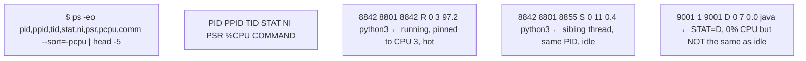
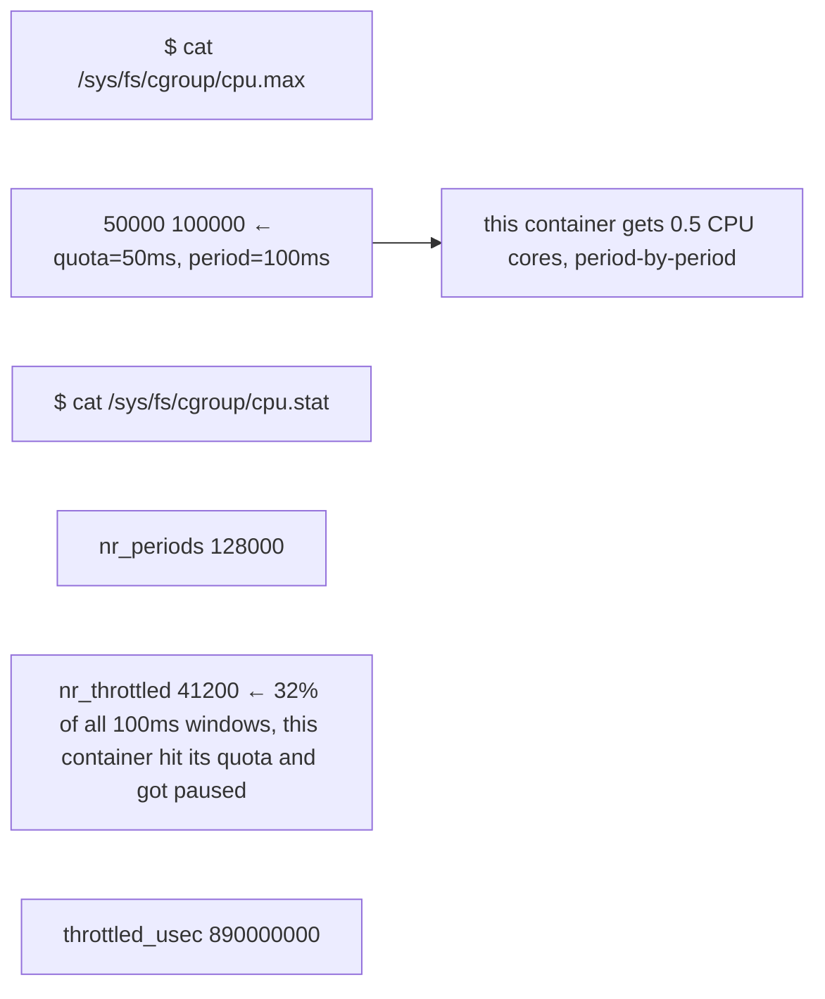

# Task: fix broken pseudo-diagrams and dense unexplained prose across the docs

This is a Docusaurus site (repo root has `docusaurus.config.ts`, docs live under
`docs/**/*.md`, one folder per volume, e.g. `docs/volume-01/`, `docs/volume-03/`, etc.).
It's a self-study curriculum (Linux/Kubernetes/GPU infra for a Solutions Architect role).

There are two separate, well-defined problems. Fix both, file by file.

---

## Problem 1: Mermaid diagrams that are actually just terminal output

At some point every doc went through an automated "convert ASCII diagrams to Mermaid"
pass. Every converted block has this exact marker comment:

```
%% Converted from the original ASCII diagram; source wording is preserved.
```

The converter did this uniformly even when the "ASCII diagram" was just a terminal
session (a `$ command` followed by its output lines), which is not a diagram at all.
The result is a `flowchart` full of disconnected boxes (`n0`, `n1`, `n2`, ...) with
few or no `-->` edges between them — meaningless as a flowchart, and on top of that
it renders with illegible low-contrast text in the site's dark mode (a separate
rendering bug already fixed at the CSS/theme level — don't worry about that part,
just fix the content).

**Below is the exact list of every occurrence**, found via:
```bash
python3 -c "
import re, glob
for f in sorted(glob.glob('docs/**/*.md', recursive=True)):
    text = open(f, encoding='utf-8').read()
    for m in re.finditer(r'\`\`\`mermaid\n(.*?)\`\`\`', text, re.S):
        block = m.group(1)
        if 'Converted from the original ASCII diagram' not in block: continue
        nodes = len(re.findall(r'^\s*n?\w+\s*\[', block, re.M))
        edges = len(re.findall(r'-->|---', block))
        line = text[:m.start()].count(chr(10)) + 1
        print(f'{f}:{line} nodes={nodes} edges={edges}')
"
```

For each hit:

- **`edges=0`** (fully disconnected — 82 of the 148 hits): this is almost certainly
  plain terminal output. Replace the whole ```` ```mermaid ... ``` ```` block with a
  plain ```` ```text ... ``` ```` (or ```` ```bash ```` if it's a shell session) code
  block, preserving every line of content and any inline `←`/arrow annotations
  exactly as written — just reformatted as real terminal output instead of flowchart
  node labels. Realign columns so the annotations line up cleanly (see worked example
  below).

- **`edges>0`** (66 hits, "partial edges"): open the file and look. Some of these are
  genuine flowcharts with real decision/sequence logic that the converter mostly
  preserved correctly — leave those alone (or only lightly clean up labels). Others
  are still just terminal output where the converter accidentally drew 1-2 stray
  arrows between adjacent lines — treat those the same as the `edges=0` case: convert
  to a code block. Use judgment: does the diagram represent an actual flow/decision
  tree, or is it a `$ command` + output transcript? If in doubt, and the node text
  looks like command output (column-aligned fields, `$` prompts, log lines), it's a
  code block.

### Worked example (already fixed, use as the template)

File: `docs/volume-01/01-linux-compute-memory-masterclass.md`
(already done — you can diff it against git history for the exact before/after, or
copy the pattern below).

Before:


After:
```text
$ ps -eo pid,ppid,tid,stat,ni,psr,pcpu,comm --sort=-pcpu | head -5
PID  PPID TID  STAT NI PSR %CPU COMMAND
8842 8801 8842 R    0  3   97.2 python3   ← running, pinned to CPU 3, hot
8842 8801 8855 S    0  11  0.4  python3   ← sibling thread, same PID, idle
9001 1    9001 D    0  7   0.0  java      ← STAT=D, 0% CPU but NOT the same as idle
```

Another worked example, same file:

Before:


After:
```text
$ cat /sys/fs/cgroup/cpu.max
50000 100000              ← quota=50ms, period=100ms: this container gets 0.5 CPU cores, period-by-period

$ cat /sys/fs/cgroup/cpu.stat
nr_periods     128000
nr_throttled   41200      ← 32% of all 100ms windows: this container hit its quota and got paused
throttled_usec 890000000
```

Note how the two related lines (`50000 100000` and its explanation) got merged onto
one line rather than kept as two disconnected boxes — use that kind of judgment
throughout: the goal is a clean, readable terminal transcript, not a mechanical
1:1 node-to-line conversion.

### Full list of files/locations to process

```
- docs/intro/02-foundation-learning-path.md
    - line 17: 11 nodes, 3 edges (partial — inspect)
- docs/volume-01/02-chapter-2-virtual-memory-page-cache-swap-and-oom.md
    - line 29: 5 nodes, 0 edges (DISCONNECTED)
    - line 102: 6 nodes, 0 edges (DISCONNECTED)
- docs/volume-01/03-linux-storage-io-masterclass.md
    - line 132: 5 nodes, 4 edges (partial — inspect)
- docs/volume-01/04-linux-networking-masterclass.md
    - line 206: 7 nodes, 1 edges (partial — inspect)
    - line 297: 10 nodes, 0 edges (DISCONNECTED)
    - line 331: 9 nodes, 2 edges (partial — inspect)
- docs/volume-01/06-chapter-6-systemd-boot-services-signals-and-logs.md
    - line 23: 6 nodes, 5 edges (partial — inspect)
- docs/volume-01/09-senior-deep-dive-3-storage-i-o-vfs-to-nvme-latency-queues-and-checkpoint-behav.md
    - line 28: 15 nodes, 6 edges (partial — inspect)
- docs/volume-01/10-senior-deep-dive-4-packet-level-networking-routing-conntrack-tcp-and-dns-failu.md
    - line 48: 9 nodes, 4 edges (partial — inspect)
    - line 68: 7 nodes, 0 edges (DISCONNECTED)
- docs/volume-01/11-senior-deep-dive-5-containers-namespaces-cgroups-v2-overlay-filesystems-and-ru.md
    - line 27: 5 nodes, 0 edges (DISCONNECTED)
    - line 39: 8 nodes, 1 edges (partial — inspect)
- docs/volume-01/12-senior-deep-dive-6-host-readiness-for-nvidia-gpu-nodes.md
    - line 28: 9 nodes, 3 edges (partial — inspect)
- docs/volume-01/13-senior-troubleshooting-exercise-slow-gpu-job-with-healthy-kubernetes.md
    - line 38: 10 nodes, 3 edges (partial — inspect)
    - line 58: 9 nodes, 3 edges (partial — inspect)
- docs/volume-02/17-final-python-checklist.md
    - line 34: 8 nodes, 4 edges (partial — inspect)
- docs/volume-02/20-senior-deep-dive-3-build-api-clients-that-fail-safely.md
    - line 64: 4 nodes, 0 edges (DISCONNECTED)
- docs/volume-03/01-k8s-control-plane-scheduling-masterclass.md
    - line 330: 5 nodes, 0 edges (DISCONNECTED)
    - line 361: 8 nodes, 1 edges (partial — inspect)
    - line 380: 4 nodes, 0 edges (DISCONNECTED)
- docs/volume-03/02-chapter-2-scheduler-mechanics-resources-and-topology.md
    - line 35: 9 nodes, 1 edges (partial — inspect)
    - line 128: 5 nodes, 0 edges (DISCONNECTED)
- docs/volume-03/03-chapter-3-kubelet-cri-and-pod-lifecycle.md
    - line 58: 9 nodes, 0 edges (DISCONNECTED)
    - line 77: 4 nodes, 0 edges (DISCONNECTED)
- docs/volume-03/04-chapter-4-kubernetes-networking-from-service-to-cni.md
    - line 46: 11 nodes, 0 edges (DISCONNECTED)
    - line 82: 4 nodes, 0 edges (DISCONNECTED)
    - line 106: 4 nodes, 0 edges (DISCONNECTED)
    - line 115: 5 nodes, 0 edges (DISCONNECTED)
- docs/volume-03/05-chapter-5-storage-and-statefulsets.md
    - line 23: 19 nodes, 2 edges (partial — inspect)
    - line 51: 8 nodes, 1 edges (partial — inspect)
    - line 102: 10 nodes, 0 edges (DISCONNECTED)
- docs/volume-03/06-chapter-6-security-authentication-rbac-workload-identity-and-pod-hardening.md
    - line 51: 6 nodes, 0 edges (DISCONNECTED)
    - line 110: 6 nodes, 0 edges (DISCONNECTED)
- docs/volume-03/07-chapter-7-autoscaling-and-capacity.md
    - line 53: 14 nodes, 1 edges (partial — inspect)
- docs/volume-03/08-chapter-8-operators-gitops-and-platform-engineering.md
    - line 62: 1 nodes, 0 edges (DISCONNECTED)
- docs/volume-03/09-chapter-9-upgrades-reliability-and-cluster-operations.md
    - line 35: 9 nodes, 0 edges (DISCONNECTED)
    - line 85: 11 nodes, 3 edges (partial — inspect)
- docs/volume-03/10-senior-deep-dive-1-api-machinery-resourceversion-watches-finalizers-and-owners.md
    - line 66: 7 nodes, 0 edges (DISCONNECTED)
- docs/volume-03/11-senior-deep-dive-2-etcd-quorum-control-plane-failure-and-recovery-boundaries.md
    - line 24: 9 nodes, 3 edges (partial — inspect)
    - line 45: 11 nodes, 1 edges (partial — inspect)
- docs/volume-03/12-senior-deep-dive-3-scheduling-framework-preemption-gang-topology-and-dra.md
    - line 35: 14 nodes, 2 edges (partial — inspect)
    - line 58: 22 nodes, 0 edges (DISCONNECTED)
- docs/volume-03/13-senior-deep-dive-4-kubelet-cri-pod-sandbox-and-node-pressure.md
    - line 37: 11 nodes, 0 edges (DISCONNECTED)
- docs/volume-03/14-senior-deep-dive-5-networking-service-abstraction-cni-dataplane-dns-and-gatewa.md
    - line 36: 12 nodes, 2 edges (partial — inspect)
- docs/volume-03/15-senior-deep-dive-6-admission-policy-and-multi-tenant-guardrails.md
    - line 30: 15 nodes, 4 edges (partial — inspect)
- docs/volume-03/16-senior-deep-dive-7-platform-patterns-from-the-staff-engineer-guide.md
    - line 27: 15 nodes, 0 edges (DISCONNECTED)
- docs/volume-03/17-senior-deep-dive-8-gpu-platform-operations-node-pools-operators-and-resource-i.md
    - line 42: 5 nodes, 3 edges (partial — inspect)
- docs/volume-04/02-gpu-architecture-topology-masterclass.md
    - line 86: 10 nodes, 0 edges (DISCONNECTED)
- docs/volume-04/03-gpu-software-operator-masterclass.md
    - line 43: 12 nodes, 0 edges (DISCONNECTED)
- docs/volume-04/04-gpu-software-operator-masterclass.md
    - line 48: 15 nodes, 0 edges (DISCONNECTED)
- docs/volume-04/05-gpu-sharing-telemetry-masterclass.md
    - line 80: 19 nodes, 1 edges (partial — inspect)
- docs/volume-04/07-gpu-sharing-telemetry-masterclass.md
    - line 67: 9 nodes, 0 edges (DISCONNECTED)
- docs/volume-04/09-senior-deep-dive-2-topology-pcie-nvlink-nvswitch-and-numa.md
    - line 36: 7 nodes, 0 edges (DISCONNECTED)
- docs/volume-05/02-ai-workloads-training-masterclass.md
    - line 87: 8 nodes, 0 edges (DISCONNECTED)
- docs/volume-05/03-llm-inference-serving-masterclass.md
    - line 43: 9 nodes, 3 edges (partial — inspect)
    - line 62: 12 nodes, 1 edges (partial — inspect)
- docs/volume-05/04-llm-inference-serving-masterclass.md
    - line 36: 13 nodes, 0 edges (DISCONNECTED)
- docs/volume-05/05-ai-autoscaling-rag-masterclass.md
    - line 40: 15 nodes, 1 edges (partial — inspect)
- docs/volume-05/06-ai-autoscaling-rag-masterclass.md
    - line 33: 11 nodes, 0 edges (DISCONNECTED)
- docs/volume-05/07-ai-autoscaling-rag-masterclass.md
    - line 38: 8 nodes, 0 edges (DISCONNECTED)
- docs/volume-05/08-ai-autoscaling-rag-masterclass.md
    - line 15: 13 nodes, 0 edges (DISCONNECTED)
    - line 40: 8 nodes, 0 edges (DISCONNECTED)
- docs/volume-05/09-ai-autoscaling-rag-masterclass.md
    - line 86: 13 nodes, 2 edges (partial — inspect)
- docs/volume-05/12-senior-deep-dive-3-nim-vllm-tensorrt-llm-and-serving-boundaries.md
    - line 13: 11 nodes, 5 edges (partial — inspect)
- docs/volume-05/14-senior-deep-dive-5-autoscaling-inference-from-work-not-only-cpu.md
    - line 29: 12 nodes, 3 edges (partial — inspect)
- docs/volume-05/15-senior-deep-dive-6-rag-vector-search-and-stateful-dependencies.md
    - line 15: 15 nodes, 7 edges (partial — inspect)
    - line 44: 12 nodes, 4 edges (partial — inspect)
- docs/volume-05/16-senior-deep-dive-7-agentic-and-multimodal-infrastructure.md
    - line 13: 7 nodes, 0 edges (DISCONNECTED)
    - line 34: 7 nodes, 4 edges (partial — inspect)
- docs/volume-05/17-senior-deep-dive-8-production-benchmark-design.md
    - line 41: 5 nodes, 3 edges (partial — inspect)
- docs/volume-06/01-ai-networking-rdma-masterclass.md
    - line 231: 5 nodes, 0 edges (DISCONNECTED)
    - line 406: 5 nodes, 0 edges (DISCONNECTED)
    - line 418: 7 nodes, 0 edges (DISCONNECTED)
- docs/volume-06/02-ai-networking-rdma-masterclass.md
    - line 20: 8 nodes, 0 edges (DISCONNECTED)
    - line 54: 5 nodes, 0 edges (DISCONNECTED)
- docs/volume-06/03-ai-networking-rdma-masterclass.md
    - line 67: 13 nodes, 0 edges (DISCONNECTED)
- docs/volume-06/04-gpudirect-fabric-operator-masterclass.md
    - line 84: 6 nodes, 0 edges (DISCONNECTED)
- docs/volume-06/05-gpudirect-fabric-operator-masterclass.md
    - line 60: 8 nodes, 0 edges (DISCONNECTED)
- docs/volume-06/06-ai-storage-data-pipelines-masterclass.md
    - line 68: 10 nodes, 0 edges (DISCONNECTED)
- docs/volume-06/07-distributed-orchestration-masterclass.md
    - line 57: 6 nodes, 0 edges (DISCONNECTED)
    - line 70: 5 nodes, 0 edges (DISCONNECTED)
    - line 82: 8 nodes, 0 edges (DISCONNECTED)
- docs/volume-06/11-senior-deep-dive-3-network-design-for-ai-oversubscription-rails-and-failure-do.md
    - line 86: 8 nodes, 0 edges (DISCONNECTED)
- docs/volume-06/12-senior-deep-dive-4-storage-hierarchy-and-data-pipeline-architecture.md
    - line 21: 9 nodes, 0 edges (DISCONNECTED)
    - line 37: 5 nodes, 1 edges (partial — inspect)
- docs/volume-06/13-senior-deep-dive-5-slurm-concepts-beyond-sbatch.md
    - line 23: 10 nodes, 0 edges (DISCONNECTED)
- docs/volume-06/14-senior-deep-dive-6-kubernetes-slurm-and-hybrid-scheduling.md
    - line 15: 8 nodes, 0 edges (DISCONNECTED)
    - line 29: 7 nodes, 1 edges (partial — inspect)
- docs/volume-06/15-senior-deep-dive-7-distributed-system-patterns-from-the-staff-engineer-guide.md
    - line 22: 10 nodes, 4 edges (partial — inspect)
    - line 42: 9 nodes, 1 edges (partial — inspect)
- docs/volume-07/01-metrics-logs-traces-masterclass.md
    - line 252: 14 nodes, 4 edges (partial — inspect)
- docs/volume-07/02-chapter-2-slis-slos-and-error-budgets.md
    - line 35: 13 nodes, 0 edges (DISCONNECTED)
- docs/volume-07/03-chapter-3-prometheus-mental-model-and-promql-reasoning.md
    - line 32: 13 nodes, 0 edges (DISCONNECTED)
- docs/volume-07/05-chapter-5-gpu-observability-with-dcgm.md
    - line 23: 9 nodes, 0 edges (DISCONNECTED)
- docs/volume-07/06-chapter-6-logs-that-survive-incidents.md
    - line 38: 12 nodes, 2 edges (partial — inspect)
    - line 59: 12 nodes, 0 edges (DISCONNECTED)
- docs/volume-07/08-chapter-8-alert-design-and-runbooks.md
    - line 22: 8 nodes, 0 edges (DISCONNECTED)
    - line 37: 12 nodes, 0 edges (DISCONNECTED)
- docs/volume-07/09-chapter-9-incident-playbook-pending-pods-crashloops-and-oom.md
    - line 97: 10 nodes, 5 edges (partial — inspect)
- docs/volume-07/10-chapter-10-incident-playbook-gpu-workload-slow-or-failing.md
    - line 38: 10 nodes, 0 edges (DISCONNECTED)
- docs/volume-07/13-senior-deep-dive-2-prometheus-internals-cardinality-and-query-cost.md
    - line 33: 4 nodes, 0 edges (DISCONNECTED)
- docs/volume-07/14-senior-deep-dive-3-opentelemetry-and-trace-context-across-ai-services.md
    - line 16: 8 nodes, 0 edges (DISCONNECTED)
- docs/volume-07/15-senior-deep-dive-4-gpu-observability-with-dcgm-and-driver-evidence.md
    - line 28: 6 nodes, 4 edges (partial — inspect)
- docs/volume-07/16-senior-deep-dive-5-inference-observability-ttft-itl-tpot-and-saturation.md
    - line 31: 2 nodes, 0 edges (DISCONNECTED)
- docs/volume-07/17-senior-deep-dive-6-incident-workflow-evidence-tree-and-safe-mitigation.md
    - line 31: 7 nodes, 4 edges (partial — inspect)
- docs/volume-07/18-senior-deep-dive-7-alert-design-for-expensive-gpu-systems.md
    - line 33: 5 nodes, 1 edges (partial — inspect)
- docs/volume-07/19-senior-deep-dive-8-reliability-testing-and-game-days.md
    - line 44: 7 nodes, 5 edges (partial — inspect)
- docs/volume-08/03-chapter-3-trade-off-matrices-with-weighted-requirements.md
    - line 70: 7 nodes, 0 edges (DISCONNECTED)
- docs/volume-08/07-chapter-7-tco-and-capacity-conversations.md
    - line 20: 27 nodes, 0 edges (DISCONNECTED)
- docs/volume-08/18-senior-deep-dive-8-practitioner-role-model-solutions-architect-versus-implemen.md
    - line 13: 22 nodes, 2 edges (partial — inspect)
    - line 44: 11 nodes, 3 edges (partial — inspect)
- docs/volume-09/07-chapter-7-hpc-networking-questions.md
    - line 49: 9 nodes, 0 edges (DISCONNECTED)
    - line 64: 4 nodes, 0 edges (DISCONNECTED)
- docs/volume-09/14-question-set-a-linux-and-host-mechanics.md
    - line 31: 9 nodes, 0 edges (DISCONNECTED)
- docs/volume-09/15-question-set-b-python-coding-and-production-automation.md
    - line 36: 11 nodes, 0 edges (DISCONNECTED)
- docs/volume-09/16-question-set-c-kubernetes-platform-depth.md
    - line 19: 32 nodes, 21 edges (partial — inspect)
    - line 78: 9 nodes, 0 edges (DISCONNECTED)
- docs/volume-09/17-question-set-d-gpu-and-accelerated-networking.md
    - line 19: 27 nodes, 14 edges (partial — inspect)
    - line 74: 5 nodes, 0 edges (DISCONNECTED)
- docs/volume-09/18-question-set-e-ai-inference-architecture.md
    - line 19: 12 nodes, 3 edges (partial — inspect)
    - line 41: 5 nodes, 0 edges (DISCONNECTED)
- docs/volume-09/19-question-set-f-customer-architecture-and-poc.md
    - line 21: 10 nodes, 0 edges (DISCONNECTED)
- docs/volume-09/20-question-set-g-whiteboard-production-genai-platform.md
    - line 13: 16 nodes, 9 edges (partial — inspect)
- docs/volume-09/21-question-set-h-behavioral-stories-for-a-senior-sa.md
    - line 13: 7 nodes, 0 edges (DISCONNECTED)
- docs/volume-09/22-current-role-family-signals-to-be-able-to-discuss.md
    - line 25: 6 nodes, 4 edges (partial — inspect)
- docs/volume-10/00c-slurm-bcm-interview-lab.md
    - line 88: 7 nodes, 6 edges (partial — inspect)
- docs/volume-10/01-bare-metal-and-bmc-lifecycle.md
    - line 259: 7 nodes, 0 edges (DISCONNECTED)
- docs/volume-10/02-nvidia-base-command-manager.md
    - line 78: 23 nodes, 2 edges (partial — inspect)
    - line 111: 10 nodes, 3 edges (partial — inspect)
- docs/volume-10/03-os-provisioning-and-linux-security-hardening.md
    - line 285: 5 nodes, 0 edges (DISCONNECTED)
- docs/volume-10/08-enroot-and-pyxis-containers-for-hpc.md
    - line 52: 10 nodes, 3 edges (partial — inspect)
- docs/volume-10/10-coordinated-cluster-wide-software-change-management.md
    - line 25: 5 nodes, 3 edges (partial — inspect)
    - line 46: 9 nodes, 5 edges (partial — inspect)
    - line 71: 9 nodes, 0 edges (DISCONNECTED)
    - line 87: 11 nodes, 0 edges (DISCONNECTED)
- docs/volume-10/11-cicd-for-infrastructure-and-cluster-configuration.md
    - line 15: 8 nodes, 6 edges (partial — inspect)
    - line 56: 11 nodes, 0 edges (DISCONNECTED)
    - line 76: 19 nodes, 0 edges (DISCONNECTED)
    - line 132: 14 nodes, 2 edges (partial — inspect)
- docs/volume-10/12-customer-runbooks-onboarding-and-best-practice-documentation.md
    - line 71: 46 nodes, 6 edges (partial — inspect)
    - line 156: 8 nodes, 0 edges (DISCONNECTED)
- docs/volume-10/13-senior-deep-dive-1-bcm-at-fleet-scale.md
    - line 40: 21 nodes, 0 edges (DISCONNECTED)
- docs/volume-10/14-senior-deep-dive-2-slurm-ha-and-accounting-internals.md
    - line 27: 13 nodes, 1 edges (partial — inspect)
- docs/volume-10/15-senior-deep-dive-3-mpi-and-nccl-joint-debugging.md
    - line 28: 32 nodes, 3 edges (partial — inspect)
- docs/volume-10/16-senior-deep-dive-4-coordinated-firmware-driver-os-rollout-across-compute-network-storage.md
    - line 15: 7 nodes, 5 edges (partial — inspect)
    - line 45: 27 nodes, 2 edges (partial — inspect)
    - line 101: 8 nodes, 0 edges (DISCONNECTED)
```

Note: line numbers are from the state of the repo as of this scan (commit `bd8eea3`).
If you've already edited earlier blocks in the same file, later line numbers in that
file will drift — just search for the `%% Converted from the original ASCII diagram`
marker within the file instead of trusting the absolute line number once you've made
edits above it.

---

## Problem 2: dense paragraphs that list jargon without explaining it

Independent of the diagram issue, some prose paragraphs (especially chapter-opening
"mental model" paragraphs) pack in 4-6 technical terms in a single sentence with no
definition or example, assuming the reader already knows what they mean. This makes
the docs much harder to learn from than they should be for a study guide.

There's no clean automated way to find every instance of this — it requires reading.
Use this worked example as the calibration for what "too dense" looks like and what
the fix looks like:

**Before** (`docs/volume-01/01-linux-compute-memory-masterclass.md`,
original `## 1.1 Process and thread model` intro):
> A program on disk is passive. A process is a running instance with virtual memory,
> credentials, file descriptors, signal state and one or more threads. Threads inside
> the same process share address space and open resources but have independent
> execution contexts. The Linux scheduler schedules tasks — roughly threads/process
> execution contexts — not Kubernetes Pods as a special kernel object.

**After:**
> A program on disk — a compiled binary or a script — is inert bytes; it does nothing
> until something runs it. A **process** is what exists once the kernel loads that
> program and starts executing it. Every process gets: its own virtual memory address
> space (so it can't read or write another process's memory), credentials (the
> user/group IDs the kernel checks on every permission decision), a table of open file
> descriptors (files, sockets, pipes it currently has open), and signal state (which
> signals it's ignoring, handling, or currently blocked on).
>
> A process can contain multiple **threads**. All threads in the same process share
> that one address space and the same file descriptor table — a variable written by
> one thread is immediately visible to the others, and closing a file descriptor in
> one thread closes it for all of them. But each thread has its own stack, CPU
> registers and program counter, so the kernel can run, block, or preempt it
> independently of its sibling threads.
>
> Why this matters for Kubernetes: the kernel scheduler has no concept of a "Pod." It
> only ever schedules threads (kernel-internal name: `task_struct`) onto CPUs. A Pod
> is a Kubernetes-level grouping of one or more containers, and each container is, at
> the OS level, one or more ordinary Linux processes. So when you're diagnosing CPU
> scheduling, throttling, or load, you have to reason in terms of processes and
> threads on the node — by the time the kernel is involved, the Pod abstraction is
> already gone.

What changed: every jargon noun got a parenthetical definition the first time it's
used; the "why does this matter" connective tissue was made explicit instead of
assumed; one dense paragraph became three focused ones.

**Instructions:** As you go through each file to fix Problem 1's diagrams, also skim
the surrounding prose (especially section-opening paragraphs, and any paragraph that
strings together more than 3 technical terms without explanation). Where you find the
same pattern — a list of jargon nouns/terms with no definition, or a conclusion
("X matters because Y") stated without the reasoning connecting them — rewrite for
clarity following the style above: concrete, one idea per sentence, define terms
inline on first use, spell out *why* a fact matters rather than just asserting it.
Don't rewrite prose that's already clear just to change wording — only fix genuinely
dense/unexplained passages.

---

## Constraints

- Preserve all factual/technical content — this is a study guide, don't remove
  substance, only clarify.
- Keep the ➕ markers (they denote content added on top of an "original text
  preserved" base document) — don't touch that convention.
- Don't touch anything outside `docs/**/*.md` unless a diagram fix requires it (it
  shouldn't).
- Work file by file, commit-sized chunks are fine if you're using git; otherwise just
  make the edits directly.
- Do not invent commands/output/facts — every code block after conversion must
  contain exactly the information that was in the original mermaid block, just
  reformatted.
