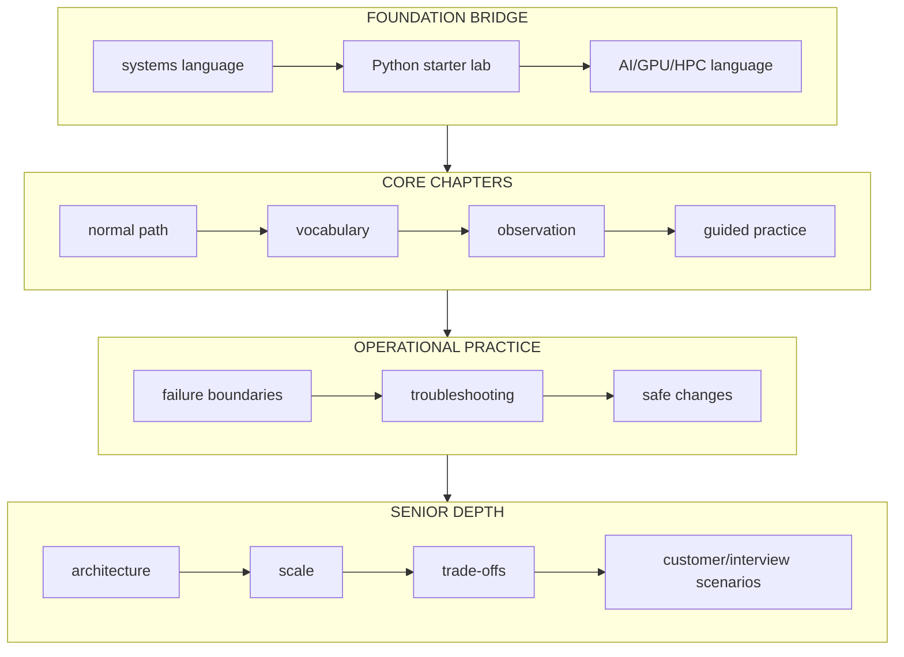

**VOLUME MASTER**

**Master Index**

Fourth Edition curriculum — Senior Engineering Expansion

> **New to one or more domains? Do not begin with the senior deep dives.** Read **[How to use this book: evidence, not proof](./00-how-to-use-this-book-evidence-not-proof.md)** first — it teaches the single habit every chapter depends on. Then, wherever a topic is genuinely new, that volume's opening chapter starts with a **Foundations** section built from zero, in plain language, before flowing straight into the advanced material on the same page — no separate primer volume to jump to and lose your place. The [Foundation learning path](./02-foundation-learning-path.md) is the route map and readiness gates for entering each volume at the right level. Senior professional experience does not imply prior Linux-kernel, Python, NVIDIA GPU, AI/ML, or HPC knowledge.

## How the curriculum is now layered

Use the core chapters to learn a technology. Use senior deep dives only after you can explain and observe its normal path. Volume 9 tests communication and Volume 10 integrates many layers; neither should be used as the first explanation of those layers.

### Start with these bridges

Each row below is now ONE chapter, not two — the foundation and the advanced material live on the same page, foundation first.

| If this feels unfamiliar | Study first |
|---|---|
| Processes, memory, files, ports, DNS, systemd, permissions | [Volume 1, Chapter 1](/curriculum/volume-01/chapter-1-processes-threads-cpu-scheduling-and-load) (opens with a Foundations section) |
| Storage, filesystems, mounts, local vs. shared/network storage | [Volume 1, Chapter 3](/curriculum/volume-01/chapter-3-files-file-descriptors-filesystems-and-block-i-o) (opens with a Foundations section) |
| Networking: IP, ports, DNS, TCP/UDP, firewalls | [Volume 1, Chapter 4](/curriculum/volume-01/chapter-4-networking-ip-routes-sockets-tcp-dns-nat-and-tls) (opens with a Foundations section) |
| Python syntax, tracebacks, files, functions, tests | [Volume 2, Chapter 1](/curriculum/volume-02/chapter-1-how-python-actually-executes-your-infrastructure-script) (opens with a Foundations section) |
| Containers, Kubernetes objects, reconciliation | [Volume 3, Chapter 1](/curriculum/volume-03/chapter-1-api-server-etcd-and-the-object-model) (opens with a Foundations section) |
| GPU hardware, CUDA, driver/toolkit layering | [Volume 4, Chapter 1](/curriculum/volume-04/chapter-1-gpu-execution-and-memory-mental-model) (opens with a Foundations section) |
| Training vs. inference, tokens, model parameters | [Volume 5, Chapter 1](/curriculum/volume-05/chapter-1-classify-the-ai-workload-before-designing-infrastructure) (opens with a Foundations section) |
| HPC clusters, job schedulers, MPI, why network speed matters more | [Volume 6, Chapter 1](/curriculum/volume-06/chapter-1-distributed-systems-performance-for-gpu-jobs) (opens with a Foundations section) |
| Linux/cluster security, SELinux/AppArmor, patch risk | [Volume 10, Chapter 3](/curriculum/volume-10/chapter-3-os-provisioning-and-linux-security-hardening) (opens with a Foundations section) |
| How to choose an order | [Foundation learning path](./02-foundation-learning-path.md) |

&lt;!-- source-table:1 --&gt;

> Fourth Edition - Rebuilt as a teaching text, not an annotated checklist

Independent study guide based on public documentation and public practitioner material. Not an NVIDIA publication.

&lt;!-- source-table:2 --&gt;

> What changed in this rebuild The series was rewritten around teaching. Concepts are explained before “why it matters.” Code is copyable. Visuals are original diagrams. Scenarios show the reasoning path step by step. Practitioner material and Udemy/Coursera/NVIDIA references appear as reinforcement after the teaching, not as substitutes for it.

&lt;!-- source-table:3 --&gt;

| Volume | Focus | Study style |
| --- | --- | --- |
| 1 | Linux, memory, storage, networking, containers | mechanism -> commands -> evidence -> scenario |
| 2 | Python for production infrastructure | code-first worked examples -> failure -> tests -> capstone |
| 3 | Kubernetes and platform engineering | control loops -> scheduling/network/storage -> troubleshooting |
| 4 | GPU foundations | hardware/software stack -> Operator -> sharing -> health |
| 5 | AI workloads | training/inference mechanics -> serving -> scaling -> state |
| 6 | HPC/network/storage | distributed data path -> RDMA -> fabric -> storage -> scheduler |
| 7 | Observability/reliability | question -> evidence -> hypothesis -> experiment |
| 8 | Solutions architecture | discovery -> constraints -> options -> trade-offs -> recommendation |
| 9 | Interview preparation | reasoning structure -> coding -> architecture -> customer scenarios |
| 10 | Bare-metal and HPC operations | BMC/BCM -> OS/IaC -> Slurm/MPI/containers -> fleet change |

# Guided tutor flow

TEACH mode should present one coherent block from the current chapter and stop. The learner reads, runs examples and asks doubts. When the learner says ready, the tutor tests that block one question at a time, corrects gaps, and then presents the next block. REFRESH and INTERVIEW modes can sample already-studied material randomly.

The later volumes reuse the same disciplined decision loop: requirements and evidence before recommendation.

&lt;!-- source-table:4 --&gt;

> FOURTH EDITION — CONTENT-RICH SENIOR ENGINEERING EXPANSION

This edition retains the readable Fourth Edition and adds substantial senior-level depth to every volume. It deliberately avoids priority labels or a prescriptive interview study order. The material is organized as a reference curriculum; study it in whichever sequence fits your preparation.

&lt;!-- source-table:5 --&gt;

| Volume | Fourth Edition additions |
| --- | --- |
| 1 — Foundations | syscalls/scheduling, cgroup CPU, NUMA, memory pressure, VFS/block I/O, packet/conntrack/TCP path, GPU-host readiness |
| 2 — Python | domain models, config validation, resilient API clients, bounded concurrency, subprocess safety, structured logs, testing, profiling, GPU-fleet CLI |
| 3 — Kubernetes | API machinery, etcd, DRA, preemption/eviction, kubelet/CRI, dataplane/DNS/Gateway API, admission/policy, GPU node lifecycle |
| 4 — GPU | execution/memory model, topology, driver/container stack, GPU Operator internals, MIG/sharing, DCGM/Xid/ECC, fleet lifecycle |
| 5 — AI workloads | training parallelism, LLM prefill/decode/KV, NIM/engines, Dynamo/disaggregated serving, inference autoscaling, RAG/agents, benchmarking |
| 6 — HPC/network/storage | collectives/NCCL, RDMA/RoCE/IB, GPUDirect, fabric design, storage hierarchy, Slurm, Enroot/Pyxis/BCM, hybrid scheduling |
| 7 — Observability | SLO/USE/RED, Prometheus cardinality/query cost, OTel, DCGM, inference metrics, evidence-tree incidents, alert design and game days |
| 8 — SA practice | workload discovery, AI factory architecture, capacity/TCO, PoC design, security/governance, product/scheduler decisions, executive communication |
| 9 — Interview | senior answer method, Linux/Python/K8s/GPU/AI/network question banks, architecture/customer drills and current NVIDIA role-family signals |

# Source architecture

Technical authority: current official NVIDIA, Kubernetes and Python documentation. Practitioner scope signals: public posts and job-family material from NVIDIA Solutions Architects, especially Vishakha Sadhwani, plus public NVIDIA SA/hiring material on GPU Kubernetes, inference and AI factory architecture. Teaching reinforcement: targeted Udemy lecture sections rather than entire courses. Internal breadth source: your Staff Engineer study guide repository, especially Kubernetes, platform patterns, observability, databases/storage and distributed-log material.
