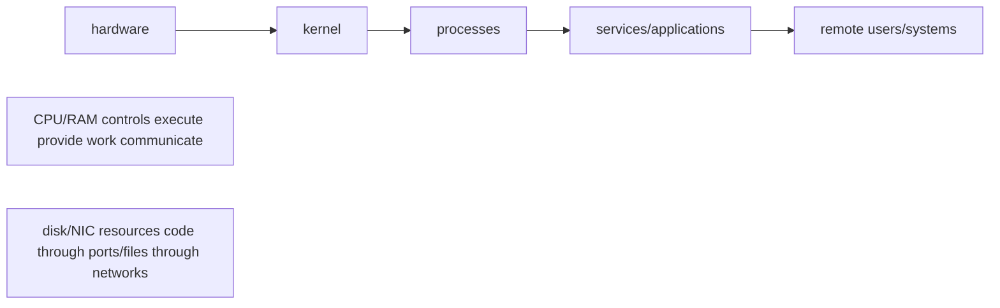
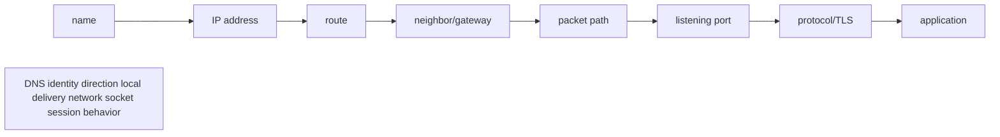
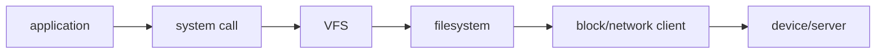
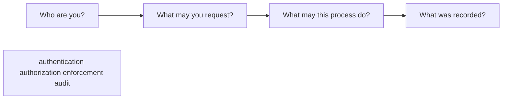

# Systems foundation

This chapter is a map, not a replacement for Volume 1. Its purpose is to give unfamiliar terms a place before the detailed chapters use them.

> **Meeting these terms for the first time?** This page is a compressed reference — tables and short definitions, not a full teaching walkthrough. For the fully explained version with analogies, worked "evidence vs. proof" examples, and check-your-understanding questions, read the **Foundations** section at the top of [Volume 1, Chapter 1 (Linux)](/curriculum/volume-01/chapter-1-processes-threads-cpu-scheduling-and-load), [Chapter 4 (Networking)](/curriculum/volume-01/chapter-4-networking-ip-routes-sockets-tcp-dns-nat-and-tls), and [Chapter 3 (Storage)](/curriculum/volume-01/chapter-3-files-file-descriptors-filesystems-and-block-i-o) first, then come back here for a fast refresher.

## One machine, five connected views



- **Hardware** supplies CPU, memory, disks, NICs, and GPUs.
- The **kernel** is the privileged core of Linux. It schedules CPU time, manages memory, exposes devices, filesystems, and networking, and enforces isolation.
- A **process** is a running program with a PID, memory, open files, credentials, and threads.
- A **service** is a long-running function, often managed by systemd—for example SSH, a web server, `slurmd`, or `kubelet`.
- A remote client reaches a service through an address, route, protocol, and port.

When something fails, locate the boundary instead of starting with a random command.

## Linux nouns you need first

| Term | Plain meaning | First evidence |
|---|---|---|
| Process | One running instance of a program | `ps`, `top`, `/proc/PID` |
| Thread | An execution path inside a process | `ps -L`, `top -H` |
| PID | Numeric process identifier | `ps -p PID` |
| User/group | Security identities attached to processes and files | `id`, `ps -o user,group` |
| File descriptor | Process-local handle to file, socket, pipe, or device | `ls -l /proc/PID/fd` |
| Virtual memory | Per-process address space mapped by the kernel | `pmap`, `/proc/PID/maps` |
| Page cache | RAM the kernel uses to cache file data | `free`, `/proc/meminfo` |
| Mount | A filesystem attached at a directory | `findmnt` |
| Device | Kernel representation of hardware or virtual hardware | `lspci`, `lsblk`, `/dev` |
| Service/unit | Work supervised by systemd | `systemctl status NAME` |
| Journal | Structured systemd/kernel log store | `journalctl` |

### Trace one command

When you run `curl https://example.com`, the shell starts a `curl` process. The process asks a resolver for an IP, opens a socket, the kernel selects a route and source address, TCP connects to port 443, TLS authenticates/encrypts the session, and HTTP exchanges data. "Curl failed" is therefore not one diagnosis.

## Networking without skipping the layers



| Question | Read-only evidence | What it does not prove |
|---|---|---|
| Did the name resolve? | `getent hosts NAME` | That the destination is reachable |
| Which route will be used? | `ip route get IP` | That every device on the path allows it |
| Is a local service listening? | `ss -lntup` | That a remote client can reach it |
| Can TCP connect? | `nc -vz HOST PORT` or protocol client | That authentication/application behavior is correct |
| Did TLS negotiate? | `openssl s_client -connect HOST:PORT` | That the application request is authorized |

An **IP address** identifies an interface within a routed network. A **port** identifies a socket endpoint on a host. DNS maps names to data such as IP addresses. A route selects where a packet goes next. A firewall permits or rejects traffic according to policy. NAT rewrites addresses or ports; it does not replace routing.

## Storage without treating every path as a local disk

An application reads a path, but the path may resolve through multiple layers:



- A **block device** exposes addressable blocks; a filesystem organizes files on it.
- A **mount** attaches a filesystem to the directory tree.
- Local NVMe offers node-local performance but does not automatically survive node loss.
- NFS and parallel filesystems expose shared data over a network and add server/fabric dependencies.
- Object storage exposes an API and object/key model, not normal POSIX file semantics.

Check both capacity and inodes: `df -h` and `df -i`. Check what a path actually uses with `findmnt -T PATH`. "Disk is full" can mean bytes, inodes, a read-only mount, quota, a missing remote mount, or an application limit.

## Security as identity, permission, policy, and evidence

Avoid thinking of security as one product:



- **Authentication** proves identity: password, SSH key, certificate, token, SSO.
- **Authorization** decides permitted actions: Unix mode bits, ACL, sudo rule, RBAC policy.
- **Least privilege** grants only what is needed, for only as long and as narrowly as practical.
- **SELinux/AppArmor** constrains process behavior beyond ordinary ownership and permissions.
- A **firewall** constrains network communication.
- **Audit/logging** records relevant decisions and changes; it does not itself prevent them.
- A **secret** is sensitive authentication material. Encryption protects data; hashing is one-way and serves different purposes.

### A safe service investigation

Use a disposable machine or lab service:

```bash
systemctl status sshd  # some distributions call it ssh
journalctl -u sshd --since "10 minutes ago"
ss -lntp
ip addr
ip route
```

For each command, write what question it answers. Do not use `sudo` automatically; first determine whether the observation requires it. Do not restart the service until you have preserved status and logs.

## First evidence ladder for any Linux incident

1. **Scope:** one process, one node, one rack, one tenant, or everyone?
2. **Time:** when did it begin and what changed nearby?
3. **Resource:** CPU, memory, disk capacity/I/O, network, device, dependency, or policy?
4. **Process/service:** running, restarting, blocked, or killed?
5. **Path:** can each boundary in the normal request/data path be demonstrated?
6. **Comparison:** what differs from a known-good peer?
7. **Mitigation:** what is the smallest reversible action that protects users?

## Readiness check

Continue to detailed Linux and Kubernetes material when you can explain:

- why a process can exist while its service is unreachable;
- the difference between memory use and disk use;
- the difference between DNS success and TCP success;
- the difference between authentication and authorization;
- why restarting first can destroy useful evidence;
- how a local path can depend on remote storage.

If an answer requires repeating a command without explaining the boundary it tests, study that section again.

