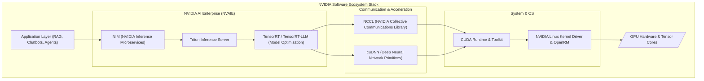

# Chapter 7 — The NVIDIA Ecosystem: From Silicon to NIMs

**Learning outcome:** Map the complete NVIDIA ecosystem from raw silicon to high-level microservices. You will learn exact specifications for modern GPU architectures (Hopper, Blackwell), differentiate interconnect fabrics (NVLink vs. PCIe vs. InfiniBand), and understand the purpose of core software layers like NCCL, TensorRT-LLM, and NVIDIA Inference Microservices (NIM).

**Prerequisites:** Completion of Chapters 1–6.

**Difficulty:** Advanced.

**Estimated reading time:** 45 minutes.

---

## 1. Introduction (The "Why")

A common mistake made by junior infrastructure engineers is viewing NVIDIA solely as a chip manufacturer. If NVIDIA only made chips, building an AI Factory would be impossible. 

The reality is that **accelerated computing is a full-stack problem**. A GPU capable of 1,000 TeraFLOPS is utterly useless if the PCIe bus starves it of data, if the network drops packets during multi-node synchronization, or if the PyTorch code cannot compile to target the specific Tensor Cores on the silicon.

To solve the AI scaling problem, NVIDIA was forced to build the entire ecosystem: the silicon (GPUs), the motherboard fabrics (NVSwitch), the datacenter networking (Mellanox/InfiniBand), the low-level communication libraries (NCCL), the serving engines (Triton), and the deployment containers (NIM). 

As a Senior AI Infrastructure Architect, your job is to orchestrate this entire stack. You cannot troubleshoot a model timeout if you do not know whether the failure occurred in the Kubernetes GPU Operator, the NCCL communication ring, or the InfiniBand Subnet Manager.

---

## 2. The Silicon: Generations and Specifications (The "What")

Architects do not talk in generalizations; they talk in numbers. You must know the exact constraints of the hardware you are deploying.

### 2.1 Ampere (A100) — The Baseline
* **Memory:** 40GB or 80GB HBM2e.
* **Memory Bandwidth:** Up to 2.0 TB/s.
* **Interconnect:** 3rd Gen NVLink (600 GB/s).
* **Significance:** Introduced Multi-Instance GPU (MIG), allowing a single physical GPU to be partitioned into 7 isolated instances at the hardware level.

### 2.2 Hopper (H100 / H200) — The Workhorse
* **Memory (H100):** 80GB HBM3 at 3.35 TB/s bandwidth.
* **Memory (H200):** 141GB HBM3e at 4.8 TB/s bandwidth.
* **Interconnect:** 4th Gen NVLink (900 GB/s).
* **Significance:** Introduced the **Transformer Engine**. Hopper can dynamically switch between FP8 (8-bit) and FP16 (16-bit) precision mathematically on the fly, doubling throughput for Large Language Models without altering code.

### 2.3 Blackwell (B200 / GB200) — The Rack-Scale Era
* **Memory:** 192GB HBM3e per GPU.
* **Memory Bandwidth:** 8.0 TB/s.
* **Interconnect:** 5th Gen NVLink (1.8 TB/s per GPU).
* **Significance:** Blackwell introduces **FP4 (4-bit)** precision and expands the NVLink domain. Instead of just 8 GPUs talking over NVLink inside a single chassis, the **GB200 NVL72** allows 72 GPUs across an entire rack to share memory as a single 130 TB/s domain over copper backplanes.

---

## 3. The Interconnect Ecosystem (The "Arteries")

If the GPUs are the heart, the interconnects are the arteries. Bottlenecks here are the #1 cause of poor AI performance.

1. **PCIe Gen5 (64–128 GB/s):** The standard motherboard bus. Used strictly for Host-to-Device (CPU-to-GPU) communication. It is *too slow* for GPU-to-GPU synchronization during training.
2. **NVLink / NVSwitch (900–1800 GB/s):** The proprietary NVIDIA interconnect. It creates a fully non-blocking mesh between GPUs *inside* a node (or rack, in Blackwell). It allows GPUs to directly read/write each other's HBM.
3. **InfiniBand (NDR 400G / X800 800G):** The lossless backend datacenter fabric used to connect *multiple nodes* together for scale-out training. Uses **GPUDirect RDMA** to bypass the CPU.
4. **Spectrum-X Ethernet:** NVIDIA's AI-optimized Ethernet platform (RoCEv2). It introduces advanced telemetry and adaptive routing to prevent the packet-dropping issues that plague standard enterprise Ethernet during AI bursts.

---

## 4. The Software Ecosystem (The "Brain")

Hardware without software is sand. The NVIDIA software stack maps exactly to the hardware hierarchy.

### 4.1 CUDA & cuDNN (The Foundation)
**CUDA** is the parallel computing platform. It allows developers to use C++ to send mathematical kernels to the GPU. **cuDNN** provides highly tuned, low-level implementations of standard deep learning operations (like convolutions and matrix multiplications) optimized for the exact silicon architecture.

### 4.2 NCCL (The Orchestrator of the Network)
**NCCL (NVIDIA Collective Communications Library)** is arguably the most critical piece of software for distributed training. When a 100-billion parameter model is split across 64 GPUs, the GPUs must constantly share their mathematical gradients. NCCL automatically figures out the fastest physical path to send that data. If GPU A and GPU B are on the same node, NCCL routes over NVLink. If they are on different nodes, NCCL routes over InfiniBand via GPUDirect RDMA.

### 4.3 TensorRT & Triton (The Serving Engines)
If you deploy a raw PyTorch model to production, it will be slow and consume excessive memory. 
* **TensorRT-LLM:** A compiler. It analyzes your LLM and physically fuses math operations together, dropping the precision to FP8 or INT8, specifically targeting the Tensor Cores of your exact GPU architecture.
* **Triton Inference Server:** The web server. It wraps the compiled model, handles gRPC/HTTP requests, and performs **Continuous In-Flight Batching** to ensure the GPU is never waiting for a user.

### 4.4 NIM (NVIDIA Inference Microservices)
Configuring CUDA, TensorRT-LLM, and Triton correctly takes months of engineering effort. **NIM** solves this. A NIM is a pre-packaged Docker container provided by NVIDIA. It contains an optimized model (e.g., Llama 3), the exact CUDA drivers required, the Triton server, and the TensorRT-LLM engine, all exposed via an industry-standard OpenAI-compatible REST API. You simply deploy the NIM via Helm, and it runs at maximum theoretical hardware efficiency out of the box.

---

## 5. Customer Scenario (Senior Level)

**The Situation:** 
A Platform Engineering Director tells you: "We have an internally developed PyTorch LLM. We deployed it on an 8-GPU H100 server inside a standard Docker container. The latency is okay, but we are running out of GPU memory when concurrent users hit the endpoint, and the GPUs are only showing 30% utilization. Our engineers are trying to write custom Python async queues to batch the requests."

**The Senior Architect Response:**
"Your team is wasting valuable engineering cycles rebuilding the wheel, and you are leaving massive hardware performance on the table. 

First, running raw PyTorch in production inference is highly inefficient. PyTorch is optimized for training flexibility, not inference throughput. You should compile the model using **TensorRT-LLM**. This will fuse the operations, apply FP8 quantization (native to your H100's Transformer Engine), and drastically reduce the memory footprint of the model weights.

Second, your Out-Of-Memory (OOM) errors are being caused by unmanaged KV Cache growth, and your low utilization is caused by poor request batching. Stop trying to write custom Python queues. You should deploy this model using **Triton Inference Server** (or a pre-built **NIM**). Triton utilizes PagedAttention to prevent memory fragmentation and performs continuous in-flight batching natively. By aligning your software stack with the NVIDIA ecosystem, you will likely triple your concurrency and drop your latency without changing a single piece of hardware."

## Interview Preparation

**Conceptual:** What is the difference between CUDA and NCCL? Why is NCCL required for distributed training?

**Architecture:** An enterprise wants to buy GPUs but says "We don't need InfiniBand, we will just use 10G Ethernet." Explain how this breaks the NCCL topology.

**Specifications:** What is the memory bandwidth difference between an H100 and a B200, and why is this critical for LLM TTFT/TPOT metrics? *(Hint: 3.35 TB/s vs 8.0 TB/s. Faster bandwidth directly reduces Time Per Output Token).*

**Ecosystem:** What is the difference between TensorRT-LLM and Triton Inference Server? *(Hint: TensorRT-LLM is the compiler/optimizer; Triton is the HTTP/gRPC server that handles batching).*

## Summary

The NVIDIA ecosystem is not a collection of optional tools; it is a tightly coupled pipeline designed to solve the physics of AI scaling. The silicon (Hopper/Blackwell) relies on the fabrics (NVLink/InfiniBand) to prevent data starvation. The fabrics rely on NCCL to route traffic. The inference serving layer relies on TensorRT-LLM and Triton (packaged as NIMs) to maximize batching and minimize memory fragmentation. A Senior AI Infrastructure Engineer must master this entire chain, as a failure or misconfiguration in any single layer will instantly bottleneck the entire multi-million-dollar factory.
