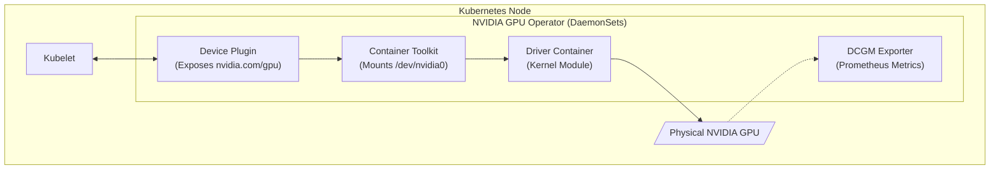

# Chapter 8 — Enterprise AI Platforms & Orchestration

**Learning outcome:** Architect the deployment platforms required to run an AI Factory. You will learn the difference between bare-metal provisioning (Base Command Manager) and Cloud-Native orchestration (Kubernetes + GPU Operator), understand the role of virtualization (vGPU), and articulate the business value of NVIDIA AI Enterprise (NVAIE).

**Prerequisites:** Completion of Chapter 7.

**Difficulty:** Advanced.

**Estimated reading time:** 40 minutes.

---

## 1. Introduction (The "Why")

You understand the hardware. You know the software stack. Now, how do you actually deploy it across a Fortune 500 company?

If you buy 100 NVIDIA DGX servers, they arrive on loading docks as massive pallets of cold metal. How do you get an operating system onto all 100 servers simultaneously? How do you ensure the InfiniBand NICs all have the exact same firmware? If you use Kubernetes, how do you map the pods to the physical GPUs without manually installing drivers on every node? What happens if a critical CVE is discovered in the Triton Inference Server open-source code?

Enterprise AI requires enterprise platforms. Open-source tools alone are insufficient when a single hour of cluster downtime costs a company $50,000 in lost training time. This chapter explores the platform management layer: the tools used to provision, orchestrate, share, and secure AI infrastructure.

---

## 2. Bare-Metal Provisioning: Base Command Manager (BCM)

Before Kubernetes or Slurm can run, the physical hardware must be brought to life. 

In traditional IT, teams might use Ansible or PXE boot scripts to image servers. At the scale of an AI Factory, minor firmware drifts (e.g., Node 1 has a slightly older Mellanox firmware than Node 2) cause catastrophic, hard-to-debug NCCL timeouts during distributed training.

**NVIDIA Base Command Manager (BCM)** is the bare-metal provisioning engine for the AI Factory.
1. **Head Nodes & Compute Nodes:** BCM designates a "Head Node" which holds the golden image. When the 100 "Compute Nodes" power on, they network-boot (PXE) from the Head Node.
2. **Immutable Infrastructure:** BCM pushes the exact OS, the exact NVIDIA drivers, the exact OFED (OpenFabrics Enterprise Distribution) networking stack, and the exact firmware down to every node simultaneously. 
3. **Health Checks:** Before handing the nodes over to the users, BCM runs automated cluster validations (e.g., `dcgmi diag` and NCCL tests) to ensure the InfiniBand fabric is physically wired correctly and operating at full bandwidth.

---

## 3. Cloud-Native Orchestration: Kubernetes & The GPU Operator

If your workload is primarily inference (serving models via APIs) or MLOps pipelines, the cluster will run Kubernetes. 

Kubernetes natively only understands CPUs and RAM. If you schedule a pod and ask for a GPU, Kubernetes will fail. To bridge this gap, NVIDIA created the **GPU Operator**.

The GPU Operator is a Kubernetes Add-on (deployed via Helm) that completely automates the lifecycle of the GPU on a cluster. When installed, it deploys a series of DaemonSets to every node:
1. **NVIDIA Driver Container:** Compiles and loads the Linux kernel driver automatically.
2. **NVIDIA Container Toolkit:** Injects the libraries required for Docker/containerd to mount GPUs into unprivileged pods.
3. **Device Plugin:** Advertises the `nvidia.com/gpu` resource to the `kube-scheduler`, allowing pods to request GPUs.
4. **DCGM Exporter:** Exposes rich hardware telemetry (temperature, tensor core utilization, Xid errors) directly to Prometheus.
5. **MIG Manager:** Automatically partitions physical GPUs into smaller Multi-Instance GPUs based on Kubernetes ConfigMaps.

---

## 4. Virtualization and Sharing: vGPU and MIG

GPUs are incredibly expensive. A single H100 costs tens of thousands of dollars. Giving an entire H100 to a data scientist who is just writing code in a Jupyter Notebook is a massive waste of resources. 

Enterprise platforms must support fractional sharing.

### 4.1 Multi-Instance GPU (MIG)
MIG is a hardware-level partition. An A100 or H100 can be physically sliced into up to 7 completely isolated instances. Each MIG instance has its own dedicated L2 cache, memory bandwidth, and compute cores. If one user crashes their PyTorch code, the other 6 users on the same physical GPU are entirely unaffected. MIG is ideal for isolating small, predictable inference workloads in Kubernetes.

### 4.2 NVIDIA vGPU (Virtual GPU)
vGPU is a software-level virtualization technology that integrates with hypervisors like VMware vSphere or KVM. It allows a single physical GPU to be shared across multiple Virtual Machines. This is heavily used in enterprise VDI (Virtual Desktop Infrastructure) or when IT departments want to provide standard VMs to developers that just happen to have a "slice" of a GPU attached for development work.

---

## 5. The Commercial Layer: NVIDIA AI Enterprise (NVAIE)

You will hear the term **NVIDIA AI Enterprise (NVAIE)** constantly in production environments. 

Many of NVIDIA's tools (like Triton, TensorRT, and the GPU Operator) are open-source and free on GitHub. So why do Fortune 500 companies pay millions of dollars in software licensing fees?

**NVAIE is the commercial, enterprise-grade software suite.** It provides:
1. **Service Level Agreements (SLAs):** If your cluster goes down at 2:00 AM on a Sunday because of a bug in the NCCL library, NVAIE gives you direct access to NVIDIA engineering support to fix it.
2. **Security & CVE Patching:** Open-source projects move fast and break things. NVAIE provides long-term support (LTS) branches of Triton, PyTorch, and drivers, ensuring that critical security vulnerabilities are patched without forcing the enterprise to upgrade to unstable edge releases.
3. **NVIDIA NIMs:** The pre-built, highly optimized Inference Microservices (discussed in Chapter 7) are exclusively part of the commercial NVAIE entitlement. 

---

## 6. Serverless AI: DGX Cloud

Not every enterprise wants to build a physical data center. Buying DGX servers requires waiting months for delivery, securing megawatts of power, and hiring specialized InfiniBand networking engineers.

**DGX Cloud** is NVIDIA's solution to this. It is a serverless AI training-as-a-service platform. 
NVIDIA hosts massive SuperPODs inside major cloud providers (AWS, Azure, GCP, Oracle). Instead of dealing with Kubernetes, Slurm, drivers, or InfiniBand, a data scientist simply points their web browser to the DGX Cloud portal, submits their training job, and the infrastructure spins up instantly. It provides the exact performance of an on-premise DGX SuperPOD, but consumed as an OpEx cloud service.

---

## 7. Customer Scenario (Senior Level)

**The Situation:** 
A CIO of a healthcare company states: "We have a strict corporate policy: all workloads must run on VMware, and all software must have 24/7 commercial support. We want to deploy an internal LLM chatbot. Our engineers downloaded open-source Triton Inference Server from GitHub and installed it on a bare-metal server to bypass VMware. I am halting the project due to policy violations. How do we make this compliant?"

**The Senior Architect Response:**
"We can align this entirely with your corporate mandates using the **NVIDIA AI Enterprise (NVAIE)** stack and VMware vSphere.

First, we will abandon the unmanaged bare-metal server. We will deploy the GPUs into your existing VMware vSphere cluster. Using **NVIDIA vGPU**, we can abstract the physical GPUs and attach them directly to standard VMware virtual machines, maintaining your IT team's existing management, snapshot, and vMotion workflows.

Second, we will not use the open-source GitHub release of Triton. Your enterprise will procure NVIDIA AI Enterprise licenses. This gives your team access to the commercial, hardened release of Triton (or pre-packaged NIMs) via the NVIDIA NGC registry. This fulfills your 24/7 commercial support mandate, guarantees critical CVE security patching, and provides direct escalation paths to NVIDIA engineers if the inference service fails."

## Interview Preparation

**Conceptual:** What is the difference between Base Command Manager (BCM) and the Kubernetes GPU Operator? *(Hint: BCM provisions the bare-metal OS, firmware, and network fabric. The GPU operator runs on top of the OS to manage the container lifecycle).*

**Architecture:** Explain the difference between MIG and vGPU. Which provides strict hardware-level isolation? *(Hint: MIG provides physical hardware isolation; vGPU provides hypervisor-level software virtualization).*

**Business Value:** If Triton Inference Server is free on GitHub, explain the business value of paying for NVIDIA AI Enterprise (NVAIE).

**Troubleshooting:** You deploy a Kubernetes pod requesting `nvidia.com/gpu: 1`, but it sits in a `Pending` state. The node has a physical GPU installed. What component of the GPU Operator has likely failed? *(Hint: The Device Plugin daemonset, which is responsible for advertising the resource to the kube-scheduler).*

## Summary

Designing the hardware is only the first half of building an AI Factory. The second half is the platform orchestration layer. Senior SREs and Architects must understand how to provision bare-metal fleets cleanly (Base Command Manager), how to integrate GPUs into cloud-native environments automatically (Kubernetes GPU Operator), how to securely slice resources for multiple tenants (MIG and vGPU), and how to protect the enterprise from open-source volatility (NVIDIA AI Enterprise). Together, these platforms transform raw silicon into a resilient, enterprise-grade AI utility.
