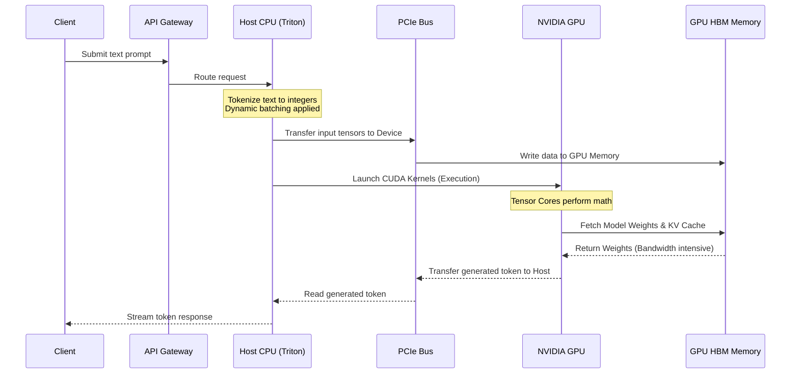

# What Is AI Infrastructure?

| Chapter metadata | Value |
|---|---|
| Volume | 01 — AI Infrastructure Foundations |
| Difficulty | Foundation to Advanced |
| Estimated reading time | 40 minutes |
| Primary audience | DevOps, SRE, Platform, Cloud and Infrastructure Engineers |
| Core question | What specific bottlenecks does AI infrastructure solve that traditional infrastructure cannot? |

## Introduction

Modern AI applications look deceptively simple from the outside. A user sends a prompt, and a Large Language Model (LLM) returns a fluent answer. The product experience feels like a standard web service, but the infrastructure behind that request operates in a fundamentally different universe.

Traditional web infrastructure is designed to solve **I/O bound, stateless problems**. It is concerned with request routing, business logic, databases, caches, queues, and network availability. If a web server is slow, it is usually waiting on a database query or a third-party API. Scaling is horizontal: you add more CPU nodes behind a load balancer.

AI infrastructure must handle all of those concerns *plus* **compute-bound, memory-bandwidth-bound, highly stateful mathematical execution**. It involves tensor memory management, accelerator scheduling, topology-aware placement, high-bandwidth interconnects (NVLink), lossless network fabrics (InfiniBand/RoCE), and failure modes that simply do not exist in CPU-only systems (like Xid errors, uncorrectable ECC memory errors, and collective communication timeouts).

AI infrastructure is the engineering discipline responsible for making that full stack work reliably in production. It is not just “servers with GPUs.” It is the holistic combination of hardware (NVIDIA DGX/HGX), network fabrics (Quantum InfiniBand, Spectrum-X Ethernet), software runtimes (CUDA, TensorRT), orchestration (Kubernetes, Slurm), and observability (DCGM) required to train, serve, and operate AI models at scale.

:::info Principal Engineer View
AI infrastructure begins when the limiting factor shifts from network I/O and database lookups to accelerated computation, memory bandwidth, and distributed data movement. The goal of a Senior AI Infrastructure Engineer is single-minded: **keep the expensive GPUs fed with data and doing useful mathematical work 100% of the time.**
:::

## Story

A platform team deploys a Retrieval-Augmented Generation (RAG) service for internal enterprise search. The first version runs on CPU servers using a small 7-billion parameter model. During a small pilot, the system performs acceptably. One user submits a document, the model generates a summary, and the response time is around 2 seconds.

Then the service is rolled out globally. Usage increases, prompts become larger, and concurrent requests spike. The team responds using the traditional DevOps playbook: they scale out the Kubernetes deployment, adding 50 more CPU nodes. 

The result is catastrophic. Overall throughput (requests per minute) improves slightly, but the latency of *individual* requests degrades to 15 seconds. Infrastructure costs skyrocket while the user experience remains unusable. 

The team eventually realizes that the system is not failing because they lack web scaling knowledge. It is failing because the expensive part of the request is not the HTTP handler—it is the billions of sequential matrix multiplications occurring during token generation. The workload has hit a compute and memory-bandwidth wall. To solve this, they transition to NVIDIA GPUs running Triton Inference Server with TensorRT-LLM. Latency drops to 200 milliseconds. This is the exact moment traditional infrastructure engineering must evolve into AI infrastructure engineering.

## Learning Objectives

After completing this chapter, you will be able to:
1. Explain why AI workloads fundamentally break traditional CPU-centric scaling models.
2. Describe the major layers of an NVIDIA-centric AI infrastructure stack (Hardware, Network, Runtime, Serving).
3. Distinguish traditional application bottlenecks (I/O, database) from AI-specific bottlenecks (Memory bandwidth, PCIe transfer, NVLink).
4. Explain the roles of orchestration, high-speed networking, storage, and observability in production AI systems.

## Big Picture

Figure 1.1 shows AI infrastructure as a layered system. A production platform must handle client traffic, but it must also integrate serving frameworks (Triton), runtime libraries (CUDA), accelerator hardware (GPUs), ultra-fast memory (HBM), and specialized interconnects.

```mermaid
flowchart TB
    User[Users / Applications] --> Gateway[API Gateway / Load Balancer]
    Gateway --> Serving[Model Serving Layer<br><i>NVIDIA Triton / vLLM</i>]
    
    subgraph "NVIDIA AI Enterprise Stack"
        Serving --> Optimization[Optimization Layer<br><i>TensorRT-LLM</i>]
        Optimization --> Runtime[Hardware Runtime<br><i>CUDA / cuDNN</i>]
    end
    
    subgraph "The AI Factory Node"
        Runtime --> CPU[Host CPU & System RAM]
        CPU <-->|PCIe Gen5| GPU[NVIDIA GPU Accelerators]
        GPU <-->|HBM3| Memory[High-Bandwidth GPU Memory]
        GPU <-->|NVLink| PeerGPU[Peer GPUs on same node]
    end
    
    CPU <--> Storage[High-Speed Storage<br><i>GPUDirect Storage (GDS)</i>]
    GPU <--> Network[Cluster Network<br><i>ConnectX NICs / InfiniBand</i>]
    
    Serving -.-> Observability[Observability<br><i>Prometheus / NVIDIA DCGM</i>]
    GPU -.-> Observability
```

**Figure 1.1 — The NVIDIA AI infrastructure stack.** A production AI service requires precise coordination across application, runtime, accelerator, memory, networking, storage, and operations layers to prevent the GPUs from starving for data.

## Deep Explanation

Traditional infrastructure is designed around general-purpose computation and context switching. A web service receives a request, executes logic, reads from a database, and returns a response. The primary concerns are availability, state management, and deployment safety.

AI workloads introduce a dominant new concern: **accelerated mathematical execution over massive datasets.** Large models perform repeated tensor operations. These operations are highly parallel, insanely memory-intensive, and too computationally expensive to run on CPUs. Therefore, the infrastructure must shift from a homogenous design to a **heterogeneous design**, where CPUs handle orchestration and I/O, while GPUs handle the parallel math.

| Traditional Platform Concern | AI Infrastructure Equivalent | Why It Changes in the NVIDIA Stack |
|---|---|---|
| **Application Routing** | Model Routing & Batching | Inference servers (Triton) dynamically batch incoming requests in real-time to maximize GPU core utilization (Continuous Batching). |
| **System Memory (DDR4/5)** | High-Bandwidth Memory (HBM) | LLM token generation is heavily memory-bound. GPUs use HBM3 (e.g., 3TB/s bandwidth) rather than DDR5 (e.g., 300GB/s) to feed the math cores. |
| **Network Latency (TCP/IP)** | RDMA / InfiniBand / RoCE | Multi-node GPU training requires bypassing the CPU kernel entirely. GPUDirect RDMA allows a NIC to read straight from GPU memory. |
| **Storage (NFS/EBS)** | Parallel Filesystems (Lustre/WEKA) | GPUs process data so fast they will idle if storage is slow. GPUDirect Storage (GDS) lets storage bypass the CPU bounce-buffer. |
| **Application Logs** | Hardware Telemetry (DCGM) | Traditional APMs cannot see inside the GPU. You must monitor CUDA core utilization, NVLink bandwidth, tensor core activity, and thermal throttling. |
| **Horizontal Scaling** | Topology-Aware Placement | You cannot randomly place GPU pods. Schedulers must understand NUMA nodes and PCIe switch topologies to avoid CPU interconnect bottlenecks. |

The most critical shift for a traditional infrastructure engineer is understanding that **a fast GPU is useless if the system cannot feed it data fast enough.** If the model cannot fit in HBM, if tokenization starves the GPU, or if the network drops packets during collective communication, the massive investment in NVIDIA hardware is wasted.

## Internal Working: The AI Request Lifecycle

A typical inference request moves through several distinct hardware and software boundaries. The platform receives the request, tokenizes it, transfers the data across the PCIe bus, executes CUDA kernels on the GPU, reads model weights from HBM, generates output tokens, and transfers the result back. Every single boundary can become a bottleneck.



**Figure 1.2 — Request lifecycle inside an AI service.** Notice the physical data movement. If the PCIe bus is slow, or if the HBM bandwidth is saturated fetching weights, the GPU compute cores sit idle.

## Architecture & Workload Types

A production AI platform must be architected specifically around the workload's mathematical characteristics. A cluster designed for training is built differently than a cluster designed for inference.

| Workload Type | Architectural Focus | Key Bottlenecks |
|---|---|---|
| **Large Scale Training** | Maximum throughput, synchronous updates, fault tolerance. | Node-to-node network bandwidth (InfiniBand), Checkpoint storage write speed, Uncorrected GPU hardware faults. |
| **Real-time Inference** | Low latency (Time-To-First-Token), high concurrency. | GPU HBM Memory Capacity (KV Cache size limits concurrent users), PCIe bandwidth, Preprocessing speed. |
| **Batch Inference** | Cost efficiency, maximum throughput. | GPU compute utilization, data loading pipelines. |

:::tip Production Rule
Do not start an infrastructure design by asking “Which NVIDIA GPU should we buy?” Start with the workload constraints: Are we training or serving? What is the parameter count of the model? What is the target latency? Will the model fit in one GPU's memory, or do we need multiple GPUs connected via NVLink? Hardware selection comes *after* workload profiling.
:::

## Production Deployment

In real enterprise environments, AI infrastructure appears as dense, liquid-cooled racks of GPU-enabled nodes connected by specialized fabrics, managed by orchestrators like Kubernetes (with the NVIDIA GPU Operator) or Slurm.

The software stack is deeply integrated:
1. **OS & Drivers:** Ubuntu/RHEL with NVIDIA Open Kernel Modules and NVIDIA Container Toolkit.
2. **Cluster Management:** NVIDIA Base Command Manager (BCM) to provision bare-metal nodes and configure network fabrics identically.
3. **Orchestration:** Kubernetes scheduling pods using `nvidia.com/gpu` resources, heavily relying on the Topology Manager to align GPUs with the correct NUMA node and NIC.
4. **Operations:** NVIDIA DCGM-Exporter feeding metrics into Prometheus, allowing SREs to alert on Xid errors (hardware faults) and thermal throttling.

A small deployment may be a single DGX system. An enterprise AI Factory scales this to SuperPOD architectures involving thousands of interconnected GPUs, non-blocking InfiniBand fabrics, and parallel storage systems capable of terabytes-per-second read speeds. At this scale, the primary infrastructure challenges become power distribution, cooling, and network fabric reliability.

## Hands-on Lab

The related lab for this section is **Lab 01 — Inspect an AI Infrastructure Host**. It does not require installing any AI frameworks. It teaches the vital habit of inspecting the raw machine first: understanding the CPU NUMA layout, identifying PCIe topologies, and verifying GPU driver state using `nvidia-smi`. An AI engineer who cannot map the physical topology of a host cannot safely optimize workloads on it.

## Production Troubleshooting

When troubleshooting AI infrastructure, Senior Engineers do not guess; they look at specific hardware and software signals to identify the bottleneck.

### Problem: The AI service has poor latency in production

| Signal | Interpretation & Action |
|---|---|
| **High CPU usage, Low GPU utilization** | Preprocessing, tokenization, or data loading is starving the GPU. Profile the CPU code; consider moving preprocessing to the GPU (e.g., using DALI for images) or adding CPU threads. |
| **High GPU Compute utilization, High latency** | The model is compute-bound. You may need to apply quantization (FP8/INT8), compile the model with TensorRT, or upgrade to a faster GPU generation. |
| **Low GPU Compute, Memory Bandwidth at 95%+** | The workload is memory-bound (common in LLM generation). Optimize the KV Cache (PagedAttention), reduce batch sizes, or use tensor parallelism to split the memory load across multiple GPUs. |
| **GPU utilization drops periodically during training** | The cluster is waiting on network synchronization (NCCL) or checkpoint writes to storage. Investigate the InfiniBand fabric for congestion or test storage IOPS. |

The core lesson: AI troubleshooting is intensely layered. You must prove whether the bottleneck lies in the application code, the host CPU, the PCIe bus, the GPU compute cores, the GPU memory bandwidth, the network, or the storage subsystem before making architectural changes.

## Customer Scenario

**The Situation:** A customer says, “We just ordered two racks of NVIDIA DGX H100 systems for our data center to run our new LLM application. What do we do next?”

**The Senior Architect Response:** A junior engineer responds with `apt-get install` commands. A senior architect starts by validating the physical and facility prerequisites. 
1. **Power & Cooling:** "A single DGX H100 rack requires over 40kW of power. Is your facility equipped with high-density power delivery and adequate cooling (rear-door heat exchangers or direct liquid cooling)?"
2. **Network Fabric:** "How are we interconnecting these nodes? To achieve return on investment, we need a dedicated, non-blocking backend fabric like NDR InfiniBand or RoCEv2 for the GPU compute traffic, completely separated from the storage and front-end management networks."
3. **Storage:** "What is the storage backend? A standard NAS will starve these GPUs. We need a parallel file system supporting GPUDirect Storage."
4. **Workload:** "Are we doing distributed training, or inference? This dictates whether we provision Kubernetes with the GPU Operator, or a bare-metal HPC scheduler like Slurm."

AI infrastructure is only successful when the business workload runs reliably, efficiently, and observably—which requires securing the physical and network foundations first.

## Interview Preparation

**Conceptual:** Explain the difference between a traditional web service bottleneck and an LLM inference bottleneck. Why doesn't adding more CPUs fix the LLM?

**Architecture:** Draw the major layers of an NVIDIA AI platform (from hardware to Triton Inference Server) and explain how data moves from a user request to the GPU's Tensor Cores.

**Scenario:** A customer has GPUs installed but the GPUs are only running at 15% utilization during a training job. What four infrastructure components do you inspect to find the bottleneck?

**Troubleshooting:** What is the difference between being "Compute Bound" and "Memory Bandwidth Bound" on a GPU?

**Customer:** How would you explain to an IT Director why they need to purchase separate, expensive high-speed networking switches specifically for the GPUs, instead of plugging them into their existing enterprise network?

## Summary

AI infrastructure is the production system required to run massively parallel, mathematically intense AI workloads safely and efficiently. It requires unlearning the "CPU-centric" web scaling mindset. It combines traditional platform engineering with heterogeneous accelerator hardware (GPUs), high-bandwidth memory (HBM), ultra-low latency networking (InfiniBand/NVLink), specialized storage paths (GPUDirect), and deep observability. The golden rule is simple: AI platforms fail when engineers treat GPU execution like ordinary application hosting and allow the accelerators to starve for data.

## Key Takeaways

- AI infrastructure is a full-stack discipline bridging physical data center design, network fabrics, and software orchestration.
- The workload's mathematical characteristics dictate the architecture; hardware selection follows the workload.
- Model execution introduces fierce new bottlenecks in memory bandwidth, PCIe data movement, and cluster-wide synchronization.
- Production AI systems require deep hardware observability (via DCGM) to detect invisible errors like thermal throttling and PCIe degradation.

## Related Chapters

- Next: [Why CPUs Became Insufficient](./chapter-02-why-cpus-became-insufficient.md)
- Related: [CPU vs GPU](./chapter-03-cpu-vs-gpu.md)
- Related lab: [Inspect an AI Infrastructure Host](./labs/lab-01-inspect-an-ai-infrastructure-host.md)
