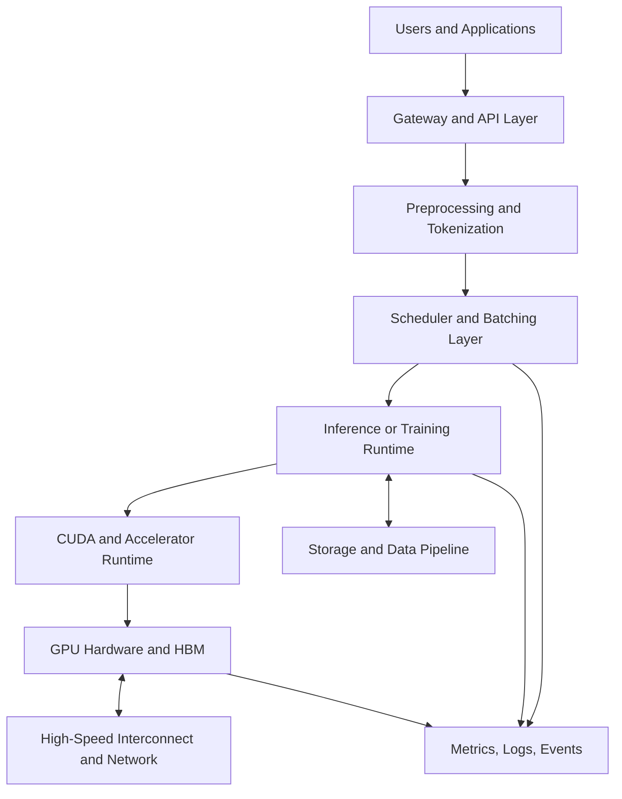
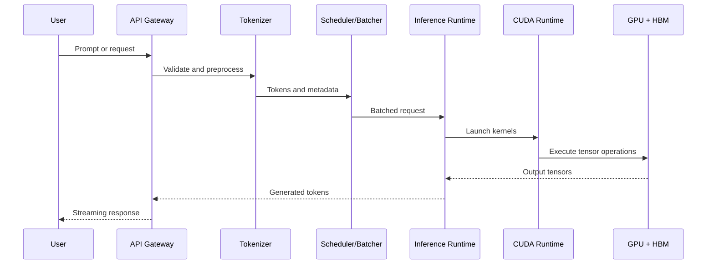

# What Is AI Infrastructure?

## Introduction

Modern AI applications look deceptively simple. A user sends a prompt, uploads an image, submits a document, or calls an API. A model returns an answer. From the outside, the experience resembles any other web application: request in, response out.

Inside the data center, the system is very different. The response may require tokenization, model execution, high-bandwidth memory access, GPU scheduling, distributed communication, storage access, request batching, streaming output, observability, and failure handling. AI infrastructure is the discipline of designing and operating that system reliably at production scale.

This chapter does not begin by listing NVIDIA products. It begins with the problem: traditional infrastructure was not designed for workloads dominated by large-scale tensor computation and continuous data movement.

## Chapter Metadata

| Field | Value |
|---|---|
| Volume | Volume 01 — AI Infrastructure Foundations |
| Difficulty | Foundation |
| Estimated Reading Time | 40 minutes |
| Prerequisites | Linux, networking, containers, and general infrastructure experience |
| Primary Outcome | Understand the purpose and boundaries of AI infrastructure |

## Story: The Model That Worked in a Demo but Failed in Production

A platform team builds an internal assistant for engineering documentation. The demo works well: one engineer asks a question, the model responds, and the team celebrates. Then the service is opened to hundreds of employees. Latency becomes unpredictable, some requests time out, GPU memory becomes fragmented, and the monitoring dashboard shows poor utilization even though users are waiting.

The team initially treats the problem like a normal application scaling issue. They add replicas, increase CPU limits, and expand the node pool. Some symptoms improve, but the core bottleneck remains. The model is not slow because the HTTP service is poorly written. It is slow because the system was never architected as an AI workload pipeline.

The team now has to answer infrastructure questions that did not exist in the prototype: Where should model execution run? How should requests be batched? How much GPU memory is required? What happens when one GPU fails? How do we monitor utilization, thermals, errors, and inference latency together? How do we explain the cost to leadership?

:::info First principle
AI infrastructure exists because deploying a model is not the same as operating a production AI system. The model is only one component in a larger architecture.
:::

## Learning Objectives

After completing this chapter, you will be able to:

- Explain what AI infrastructure is without relying on vendor terminology.
- Describe the difference between a model, an AI application, and an AI infrastructure platform.
- Identify the major layers of a production AI system.
- Explain why GPUs, memory, networking, storage, and orchestration must be designed together.
- Discuss common production failure modes in early AI deployments.

## Big Picture

AI infrastructure is a layered system. Each layer has a specific responsibility, and performance depends on how efficiently the layers interact. A weak storage pipeline can starve GPUs. A poor batching strategy can waste expensive accelerators. A network bottleneck can break distributed training. A missing observability layer can turn small failures into long outages.

**Figure 1.1 — AI infrastructure as a layered production system.** The model runtime is only one part of the architecture. Production behavior depends on scheduling, memory, networking, storage, and observability.

## What Problem Are We Solving?

Traditional infrastructure is excellent at hosting services, databases, queues, caches, and APIs. Those systems usually scale by adding application replicas, database capacity, cache layers, or message-processing workers. AI systems introduce a different execution pattern. They require large numerical workloads to run over model weights, activations, embeddings, image tensors, audio features, or simulation data.

The hard problem is not merely running code. The hard problem is feeding expensive compute devices with enough data, keeping them utilized, isolating tenants, scheduling limited accelerator resources, handling failures, and meeting latency or throughput targets at an acceptable cost.

| Traditional Platform Question | AI Infrastructure Question |
|---|---|
| How many application replicas do we need? | How many GPUs are needed for the model size, batch shape, and latency target? |
| Is the database saturated? | Is the GPU compute-bound, memory-bound, network-bound, or input-pipeline-bound? |
| Are pods healthy? | Are GPU devices healthy, visible, scheduled, and correctly isolated? |
| Is CPU utilization high? | Is accelerator utilization high for the right reason? |
| Can we scale horizontally? | Can the workload scale across GPUs, nodes, racks, and networks efficiently? |

## What AI Infrastructure Includes

AI infrastructure includes the full stack required to build, deploy, operate, monitor, secure, and troubleshoot AI workloads. It is not limited to GPUs, although GPUs are often the most visible and expensive part of the system.

| Layer | Examples | Primary Responsibility |
|---|---|---|
| Hardware | CPU, GPU, memory, storage, NICs, power, cooling | Provide physical compute and data movement capacity |
| Accelerator Runtime | CUDA, drivers, libraries, container runtime integration | Allow software to use GPUs correctly and efficiently |
| Platform | Kubernetes, GPU Operator, schedulers, admission policies | Orchestrate workloads and expose GPU resources safely |
| Workload Runtime | Triton, vLLM, TensorRT-LLM, PyTorch, NCCL | Execute inference, training, and distributed computation |
| Data Layer | Object storage, filesystems, checkpoint storage, vector stores | Feed models and persist training or inference artifacts |
| Operations | Observability, alerting, upgrades, incident response | Keep the system reliable over time |
| Governance | Security, isolation, quotas, chargeback, compliance | Make shared AI platforms safe for enterprise use |

## Why NVIDIA Appears So Often in AI Infrastructure

NVIDIA is central to many AI infrastructure discussions because it provides a large part of the accelerator ecosystem: GPUs, CUDA, communication libraries, networking technologies, systems such as DGX, platform software, inference runtimes, and enterprise packaging. However, this bootcamp does not treat NVIDIA products as magic boxes. Each technology will be introduced through the problem it solves.

For example, we will not start by saying “NVLink is a high-speed GPU interconnect.” We will first ask why PCIe becomes limiting for GPU-to-GPU communication. We will not start by saying “NCCL is a communication library.” We will first ask why distributed training needs efficient collective operations. That is the learning style for the entire book.

## Internal Working: A Single Inference Request

A single inference request crosses many boundaries. Even before a GPU executes model layers, the platform must receive the request, validate it, possibly retrieve context, tokenize the input, place the request into a batch, allocate memory, execute kernels, and stream the response. Each boundary introduces latency, queueing, failure modes, and observability requirements.

**Figure 1.2 — Inference request lifecycle.** A production request path includes control-plane work, data preparation, batching, kernel execution, and response streaming.

## Production Architecture Considerations

An AI infrastructure design must balance performance, reliability, cost, and operational complexity. The fastest design is not always the right design. A platform that achieves excellent benchmark numbers but cannot be upgraded safely, monitored clearly, or shared securely will fail in enterprise environments.

| Concern | Architecture Question |
|---|---|
| Performance | Are GPUs waiting on data, memory, network, or scheduling? |
| Scalability | Can the design grow from one node to many racks without redesign? |
| Reliability | What happens when a GPU, node, switch, driver, or model server fails? |
| Security | How are tenants, models, secrets, and network paths isolated? |
| Observability | Can operators see GPU, runtime, application, network, and storage signals together? |
| Cost | Are expensive accelerators used efficiently, or are they idle because another layer is slow? |
| Operations | How are drivers, firmware, models, runtimes, and Kubernetes components upgraded? |

## When AI Infrastructure Is Not Needed

Not every AI experiment requires a production AI infrastructure platform. A small proof of concept, a CPU-friendly model, or an offline batch task may run perfectly well on existing infrastructure. The need becomes serious when model size, concurrency, latency, data volume, reliability, compliance, or cost force the organization to treat AI as a production platform.

| Lightweight Setup Is Enough When | AI Infrastructure Becomes Necessary When |
|---|---|
| One team is experimenting | Multiple teams need shared GPU access |
| Latency is not important | Latency and throughput are customer-facing requirements |
| Model size is small | Model weights and context require accelerator memory planning |
| Failures are acceptable | Failures impact customers or business workflows |
| Manual deployment is acceptable | Repeatability, upgrades, monitoring, and incident response matter |

## Hands-on Lab Preview

The first lab in this volume asks you to inspect a host from an AI infrastructure perspective. Instead of blindly running `nvidia-smi`, the lab teaches what to look for: CPU layout, memory, kernel, container runtime, GPU visibility, and basic resource signals. Later labs will add CUDA, containers, Kubernetes, GPU Operator, inference serving, distributed training, and troubleshooting.

## Production Troubleshooting

### Problem

A newly deployed AI application has poor latency and low accelerator utilization.

### Likely Symptoms

- Users report slow responses even though GPUs are present.
- GPU utilization is low or bursty rather than sustained.
- CPU, storage, or tokenization stages show queueing.
- Application replicas scale, but end-to-end latency remains high.

### Diagnosis Approach

Do not begin by blaming the model or buying more GPUs. Break the request path into stages and measure each one: ingress, preprocessing, batching, runtime execution, GPU utilization, memory usage, output generation, and network response. The slowest stage determines the user experience.

### Root Cause Pattern

Early AI deployments often fail because the team accelerates one part of the system while leaving the rest of the pipeline unchanged. A fast GPU cannot compensate for slow input processing, poor batching, weak scheduling, insufficient memory, or missing observability.

### Production Advice

Build AI platforms as measurable pipelines. Every important layer should expose metrics, logs, health state, and ownership. The question is not only “Is the GPU working?” The production question is “Is the complete AI service meeting its reliability, latency, throughput, and cost goals?”

## Customer Scenario

A customer says: “We purchased eight GPU servers. Now what?”

A strong architecture conversation does not begin with installation commands. It begins with workload discovery. What models will run? Are they training or inference workloads? What are the latency and throughput goals? How many teams will share the cluster? What data sources are involved? What security boundaries are required? What monitoring and support model exists?

Only after those questions are answered should the architect recommend hardware topology, Kubernetes design, GPU sharing strategy, storage, networking, observability, and operational runbooks.

## Interview Preparation

### Conceptual Questions

1. What is the difference between an AI model and AI infrastructure?
2. Why is GPU utilization alone not enough to judge platform health?
3. Why does data movement matter so much in AI systems?

### Architecture Questions

1. Draw a basic production inference platform and explain each layer.
2. How would you design an AI platform for multiple internal teams?
3. What changes when moving from a demo model to a production AI service?

### Troubleshooting Questions

1. A model server has low GPU utilization but high user latency. What do you inspect first?
2. How would you determine whether the bottleneck is tokenization, scheduling, GPU execution, or storage?
3. What observability signals should exist before an AI platform goes live?

## Summary

AI infrastructure is the production system around AI workloads. It includes hardware, runtimes, orchestration, storage, networking, observability, security, and operations. GPUs are important, but they are not the whole story. The goal is to design a complete system that can run AI workloads reliably, efficiently, and safely.

The next chapter explains why CPU-centric infrastructure becomes insufficient for many AI workloads and why parallel accelerators became necessary.

## Quick Revision Sheet

| Question | Answer |
|---|---|
| What is AI infrastructure? | The full stack required to deploy, operate, monitor, secure, and troubleshoot AI workloads. |
| Is it only GPUs? | No. GPUs are one layer in a larger production system. |
| Why does architecture matter? | AI performance depends on compute, memory, data movement, scheduling, and operations together. |
| What is the first design step? | Understand the workload before choosing hardware or software. |

## Related Chapters

- Next: [Why CPUs Became Insufficient](./chapter-02-why-cpus-became-insufficient.md)
- Lab: [Inspect an AI Infrastructure Host](./labs/lab-01-inspect-an-ai-infrastructure-host.md)
