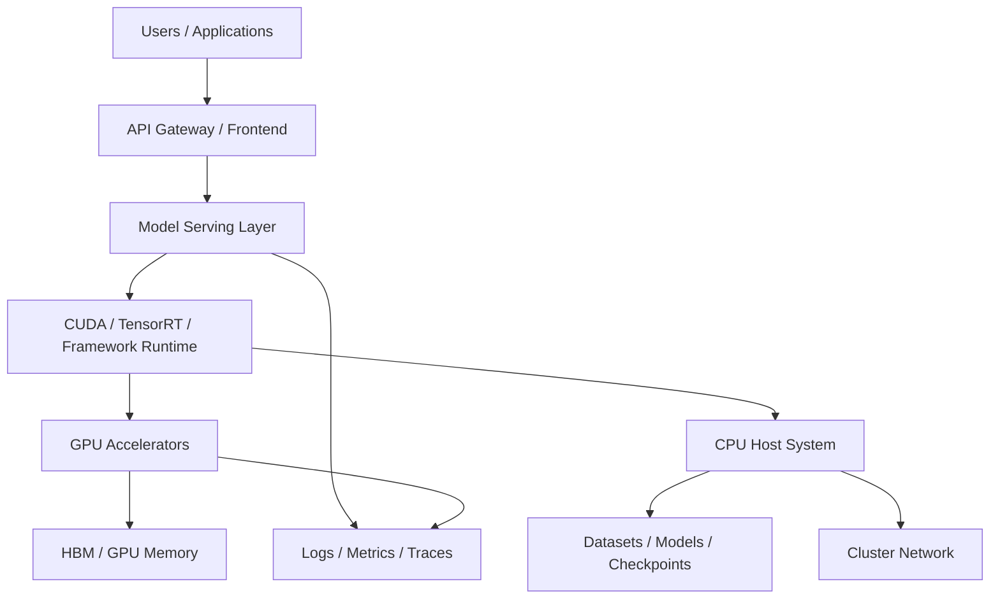
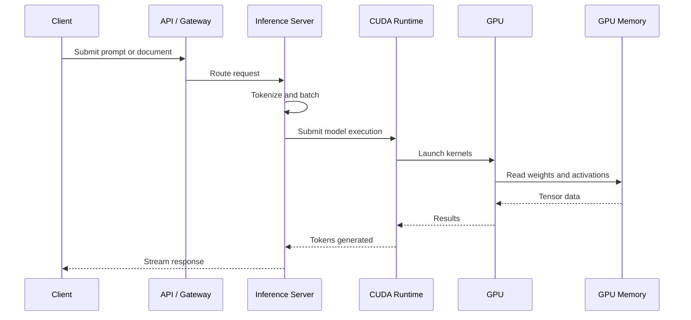

# What Is AI Infrastructure?

| Chapter metadata | Value |
|---|---|
| Volume | 01 — AI Infrastructure Foundations |
| Difficulty | Foundation |
| Estimated reading time | 35 minutes |
| Primary audience | DevOps, SRE, Platform, Cloud and Infrastructure Engineers |
| Core question | What problem does AI infrastructure solve that traditional infrastructure does not? |

## Introduction

Modern AI applications look deceptively simple from the outside. A user sends a prompt, uploads an image, submits a document or calls an API, and a model returns an answer. The product experience feels like a normal web service, but the infrastructure behind that request is very different from the infrastructure behind a traditional API.

A conventional web platform is mostly concerned with request routing, business logic, databases, caches, queues, storage and network reliability. An AI platform must handle all of those concerns plus model execution, tensor memory, accelerator scheduling, high-bandwidth interconnects, distributed computation, model-serving latency, GPU utilization, checkpoint storage and failure modes that do not exist in CPU-only systems.

AI infrastructure is the engineering discipline responsible for making that full stack work reliably in production. It is not just “servers with GPUs.” It is the combination of compute, memory, networking, storage, software runtimes, orchestration, observability and operations required to train, serve and operate AI models at scale.

:::info Principal Engineer View
AI infrastructure begins when the limiting factor is no longer ordinary application hosting. The limiting factor becomes accelerated computation, memory movement, model lifecycle, distributed execution and the ability to keep expensive GPUs doing useful work.
:::

## Story

A platform team deploys a document summarization service for internal users. The first version runs on CPU servers and performs acceptably during a small pilot. One user submits a document, the model generates a summary, and the response time is acceptable enough for early testing.

Then the service is connected to the company knowledge base. Usage increases, requests become longer, and many users begin submitting documents at the same time. Each request now requires document parsing, tokenization, model execution and response generation. The team adds more CPU nodes, but the improvement is disappointing: infrastructure cost rises quickly while latency remains too high for a production service.

The team eventually realizes that the system is not failing because the platform engineers forgot how to scale web applications. It is failing because model execution is a different class of workload. The expensive part of the request is not the HTTP handler or the database call. It is the repeated numerical computation and memory movement inside the model. That is the point where AI infrastructure becomes necessary.

## Learning Objectives

After completing this chapter, you will be able to explain why AI workloads require a different infrastructure mindset, describe the major layers of an AI infrastructure stack, distinguish traditional application bottlenecks from AI-specific bottlenecks, identify why GPUs appear in modern AI platforms, and explain the role of orchestration, networking, storage and observability in production AI systems.

## Big Picture

Figure 1.1 shows AI infrastructure as a layered system. The model is only one part of the design. A production platform must also handle client traffic, serving frameworks, runtime libraries, accelerator hardware, memory, interconnects, storage, monitoring and operations.

**Figure 1.1 — AI infrastructure stack.** A production AI service requires application, runtime, accelerator, memory, networking, storage and operations layers to work together.

## Deep Explanation

Traditional infrastructure is designed around general-purpose computation. A web service receives a request, executes application logic, reads or writes data, and returns a response. Scaling usually means adding more application instances, database replicas, cache capacity or queue workers. The primary concerns are availability, latency, throughput, state management, network reliability and deployment safety.

AI workloads add a new dominant concern: accelerated mathematical execution. Large models perform repeated tensor operations over large amounts of data. These operations are often highly parallel, memory-intensive and expensive to run on CPUs alone. The infrastructure must therefore move from a CPU-centric design to a heterogeneous design where CPUs, GPUs, memory systems and interconnects cooperate.

| Traditional platform concern | AI infrastructure adds |
|---|---|
| Application routing | Model routing, batching and streaming responses |
| CPU utilization | GPU utilization and accelerator scheduling |
| System memory | GPU memory, KV cache and model weights |
| Network latency | Inter-GPU and inter-node communication |
| Storage capacity | Dataset, checkpoint and model artifact throughput |
| Application logs | GPU metrics, CUDA errors, XID events and model-serving telemetry |
| Horizontal scaling | Distributed inference, distributed training and topology awareness |

The important shift is that AI infrastructure is not defined by a single product. It is defined by the interaction of many layers. A fast GPU does not help if the model cannot fit in memory. A large model does not perform well if tokenization starves the GPU. A multi-node cluster does not scale if the network cannot handle collective communication. A Kubernetes deployment is not production-ready if GPU failures are invisible to monitoring.

## Internal Working

A typical inference request moves through several stages. The platform receives the request, applies authentication and routing, prepares the input, submits model work to the runtime, executes GPU kernels, reads model weights from GPU memory, generates output tokens and streams the result back to the user. Every stage can become the bottleneck.

**Figure 1.2 — Request lifecycle inside an AI service.** The visible product request becomes a coordinated sequence across application, runtime, GPU and memory layers.

## Architecture

A production AI platform must be designed around workload characteristics. Training workloads usually optimize total throughput and distributed scaling. Real-time inference workloads optimize latency, concurrency and predictable response time. Batch inference workloads optimize cost per processed item. Retrieval-augmented generation workloads add vector databases, document stores and retrieval pipelines. Scientific workloads may care about precision and numerical reproducibility.

| Design dimension | Production question |
|---|---|
| Workload | Is this training, inference, fine-tuning, batch inference, RAG or simulation? |
| Latency | Is the user waiting interactively or is this offline processing? |
| Throughput | How many requests, tokens, images or training samples must be processed? |
| Memory | Can the model, activations and KV cache fit comfortably in GPU memory? |
| Network | Does the workload need multi-GPU or multi-node communication? |
| Storage | Are model files, datasets and checkpoints delivered fast enough? |
| Operations | Can the team monitor, upgrade, isolate tenants and recover from failures? |
| Cost | Are expensive GPUs highly utilized or mostly idle? |

:::tip Production Rule
Do not start with “Which GPU should we buy?” Start with the workload, latency target, model size, concurrency, data path, failure tolerance and operating model. Hardware selection comes after architecture analysis.
:::

## Production Deployment

In real environments, AI infrastructure appears as GPU-enabled nodes connected to high-speed storage and networking, managed by an orchestration platform such as Kubernetes or a specialized cluster manager. The software stack includes NVIDIA drivers, CUDA libraries, container runtime integration, device discovery, monitoring exporters, model-serving frameworks and workload schedulers.

A small deployment may contain one GPU node running a single inference service. An enterprise deployment may contain many racks of GPU systems, dedicated storage, InfiniBand or tuned Ethernet fabrics, separate training and inference clusters, strict tenant isolation, model registries, CI/CD pipelines and operational runbooks. The architectural principles are the same, but the failure blast radius and operational discipline change dramatically at scale.

## Hands-on Lab

The first lab in this volume is **Lab 01 — Inspect an AI Infrastructure Host**. It does not install software. It teaches the habit of inspecting the machine first: CPU, memory, PCIe, GPU visibility, driver state and topology. This is intentional. Engineers who cannot read the current state of a system cannot safely operate AI infrastructure.

## Production Troubleshooting

### Problem: The service has poor latency after moving to production

| Signal | Interpretation |
|---|---|
| High CPU usage and low GPU usage | Preprocessing, tokenization or request handling may be starving the GPU. |
| High GPU usage and high latency | The model may be too large, batches may be too big, or GPU memory may be constrained. |
| Low CPU and low GPU usage | The bottleneck may be network, storage, queueing or external dependencies. |
| GPU memory near capacity | Model weights, activations or KV cache may be limiting concurrency. |
| Increasing tail latency | Batching, scheduling or contention may be unstable under load. |

The lesson is that AI troubleshooting is layered. You must inspect the application, CPU, runtime, GPU, memory, network and storage path before deciding where to scale.

## Customer Scenario

A customer says, “We purchased eight GPU servers. Now what?” A weak answer starts with installation commands. A strong answer starts with questions: What workload will run? Is it training or inference? What models? What latency target? What data path? What users? What availability expectation? What monitoring exists? What team will operate it?

Only after those answers are clear should an architect discuss cluster layout, GPU allocation, Kubernetes integration, networking, storage, model serving, observability and operational runbooks. AI infrastructure is not successful when GPUs are installed. It is successful when the business workload runs reliably, efficiently and observably.

## Interview Preparation

**Conceptual:** What makes AI infrastructure different from traditional application infrastructure?

**Architecture:** Draw the major layers of an AI inference platform and explain the role of each layer.

**Scenario:** A customer has GPUs installed but poor model latency. What do you inspect first?

**Troubleshooting:** Why can a GPU-enabled application still behave like a CPU-bound system?

**Customer:** How would you explain the value of AI infrastructure without using marketing language?

## Summary

AI infrastructure is the production system required to run AI workloads reliably and efficiently. It combines traditional platform engineering with accelerator hardware, GPU software, model-serving frameworks, high-bandwidth memory, fast networking, storage pipelines, observability and operations. The central lesson is simple: AI platforms fail when engineers treat model execution like ordinary application hosting.

## Key Takeaways

- AI infrastructure is a full-stack discipline, not a synonym for GPU servers.
- The workload determines the architecture; hardware selection comes later.
- Model execution introduces bottlenecks in compute, memory, data movement and scheduling.
- Production AI systems require observability across application, CPU, runtime, GPU, network and storage layers.

## Related Chapters

- Next: [Why CPUs Became Insufficient](./chapter-02-why-cpus-became-insufficient.md)
- Related: [CPU vs GPU](./chapter-03-cpu-vs-gpu.md)
- Related lab: [Inspect an AI Infrastructure Host](./labs/lab-01-inspect-an-ai-infrastructure-host.md)
