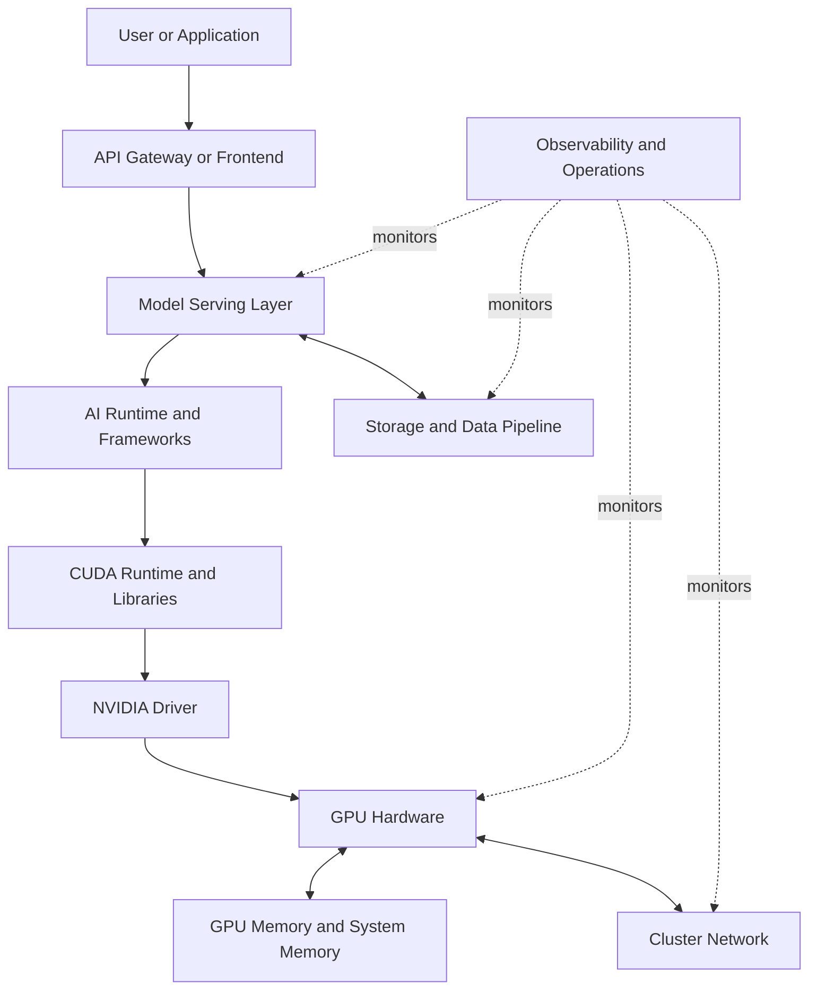
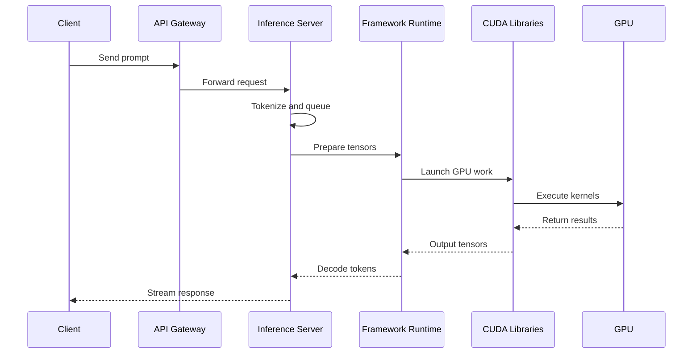
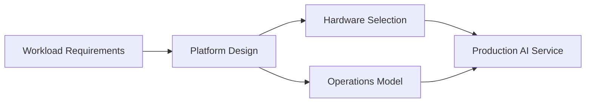

# What Is AI Infrastructure?

## Introduction

Modern AI applications appear simple from the outside.

A user sends a prompt, uploads an image, submits a document, or calls an API.

A model returns an answer.

The interface hides the infrastructure problem.

Behind that response is a system that must load model weights, move tensors through memory, schedule work onto accelerators, stream data through networks, and recover from failures without users noticing.

This chapter does not begin by defining AI infrastructure.

It begins with the problem.

What must exist underneath an AI application so that training, inference, evaluation, and deployment can happen reliably at production scale?

## Story

A financial services company wants to deploy an internal assistant for developers and operations teams.

The first prototype runs on a single CPU server.

It works during a demo.

Then the platform team opens access to a larger engineering group.

The symptoms appear quickly.

- Response latency becomes unpredictable.
- CPU utilization remains high for long periods.
- Memory pressure increases when the model is loaded.
- Concurrent users experience long queues.
- Scaling by adding more CPU servers improves cost faster than performance.

The team initially treats this like a traditional web application problem.

They add more replicas.

They add a load balancer.

They increase instance sizes.

The system still feels slow.

The reason is that an AI workload is not primarily a request-routing problem.

It is a compute, memory, and data-movement problem.

A large model spends most of its useful work performing repeated numerical operations over large tensors. The infrastructure must feed those operations fast enough, schedule them efficiently, and avoid wasting expensive accelerator capacity.

That is the beginning of AI infrastructure.

## Learning Objectives

After completing this chapter, you will be able to:

- Explain why AI infrastructure exists as a separate discipline.
- Describe the major layers involved in a production AI platform.
- Distinguish application latency from accelerator utilization problems.
- Explain why compute, memory, storage, and networking must be designed together.
- Discuss the first questions an architect should ask before recommending GPUs.

## Prerequisites

You should already understand basic Linux operations, containers, networking, and Kubernetes concepts.

You do not need prior NVIDIA knowledge.

You do not need CUDA experience.

## Estimated Reading Time

30–40 minutes.

## Difficulty

Foundation.

## Big Picture

AI infrastructure is the set of hardware, system software, orchestration, networking, storage, observability, and operational processes required to run AI workloads reliably.

It is easiest to understand as a stack.



Figure 1.1 — AI infrastructure stack.

The important point is not the number of layers.

The important point is that performance and reliability depend on the interaction between layers.

A fast GPU does not help if the model server batches requests poorly.

A well-tuned model server does not help if storage cannot feed data fast enough.

A strong Kubernetes platform does not help if the driver and runtime stack are inconsistent across nodes.

## Deep Explanation

Traditional infrastructure was built around general-purpose computing.

A CPU is excellent at running operating systems, databases, control planes, web servers, networking stacks, and applications with complex branching logic.

It is optimized for low-latency execution of diverse instructions.

AI workloads stress a different part of the system.

A neural network executes repeated mathematical operations over large arrays of numbers.

Those arrays are tensors.

The operation pattern is often highly parallel.

Instead of asking one core to make many different decisions, the system asks many execution units to perform similar mathematical operations across large blocks of data.

That distinction changes infrastructure design.

A production AI platform must answer questions that traditional application platforms often avoid:

| Question | Why It Matters |
|---|---|
| Where do model weights live? | Large models may consume significant accelerator memory. |
| How are tensors moved? | Data movement can dominate latency. |
| How are GPUs scheduled? | Idle GPUs are expensive and reduce platform efficiency. |
| How are requests batched? | Batching improves throughput but can increase latency. |
| How are failures detected? | GPU, driver, runtime, network, and application failures look different. |
| How is performance measured? | CPU metrics alone do not explain AI workload behavior. |

AI infrastructure exists because these questions must be handled deliberately.

## What Makes AI Infrastructure Different?

AI infrastructure is not only traditional infrastructure with GPUs attached.

Adding GPUs changes the operating model.

The platform must now manage accelerator lifecycle, driver compatibility, CUDA libraries, container runtime integration, topology awareness, model memory behavior, and workload-level performance.

The difference becomes visible in production.

| Traditional Platform Concern | AI Infrastructure Concern |
|---|---|
| CPU utilization | GPU utilization and memory pressure |
| Request latency | Token latency, batching latency, and queueing |
| Horizontal pod autoscaling | GPU-aware scheduling and capacity planning |
| Disk throughput | Dataset, checkpoint, and model weight movement |
| Network reachability | RDMA, collective communication, and fabric health |
| Application logs | Driver, CUDA, Kubernetes, and accelerator metrics |

The systems are related, but the failure modes are different.

An experienced platform engineer already has useful instincts.

Those instincts must be extended to include accelerators.

## Internal Working

A simplified inference request flows through several stages.



Figure 1.2 — Simplified inference request flow.

Each stage can become the bottleneck.

If tokenization is slow, the GPU waits.

If batching is too small, GPU utilization is poor.

If the model does not fit efficiently in GPU memory, latency increases.

If the network is congested, distributed workloads stall.

If observability stops at the application layer, the operator may not see the real cause.

## Architecture

A good AI infrastructure design starts with workload questions, not product names.

The first questions are:

- Is the workload training, inference, fine-tuning, batch inference, simulation, or data processing?
- Is the priority latency, throughput, cost efficiency, accuracy, or developer velocity?
- How large is the model?
- How large is the dataset?
- How many users or jobs must run concurrently?
- What are the availability and security requirements?
- What operational team will run the platform?

Only after these answers are clear should the architecture select hardware, networking, storage, and orchestration.

### Architecture Principles

| Principle | Meaning |
|---|---|
| Understand the workload first | Training and inference need different designs. |
| Minimize data movement | Moving tensors is expensive. |
| Optimize the whole pipeline | A fast GPU cannot fix slow preprocessing. |
| Observe every layer | Hardware, driver, runtime, platform, and application metrics matter. |
| Design for failure | GPU clusters fail like all production systems. |
| Balance performance and cost | Peak speed is not always the correct architecture. |

## Production Deployment

A production AI platform usually includes more than GPU nodes.

It includes:

- GPU servers or cloud GPU instances.
- NVIDIA drivers and CUDA-compatible runtime libraries.
- Container runtime integration.
- Kubernetes or another workload orchestrator.
- A model serving or training framework.
- High-speed storage for datasets, checkpoints, and model artifacts.
- Network fabric appropriate for the workload.
- Monitoring, logging, alerting, and capacity reporting.
- Upgrade and incident response procedures.

In a small environment, these layers may run on a few nodes.

In an enterprise environment, they may span racks, fabrics, storage systems, identity platforms, and regulated network boundaries.

The architecture must be understandable before it can be operated.

## Hands-on Lab

The lab for this chapter is `Lab 01: Inspect an AI Infrastructure Host`.

The lab does not assume a GPU is available.

Its purpose is to teach inspection habits:

- Identify CPU and memory characteristics.
- Inspect PCI devices.
- Check whether NVIDIA hardware and drivers are present.
- Understand what information is missing when no GPU exists.

This prepares the reader for later GPU-specific labs.

## Production Troubleshooting

### Problem

The AI assistant is slow even though the platform has enough CPU and memory.

### Symptoms

- Requests queue during load.
- CPU usage is high during generation.
- Latency increases as concurrency increases.
- Scaling CPU replicas does not reduce latency proportionally.

### Diagnosis

Start by separating application latency from accelerator capacity.

Useful questions:

- Is inference running on CPU or GPU?
- Is the model loaded once or repeatedly?
- Is batching configured?
- Is preprocessing slower than model execution?
- Are requests waiting in a queue before execution?

### Commands

Purpose: check whether NVIDIA GPUs are visible.

```bash
lspci | grep -i nvidia
```

Expected healthy output on a GPU host is one or more NVIDIA PCI devices.

A host without NVIDIA hardware returns no matching lines.

Purpose: check whether the NVIDIA management CLI is installed and the driver can communicate with the GPU.

```bash
nvidia-smi
```

Expected healthy output includes a driver version, CUDA compatibility version, and at least one visible GPU.

If the command is missing, the NVIDIA user-space tooling is not installed or not in the shell path.

If the command exists but fails, the driver may not be loaded, the GPU may not be visible, or permissions may be incorrect.

### Root Cause

The workload is running on general-purpose CPU infrastructure rather than accelerator-aware infrastructure.

### Resolution

Move from generic application hosting to an AI infrastructure design.

That does not mean buying GPUs immediately.

It means first characterizing the workload, then selecting the correct compute, memory, runtime, orchestration, and observability model.

### Prevention

Treat AI workloads as infrastructure workloads, not only application workloads.

Define performance targets, concurrency targets, and observability requirements before deployment.

## Customer Scenario

A customer says:

> We already run Kubernetes. Why do we need a special AI infrastructure design?

A good answer is:

Kubernetes schedules containers, but it does not by itself solve accelerator lifecycle, GPU topology, CUDA compatibility, model memory behavior, batching, inference latency, distributed training communication, or GPU observability.

Kubernetes is part of the platform.

It is not the complete AI infrastructure architecture.

## Interview Preparation

### Conceptual Questions

1. Why is AI infrastructure considered a separate discipline from traditional application infrastructure?
2. Why is GPU utilization alone not enough to judge platform health?
3. Why can adding more replicas fail to improve AI inference latency?

### Architecture Questions

1. Draw the layers involved in a production inference platform.
2. Where would you place observability in the architecture?
3. What questions would you ask before recommending a GPU platform?

### Scenario Questions

1. A customer reports slow inference after moving from a demo to production. How do you begin diagnosis?
2. A team wants to buy high-end GPUs before measuring workload behavior. How would you respond?

### Troubleshooting Questions

1. `nvidia-smi` fails on a supposed GPU node. What are your first checks?
2. GPU utilization is low but latency is high. What non-GPU bottlenecks would you investigate?

## Summary

AI infrastructure exists because AI workloads place unusual pressure on compute, memory, data movement, scheduling, networking, and observability.

A production AI system is not only a model.

It is a layered platform that must move data efficiently, execute numerical workloads on accelerators, expose meaningful signals, and recover from failures.

The correct architectural mindset begins with workload requirements.

Technology selection comes later.

## Key Takeaways

- AI infrastructure solves compute, memory, data movement, scheduling, and operations problems.
- GPUs are important, but they are only one layer of the system.
- Traditional infrastructure knowledge remains valuable, but it must be extended for accelerators.
- Architecture should begin with workload characteristics and production constraints.

## Architecture Summary



Figure 1.3 — Technology selection follows workload understanding.

## Quick Revision Sheet

| Concept | Reminder |
|---|---|
| AI infrastructure | Full platform required to run AI workloads reliably. |
| GPU | Accelerator optimized for parallel numerical work. |
| Bottleneck | The slowest layer limiting system performance. |
| Observability | Required across hardware, driver, runtime, platform, and application layers. |

## Lab Checklist

- Read Lab 01.
- Inspect CPU, memory, PCI devices, and driver state.
- Record what the host can and cannot tell you.
- Prepare for GPU-specific inspection in later chapters.

## Further Reading

- NVIDIA CUDA documentation.
- NVIDIA Data Center GPU documentation.
- Kubernetes device plugin documentation.
- Docusaurus documentation for maintaining this curriculum.

## Next Chapter

Continue to Chapter 02: Why CPUs Became Insufficient.
