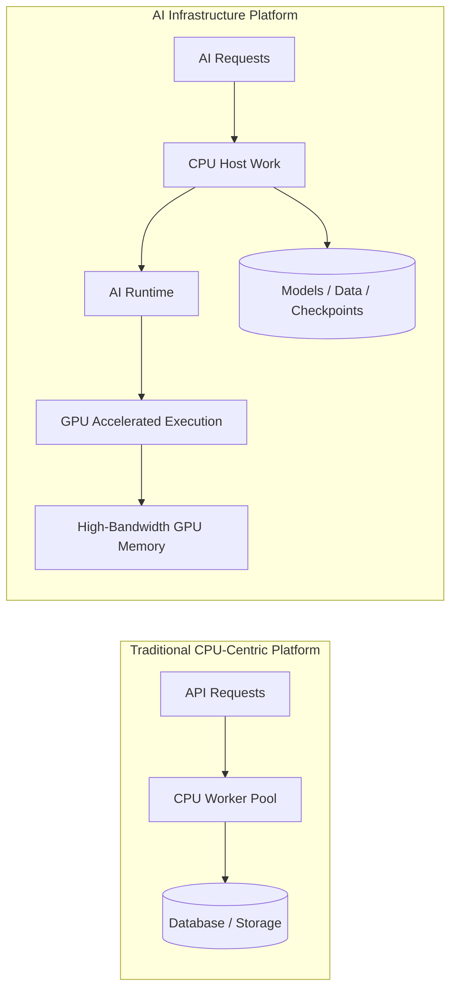
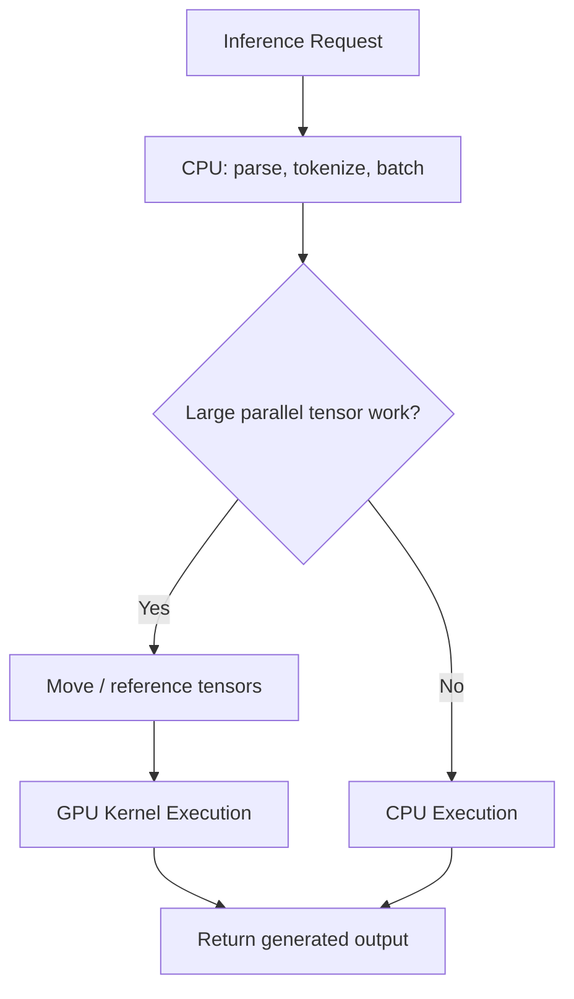

# Why CPUs Became Insufficient

| Chapter metadata | Value |
|---|---|
| Volume | 01 — AI Infrastructure Foundations |
| Difficulty | Foundation |
| Estimated reading time | 35 minutes |
| Primary audience | DevOps, SRE, Platform, Cloud and Infrastructure Engineers |
| Core question | Why did CPU-centric scaling stop being enough for modern AI workloads? |

## Introduction

The CPU did not become irrelevant. It became insufficient for a specific class of workload: large-scale numerical computation over tensors, matrices and vectors. That distinction matters because CPUs still run operating systems, schedulers, storage stacks, networking, security agents, orchestration components and application logic in every AI platform.

The architectural shift happened because AI workloads changed the bottleneck. Traditional infrastructure often scales by adding CPU cores, memory, replicas or cache capacity. Modern AI workloads require enormous parallel computation and sustained memory bandwidth. When the expensive part of the request becomes repeated matrix multiplication over large model weights, adding ordinary CPU capacity no longer produces proportional improvement.

:::info Principal Engineer View
CPU-centric scaling fails when the workload contains more parallel mathematical work than the CPU architecture can execute efficiently. The answer is not “remove CPUs.” The answer is to introduce accelerators and redesign the system around heterogeneous execution.
:::

## Story

A team builds an internal summarization service using a transformer model. During the pilot, the service handles a few requests per minute. CPU latency is acceptable because the load is low and the users are tolerant of delays. The architecture looks familiar: API service, queue, workers, object storage and monitoring.

Then adoption grows. Documents become longer, concurrency increases and the model must generate more tokens per request. The team adds CPU replicas, but the cost curve becomes ugly. Throughput improves slightly, yet tail latency remains high. Profiling shows that most time is spent in numerical model execution, not in the HTTP server, database or queue.

At this point the team has reached the limit of CPU-centric thinking. The workload is not primarily a web service problem anymore. It is a compute acceleration problem, a memory bandwidth problem and a data movement problem. The architecture must change.

## Learning Objectives

After completing this chapter, you will be able to explain why CPU scaling is effective for many traditional systems but insufficient for large AI workloads, describe the relationship between parallelism and model execution, identify memory bandwidth as a major AI infrastructure constraint, explain why accelerators became necessary, and discuss when CPUs are still the right execution target.

## Big Picture

Figure 2.1 shows the transition from traditional CPU-centric scaling to accelerator-aware AI infrastructure. CPU scaling adds general-purpose workers. AI scaling introduces a separate accelerated execution path for the parts of the workload that can run in parallel.

**Figure 2.1 — From CPU scaling to accelerator-aware execution.** AI infrastructure keeps CPUs but moves suitable numerical work onto GPUs.

## Deep Explanation

CPUs are excellent general-purpose processors. They execute complex instruction streams, handle branches, respond to interrupts, manage virtual memory, run kernels, operate filesystems and coordinate I/O. This is why CPUs remain the control center of every server, including GPU servers.

The problem is that AI model execution has different characteristics. Neural networks repeatedly apply mathematical operations to large tensors. The same kind of operation is performed many times across many data elements. This is a natural fit for parallel execution. A CPU can perform the operations correctly, but it cannot always perform enough of them concurrently to meet latency, throughput and cost goals.

| Workload characteristic | Traditional CPU platform | AI workload pressure |
|---|---|---|
| Control flow | Many branches and decisions | Often regular mathematical kernels |
| Parallelism | Request-level concurrency | Massive data-level and tensor-level parallelism |
| Memory access | General application data | Large model weights, activations and KV cache |
| Scaling unit | More app replicas or CPU workers | GPUs, GPU memory, interconnect and batching |
| Bottleneck | I/O, locks, database, CPU saturation | Compute throughput, memory bandwidth and data movement |

This is why the old scaling rule breaks down. Adding more CPU workers helps if the workload is embarrassingly parallel at the request level and each request is not too expensive. It helps less when each request contains a large amount of dense numerical computation. At that point, the architecture needs a processor designed for parallel throughput.

## Internal Working

A CPU-centric inference path executes model operations as ordinary CPU instructions. Each operation competes with the operating system, application threads, memory hierarchy and other host workloads. Even with vector extensions and optimized libraries, the CPU is constrained by core count, memory bandwidth and the amount of parallel execution it can expose.

An accelerator-aware path keeps the CPU responsible for orchestration but moves suitable operations to the GPU. The host process prepares tensors, submits work through the runtime, and the GPU executes many operations concurrently against data in GPU memory. The system becomes faster only when the overhead of moving and scheduling work is outweighed by the parallel execution benefit.

**Figure 2.2 — Accelerator decision path.** GPUs help when the workload exposes enough parallel tensor work to justify accelerated execution.

## Architecture

The central architecture lesson is that CPU insufficiency is not only about compute. It is also about memory bandwidth, data movement and pipeline balance. Large models require repeated access to model weights and intermediate activations. If the compute units are fast but memory cannot feed them, performance suffers. If the GPU is fast but tokenization is slow, the GPU waits. If multiple GPUs are used but networking is weak, distributed scaling collapses.

| Design concern | Architectural implication |
|---|---|
| Model size | Determines GPU memory requirements and placement strategy. |
| Concurrency | Determines batching, scheduling and KV cache pressure. |
| Input/output length | Influences latency, memory use and token generation cost. |
| CPU preprocessing | Can starve accelerators if tokenization or data loading is slow. |
| Memory bandwidth | Often limits performance even when compute capacity is high. |
| Interconnect | Matters when work spans multiple GPUs or nodes. |

:::tip Production Rule
When a CPU-based AI service is slow, do not immediately ask “Which GPU should we buy?” First determine whether the bottleneck is model compute, preprocessing, memory bandwidth, batching, network, storage or queueing.
:::

## Production Deployment

In production, CPUs remain part of the critical path. Kubernetes agents, container runtimes, GPU drivers, monitoring exporters, inference servers, tokenizers, retrieval pipelines and networking all depend on CPU capacity. A GPU server with under-provisioned CPU resources can still deliver poor performance because the accelerators are not fed efficiently.

This is why enterprise AI infrastructure sizing includes CPU-to-GPU balance, system memory, PCIe topology, GPU memory, local NVMe, network bandwidth and operational overhead. The GPU is the most visible component, but it is only one part of the node design.

## Hands-on Lab

The related lab, **Lab 01 — Inspect an AI Infrastructure Host**, asks readers to observe CPU, memory and PCIe state before looking at GPU state. This reinforces an important habit: AI infrastructure troubleshooting starts with the whole machine, not just the accelerator.

## Production Troubleshooting

### Problem: Adding CPU nodes does not reduce AI inference latency enough

| Symptom | Likely meaning |
|---|---|
| CPU usage is high and GPU is absent | Model execution is running on CPU and may need acceleration. |
| CPU usage is high but GPU usage is low | Preprocessing or scheduling may be the bottleneck. |
| GPU usage is high and latency is high | The model may be too large, memory-bound or under-batched. |
| Throughput improves but latency does not | More workers increase capacity but do not accelerate each request. |
| Cost rises faster than throughput | The architecture is scaling the wrong resource. |

A good diagnosis separates request-level scaling from per-request acceleration. More CPU replicas may handle more simultaneous requests, but they may not make each model execution fast enough.

## Customer Scenario

A customer runs a private LLM on CPU servers and asks why the service is slow. The correct response is not to criticize the CPU architecture. The correct response is to explain workload fit. CPUs are still handling routing, security, orchestration and preprocessing correctly. The issue is that large model execution is dominated by parallel tensor operations and memory bandwidth, which are better served by accelerators.

The recommendation should include workload profiling, model sizing, latency goals, concurrency targets, GPU memory requirements and operating model. Only then should the architect propose specific hardware or platform changes.

## Interview Preparation

**Conceptual:** Why did CPUs become insufficient for large AI workloads without becoming obsolete?

**Architecture:** Design a CPU/GPU node for inference and explain what runs where.

**Scenario:** A CPU-only model service scales replicas but latency remains high. What does that tell you?

**Troubleshooting:** How do you determine whether a service is CPU-bound, GPU-bound, memory-bound or pipeline-bound?

**Customer:** How would you explain the business value of GPUs without using marketing language?

## Summary

CPUs became insufficient because modern AI workloads require massive parallel computation, high memory bandwidth and efficient tensor execution. They did not disappear from the architecture; they became the control and coordination layer around accelerators. Production AI infrastructure succeeds when the CPU, GPU, memory, storage, network and runtime are designed as one system.

## Key Takeaways

- CPU-centric scaling works well for many traditional services but not for all AI workloads.
- AI model execution often requires parallel throughput and memory bandwidth beyond what CPUs can economically provide.
- GPUs are accelerators, not replacements for the entire host system.
- Profiling must precede hardware recommendations.

## Related Chapters

- Previous: [What Is AI Infrastructure?](./chapter-01-what-is-ai-infrastructure.md)
- Next: [CPU vs GPU](./chapter-03-cpu-vs-gpu.md)
- Related lab: [Inspect an AI Infrastructure Host](./labs/lab-01-inspect-an-ai-infrastructure-host.md)
