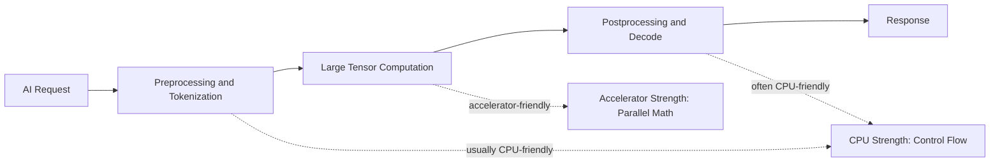
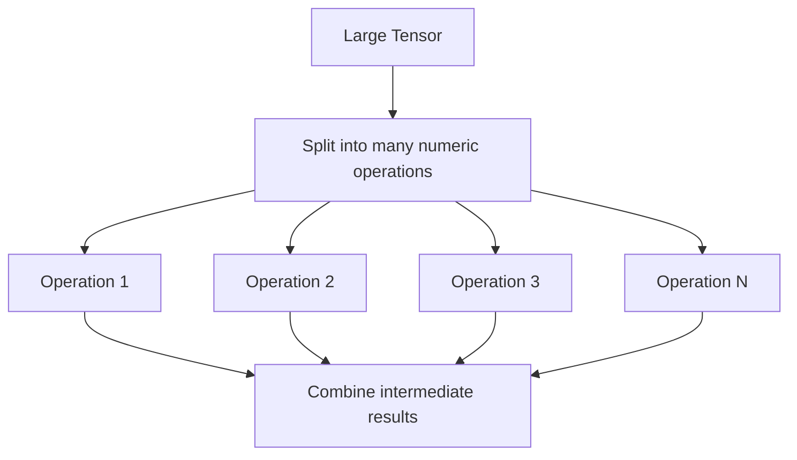
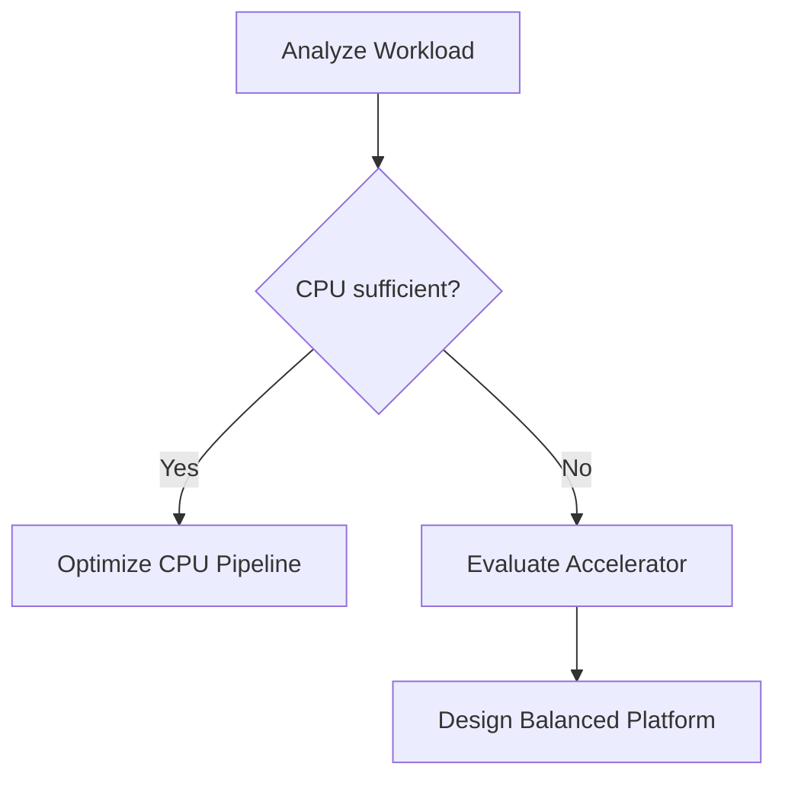

# Why CPUs Became Insufficient

## Introduction

The CPU did not become irrelevant.

It became insufficient for a specific class of workload.

That distinction matters.

Modern AI platforms still depend on CPUs for operating systems, networking, storage, orchestration, preprocessing, tokenization, and control flow.

The problem is that CPUs were not designed to execute enormous volumes of similar mathematical operations over large tensors as efficiently as accelerators.

This chapter explains the reason before introducing the solution.

## Story

A platform team runs a document summarization model on CPU servers.

During early testing, one user at a time receives acceptable responses.

Then the team connects the service to an internal knowledge base.

Usage increases.

Each request requires tokenization, model execution, and response generation.

The team adds more CPU cores.

Throughput improves, but not enough.

Latency remains high.

Infrastructure cost grows quickly.

The team notices a pattern.

The CPU is busy, but the workload is not complex in the usual application sense.

The system is repeatedly performing numerical operations across large arrays.

The CPU can do the work.

It is not the right engine for the amount and shape of the work.

## Learning Objectives

After completing this chapter, you will be able to:

- Explain why CPU-centric systems struggle with large AI workloads.
- Distinguish latency-optimized execution from throughput-optimized execution.
- Describe why parallelism changed infrastructure design.
- Identify when CPU scaling is appropriate and when it becomes inefficient.
- Prepare for the GPU execution model introduced in the next chapter.

## Prerequisites

You should understand processes, threads, memory, and basic performance troubleshooting.

No GPU knowledge is required.

## Estimated Reading Time

30–40 minutes.

## Difficulty

Foundation.

## Big Picture

A CPU-centric system is excellent when the workload requires flexible control flow.

An AI workload often requires the same mathematical operation to be repeated across large tensor blocks.



Figure 2.1 — CPU-friendly and accelerator-friendly parts of an AI request.

The CPU remains necessary.

The question is where it should be used.

## Deep Explanation

A CPU is designed for general-purpose computing.

It executes a wide variety of instructions, handles interrupts, runs operating systems, manages virtual memory, schedules processes, and supports complex branching behavior.

This flexibility is valuable.

It is also expensive when the workload is mostly repetitive numerical computation.

AI workloads often involve operations such as matrix multiplication, vector operations, normalization, and attention mechanisms.

These operations process large blocks of numeric data.

The system does not need one powerful instruction stream as much as it needs many execution units working in parallel.

That is why simply adding larger CPUs eventually becomes inefficient.

The infrastructure bottleneck shifts from instruction flexibility to parallel throughput and memory bandwidth.

## Why More CPU Cores Are Not Always Enough

Adding CPU cores can help some workloads.

It helps when the workload can be split cleanly across independent threads and when memory, cache, and synchronization overhead do not dominate.

AI workloads often hit limits before CPU core count alone solves the problem.

| Limitation | Why It Matters for AI |
|---|---|
| Limited parallel arithmetic density | Large tensor operations need many simultaneous math operations. |
| Memory bandwidth pressure | Model weights and activations must be moved repeatedly. |
| Cache locality challenges | Large tensors may not fit well in CPU caches. |
| Synchronization overhead | Parallel CPU threads may spend time coordinating. |
| Power and cost efficiency | Scaling CPU fleets can become expensive for numerical workloads. |

The result is not that CPUs are bad.

The result is that they are optimized for a different balance of flexibility, latency, and throughput.

## Internal Working

At a simplified level, a CPU executes work through a small number of powerful cores.

Each core is optimized for fast single-thread performance, branch prediction, speculative execution, cache hierarchy, and general-purpose instruction execution.

This design is excellent for systems where each operation may be different from the previous one.

AI model execution has a different shape.



Figure 2.2 — AI computation exposes large amounts of parallel work.

The more parallel work a system can execute at once, the more efficiently it can process tensor-heavy workloads.

That insight led to accelerator-centric AI infrastructure.

## Architecture

When a customer reports poor AI performance on CPU infrastructure, the architect should not immediately recommend a GPU SKU.

The correct first step is workload analysis.

### Questions to Ask

| Question | Architectural Reason |
|---|---|
| Is this training or inference? | Training and inference stress infrastructure differently. |
| What is the model size? | Model size affects memory requirements. |
| What is the concurrency target? | Concurrency affects batching and serving design. |
| What is the latency target? | Low latency may require different batching decisions. |
| What is the data path? | Slow input pipelines can starve accelerators. |
| What is the cost target? | Hardware choice must match business constraints. |

### Trade-offs

CPU-only systems may still be appropriate when:

- The model is small.
- Latency requirements are relaxed.
- Request volume is low.
- GPU availability or cost is a constraint.
- The workload is mostly preprocessing, control flow, or business logic.

GPU-accelerated systems become appropriate when:

- Model execution dominates latency.
- Tensor computation dominates runtime.
- Throughput requirements are high.
- Parallelism is available and exploitable.
- The cost of CPU scaling exceeds the value delivered.

Never claim that GPU is always better.

The workload decides.

## Production Deployment

In production, CPU and GPU roles should be designed together.

A common inference deployment may use CPUs for:

- Request handling.
- Authentication and authorization.
- Tokenization.
- Scheduling and batching decisions.
- Logging and telemetry.
- Postprocessing.

The GPU is used for:

- Model forward pass.
- Tensor operations.
- Attention computation.
- High-throughput numerical execution.


Figure 2.3 — CPU and GPU responsibilities in a simplified inference system.

A poor architecture overloads one side while starving the other.

A good architecture keeps the pipeline balanced.

## Hands-on Lab

The lab for this chapter extends Lab 01 by encouraging the reader to inspect CPU topology and memory characteristics before assuming hardware needs.

The goal is not to benchmark AI models yet.

The goal is to learn how to ask better infrastructure questions.

## Production Troubleshooting

### Problem

A CPU-based inference system becomes slow under concurrency.

### Symptoms

- CPU usage is high.
- Request latency increases as users increase.
- Horizontal scaling improves throughput but not enough.
- Memory pressure rises when multiple model workers start.

### Diagnosis

Separate the request pipeline into stages.

| Stage | What to Check |
|---|---|
| Request handling | Web server latency and queue depth. |
| Tokenization | CPU time spent preparing inputs. |
| Model execution | Time spent in numerical computation. |
| Memory | Page faults, cache pressure, and swapping. |
| Networking | Upstream and downstream latency. |

### Commands

Purpose: inspect CPU layout.

```bash
lscpu
```

Expected output includes architecture, CPU count, NUMA nodes, caches, and virtualization details.

Purpose: observe CPU and memory pressure interactively.

```bash
top
```

Expected healthy behavior depends on workload, but sustained high CPU usage with growing queues indicates capacity or architecture pressure.

Purpose: inspect memory usage.

```bash
free -h
```

A healthy system should not rely heavily on swap for active model execution.

### Root Cause

The system is using general-purpose CPU resources for a workload dominated by parallel tensor computation.

### Resolution

Characterize the workload and determine whether accelerator-backed inference is appropriate.

If moving to GPUs, design the full pipeline rather than only replacing CPU nodes with GPU nodes.

### Prevention

Before production rollout, measure per-stage latency and identify which part of the pipeline dominates runtime.

## Customer Scenario

A customer says:

> We can just add more CPU servers. Why introduce GPUs and operational complexity?

A strong answer is:

Adding CPU servers may work for small workloads or relaxed latency targets. However, if model execution dominates runtime, CPU scaling can become inefficient because the workload shape is massively parallel. GPUs introduce operational complexity, but they may reduce total cost and latency when parallel tensor computation is the bottleneck. We should benchmark the workload before choosing.

## Interview Preparation

### Conceptual Questions

1. Why did CPUs remain essential even after GPUs became central to AI infrastructure?
2. What makes tensor computation different from typical application logic?
3. Why does memory bandwidth matter when evaluating AI workload performance?

### Architecture Questions

1. Design a CPU plus GPU inference pipeline and explain each component.
2. When would CPU-only inference be acceptable?
3. What measurements would you collect before recommending GPU acceleration?

### Scenario Questions

1. A customer scaled from 8 CPU nodes to 64 CPU nodes but latency is still high. What do you investigate?
2. A small internal tool uses a lightweight model once per hour. Would you recommend GPU infrastructure?

### Troubleshooting Questions

1. How do you distinguish CPU preprocessing bottlenecks from model execution bottlenecks?
2. Why can swap usage severely damage model-serving latency?

## Summary

CPUs became insufficient for large AI workloads because the dominant work shifted from flexible instruction execution to high-throughput numerical processing over large tensors.

The CPU remains critical.

It should coordinate, prepare, schedule, and operate the system.

The accelerator should execute the highly parallel numerical work when the workload justifies it.

## Key Takeaways

- CPU scaling is not always efficient for tensor-heavy workloads.
- AI workloads often expose large amounts of parallel computation.
- Memory bandwidth and data movement matter as much as raw compute.
- GPU adoption should follow workload analysis, not product enthusiasm.

## Architecture Summary



Figure 2.4 — Decision flow before moving beyond CPU-only infrastructure.

## Quick Revision Sheet

| Concept | Reminder |
|---|---|
| CPU strength | General-purpose control flow and low-latency execution. |
| AI pressure point | Repeated numerical work over large tensors. |
| Scaling limit | More CPU nodes may not solve tensor execution bottlenecks. |
| Correct method | Measure workload stages before selecting hardware. |

## Further Reading

- Operating system scheduling fundamentals.
- Computer architecture introductions to parallelism.
- NVIDIA CUDA programming model documentation.

## Next Chapter

Continue to Chapter 03: CPU vs GPU.
