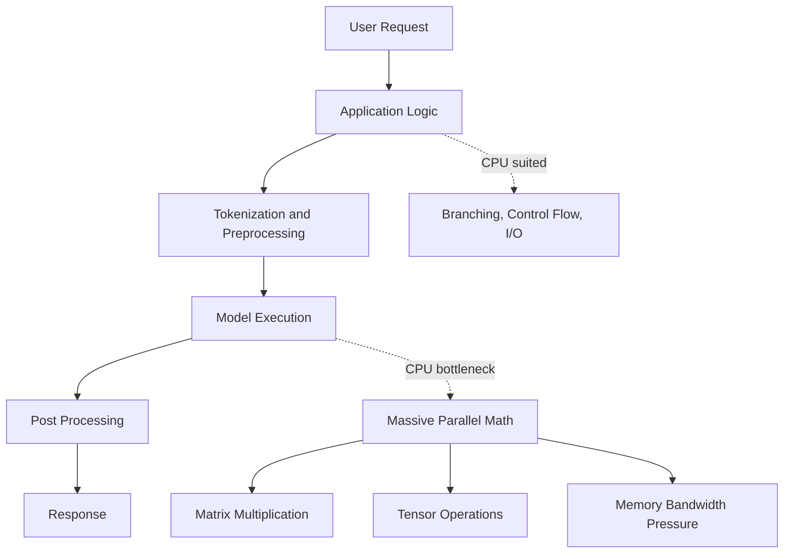
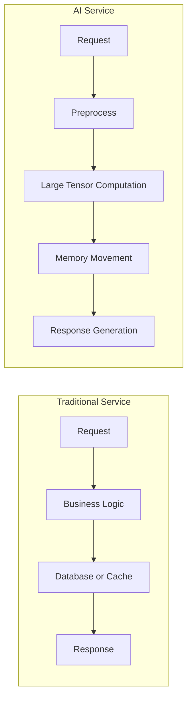
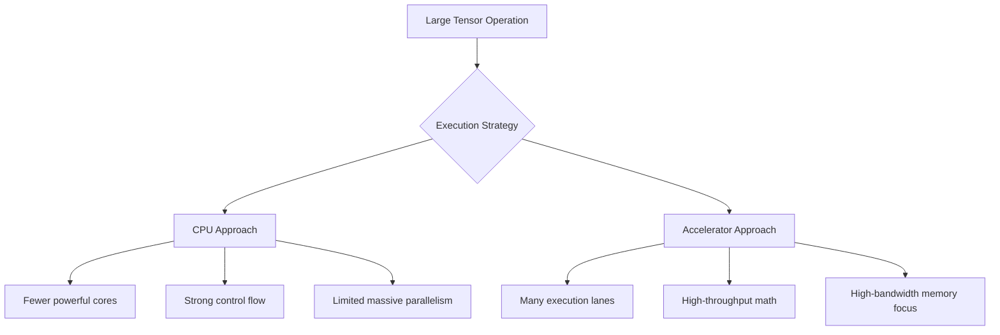

# Why CPUs Became Insufficient

## Introduction

The CPU did not become irrelevant. It became insufficient for a specific class of workload: workloads where the same mathematical operation must be executed over very large amounts of data at the same time. That distinction matters because CPUs still coordinate the system, run the operating system, manage I/O, execute control logic, and host many parts of an AI platform. The problem is that modern AI workloads are dominated by dense linear algebra, memory movement, and repeated tensor operations rather than traditional request-response application logic.

This chapter explains why the CPU-centric infrastructure model that served databases, web applications, and enterprise systems so well became inefficient for large-scale AI. We will build the explanation from first principles before introducing GPUs in the next chapter.

## Chapter Metadata

| Field | Value |
|---|---|
| Volume | Volume 01 — AI Infrastructure Foundations |
| Difficulty | Foundation |
| Estimated Reading Time | 35 minutes |
| Prerequisites | Linux and general infrastructure experience |
| Primary Outcome | Understand the architectural limits of CPU-only AI infrastructure |

## Story: The Summarization Service That Would Not Scale

A platform team deploys a document summarization model on CPU servers. During early testing, a single user receives acceptable responses, so the team connects the service to an internal knowledge base and opens it to more employees. Usage increases quickly. Each request now requires tokenization, model execution, response generation, and result formatting.

The team adds more CPU cores. Throughput improves, but not enough. Latency remains high, infrastructure cost grows quickly, and CPU utilization does not explain the whole problem. Some cores are busy, some are waiting on memory, and requests spend significant time moving data between caches, main memory, and application buffers.

The failure is not that the team chose bad servers. The failure is that they treated an AI workload like a conventional web workload. Adding more general-purpose CPU capacity helped the coordination layer, but it did not change the fundamental execution pattern of the model.

:::tip Engineering lesson
When an AI workload scales poorly on CPUs, the first question is not “How many more CPU cores do we need?” The first question is “Which part of the workload is serial, which part is parallel, and where is data movement dominating execution?”
:::

## Learning Objectives

After completing this chapter, you will be able to:

- Explain why CPU scaling alone is inefficient for many AI workloads.
- Distinguish serial control-plane work from parallel data-plane computation.
- Describe why memory bandwidth and data locality matter for model execution.
- Identify symptoms of CPU-only AI infrastructure bottlenecks.
- Explain why accelerators became necessary without reducing the importance of CPUs.

## Big Picture

A CPU-centric server is excellent at general-purpose coordination. It handles interrupts, system calls, kernel scheduling, networking, storage, process isolation, and application control flow. AI model execution stresses a different part of the system: repeated numerical operations over large tensors.



**Figure 2.1 — CPU-centric AI request path.** The CPU handles the full pipeline, but model execution creates a parallel computation bottleneck that general-purpose cores do not solve efficiently.

## Why CPUs Were Designed This Way

CPUs evolved to run many kinds of programs, not one kind of mathematical operation. A CPU core is optimized to execute complex instruction streams with low latency. It has sophisticated branch prediction, deep caches, out-of-order execution, privilege modes, interrupts, and memory protection. These features are essential for operating systems, databases, web servers, control planes, and infrastructure services.

That flexibility has a cost. A CPU dedicates significant silicon and power budget to making a small number of powerful cores execute diverse workloads efficiently. This is the correct trade-off for many infrastructure systems. It is not the ideal trade-off for workloads where millions or billions of similar operations must be applied to tensors.

| CPU Strength | Why It Matters in Infrastructure | Why It Is Not Enough for AI Model Execution |
|---|---|---|
| Low-latency control flow | Handles requests, interrupts, system calls, and orchestration | Model execution needs massive throughput more than branch-heavy control |
| Large caches | Reduces latency for general-purpose memory access | Large models often exceed cache capacity and stress memory bandwidth |
| Complex instruction handling | Runs many kinds of programs safely and correctly | AI kernels repeat a smaller set of mathematical operations at very large scale |
| Strong single-thread performance | Improves serial application sections | Parallel tensor operations need many simple execution lanes |
| General-purpose programmability | Supports OS and application ecosystems | Specialized accelerators can execute dense math more efficiently |

## The End of Easy CPU Scaling

For many years, application performance improved as CPU clock speeds increased. Software often became faster simply by running on the next generation of processor. That era changed when power, heat, and frequency scaling became limiting factors. CPU vendors added more cores, wider vector instructions, larger caches, and better memory subsystems, but the basic trade-off remained: CPU cores are powerful and flexible, not massively parallel in the same way AI workloads require.

AI exposed this limitation clearly. A model layer may need to perform matrix multiplications across millions of values. The same operation is applied repeatedly across large arrays. This is not primarily a problem of making one core faster. It is a problem of executing a huge number of similar operations concurrently while feeding them with enough memory bandwidth.

## What Makes AI Workloads Different

Traditional infrastructure workloads often spend time on branching, waiting, coordination, I/O, and request management. AI workloads include those elements, but the expensive part is usually numerical execution. Transformer models, recommendation systems, computer vision pipelines, and many scientific workloads depend heavily on matrix multiplication and tensor transformations.



**Figure 2.2 — Traditional service versus AI service.** Traditional services are often dominated by control flow and external I/O. AI services are dominated by tensor computation and memory movement.

## The Core Constraint: Parallel Math Plus Memory Bandwidth

A useful mental model is simple: AI systems need two things at the same time. They need many arithmetic units to execute tensor operations, and they need enough memory bandwidth to feed those units. If either side is weak, performance suffers.

Adding CPU cores increases available execution capacity, but each core remains relatively large, power-hungry, and optimized for general-purpose work. As the model grows, memory movement becomes a major limiter. Model weights, activations, key-value cache, batches, and intermediate tensors must move through memory hierarchies continuously. If the system cannot feed computation fast enough, cores wait.

| Bottleneck | What It Looks Like | Why More CPU Cores May Not Fix It |
|---|---|---|
| Memory bandwidth | Cores wait for data even when compute resources exist | More cores can increase contention for memory |
| Cache misses | Large working set does not fit in cache | Model weights and activations exceed cache capacity |
| Synchronization | Threads spend time coordinating | More threads can increase coordination overhead |
| Vectorization limits | Code does not fully use SIMD/vector units | Requires careful kernel and library optimization |
| Data pipeline latency | CPU waits on tokenization, storage, or preprocessing | More compute does not repair upstream pipeline design |

## Internal Working: Why Parallel Execution Changes the Equation

Imagine applying the same mathematical transformation to millions of numbers. A CPU can do this, especially with vector instructions and optimized libraries, but it is still constrained by the number of cores, memory bandwidth, and the general-purpose design of each core. A parallel accelerator approaches the problem differently: it uses many simpler execution lanes and is designed to keep a large number of operations in flight.

The important architectural shift is from latency-optimized execution to throughput-optimized execution. CPUs minimize the time to complete complex individual instruction streams. AI accelerators maximize the amount of numerical work completed per unit of time across many data elements.



**Figure 2.3 — Execution strategy shift.** CPU execution remains essential for coordination, but tensor-heavy workloads benefit from hardware designed around throughput.

## Production Architecture Implications

In production, CPU insufficiency appears as a system design problem, not just a processor problem. A CPU-only AI service may be easy to prototype, but it can become expensive and operationally inefficient as concurrency, model size, or latency expectations increase.

A production architect must separate the pipeline into responsibilities:

| Pipeline Stage | Typical Best Fit | Reason |
|---|---|---|
| API handling | CPU | Connection handling, authentication, routing, request validation |
| Tokenization | CPU or specialized preprocessing path | Often branchy and text-oriented; may become a CPU bottleneck at scale |
| Model execution | GPU or accelerator | Dense tensor operations and high parallelism |
| Post-processing | CPU | Formatting, filtering, business logic, response assembly |
| Observability and control | CPU | Metrics, logs, scheduling, orchestration, health checks |

The correct design is not “replace CPUs with GPUs.” The correct design is “use CPUs for control and GPUs for parallel numerical execution.” NVIDIA AI infrastructure follows this pattern throughout the stack: CPUs coordinate; GPUs compute; high-speed memory and interconnects reduce data movement bottlenecks.

## When CPU-Only Execution Is Still Appropriate

CPU-only AI is not automatically wrong. It can be appropriate for small models, low-concurrency internal tools, development environments, batch jobs with relaxed deadlines, or edge cases where accelerator availability is limited. It can also be useful for testing orchestration logic before moving execution to GPU-backed systems.

The mistake is using CPU-only infrastructure for workloads that require high concurrency, low latency, large models, or high throughput. At that point, CPU scaling often becomes a cost multiplier rather than a performance strategy.

| Use CPU-Only When | Prefer GPU/Accelerator When |
|---|---|
| Model is small | Model is large or memory bandwidth intensive |
| Concurrency is low | Many users or high request volume exist |
| Latency target is relaxed | Low latency or streaming response matters |
| Cost of GPU access is unjustified | CPU fleet cost exceeds accelerator-backed design |
| Environment is development or testing | Deployment is production or customer-facing |

## Production Troubleshooting

### Problem

A CPU-only inference service becomes slow as usage increases.

### Symptoms

- Request latency increases under moderate concurrency.
- CPU utilization appears high, but scaling nodes produces weak improvement.
- Memory bandwidth or cache-miss behavior becomes a hidden bottleneck.
- Application queues grow during model execution.

### Diagnosis

Start by separating the request path into preprocessing, model execution, and post-processing. Measure latency at each stage rather than only looking at total request time.

```bash
# Purpose: Inspect CPU saturation at the host level.
# Command:
mpstat -P ALL 1 5

# Expected healthy pattern:
# CPU usage varies by core, and idle time remains available during normal load.

# Suspicious pattern:
# Many cores remain busy while throughput does not increase proportionally.
```

```bash
# Purpose: Inspect memory pressure and paging behavior.
# Command:
vmstat 1 5

# Expected healthy pattern:
# Low swap activity, stable runnable queue, and no sustained memory pressure.

# Suspicious pattern:
# High run queue, frequent paging, or sustained CPU wait behavior.
```

### Root Cause

The expensive part of the pipeline is dominated by tensor operations and memory movement. The CPU can execute the workload, but it is not the most efficient architecture for the required parallelism.

### Resolution

Move model execution to an accelerator-backed runtime, then re-measure the full pipeline. Do not stop at GPU enablement: tokenization, batching, memory transfer, and response streaming must also be measured.

### Prevention

During architecture design, classify the workload before selecting hardware. Estimate model size, concurrency, latency target, batch behavior, memory requirements, and scaling expectations before choosing CPU-only deployment.

## Customer Scenario

A customer says: “We already have a large CPU virtualization environment. Why should we buy GPU systems?”

A strong answer does not dismiss the existing environment. It explains that the virtualization platform remains useful for control-plane services, APIs, data services, CI/CD, monitoring, and business logic. The issue is model execution. If the customer wants production inference or training with meaningful concurrency, they need hardware that matches the workload’s parallel structure and memory bandwidth requirements.

The architectural recommendation is usually hybrid: keep general services on CPU infrastructure, place model execution on GPU-backed nodes, and design the data path so requests reach accelerators efficiently.

## Interview Preparation

### Conceptual Questions

1. Why are CPUs still necessary in AI infrastructure even when GPUs perform model execution?
2. What is the difference between latency-optimized and throughput-optimized hardware?
3. Why does adding CPU cores sometimes fail to improve AI workload performance?

### Architecture Questions

1. Design a CPU-to-GPU transition plan for an internal inference service.
2. Where would you place tokenization, model execution, and monitoring in a production architecture?
3. How would you decide whether a workload can remain CPU-only?

### Troubleshooting Questions

1. A customer adds CPU nodes but sees only minor throughput improvement. What do you measure next?
2. How do you distinguish a CPU bottleneck from a memory bandwidth bottleneck?
3. What signs suggest that model execution should move to GPU-backed infrastructure?

## Summary

CPUs became insufficient for modern AI not because they are weak, but because they are optimized for the wrong part of the workload. They remain essential for orchestration, operating systems, services, security, networking, and application logic. The limitation appears when dense tensor computation and memory movement dominate execution.

The architectural lesson is simple: match hardware to workload shape. Use CPUs where flexibility and control matter. Use accelerators where massive parallel numerical throughput matters. The next chapter builds on this foundation by comparing CPU and GPU architectures directly.

## Quick Revision Sheet

| Question | Answer |
|---|---|
| Did CPUs become obsolete? | No. They remain essential for control and orchestration. |
| What changed? | AI workloads became dominated by parallel tensor computation. |
| Why not just add CPU cores? | Memory bandwidth, synchronization, and general-purpose core design limit scaling. |
| What is the production lesson? | Separate control-plane work from parallel model execution. |

## Related Chapters

- Previous: [What Is AI Infrastructure?](./chapter-01-what-is-ai-infrastructure.md)
- Next: [CPU vs GPU](./chapter-03-cpu-vs-gpu.md)
- Lab: [Inspect an AI Infrastructure Host](./labs/lab-01-inspect-an-ai-infrastructure-host.md)
