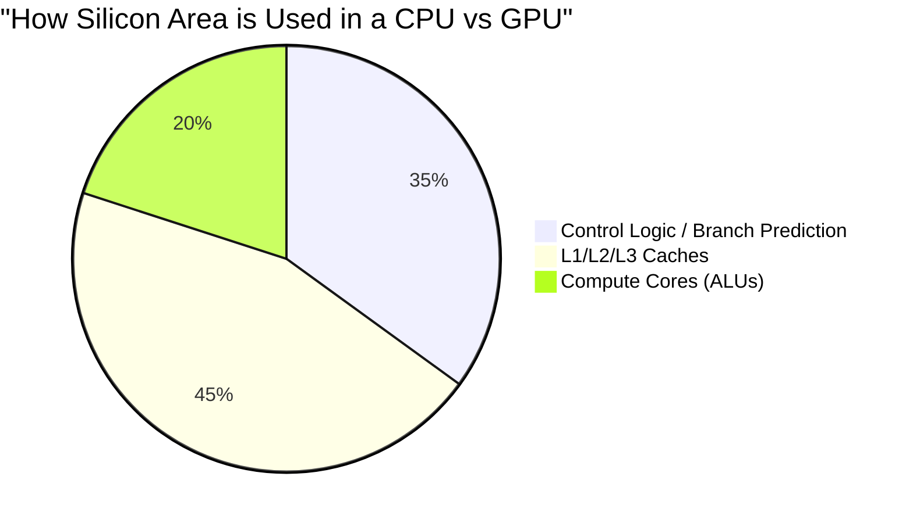
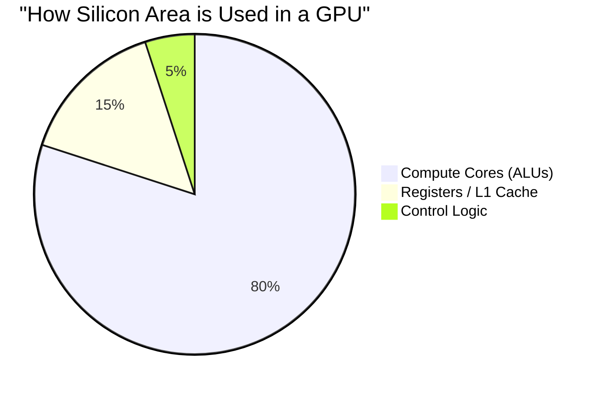

# Chapter 2 — Why CPUs Became Insufficient

| Chapter metadata | Value |
|---|---|
| Volume | 01 — AI Infrastructure Foundations |
| Difficulty | Foundation to Advanced |
| Estimated reading time | 35 minutes |
| Primary audience | DevOps, SRE, Platform, Cloud and Infrastructure Engineers |
| Core question | Why did CPU-centric scaling stop working for AI, and why didn't we just build CPUs with 10,000 cores? |

## Introduction (The "Why")

For decades, software engineers enjoyed a "free lunch." Every two years, processors became faster, smaller, and more power-efficient, following Moore's Law and Dennard Scaling. If your application was slow, you didn't necessarily have to rewrite it; you just waited for Intel or AMD to release the next generation of CPUs.

This era ended around 2005. Physics intervened. Processors hit a thermal wall: you could not clock a CPU much past 4-5 GHz without it melting. To continue increasing performance, CPU manufacturers shifted from increasing *clock speed* to adding more *cores* (multi-core architecture).

For standard web and database workloads, this multi-core paradigm worked beautifully. A web server handling 100 concurrent HTTP requests runs exceptionally well on a 100-core CPU. 

But then Deep Learning arrived. Deep Learning relies fundamentally on **Dense Matrix Multiplication (GEMM - General Matrix Multiply)**. A neural network forward pass requires multiplying matrices with millions or billions of parameters. 

A 100-core CPU is astonishingly fast at running 100 independent tasks. It is hopelessly, economically insufficient at multiplying a 10,000 x 10,000 matrix. To understand AI Infrastructure, you must understand exactly why the CPU failed at this specific mathematical task, and why adding "more CPUs" is an architectural dead end for AI.

## The Limits of CPU Architecture (The "What")

To understand why the CPU became insufficient, we must look at what a CPU was designed to do. 

A CPU is optimized for **latency-sensitive, complex, branching logic**. Think about the code in a standard web application backend:
```python
if user.is_authenticated():
    data = db.query("SELECT * FROM orders WHERE user_id = ?", user.id)
    if not data:
        return "No orders"
    else:
        return process_orders(data)
```
This code is highly unpredictable. The CPU doesn't know which path the `if` statement will take until it evaluates it. To make this fast, CPUs dedicate massive amounts of silicon to **Branch Prediction** (guessing which way the `if` statement will go) and **Out-Of-Order Execution** (running instructions ahead of time).

Furthermore, accessing System RAM (DDR4/DDR5) is painfully slow for a CPU. To prevent the CPU from waiting on RAM, engineers placed massive **L1, L2, and L3 Caches** directly on the CPU die. 

### The Problem with Matrix Math
Deep Learning algorithms have almost no unpredictable branching. They are extremely predictable: 
*Take this row of numbers, multiply it by this column of numbers, sum the result, and repeat 10 billion times.*

When a CPU runs this workload:
1. Its massive branch prediction logic sits idle and useless.
2. Its massive L3 cache is instantly blown out, because matrix math streams huge volumes of data once and never reuses it.
3. Its powerful Arithmetic Logic Units (ALUs) spend all their time waiting for data to slowly cross the motherboard from system memory.

## Architectural Diagram: The Resource Allocation Mismatch


*In a CPU, only a tiny fraction of the physical silicon is actually doing math. The rest is dedicated to managing complex logic and caching memory.*


*In a GPU, the control logic is stripped out. If 32 threads are doing the exact same math operation (SIMT), they share one tiny control unit, allowing the chip to be packed with thousands of mathematical cores.*

## Advanced Concepts (The "How" & "Trade-offs")

If CPUs are bad at matrix math, why didn't Intel or AMD just build CPUs with 10,000 simplified cores? 

### 1. Context Switching vs. Warp Scheduling
When a CPU needs to switch from one task to another (Context Switching), it takes thousands of clock cycles to save the state of the registers and load a new thread. 
GPUs don't context switch like CPUs. They use **Warp Scheduling**. A GPU holds thousands of threads in its registers simultaneously. If one group of threads (a Warp) is waiting for data to arrive from memory, the GPU instantly swaps to another Warp that has its data ready, at zero cost. This hides the memory latency perfectly.

### 2. The Vector Extension Trade-off (AVX-512)
CPU manufacturers *did* try to compete. They added Vector Extensions (like AVX-512) to CPUs, allowing a single CPU core to multiply several numbers at once. 
* **The Trade-off:** Running AVX-512 instructions generates so much heat that the CPU must drastically lower its clock speed (thermal throttling) to prevent melting. Even with AVX-512, a top-tier CPU might peak at a few TeraFLOPS (Trillion Floating Point Operations Per Second), while an NVIDIA H100 GPU exceeds 1,000 TeraFLOPS (1 PetaFLOP) of dense tensor compute.

### 3. The Memory Bandwidth Wall
Even if a CPU had 10,000 cores, it would fail. Standard CPU memory (DDR5) maxes out around 300-400 GB/s of bandwidth. An NVIDIA H100 uses High-Bandwidth Memory (HBM3) integrated directly onto the silicon interposer alongside the GPU die, yielding over **3,000 GB/s**. The CPU physically cannot move data from the RAM sticks across the motherboard fast enough to feed an AI model.

## Production Deployment & Operations

In a modern AI infrastructure platform, the realization that CPUs are insufficient leads to a strict separation of duties (Heterogeneous Computing).

1. **The Host CPU's Role:** The CPU is demoted. It handles the Kubernetes `kubelet`, network interrupts (if RDMA is not used), disk I/O, dataset decoding, tokenization, and launching CUDA kernels.
2. **The GPU's Role:** The GPU handles 100% of the forward/backward pass mathematical execution.
3. **The Danger of CPU Starvation:** In production, you must monitor the CPU closely. If you provision an 8-GPU node with a weak CPU, the CPU will fail to tokenize text or decode images fast enough. The $30,000 GPUs will sit at 0% utilization waiting for the $1,000 CPU to finish its preprocessing. This is called **Host Starvation**.

## Customer Scenario (Senior Level)

**The Situation:** 
A financial institution's CTO says, "We have massive VMware clusters filled with the latest Intel Xeon CPUs. We don't want to buy new hardware. Can't we just deploy our massive LLM across 100 of our existing CPU servers and let them work together? That's what Kubernetes is for."

**The Senior Architect Response:**
"Scaling out across 100 CPU servers works for web traffic, but it fails catastrophically for LLM inference due to Amdahl's Law and network latency. 

When you split an LLM across 100 independent CPU servers, for every single word the model generates, those 100 servers must synchronize their mathematical state over your standard datacenter Ethernet network. The math might take 10 milliseconds, but the network synchronization across 100 TCP/IP stacks will take hundreds of milliseconds per token. 

Furthermore, memory bandwidth is the primary bottleneck for LLMs. Your 100 CPUs are bottlenecked by DDR4/DDR5 RAM speeds (~150-300 GB/s per node). A single modern NVIDIA GPU with HBM3 provides over 3,000 GB/s natively, without crossing a network. Running this on your VMware cluster will consume massive amounts of power, yield unacceptably slow response times, and ultimately cost more in power and licensing than purchasing a single dedicated 8-GPU node."

## Interview Preparation

**Conceptual:** Why is a massive L3 cache highly beneficial for a web server, but largely useless for training a Deep Learning model?
*(Hint: Web servers reuse data. AI models stream massive tensors once, instantly blowing out the cache).*

**Architecture:** Explain the difference in how CPUs and GPUs handle memory latency.
*(Hint: CPUs use massive caches and branch prediction to avoid waiting. GPUs use massive multi-threading/warp-scheduling to execute other threads while waiting).*

**Troubleshooting:** You deploy a PyTorch training job on an 8-GPU server. The GPUs are only running at 15% utilization, but the CPU is at 100% across all cores. What is happening?
*(Hint: Host Starvation. The CPU cannot preprocess the data (e.g., image decoding or text tokenization) fast enough to keep the GPUs fed).*

## Summary

CPUs did not become obsolete; they became insufficient for the specific task of dense, massively parallel matrix mathematics. The architectural choices that make a CPU great at running an Operating System (complex control logic, massive caches, low core counts) are the exact choices that make it terrible at running a Neural Network. AI infrastructure requires a heterogeneous architecture: the CPU acts as the orchestrator and data-feeder, while the GPU acts as the specialized, high-throughput math accelerator.

## Key Takeaways

- CPUs optimize for **latency** (getting one complex task done fast). GPUs optimize for **throughput** (getting thousands of simple tasks done simultaneously).
- Deep Learning is fundamentally bounded by Matrix Multiplication and Memory Bandwidth.
- GPUs strip out complex control logic to fit thousands of ALUs and use High-Bandwidth Memory (HBM) to break the memory wall.
- Deploying AI on legacy CPU clusters is an architectural anti-pattern due to network synchronization and memory bandwidth limitations.
