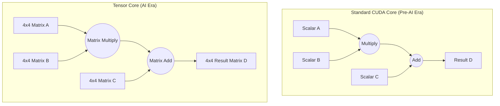

# Chapter 3 — CPU vs. GPU: Silicon, Threads, and Tensor Cores

| Chapter metadata | Value |
|---|---|
| Volume | 01 — AI Infrastructure Foundations |
| Difficulty | Advanced |
| Estimated reading time | 40 minutes |
| Primary audience | DevOps, SRE, Platform, Cloud and Infrastructure Engineers |
| Core question | How exactly does a GPU execute thousands of threads simultaneously without crashing, and what makes a Tensor Core different from a standard CUDA core? |

## Introduction (The "Why")

In the previous chapter, we established *why* the CPU was insufficient for dense matrix math. We discussed the high-level trade-offs between latency (CPU) and throughput (GPU). 

But as a Senior AI Infrastructure Engineer, high-level analogies like "the CPU is a racecar, the GPU is a bus" are no longer sufficient. When you are profiling a PyTorch job that is failing to scale, or diagnosing an `OOMKilled` container, you must understand exactly how the hardware handles instructions and memory.

This chapter dives into the silicon. We will explore how NVIDIA GPUs group threads into Warps, how they execute Single Instruction, Multiple Threads (SIMT), and why the invention of the **Tensor Core** radically changed AI hardware architecture forever.

## The Core Difference: Thread Management (The "What")

If you write a Python script that spawns 10,000 parallel threads on a standard Linux CPU, the server will crash. 

### The CPU Approach: Context Switching
A CPU has a small number of physical cores (e.g., 64). To run 10,000 threads, the Linux CPU scheduler must rapidly switch between them. It pauses Thread 1, copies its register state into RAM, loads Thread 2's state from RAM into the registers, executes for a few milliseconds, and repeats. This is called **Context Switching**. 

Context switching is "expensive." It wastes thousands of clock cycles. If a CPU tries to juggle 10,000 active threads, it will spend 99% of its time moving register states back and forth to RAM, and 1% of its time doing actual math.

### The GPU Approach: SIMT and Warp Scheduling
An NVIDIA GPU does not do traditional context switching. It uses an architecture called **SIMT (Single Instruction, Multiple Threads)**.

When you send work to a GPU, it groups the threads into blocks of 32, called a **Warp**. 
The magic of a Warp is that **all 32 threads must execute the exact same instruction at the exact same time**, just on different pieces of data. Because they are executing the same instruction, the GPU only needs *one* instruction decoder for all 32 threads, saving massive amounts of silicon space.

Furthermore, a GPU has tens of thousands of massive physical registers. When a Warp needs to wait for data from memory, the GPU does not copy the Warp's state to RAM. It just leaves it in the physical registers and instantly switches to executing another Warp that is ready. This is a **Zero-Cost Context Switch**, allowing the GPU to juggle 100,000 active threads effortlessly, completely hiding the latency of memory fetches.

## Architectural Diagram: CUDA Cores vs Tensor Cores

## The Evolution: CUDA Cores vs. Tensor Cores (The "How")

### The Standard CUDA Core (FP32/FP64)
Historically, GPUs were built for rendering graphics or scientific simulations. The primary execution unit was the **CUDA Core**. 
A CUDA core is a scalar processor. In a single clock cycle, it can take one number, multiply it by a second number, and add a third number (a Multiply-Accumulate, or MAC operation).
$$ D = (A \times B) + C $$
To multiply two 4x4 matrices using standard CUDA cores requires **64 separate operations** across multiple clock cycles.

### The Tensor Core
In 2017 (with the Volta architecture), NVIDIA introduced the **Tensor Core**, explicitly designed for Deep Learning.
A Tensor Core does not multiply single numbers. In a *single clock cycle*, a Tensor Core can multiply an entire 4x4 matrix by another 4x4 matrix, and add a third 4x4 matrix to the result. 

Instead of taking 64 operations, it takes **1 operation**.

This singular hardware invention is the foundation of the modern AI revolution. It increased the mathematical throughput of a GPU by orders of magnitude overnight.

### The Trade-off: Precision
To achieve this massive throughput, Tensor Cores trade away precision. 
Standard scientific computing uses FP64 (64-bit precision) or FP32 (32-bit precision). AI models do not require extreme precision to recognize patterns. Tensor Cores are optimized to run at lower precisions like FP16, BF16 (Brain Floating Point), or even INT8 (8-bit Integers).

By halving the precision from 32-bit to 16-bit:
1. You double the mathematical throughput (TFLOPS).
2. You halve the memory required to store the model weights.
3. You halve the memory bandwidth required to move the weights from HBM to the cores.

## Production Deployment & Operations

Understanding SIMT and Tensor Cores directly impacts how you deploy workloads in Kubernetes or Slurm.

1. **Alignment:** Because GPUs operate in Warps of 32 threads, and Tensor Cores operate on fixed matrix sizes (like 16x16), neural network layers and batch sizes should ideally be multiples of 8 or 32. If a developer uses a batch size of 31, the GPU still has to allocate 32 threads, wasting compute cycles.
2. **TensorRT Compilation:** When deploying a model to production inference, Senior Engineers do not just run raw PyTorch code. They compile the model using **NVIDIA TensorRT**. TensorRT inspects the specific GPU architecture (e.g., Hopper vs Ampere) and physically fuses operations together, ensuring that the model leverages the Tensor Cores at the optimal precision (like INT8) rather than falling back to slower CUDA cores.

## Customer Scenario (Senior Level)

**The Situation:** 
A Data Science team trains a model using standard FP32 precision on older NVIDIA V100 GPUs. They get a budget to upgrade to the latest NVIDIA H100 GPUs. After running the exact same Docker container and PyTorch code on the H100s, they complain to the Platform team: "The new $30,000 GPUs are barely faster than our old ones. The infrastructure must be broken."

**The Senior Architect Response:**
"The infrastructure is healthy; the software is failing to target the silicon. 

NVIDIA's massive leap in performance generation-over-generation is driven entirely by Tensor Cores operating at lower precisions (like BF16, FP8, or INT8). Because your legacy code strictly enforces FP32 (32-bit float) precision, the PyTorch runtime cannot utilize the modern Tensor Cores. The workload is falling back to the standard scalar CUDA cores, bypassing the primary acceleration hardware of the H100.

To unlock the hardware, we must update the training script to use **Automatic Mixed Precision (AMP)** or compile the model for lower precision. Once the math is cast to BF16 or FP8, the runtime will engage the Tensor Cores, and you will see an immediate 4x to 6x leap in throughput."

## Interview Preparation

**Conceptual:** Explain the difference between a Context Switch on a CPU and Warp Scheduling on a GPU. Why doesn't the GPU crash when handling 100,000 threads?

**Architecture:** What is a Tensor Core, and how does it fundamentally differ from a standard CUDA core?

**Troubleshooting:** An AI application is running on an H100 but profiling shows extremely low Tensor Core utilization and high CUDA core utilization. What is the likely cause? *(Hint: The math is likely running at a precision that Tensor Cores do not support, like standard FP64 or unoptimized FP32).*

**Customer Communication:** Explain to a software engineer why changing their batch size from 31 to 32 might actually make the model run faster on GPU hardware.

## Summary

The difference between a CPU and a GPU goes far beyond "one has more cores." They are fundamentally different computational paradigms. The CPU relies on massive caches and expensive context switching to handle unpredictable logic. The GPU relies on SIMT, Zero-Cost Warp Scheduling, and massive register files to stream predictable data effortlessly. The invention of the Tensor Core—sacrificing extreme precision for raw matrix-multiplication throughput—is the architectural cornerstone that makes modern Large Language Models possible.

## Key Takeaways

- CPUs suffer from expensive Context Switching. GPUs use Warp Scheduling to hide memory latency at zero cost.
- SIMT (Single Instruction, Multiple Threads) forces 32 threads to execute the exact same instruction, saving massive silicon space.
- A standard CUDA core multiplies two scalars. A Tensor Core multiplies two matrices in a single clock cycle.
- To utilize modern GPU hardware, workloads must use mixed or lower precision (BF16, FP8) to engage the Tensor Cores.
