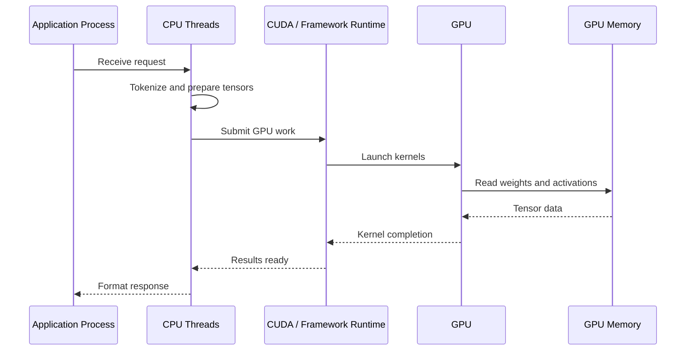

# CPU vs GPU

| Chapter metadata | Value |
|---|---|
| Volume | 01 — AI Infrastructure Foundations |
| Difficulty | Foundation |
| Estimated reading time | 35 minutes |
| Primary audience | DevOps, SRE, Platform, Cloud and Infrastructure Engineers |
| Core question | Why do modern AI platforms combine CPUs and GPUs instead of using only one processor type? |

## Introduction

A CPU and a GPU are both processors, but they are designed around very different engineering assumptions. A CPU is built for flexible control flow, operating system coordination, low-latency decision making, interrupts, system calls, networking, storage, security boundaries and complex application logic. A GPU is built for throughput: applying the same mathematical operation across many pieces of data in parallel, especially when the work can be expressed as matrix, vector or tensor operations.

This distinction is central to AI infrastructure. A production AI platform does not replace CPUs with GPUs. It combines them. CPUs coordinate the system; GPUs accelerate the heavy numerical work. The architecture fails when engineers expect one processor type to behave like the other.

:::info Principal Engineer View
The question is not whether a CPU or GPU is “better.” The question is which part of the workload is control-heavy, which part is math-heavy, where data moves, and which processor is responsible for each stage.
:::

## Story

A platform engineer receives two performance reports from two different services. The first service is a traditional internal API. Its latency is dominated by database queries, network calls, authentication checks and business logic. Adding CPU cores helps because the workload is made of many independent requests with branching behavior and I/O waits.

The second service is a model inference endpoint. Its latency is dominated by model execution, memory bandwidth and tensor movement. The service spends most of its time multiplying matrices, reading model weights and generating tokens. Adding more CPU cores improves the preprocessing and API layer, but it does not change the fundamental bottleneck: the expensive part of the request is numerical parallel computation.

The engineer now sees the architecture problem clearly. Traditional infrastructure optimizes request handling. AI infrastructure must optimize request handling plus accelerated computation plus data movement. That is why CPUs and GPUs appear together in every serious AI platform design.

## Learning Objectives

After completing this chapter, you will be able to explain the architectural difference between CPU-centric and GPU-accelerated execution, describe why AI workloads map naturally to GPUs, identify which parts of an AI service still require CPUs, reason about latency and throughput trade-offs, and troubleshoot common CPU/GPU imbalance symptoms in production systems.

## Big Picture

Figure 3.1 shows the division of responsibility in a simplified AI inference node. The CPU receives requests, runs platform logic, prepares work and coordinates the runtime. The GPU executes the dense numerical operations. Memory, PCIe, NVLink and networking determine how efficiently work moves between those layers.

**Figure 3.1 — CPU and GPU responsibilities in an AI inference node.** The CPU coordinates the request lifecycle while the GPU executes the parallel numerical workload.

## Deep Explanation

A CPU is optimized for versatility. It has a small number of powerful cores, sophisticated branch prediction, large caches, strong single-thread performance and deep integration with the operating system. This makes CPUs excellent for workloads where each request may follow a different path: web services, databases, control planes, orchestration systems, security checks, storage coordination and general application logic.

A GPU is optimized for parallel throughput. Instead of a few highly flexible cores, it contains many execution units designed to run large numbers of similar operations concurrently. That design is a poor fit for arbitrary operating system work but an excellent fit for AI workloads, where the same mathematical operations are repeatedly applied to large tensors.

| Dimension | CPU | GPU | AI infrastructure implication |
|---|---|---|---|
| Design goal | Flexible low-latency execution | High-throughput parallel execution | Use CPUs for orchestration and GPUs for model execution |
| Core style | Fewer complex cores | Many simpler parallel units | GPU acceleration helps when the workload has large parallel regions |
| Strength | Branching, control flow, I/O, OS work | Matrix, vector and tensor computation | Model execution belongs on GPUs when the model is large enough |
| Weakness | Limited massive parallel throughput | Poor fit for irregular control-heavy work | Do not move the entire service to the GPU |
| Bottleneck pattern | CPU saturation, lock contention, I/O wait | Memory bandwidth, kernel efficiency, data movement | Troubleshooting must identify the real limiting layer |

The common mistake is to describe GPUs as “faster CPUs.” That is wrong. GPUs are not general replacements for CPUs. They are accelerators for workloads that can expose enough parallel work to keep many execution units busy.

## Internal Working

At runtime, the CPU and GPU cooperate. A framework such as PyTorch, TensorFlow, TensorRT, Triton or vLLM runs on the host CPU process. The framework prepares inputs, manages model metadata, schedules operations and calls into CUDA or another runtime layer. The runtime submits work to the GPU. The GPU executes kernels against data stored in GPU memory, then returns results or intermediate tensors back to the runtime.

**Figure 3.2 — CPU/GPU execution sequence.** The CPU remains active even when the GPU performs the expensive model computation.

This sequence explains why poor GPU utilization does not always mean the GPU is weak. The GPU may be waiting for input preparation, host-to-device transfer, batching, scheduling or memory movement. In production, the goal is not merely to “have a GPU.” The goal is to keep the GPU fed with useful work while avoiding unnecessary data transfers.

## Architecture

A well-designed AI node assigns responsibilities deliberately. CPU capacity must be sufficient for tokenization, request routing, networking, observability agents, container runtime work and framework overhead. GPU capacity must match model size, precision, concurrency and latency goals. Memory capacity and bandwidth often matter as much as raw compute because model weights and activations must be read continuously during execution.

| Architecture question | Why it matters |
|---|---|
| Is the workload latency-sensitive or throughput-oriented? | Real-time inference and batch jobs require different batching and scheduling choices. |
| Is the model small enough that CPU execution is acceptable? | Small models or low-volume workloads may not justify GPU cost. |
| Is preprocessing CPU-heavy? | Tokenization, image transforms and retrieval pipelines can starve the GPU. |
| Is the GPU memory large enough? | If the model or KV cache does not fit comfortably, latency and reliability suffer. |
| Is the interconnect sufficient? | PCIe, NVLink and networking influence multi-GPU performance and data movement. |

:::tip Production Rule
Before adding GPUs, profile the pipeline. Before adding CPU cores, check whether the bottleneck is actually model execution or memory bandwidth. Scaling the wrong layer increases cost without solving the problem.
:::

## Production Deployment

In production, CPU and GPU roles appear at multiple layers. A Kubernetes GPU node still needs kubelet, containerd, networking agents, monitoring agents and security controls on the CPU side. The GPU Operator, device plugin, container runtime and NVIDIA driver stack expose the GPU to workloads. The inference or training container then consumes the GPU resource and submits accelerated work through CUDA libraries.

For inference platforms, the CPU often handles HTTP/gRPC routing, authentication, tokenization, batching decisions and response streaming. The GPU performs model execution. For training platforms, the CPU handles data loading, process orchestration, checkpoint coordination and distributed job management while GPUs perform forward passes, backward passes and collective communication.

## Hands-on Lab

The lab for this volume is **Lab 01 — Inspect an AI Infrastructure Host**. It teaches how to inspect CPU, memory, PCIe and GPU visibility before deploying any AI workload. That lab intentionally starts with observation rather than installation because infrastructure engineers must learn to read the machine before changing it.

## Production Troubleshooting

### Problem: GPU utilization is low even though requests are slow

| Area | What to inspect | Why |
|---|---|---|
| CPU | `top`, `htop`, `pidstat`, application profiling | CPU tokenization or preprocessing may be the bottleneck. |
| GPU | `nvidia-smi`, DCGM metrics | Confirms whether kernels are actually running. |
| Memory | GPU memory usage, host memory pressure | Model loading, paging or KV cache growth may be limiting performance. |
| Runtime | framework logs, batching configuration | Small batches or poor scheduling can underfeed the GPU. |
| Network/storage | request latency, dataset reads, object store metrics | The GPU may be idle while waiting for data. |

The root cause is often pipeline imbalance. A GPU-accelerated system can still behave like a CPU-bound system if input preparation, batching, retrieval or response handling cannot keep up with model execution.

## Customer Scenario

A customer asks whether they should replace a large CPU fleet with GPUs for document summarization. A strong architect does not answer immediately. The first step is to classify the workload: request rate, latency target, model size, token length, batchability, retrieval requirements, data sensitivity and expected growth.

If the workload uses a large transformer model with high concurrency, GPUs are likely appropriate for model execution. If the workload is low volume, latency-insensitive or dominated by document parsing and retrieval, CPU optimization may deliver better economics. The recommendation depends on the workload, not on a generic claim that GPUs are always better.

## Interview Preparation

**Conceptual:** Why is a GPU not simply a faster CPU?

**Architecture:** Design an inference node and identify which components run on the CPU and which use the GPU.

**Scenario:** A model service has high latency but only 20% GPU utilization. What do you inspect first?

**Customer:** A customer wants to buy GPUs because CPU inference is slow. What questions do you ask before recommending hardware?

**Whiteboard:** Draw the request path from client to CPU runtime to GPU execution and back.

## Summary

CPUs and GPUs solve different infrastructure problems. CPUs remain essential for control flow, orchestration, system integration and request lifecycle management. GPUs become essential when the workload contains enough parallel numerical computation to justify acceleration. Production AI infrastructure succeeds when these roles are balanced, observable and matched to the workload.

## Key Takeaways

- CPUs optimize flexibility and control; GPUs optimize parallel throughput.
- AI platforms combine CPUs and GPUs rather than replacing one with the other.
- Low GPU utilization usually indicates a pipeline problem, not necessarily a hardware problem.
- Architecture decisions must be based on workload profile, latency goals, memory needs, data movement and cost.

## Related Chapters

- Previous: [Why CPUs Became Insufficient](./chapter-02-why-cpus-became-insufficient.md)
- Next: GPU execution fundamentals
- Related lab: [Inspect an AI Infrastructure Host](./labs/lab-01-inspect-an-ai-infrastructure-host.md)
