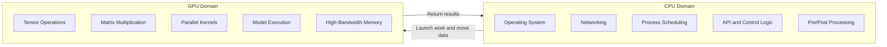
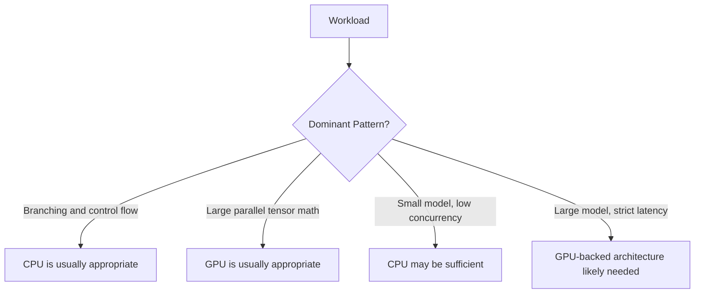
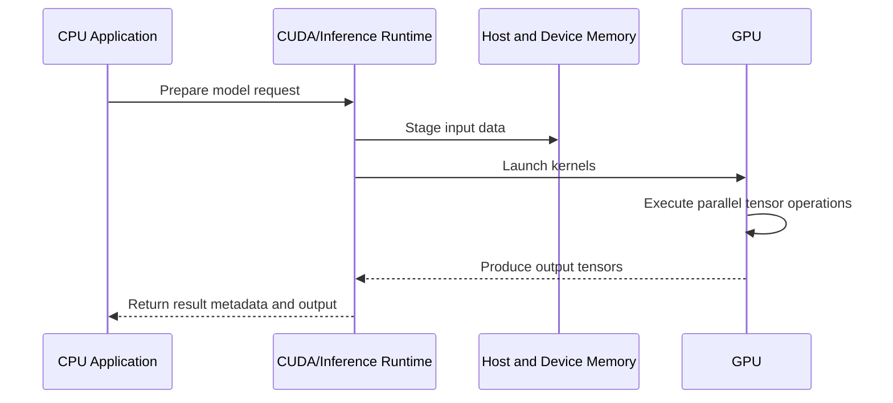

# CPU vs GPU

## Introduction

A CPU and a GPU are both processors, but they represent different architectural trade-offs. A CPU is optimized for flexible control, operating system integration, branching, interrupts, and fast execution of complex instruction streams. A GPU is optimized for executing many similar mathematical operations in parallel while moving large amounts of data through high-bandwidth memory.

This chapter compares CPUs and GPUs from an AI infrastructure perspective. The goal is not to declare one processor “better.” The goal is to understand why production AI systems use both: CPUs coordinate the platform, and GPUs accelerate the numerical work that dominates modern AI workloads.

## Chapter Metadata

| Field | Value |
|---|---|
| Volume | Volume 01 — AI Infrastructure Foundations |
| Difficulty | Foundation |
| Estimated Reading Time | 40 minutes |
| Prerequisites | Chapters 01 and 02 |
| Primary Outcome | Understand when CPU and GPU architectures are appropriate |

## Story: The Same Model, Two Very Different Systems

An infrastructure team benchmarks the same image classification workload on two systems. The first system uses high-core-count CPU servers. The second uses GPU-backed servers. Both systems can run the model, but they behave differently under load.

On the CPU system, individual requests work, but concurrency increases latency quickly. The team observes high CPU activity, memory pressure, and rising queue times. On the GPU system, model execution is much faster, but only when batching, memory placement, and input feeding are configured correctly. When the GPU is underfed, utilization remains low and the system still performs poorly.

The lesson is subtle: GPUs are not magic. They are extremely effective when the workload matches their architecture and the surrounding platform keeps them fed. CPUs are still required for the rest of the system.

:::tip Architecture principle
Do not ask whether a CPU or GPU is “better.” Ask which part of the workload is control-heavy, which part is data-parallel, and which part is limited by memory or communication.
:::

## Learning Objectives

After completing this chapter, you will be able to:

- Compare CPU and GPU architectures using workload characteristics.
- Explain why GPUs are effective for AI tensor operations.
- Describe why CPUs remain essential in AI infrastructure.
- Identify when a workload is not suitable for GPU acceleration.
- Explain CPU/GPU trade-offs to infrastructure and customer audiences.

## Big Picture

CPU and GPU architectures solve different problems. The CPU is the system’s general-purpose coordinator. The GPU is a throughput engine for highly parallel numerical work.



**Figure 3.1 — CPU and GPU responsibility split.** Production AI systems depend on cooperation between general-purpose control and parallel accelerated computation.

## Architectural Comparison

A CPU spends much of its design budget on making a small number of sophisticated cores execute diverse workloads quickly and safely. A GPU spends much more of its design budget on parallel execution throughput and memory bandwidth. This difference explains why GPUs became central to AI.

| Dimension | CPU | GPU |
|---|---|---|
| Primary goal | Low-latency general-purpose execution | High-throughput parallel execution |
| Core design | Fewer, more complex cores | Many simpler execution lanes |
| Best suited for | Control flow, OS work, branching, I/O, orchestration | Tensor operations, matrix multiplication, parallel kernels |
| Memory behavior | Large caches and general-purpose memory access | High-bandwidth memory optimized for streaming data patterns |
| Programming model | Threads, processes, system calls, libraries | Kernels, blocks, warps, device memory, accelerator libraries |
| AI infrastructure role | Coordinates platform and prepares work | Executes model computation efficiently |

## Why GPUs Fit AI Workloads

AI workloads often apply the same operations across large tensors. A transformer layer, for example, performs operations over vectors and matrices representing tokens, weights, activations, attention scores, and intermediate results. These operations are not random business logic. They are structured numerical computation.

That structure is what makes GPU acceleration effective. If the workload can be expressed as parallel operations over data, the GPU can keep many execution lanes busy. If the workload is branch-heavy, small, irregular, or dominated by serial decisions, the GPU advantage may shrink or disappear.



**Figure 3.2 — Processor selection by workload pattern.** Hardware selection begins with workload shape, not product preference.

## How CPU and GPU Work Together

A production inference request may begin on a CPU, execute its expensive numerical section on a GPU, and return to the CPU for response handling. The CPU validates the request, manages memory buffers, invokes runtime libraries, handles networking, records metrics, and coordinates the application. The GPU executes kernels against data in device memory.

This split introduces an important operational reality: moving data between CPU memory and GPU memory has cost. If data is moved unnecessarily, copied repeatedly, or prepared inefficiently, the GPU may sit idle. Strong AI infrastructure design minimizes unnecessary movement and keeps the accelerator busy with useful work.



**Figure 3.3 — CPU/GPU execution path.** The CPU coordinates and the GPU executes parallel work. Data movement between memory domains must be designed carefully.

## When GPUs Do Not Help Much

GPU acceleration is powerful, but it is not universal. A workload may perform poorly on a GPU if it contains too little parallel work, has small batches, spends most of its time in preprocessing, or moves data inefficiently. GPU systems also add operational complexity: drivers, CUDA compatibility, container runtime configuration, device scheduling, isolation, monitoring, and failure handling.

| Poor GPU Fit | Reason |
|---|---|
| Very small workload | Transfer and scheduling overhead may dominate execution time |
| Highly branchy logic | GPU execution is less efficient when threads diverge heavily |
| Low concurrency with relaxed latency | CPU may satisfy requirements at lower operational complexity |
| Data pipeline bottleneck | GPU waits idle if input preparation is slow |
| Unsupported or poorly optimized operations | Acceleration depends on libraries, kernels, and framework support |

## Production Design Pattern

A strong production design uses each processor for the work it is architecturally suited to perform. The CPU runs the platform and control plane. The GPU executes dense math. The network and storage layers are designed so the GPU is not starved. The monitoring layer observes all of it together.

| Layer | CPU Responsibility | GPU Responsibility |
|---|---|---|
| API layer | Routing, auth, validation, request shaping | None or minimal |
| Preprocessing | Tokenization, image decode, feature preparation | Sometimes accelerated depending on pipeline |
| Runtime | Launch kernels, manage requests, coordinate batching | Execute model kernels |
| Memory | Host memory management and staging | Device memory, HBM, activations, KV cache |
| Observability | Export logs, metrics, traces, control signals | Expose utilization, memory, power, thermals, ECC, XID signals |
| Operations | Scheduling, upgrades, health checks | Device availability, runtime compatibility, fault signals |

## Customer Explanation

A customer may ask: “If GPUs are so powerful, why do we still need expensive CPU servers?”

The answer is that GPUs accelerate the model’s numerical engine, not the entire platform. The system still needs CPUs for operating systems, Kubernetes, networking, security agents, observability, storage clients, preprocessing, model server coordination, and business logic. Removing the CPU layer would remove the system’s control structure.

A better analogy is a factory. The CPU is the planning office, logistics desk, and control room. The GPU is a specialized production line that can process large volumes when material arrives correctly. A factory with only a control room produces nothing quickly. A factory with only production lines and no coordination fails operationally.

## Production Troubleshooting

### Problem

A GPU-backed inference service shows low GPU utilization and high latency.

### Symptoms

- GPU utilization spikes briefly and then drops.
- CPU preprocessing is consistently busy.
- Request queues grow before model execution.
- Increasing GPU count does not improve user latency.

### Diagnosis

Measure the request path before assuming the GPU is the bottleneck. Check preprocessing latency, batch formation, memory transfers, runtime logs, GPU memory usage, and device utilization.

```bash
# Purpose: Inspect GPU utilization and memory usage.
# Command:
nvidia-smi dmon -s pucm

# Expected healthy pattern:
# Utilization and memory activity should correlate with active inference load.

# Suspicious pattern:
# Low GPU utilization while application queues or CPU usage remain high.
```

```bash
# Purpose: Inspect whether the host CPU is saturated during GPU-backed inference.
# Command:
mpstat -P ALL 1 5

# Expected healthy pattern:
# CPU usage supports the pipeline without becoming the dominant bottleneck.

# Suspicious pattern:
# CPU saturation during tokenization or preprocessing while GPU remains underutilized.
```

### Root Cause

The GPU is present, but the platform is not feeding it efficiently. The bottleneck may be tokenization, request batching, memory transfer, storage access, or application-level scheduling.

### Resolution

Profile the full pipeline and optimize the slowest stage first. Possible fixes include batching requests, improving preprocessing, moving data preparation closer to the runtime, pinning memory where appropriate, using optimized inference runtimes, or adjusting concurrency settings.

### Prevention

Design GPU services as pipelines rather than isolated model servers. Every production deployment should measure CPU time, queue time, GPU execution time, memory usage, and end-to-end latency.

## Interview Preparation

### Conceptual Questions

1. Why are GPUs effective for neural network workloads?
2. Why do CPUs remain necessary in GPU-based AI systems?
3. What does it mean for a workload to be data-parallel?

### Architecture Questions

1. Draw the execution path of an inference request across CPU and GPU.
2. How would you decide whether a workload should be moved from CPU to GPU?
3. What supporting infrastructure is required to keep GPUs utilized?

### Scenario Questions

1. A customer has GPUs but sees only 20% utilization. What do you investigate?
2. A small model runs faster on CPU than GPU. How is that possible?
3. A GPU deployment has high latency despite high GPU utilization. What else could be wrong?

## Summary

CPUs and GPUs are complementary. CPUs provide flexible control, system integration, and orchestration. GPUs provide high-throughput parallel execution for workloads such as tensor operations and matrix multiplication. Production AI infrastructure succeeds when each processor is used for the right part of the pipeline.

The next chapters will build from this comparison into GPU architecture, CUDA, memory hierarchy, and the NVIDIA software stack.

## Quick Revision Sheet

| Question | Answer |
|---|---|
| Is a GPU a replacement for a CPU? | No. It is an accelerator used alongside CPUs. |
| What is the CPU best at? | Control flow, OS work, orchestration, branching, and general-purpose execution. |
| What is the GPU best at? | Parallel numerical computation and high-throughput tensor operations. |
| Why can GPU systems still be slow? | Poor batching, slow preprocessing, memory movement, or pipeline bottlenecks can starve the GPU. |

## Related Chapters

- Previous: [Why CPUs Became Insufficient](./chapter-02-why-cpus-became-insufficient.md)
- Lab: [Inspect an AI Infrastructure Host](./labs/lab-01-inspect-an-ai-infrastructure-host.md)
