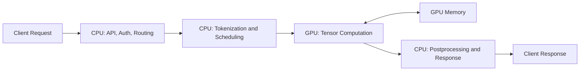
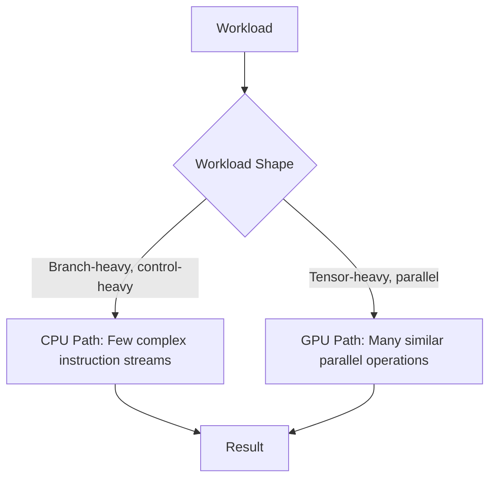
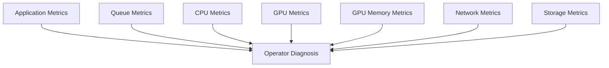
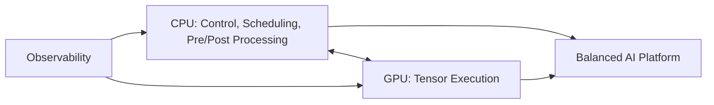

# CPU vs GPU

## Introduction

A CPU and a GPU are both processors.

They are not designed for the same kind of work.

A CPU is optimized for flexibility, operating system integration, branching, and fast execution of complex instruction streams.

A GPU is optimized for throughput across many parallel operations.

This chapter explains the difference from an infrastructure perspective.

The goal is not to memorize hardware terminology.

The goal is to understand why AI platforms combine CPUs and GPUs rather than replacing one with the other.

## Story

A platform engineer receives two performance reports.

The first report shows a traditional API service.

Latency is dominated by database queries, network calls, and business logic.

The second report shows a model inference service.

Latency is dominated by model execution and tensor movement.

The engineer asks a reasonable question:

> Why not run everything on the same kind of server?

The answer is that these workloads have different shapes.

Traditional applications often need fast decision-making.

AI workloads often need many similar mathematical operations to happen at once.

That difference explains the CPU versus GPU architecture decision.

## Learning Objectives

After completing this chapter, you will be able to:

- Compare CPU and GPU execution models.
- Explain why GPUs are effective for AI workloads.
- Identify work that should remain on CPUs.
- Describe common infrastructure bottlenecks when using GPUs.
- Explain CPU/GPU trade-offs to a customer or interview panel.

## Prerequisites

You should have read Chapter 01 and Chapter 02.

You should understand basic processes, memory, and system performance concepts.

## Estimated Reading Time

35–45 minutes.

## Difficulty

Foundation.

## Big Picture

A CPU and GPU cooperate in a production AI system.



Figure 3.1 — CPU and GPU cooperation in an inference path.

The CPU controls much of the system.

The GPU accelerates the numerical core of the workload.

## Deep Explanation

The CPU is a small group of powerful general-purpose cores.

Each core is designed to handle complicated control flow, branch-heavy code, system calls, interrupts, and a wide range of instructions.

The GPU is a large collection of simpler execution resources designed to process many data elements in parallel.

This is why GPUs are effective for workloads where the same operation is applied many times across large arrays.

AI models expose that pattern naturally.

Matrix multiplication, convolution, attention, normalization, and embedding operations all create large amounts of parallel work.

The GPU does not make every workload faster.

It makes the right workload faster when the software stack can expose enough parallelism and feed the GPU with data efficiently.

## Comparison Table

| Dimension | CPU | GPU |
|---|---|---|
| Primary design goal | General-purpose execution | High-throughput parallel execution |
| Best at | Control flow, OS work, branching, coordination | Tensor math, matrix operations, parallel numeric work |
| Core style | Fewer, more complex cores | Many simpler execution resources |
| Latency/throughput bias | Low-latency instruction execution | High-throughput data-parallel execution |
| Memory concern | Cache behavior and system memory | High-bandwidth device memory and data movement |
| AI role | Orchestration, preprocessing, scheduling, control | Model execution and tensor operations |
| Failure mode | Process, OS, memory, or service failure | Driver, CUDA, device, memory, thermal, or topology issues |

There is no universal winner.

A production AI platform needs both.

## Internal Working

The difference becomes clearer when visualized as work distribution.



Figure 3.2 — Workload shape determines the appropriate execution engine.

The CPU path is appropriate when each operation may be different.

The GPU path is appropriate when the system can apply similar operations across many data elements.

## Architecture

Architects should avoid simplistic statements such as "GPUs are faster than CPUs."

A better statement is:

> GPUs can provide much higher throughput for parallel numerical workloads when the data pipeline, runtime, and memory layout allow the workload to use them efficiently.

That sentence includes the conditions.

Architecture is about conditions.

### Key Trade-offs

| Trade-off | Explanation |
|---|---|
| Performance vs complexity | GPUs can improve throughput but require driver, runtime, and scheduling discipline. |
| Throughput vs latency | Batching can improve GPU efficiency while increasing per-request wait time. |
| Cost vs utilization | Expensive GPUs must be kept busy to justify their cost. |
| Flexibility vs specialization | CPUs handle broad workloads; GPUs specialize in parallel numeric execution. |
| Simplicity vs scale | Small systems may not need GPU orchestration; larger systems usually do. |

## When to Use CPU-Only Infrastructure

CPU-only infrastructure can be appropriate when:

- The model is small.
- Request volume is low.
- Latency targets are relaxed.
- The workload is mostly data preparation or business logic.
- GPU cost or availability is not justified.
- Operational simplicity is more important than acceleration.

This decision should be made from measurement, not habit.

## When to Use GPU-Accelerated Infrastructure

GPU acceleration becomes appropriate when:

- Model execution dominates runtime.
- The workload has strong parallelism.
- Throughput requirements are high.
- Latency targets cannot be met on CPU efficiently.
- Model size or batch size benefits from GPU memory and compute.
- Total cost improves when expensive accelerators are highly utilized.

A GPU is not a magic performance layer.

It is a specialized engine that must be used correctly.

## Production Deployment

In production, the CPU/GPU boundary appears in several places.

### Kubernetes Scheduling

The scheduler must place GPU workloads on nodes that expose GPU resources.

The container runtime must allow the container to access the NVIDIA driver and device files.

### Model Serving

The serving layer must decide how to batch, queue, and route requests.

Poor batching can leave GPUs underutilized.

Aggressive batching can increase latency.

### Observability

Operators must watch both CPU and GPU signals.

CPU metrics alone may miss accelerator bottlenecks.

GPU metrics alone may miss preprocessing, networking, or queuing bottlenecks.



Figure 3.3 — CPU/GPU systems require multi-layer observability.

## Hands-on Lab

Lab 01 asks you to inspect the host and identify what the system can tell you about CPUs, memory, PCI devices, and optional NVIDIA GPUs.

Later labs will compare actual GPU workloads.

This chapter focuses on the mental model first.

## Production Troubleshooting

### Problem

GPU utilization is low in a GPU-backed inference service.

### Symptoms

- GPU utilization remains low during active traffic.
- CPU usage is high on the inference server.
- Request latency is high.
- Increasing GPU count does not improve throughput.

### Diagnosis

Low GPU utilization does not automatically mean the GPU is weak.

It may mean the GPU is waiting.

Check:

- Tokenization time.
- Request queue behavior.
- Batch size.
- Model loading behavior.
- Data transfer between CPU and GPU.
- Container runtime configuration.
- GPU memory usage.

### Commands

Purpose: check whether GPUs are visible to the host.

```bash
nvidia-smi
```

Expected healthy output includes one or more GPUs, driver information, and process information when workloads are active.

Purpose: inspect CPU pressure.

```bash
top
```

High CPU pressure during low GPU utilization may indicate preprocessing or scheduling bottlenecks.

Purpose: inspect PCI topology when GPUs exist.

```bash
nvidia-smi topo -m
```

Expected output shows GPU, CPU, and interconnect topology when supported by the driver and platform.

### Root Cause

The GPU is not receiving enough useful parallel work because another layer in the pipeline is the bottleneck.

### Resolution

Tune the pipeline rather than adding GPUs blindly.

Possible fixes include:

- Improve tokenization throughput.
- Increase or tune batching carefully.
- Avoid repeated model loading.
- Reduce CPU-to-GPU transfer overhead.
- Fix container runtime or scheduling configuration.

### Prevention

Monitor queue depth, CPU usage, GPU utilization, GPU memory, request latency, and model execution time together.

## Customer Scenario

A customer says:

> We purchased GPUs, but our application is not faster. Are the GPUs defective?

A strong architect does not begin with blame.

The answer is:

A GPU only accelerates work that reaches it in a suitable form. We need to check whether the model is actually using the GPU, whether requests are batched correctly, whether preprocessing is limiting throughput, and whether GPU memory and runtime configuration are healthy. The hardware may be fine while the pipeline is poorly balanced.

## Interview Preparation

### Conceptual Questions

1. Explain the difference between CPU-optimized and GPU-optimized workloads.
2. Why does a GPU not accelerate every application?
3. Why is data movement important in CPU/GPU systems?

### Architecture Questions

1. Draw an inference architecture showing CPU and GPU responsibilities.
2. How would you decide whether a customer needs CPU-only or GPU-backed inference?
3. What metrics would you collect to confirm GPU acceleration is effective?

### Scenario Questions

1. A GPU node shows low utilization while users report high latency. What do you investigate?
2. A customer wants to replace all CPU nodes with GPU nodes. How do you respond?

### Whiteboard Questions

1. Draw the lifecycle of a request from API gateway to GPU execution.
2. Draw the signals required to troubleshoot a CPU/GPU inference pipeline.

## Summary

CPUs and GPUs solve different problems.

The CPU remains the control and coordination engine of the platform.

The GPU accelerates the numerical core when the workload exposes enough parallelism and the pipeline feeds the accelerator efficiently.

Good AI infrastructure design is not CPU versus GPU.

It is CPU plus GPU, connected by the right software, memory, scheduling, and operational model.

## Key Takeaways

- CPUs are optimized for flexible control flow.
- GPUs are optimized for high-throughput parallel numerical work.
- AI platforms require both.
- Low GPU utilization often indicates a pipeline bottleneck, not bad hardware.
- Architecture decisions require workload measurement.

## Architecture Summary



Figure 3.4 — Balanced AI platforms coordinate CPU and GPU responsibilities.

## Quick Revision Sheet

| Question | Answer |
|---|---|
| Is GPU always faster? | No. It depends on workload shape and data movement. |
| Should CPUs disappear? | No. CPUs remain essential for orchestration and control. |
| What causes low GPU utilization? | Often batching, preprocessing, scheduling, or data movement bottlenecks. |
| What should architects measure? | Latency, throughput, queue depth, CPU, GPU, memory, network, and storage signals. |

## Further Reading

- NVIDIA CUDA programming model documentation.
- Computer architecture resources on parallel execution.
- Kubernetes device plugin documentation.

## Next Chapter

The next foundation chapter will explain what happens when an AI system answers a request end to end.
