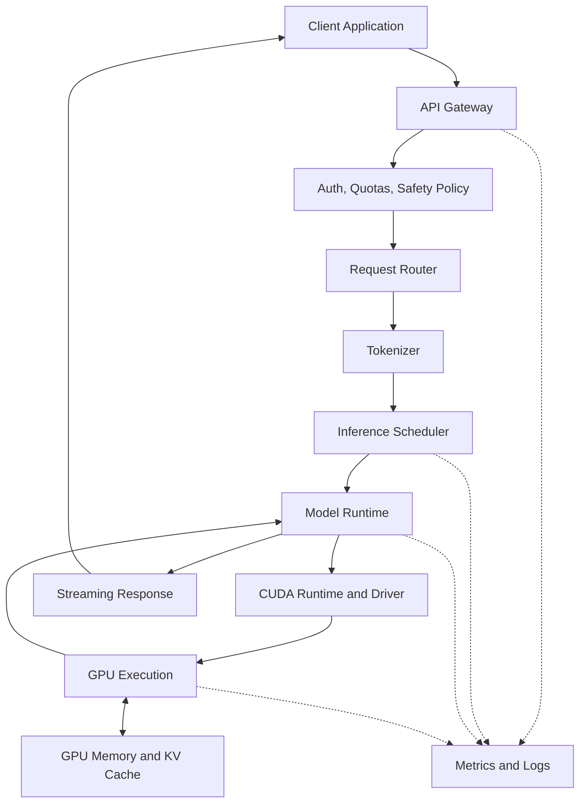
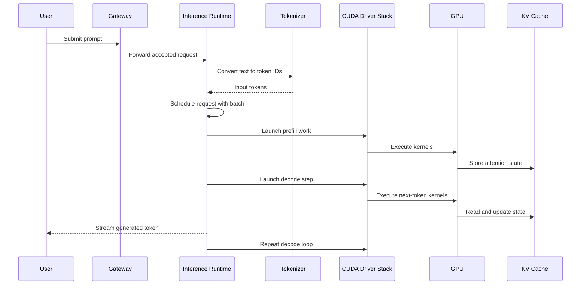
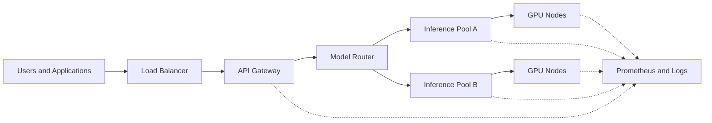

# What Actually Happens When ChatGPT Answers?

## Introduction

A chat interface hides the real engineering system behind modern AI. A user types a prompt, waits a few seconds, and receives a fluent answer. The experience feels like calling a normal web API, but the infrastructure path is very different from a traditional request-response application.

A normal API usually retrieves data, applies business logic, and returns a structured response. A large language model must convert text into tokens, move model weights and intermediate tensors through memory, execute thousands of mathematical operations, choose the next token repeatedly, and stream partial output while the request is still running. The answer is not retrieved from a database. It is generated step by step.

This chapter builds the first end-to-end mental model for AI infrastructure. Later volumes will dive into GPUs, CUDA, TensorRT, Triton, vLLM, NCCL, Kubernetes, networking, and observability. For now, the goal is to see the complete request path before studying each layer in detail.

| Chapter field | Value |
|---|---|
| Volume | 01 - AI Infrastructure Foundations |
| Difficulty | Foundation |
| Estimated reading time | 35 minutes |
| Primary focus | End-to-end AI request lifecycle |
| Previous chapter | CPU vs GPU |
| Next chapter | AI Infrastructure Landscape |

## Story

A platform team exposes an internal assistant to employees. During the pilot, the assistant performs well. A single engineer asks a question, the model responds quickly, and the demo looks successful. The team assumes the system is ready for broader use.

The first production rollout changes everything. Hundreds of employees start using the assistant during the same morning. Some prompts are short, but others include long documents, policy text, and log files. The model must read more context, generate longer answers, and serve more concurrent users. Latency rises. Some requests queue behind others. GPU utilization looks uneven. CPU usage spikes during tokenization. Memory pressure increases because active conversations keep intermediate state.

The team initially thinks the problem is simply that the model is slow. That diagnosis is incomplete. The real issue is that a generative AI request is a pipeline, not a single operation. The user sees one answer, but the infrastructure executes many stages before the first token appears and many more stages before the final answer is complete.

:::tip Principal engineer perspective
When investigating an AI service, never ask only whether the GPU is fast. Ask where time is spent before the GPU, inside the GPU, between tokens, and after the GPU. End-to-end latency is a pipeline property.
:::

## Learning Objectives

After completing this chapter, you will be able to:

- Explain the difference between a traditional API request and a generative AI request.
- Describe the major stages of an LLM inference pipeline.
- Explain why time to first token and tokens per second are different performance signals.
- Identify the infrastructure layers involved in serving a single AI response.
- Discuss common production bottlenecks in request routing, tokenization, model execution, memory, and streaming.

## Big Picture

Before learning NVIDIA technologies, we need to place them inside the request path. The GPU is central, but it is not the whole system. A production AI response depends on the client, gateway, scheduler, tokenizer, inference runtime, CUDA stack, GPU memory, model weights, observability system, and sometimes retrieval or policy layers.

**Figure 1.4.1 - LLM request lifecycle.** A user-facing AI response crosses application, platform, runtime, driver, hardware, and observability layers before the user sees the final text.

The important lesson is not the exact product used at each layer. The important lesson is that every layer can become the bottleneck. A slow tokenizer can delay the GPU. Poor scheduling can reduce batching efficiency. Insufficient GPU memory can limit concurrency. Weak observability can make the system impossible to troubleshoot under load.

## Deep Explanation

A generative AI request has two phases that infrastructure teams must separate: the **prefill phase** and the **decode phase**. During prefill, the system processes the input prompt and builds the internal state needed to start generation. During decode, the model generates output tokens one step at a time. These phases stress infrastructure differently.

The prefill phase is usually dominated by processing the input context. Longer prompts require more computation and more memory traffic before the model can produce the first token. This is why a short question and a long document summarization request behave very differently even if they use the same model.

The decode phase is iterative. The model predicts one token, updates state, predicts the next token, and repeats until the answer is complete or a stopping condition is reached. The user may see text streaming, but the infrastructure is still executing a loop behind the scenes. This loop makes LLM serving different from many traditional batch workloads.

| Stage | What happens | Infrastructure concern |
|---|---|---|
| Request admission | Gateway authenticates and accepts the request | Rate limits, quotas, tenant isolation |
| Tokenization | Text becomes token IDs | CPU load, tokenizer latency, long prompts |
| Scheduling | Request is placed into an execution queue | Fairness, batching, priority, queue delay |
| Prefill | Model processes the input context | GPU compute, memory bandwidth, context length |
| Decode | Model generates output tokens | Token latency, KV cache, concurrency |
| Streaming | Partial output returns to client | Backpressure, network reliability, UX latency |
| Observability | Metrics and logs are emitted | Debuggability, SLO tracking, capacity planning |

The first token is often the most important user-visible milestone. If time to first token is high, the system feels slow even if final throughput is good. After generation begins, tokens per second becomes more visible. A system can have acceptable throughput but poor time to first token, or fast first-token latency but poor sustained generation under concurrency.

:::note
In production conversations, avoid saying only that inference is fast or slow. Separate queue time, prefill time, time to first token, decode throughput, and total completion time.
:::

## Internal Working

The runtime path is easier to understand as an interaction sequence. The model runtime does not directly “talk to the GPU” as a single opaque action. It invokes libraries and kernels through the software stack, and the GPU executes work against model weights, activations, and cached state.

**Figure 1.4.2 - Request sequence.** The visible response is produced by repeated interactions between the runtime, CUDA stack, GPU, and memory state.

The key internal object during LLM serving is the cached state used during generation. This is commonly discussed as the KV cache. You do not need to understand the mathematics yet. At this point, remember only that active requests consume memory beyond the model weights themselves. More users, longer prompts, and longer generations can all increase memory pressure.

## Architecture

A production AI request path must be designed for both latency and throughput. These goals can conflict. Larger batches can improve GPU efficiency, but aggressive batching may increase the waiting time for an individual request. Serving systems therefore balance utilization against responsiveness.

| Architecture concern | Question to ask | Common failure when ignored |
|---|---|---|
| Admission control | Should this request be accepted now? | Queue explosion and timeout storms |
| Routing | Which model instance should serve this request? | Hot spots and uneven GPU utilization |
| Batching | Which requests should run together? | Low utilization or high waiting time |
| Memory management | Can active requests fit in GPU memory? | Out-of-memory failures and evictions |
| Streaming | Can clients consume output reliably? | Backpressure and broken connections |
| Observability | Can we isolate each stage of latency? | Guesswork during incidents |

A well-designed system exposes stage-level metrics. If the team only measures total latency, every incident becomes ambiguous. If the team measures queue time, tokenization time, prefill time, decode rate, GPU memory usage, and request errors, troubleshooting becomes systematic.

## Production Deployment

In a small environment, one service may handle routing, scheduling, and execution on a single GPU node. In a larger environment, these responsibilities are usually separated. A gateway handles authentication and rate limits. A routing layer selects model replicas. An inference runtime manages batching and execution. Monitoring systems collect application and GPU metrics.

**Figure 1.4.3 - Production serving layout.** Enterprise AI serving separates request control, model routing, GPU execution, and observability.

This architecture allows teams to scale model pools independently. A small embedding model may need many lightweight replicas. A large language model may need fewer replicas with more GPU memory. A regulated workload may need its own isolated pool. The platform architecture should make these differences explicit instead of forcing every workload into the same shape.

## Hands-on Lab

The companion lab for this foundation area is **Lab 01: Inspect an AI Infrastructure Host**. In later labs, you will extend that inspection workflow by running a small containerized inference workload, measuring latency, and separating CPU-side preprocessing from GPU-side execution.

For this chapter, the practical skill is architectural tracing. Given a slow response, practice drawing the request path and asking which stage is responsible before changing hardware or scaling replicas.

## Production Troubleshooting

### Problem: High time to first token

| Area | What to inspect | Why it matters |
|---|---|---|
| Queue | Pending requests and scheduler delay | A request may wait before GPU execution begins |
| Tokenizer | CPU utilization and prompt length | Long prompts can delay prefill |
| Prefill | GPU utilization during context processing | First token cannot appear before prefill finishes |
| Memory | GPU memory usage and cache pressure | Memory pressure can reduce concurrency |
| Routing | Per-replica load distribution | One hot replica can dominate tail latency |

A common mistake is to treat high time to first token as purely a GPU problem. Sometimes the GPU is idle because the request is stuck in admission, tokenization, routing, or batching. The correct troubleshooting approach follows the request from the edge toward the GPU and then back toward the client.

### Problem: Good single-user performance, poor production performance

This failure usually appears when the test environment measures one request at a time. Production introduces concurrency, longer prompts, mixed output lengths, network variability, and tenant contention. The fix is not automatically to buy more GPUs. The team must benchmark realistic traffic and measure each pipeline stage under load.

## Customer Scenario

A financial services customer deploys an internal research assistant. The first demo uses a small group of users and looks excellent. After rollout, analysts submit long documents near market open, and latency becomes unpredictable. The customer asks whether they need a larger GPU cluster.

A strong architect does not start with a hardware quote. The first response is to map the request lifecycle and collect evidence. Are requests waiting in a queue? Are prompts too long? Is the retrieval layer slow? Is the model pool underprovisioned? Are GPU replicas unevenly loaded? Only after answering those questions can the architect recommend scaling, batching changes, model optimization, or workload separation.

## Interview Preparation

### Conceptual Questions

1. Why is LLM inference not equivalent to a normal stateless API request?
2. What is the difference between time to first token and total response time?
3. Why can long prompts increase latency before generation begins?

### Architecture Questions

1. Draw an end-to-end LLM serving architecture for an enterprise internal assistant.
2. Where would you place authentication, quota enforcement, routing, and observability?
3. How would you separate latency-sensitive requests from batch summarization workloads?

### Scenario Questions

1. Single-user latency is good, but production latency is poor. What do you inspect first?
2. GPU utilization is low while users report slow responses. What could explain this?
3. Long documents cause timeouts. How would you redesign the serving path?

## Summary

A generative AI response is produced by a pipeline, not a single function call. The request moves through admission control, tokenization, scheduling, prefill, decode, memory management, streaming, and observability. Each stage can become the bottleneck.

The GPU is central to model execution, but GPU performance alone does not determine user experience. AI infrastructure engineers must reason about the full path from client request to streamed response. This request-lifecycle mindset prepares you to understand the rest of the bootcamp: GPUs, CUDA, runtimes, networking, Kubernetes, observability, and production operations.

## Key Takeaways

- A chatbot response hides a multi-stage infrastructure pipeline.
- Time to first token and tokens per second measure different parts of the user experience.
- Tokenization, scheduling, memory, and routing can bottleneck inference before the GPU becomes the issue.
- Production AI serving requires observability at every stage of the request path.
- Good architecture starts by tracing the system, not by guessing which component is slow.

## Cross References

- Previous: [CPU vs GPU](./chapter-03-cpu-vs-gpu.md)
- Next: [AI Infrastructure Landscape](./chapter-05-ai-infrastructure-landscape.md)
- Related lab: [Inspect an AI Infrastructure Host](./labs/lab-01-inspect-an-ai-infrastructure-host.md)
