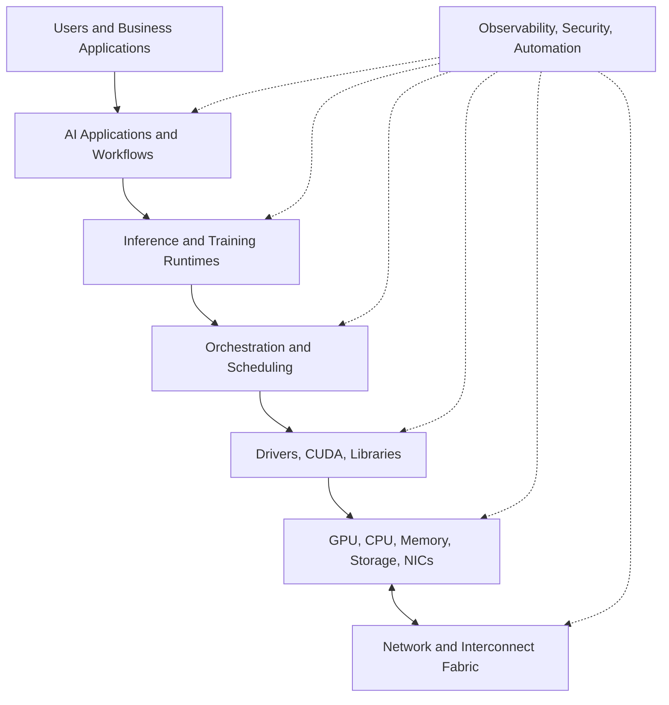
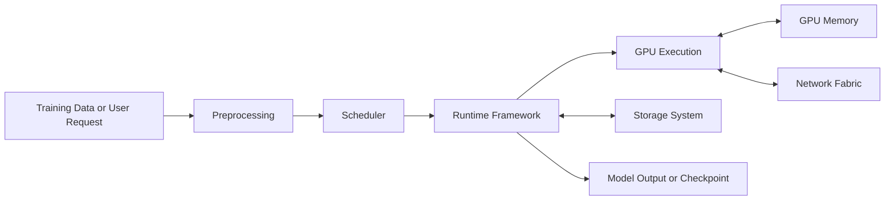
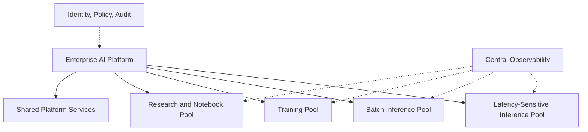

# AI Infrastructure Landscape

## Introduction

AI infrastructure is often misunderstood as “servers with GPUs.” That description is too small. A GPU server is only one part of a larger system that must ingest data, schedule work, execute models, move tensors, serve users, isolate tenants, observe failures, and control cost.

For experienced DevOps, SRE, cloud, and platform engineers, the challenge is not learning a single product. The challenge is learning how familiar infrastructure disciplines change when the workload becomes GPU-accelerated, memory-intensive, and distributed. Linux still matters. Kubernetes still matters. Networking still matters. Storage still matters. The difference is that bottlenecks now appear in places many infrastructure teams have not previously measured.

This chapter maps the landscape. The goal is to understand the major domains before going deep into NVIDIA hardware, CUDA, DGX, HGX, networking, Kubernetes, inference, training, observability, and operations.

| Chapter field | Value |
|---|---|
| Volume | 01 - AI Infrastructure Foundations |
| Difficulty | Foundation |
| Estimated reading time | 35 minutes |
| Primary focus | AI infrastructure domains and layers |
| Previous chapter | What Actually Happens When ChatGPT Answers? |
| Next chapter | Modern AI Factory |

## Story

An enterprise architecture team is asked to build a private AI platform. The first meeting immediately becomes confusing. The data science team asks for notebooks and model endpoints. The security team asks about tenant isolation and data residency. The platform team asks whether Kubernetes is required. The networking team asks whether Ethernet is enough. The finance team asks why GPUs are so expensive. The operations team asks who owns firmware, drivers, and incident response.

Everyone is discussing the same platform, but each team sees a different slice of it. Without a shared landscape, the design becomes a list of disconnected tools: GPU nodes, object storage, Kubernetes, model servers, vector databases, monitoring dashboards, and CI/CD pipelines. The architecture looks complete on paper but has no clear ownership model or failure model.

A senior AI infrastructure architect starts differently. They draw the platform as layers. Each layer has a responsibility, a failure mode, and an operational owner. Once the landscape is visible, technology decisions become easier to reason about.

## Learning Objectives

After completing this chapter, you will be able to:

- Identify the major layers of production AI infrastructure.
- Explain how hardware, system software, orchestration, runtimes, data, and operations interact.
- Distinguish between training, inference, experimentation, and platform services.
- Recognize why AI infrastructure requires cross-functional ownership.
- Use a layered architecture model to discuss enterprise AI platforms.

## Big Picture

The AI infrastructure landscape can be represented as a layered stack. The stack is not merely conceptual. Every layer introduces real operational responsibilities and real failure modes.

**Figure 1.5.1 - AI infrastructure landscape.** Production AI infrastructure is a layered system. Operations, security, and observability cut across every layer rather than living at the end of the project.

This model prevents a common mistake: treating AI infrastructure as a GPU procurement exercise. Hardware is necessary, but it does not automatically produce a usable platform. Without scheduling, runtime integration, networking, observability, and operational discipline, expensive GPUs can sit underutilized.

## Deep Explanation

AI infrastructure contains several domains that must be designed together. Each domain answers a different engineering question.

| Domain | Primary question | Examples |
|---|---|---|
| Hardware | Where does computation physically run? | GPUs, CPUs, HBM, NVMe, NICs, DGX, HGX |
| Interconnect | How does data move inside and between nodes? | PCIe, NVLink, InfiniBand, Ethernet, RDMA |
| System software | How do applications access accelerators? | Drivers, CUDA, libraries, container runtime integration |
| Orchestration | How are workloads placed and isolated? | Kubernetes, device plugins, operators, schedulers |
| Runtime | How are models executed efficiently? | Inference servers, training frameworks, batching, optimization |
| Data | Where do datasets, checkpoints, and embeddings live? | Object storage, parallel file systems, vector stores |
| Operations | How is the platform kept healthy? | Metrics, logs, alerts, upgrades, incident response |
| Governance | How is enterprise risk controlled? | RBAC, quotas, audit, policy, compliance |

The boundaries between domains are important, but the interactions are more important. A runtime decision can change GPU memory pressure. A storage decision can change training throughput. A network decision can change distributed training scalability. A scheduling decision can change tenant fairness. AI infrastructure engineering is the discipline of understanding these interactions.

:::note
A platform can be technically functional and still architecturally weak. If ownership, observability, upgrade paths, and failure recovery are unclear, the system is not production-ready.
:::

## Internal Working

The landscape becomes clearer when viewed through the path of a workload. A training job and an inference service use many of the same layers, but they stress them differently.

**Figure 1.5.2 - Workload path across infrastructure domains.** A workload crosses data, scheduling, runtime, GPU, memory, network, and storage layers. The slowest layer limits the system.

For inference, the input may be a user request and the output may be a streamed response. For training, the input may be a dataset and the output may be model checkpoints. In both cases, infrastructure must move data efficiently, place workloads correctly, execute GPU work, and expose enough telemetry to diagnose problems.

## Architecture

A useful way to design AI infrastructure is to separate capability layers from operating layers. Capability layers provide the functions the business wants. Operating layers make those functions reliable, secure, scalable, and maintainable.

| Layer type | Examples | What happens if it is missing |
|---|---|---|
| Capability | GPU compute, inference serving, training framework, storage | The platform cannot run required workloads |
| Control | Scheduling, quotas, routing, admission control | The platform becomes unfair or unstable under load |
| Reliability | health checks, redundancy, rollback, recovery procedures | Failures turn into long outages |
| Observability | GPU metrics, request metrics, logs, traces, dashboards | Teams cannot isolate bottlenecks |
| Governance | identity, RBAC, audit, compliance, data controls | The platform cannot be used safely in enterprise environments |

Architecture work begins by clarifying requirements. A research environment needs flexibility. A production inference platform needs predictability. A regulated industry environment needs governance. A large training cluster needs fabric performance and failure recovery. The same technology stack may appear in each environment, but the design emphasis changes.

## Production Deployment

A production enterprise AI platform commonly includes multiple workload zones. Not every workload should share the same pool. Interactive inference, batch inference, training, experimentation, and system services often need different scheduling policies and operational expectations.

**Figure 1.5.3 - Enterprise workload zones.** Production AI platforms separate workload classes so that latency-sensitive services, batch jobs, training runs, and research environments do not interfere unpredictably.

This separation helps with cost and reliability. Training jobs can consume large GPU allocations for long periods. Interactive inference needs predictable latency. Research notebooks need flexibility but can create unpredictable resource usage. Batch workloads can be scheduled during lower-demand windows. Treating all workloads identically usually creates operational conflict.

## Hands-on Lab

The practical skill for this chapter is inventory mapping. Before deploying any software, an infrastructure engineer should be able to list the platform layers, identify owners, and describe how each layer is observed.

In later labs, this becomes concrete through GPU inspection, CUDA workloads, container runtime configuration, GPU Operator deployment, DCGM monitoring, and model serving. Each lab will reinforce one layer of the landscape while showing how it connects to the others.

## Production Troubleshooting

### Problem: The team cannot explain where latency is coming from

This is usually a landscape problem, not just a tooling problem. The platform has metrics, but they are not mapped to architecture layers. GPU metrics exist in one dashboard. application latency exists somewhere else. Kubernetes events are checked manually. Storage metrics are owned by another team. No one can connect symptoms across layers.

| Symptom | Likely missing capability | Architecture fix |
|---|---|---|
| GPU looks idle but users wait | Queue and scheduler visibility | Add request-stage metrics |
| Training is slow but GPU memory is full | Memory and input pipeline visibility | Measure data loading and memory pressure |
| Inference fails during peak usage | Admission control and capacity policy | Add quotas and load shedding |
| Incidents require many teams | Ownership model | Define layer ownership and escalation paths |

### Problem: GPUs are purchased before workload requirements are clear

This often produces expensive mismatch. A platform optimized for large training may not serve low-latency inference well. A small inference environment may not need the same networking fabric as a multi-node training cluster. Hardware choices should follow workload analysis, not precede it.

## Customer Scenario

A manufacturing company wants an AI platform for visual inspection, document search, engineering assistants, and model experimentation. The business asks for “an NVIDIA platform,” but the workloads are not the same. Visual inspection may require low-latency edge or factory integration. Document search may require retrieval pipelines and inference serving. Engineering assistants may need private LLM serving. Experimentation may need notebooks and flexible GPU access.

A good architect does not collapse these into one generic design. The architect maps each workload to the landscape: data source, runtime, GPU needs, latency target, storage pattern, security boundary, observability requirement, and operational owner. Only then does the design become specific enough to implement.

## Interview Preparation

### Conceptual Questions

1. Why is AI infrastructure more than GPU hardware?
2. Which infrastructure layers are involved in serving an inference request?
3. Why should observability be designed across layers instead of added later?

### Architecture Questions

1. Draw a layered AI infrastructure stack for an enterprise platform.
2. How would you separate training, inference, and research workloads?
3. Which teams should own hardware, platform, runtime, security, and operations?

### Scenario Questions

1. A customer bought GPU servers but has low utilization. What landscape-level issues do you investigate?
2. A platform works in development but fails under enterprise rollout. What layers may be missing?
3. Multiple teams disagree about whether the problem is storage, networking, or GPUs. How do you structure the investigation?

## Summary

AI infrastructure is a layered production system. Hardware, networking, system software, orchestration, runtimes, data, observability, security, and operations must work together. A GPU server is important, but it is not a complete platform.

The landscape model helps engineers reason across domains. Instead of arguing about isolated tools, teams can ask which layer owns the problem, how that layer is measured, how it interacts with adjacent layers, and what trade-offs the architecture must make.

## Key Takeaways

- AI infrastructure is a system of layers, not a single product.
- Workloads cross hardware, runtime, platform, data, network, and operations domains.
- Training, inference, batch processing, and research stress the platform differently.
- Enterprise platforms require governance, observability, and ownership from the beginning.
- Good architecture maps requirements to layers before selecting technology.

## Cross References

- Previous: [What Actually Happens When ChatGPT Answers?](./chapter-04-what-happens-when-chatgpt-answers.md)
- Next: [Modern AI Factory](./chapter-06-modern-ai-factory.md)
- Related lab: [Inspect an AI Infrastructure Host](./labs/lab-01-inspect-an-ai-infrastructure-host.md)
