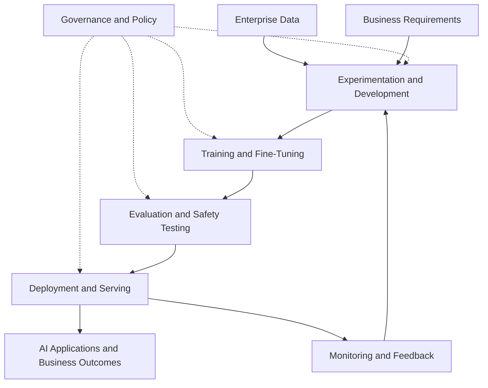
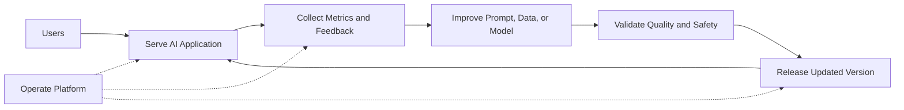
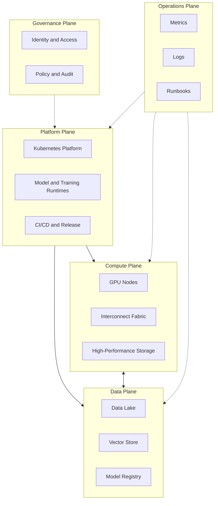

# Modern AI Factory

## Introduction

A modern AI platform is not only a place where models run. It is a production system that repeatedly turns data, compute, models, policies, and operations into useful business output. This is the idea behind the AI factory.

The factory analogy is useful because it shifts the conversation away from isolated tools. A factory has inputs, machinery, workflows, quality control, safety controls, maintenance, and output. An AI factory has the same architectural concerns. Data enters. Models are trained, tuned, evaluated, deployed, monitored, and improved. Infrastructure must make that cycle repeatable.

This chapter explains the AI factory as an architecture pattern. It does not assume a specific vendor product. Later chapters will show how NVIDIA technologies fit into this pattern through GPUs, DGX, HGX, networking, CUDA, Kubernetes, inference runtimes, observability, and enterprise software.

| Chapter field | Value |
|---|---|
| Volume | 01 - AI Infrastructure Foundations |
| Difficulty | Foundation |
| Estimated reading time | 40 minutes |
| Primary focus | AI factory architecture model |
| Previous chapter | AI Infrastructure Landscape |
| Next chapter | NVIDIA Ecosystem Overview |

## Story

A healthcare organization wants to deploy AI across multiple departments. Radiology wants imaging models. Legal wants document summarization. Operations wants forecasting. Security wants strict access controls. Data science wants experimentation environments. Executives want repeatable business outcomes, not disconnected prototypes.

The first attempt is project-based. Each team builds its own environment, chooses its own tools, and deploys its own model. The result is predictable: duplicated infrastructure, inconsistent security controls, unclear ownership, low GPU utilization, and no standard path from prototype to production.

The second attempt treats AI as a factory. The organization defines shared data pipelines, standardized GPU platforms, approved model runtimes, governance controls, observability, and deployment patterns. Teams can still build different applications, but they use a common production foundation. The platform becomes repeatable instead of artisanal.

:::tip Architect mindset
An AI factory is not a single cluster. It is an operating model supported by infrastructure. The goal is repeatable AI delivery with measurable quality, performance, security, and cost.
:::

## Learning Objectives

After completing this chapter, you will be able to:

- Explain the AI factory model from first principles.
- Identify the inputs, processing stages, controls, and outputs of an AI factory.
- Distinguish between project-based AI deployment and platform-based AI delivery.
- Describe the infrastructure layers required for repeatable AI production.
- Discuss why operations, governance, and observability are part of the AI factory rather than afterthoughts.

## Big Picture

An AI factory is a pipeline of capabilities. It receives data and requirements, transforms them through development and production systems, and produces deployed AI services, trained models, insights, or automated decisions.

**Figure 1.6.1 - AI factory lifecycle.** The AI factory turns data and requirements into production AI outcomes through repeatable development, training, evaluation, deployment, and feedback loops.

The important idea is repetition. A one-time model deployment is not an AI factory. A platform that allows many teams to build, validate, deploy, monitor, and improve AI systems through standard patterns is much closer to the factory model.

## Deep Explanation

The AI factory exists because enterprise AI fails when every model is treated as a unique snowflake. Early AI projects often succeed as demos but struggle in production. The prototype may use manually prepared data, one-off scripts, ad hoc GPU access, untracked model artifacts, weak monitoring, and unclear security boundaries. That approach cannot scale across departments.

A factory model standardizes the path from idea to production. It does not remove engineering judgment. Instead, it creates reliable rails. Data access follows approved patterns. GPU capacity is scheduled and observed. Models are packaged consistently. Evaluation gates are defined. Deployment targets are known. Incidents have owners. Costs are measured.

| Factory concept | AI infrastructure equivalent | Why it matters |
|---|---|---|
| Raw material | Data, documents, images, logs, prompts | AI output quality depends on input quality |
| Machinery | GPUs, runtimes, training frameworks, storage, networking | Workloads require specialized execution systems |
| Assembly line | Pipelines for training, evaluation, deployment | Repeatability reduces operational chaos |
| Quality control | Evaluation, safety checks, performance tests | Models must be validated before production use |
| Maintenance | Upgrades, monitoring, incident response | Platforms degrade without operations |
| Output | Models, APIs, assistants, predictions, insights | Business value appears only when AI reaches users |

The AI factory is not only about training large models. Many enterprises will consume existing models, customize them, connect them to private data, serve them securely, and monitor them in production. In that case, the factory still matters because deployment, governance, observability, cost control, and feedback loops remain necessary.

## Internal Working

A production AI factory contains multiple feedback loops. The serving loop handles live traffic. The improvement loop collects signals and feeds future development. The operations loop maintains the platform. These loops must work together without compromising security or reliability.

**Figure 1.6.2 - AI factory feedback loops.** The factory is sustained by feedback from production, validation before release, and continuous platform operations.

The infrastructure implication is significant. The platform must support more than raw execution. It must manage artifacts, versions, approvals, telemetry, rollback, access control, and capacity. If these concerns are missing, teams may deploy models, but they cannot operate them safely at enterprise scale.

## Architecture

A modern AI factory can be organized into five architectural planes: data, compute, platform, governance, and operations. Each plane has a distinct responsibility, but no plane works in isolation.

| Plane | Responsibility | Typical components |
|---|---|---|
| Data plane | Provides approved data access and storage | Object storage, file systems, databases, vector stores |
| Compute plane | Executes training, inference, and batch jobs | GPUs, CPUs, memory, NVMe, interconnects |
| Platform plane | Schedules and exposes workloads | Kubernetes, operators, runtimes, CI/CD, model registry |
| Governance plane | Controls risk and access | IAM, RBAC, audit, policy, data controls, approvals |
| Operations plane | Keeps the factory reliable | Monitoring, alerting, runbooks, upgrades, capacity planning |

**Figure 1.6.3 - AI factory planes.** The AI factory separates responsibility into planes while preserving clear interaction between governance, platform, compute, data, and operations.

This structure helps architects explain complex systems to different audiences. Executives care about repeatable outcomes and risk. Platform teams care about scheduling and automation. Security teams care about governance. Infrastructure teams care about compute, networking, and storage. Operations teams care about reliability and recovery. The AI factory model gives all of them a shared map.

## Production Deployment

A production AI factory is usually deployed in phases. Attempting to build everything at once creates complexity before the organization has learned its workload patterns. A practical rollout starts with a small number of high-value workloads, standardizes the platform path, and then expands.

| Phase | Goal | Common deliverables |
|---|---|---|
| Phase 1 | Establish foundation | GPU nodes, base Kubernetes, storage, monitoring |
| Phase 2 | Enable first workloads | Inference runtime, notebook environment, access controls |
| Phase 3 | Standardize delivery | CI/CD, model registry, deployment templates, runbooks |
| Phase 4 | Improve operations | SLOs, cost reporting, capacity planning, upgrade strategy |
| Phase 5 | Scale enterprise adoption | Multi-tenant policies, workload zones, chargeback, DR planning |

The factory should not be designed only for the first model. The first model proves the platform path. The long-term value appears when the second, tenth, and hundredth workloads can reuse the same foundation with appropriate guardrails.

## Hands-on Lab

This chapter does not require a dedicated software deployment. The practical exercise is to design an AI factory map for one enterprise use case. Choose a workload such as internal document search, customer support automation, visual inspection, or private code assistance. Identify the data sources, compute requirements, runtime, deployment target, governance controls, observability signals, and operational owner.

Later labs will implement pieces of this map. GPU inspection introduces the compute plane. GPU Operator labs introduce the platform plane. Monitoring labs introduce the operations plane. Inference labs introduce serving. Troubleshooting labs connect all planes during failure.

## Production Troubleshooting

### Problem: The organization has many AI pilots but no production platform

This is a common AI factory failure. Individual teams can build demos, but there is no standard path to production. Models are packaged differently, security reviews repeat from scratch, GPU access is manually negotiated, and incidents have unclear ownership.

| Symptom | Underlying issue | AI factory response |
|---|---|---|
| Every team builds its own stack | No platform plane | Provide shared deployment patterns |
| Security reviews block every release | No governance plane | Standardize approved controls |
| GPU costs rise without visibility | Weak operations plane | Add utilization and chargeback reporting |
| Models fail silently | Weak observability | Define serving metrics and alerts |
| Production rollout is slow | No repeatable lifecycle | Build release gates and templates |

### Problem: The platform is optimized for demos, not operations

Demo platforms prioritize speed of first deployment. Production factories prioritize repeatability, reliability, and control. A demo environment may ignore upgrades, rollback, quota enforcement, incident response, and model drift. These omissions become outages later.

:::warning Production mistake
Do not confuse “we deployed a model” with “we have an AI factory.” Deployment is one stage. A factory requires a repeatable lifecycle, operational ownership, governance, and feedback.
:::

## Customer Scenario

A telecom customer wants to use AI for network operations, customer support, and field engineering. Each team has different data, latency, and governance requirements. The customer asks whether they should build one large GPU cluster for all workloads.

A strong architect reframes the question. The customer does need shared infrastructure, but the design should define workload zones, access controls, runtime patterns, and operations processes. Batch analytics, real-time support assistants, and engineering copilots should not all receive the same scheduling policy. The architecture should provide a common factory foundation while allowing workload-specific execution patterns.

## Interview Preparation

### Conceptual Questions

1. What does the AI factory analogy explain that “GPU cluster” does not?
2. Why is repeatability important for enterprise AI adoption?
3. Why are governance and operations part of the AI factory architecture?

### Architecture Questions

1. Draw an AI factory architecture with data, compute, platform, governance, and operations planes.
2. How would you phase the rollout of an enterprise AI factory?
3. How would you separate research, training, inference, and batch workloads inside the same factory model?

### Scenario Questions

1. A customer has ten AI pilots but no production deployment. What is missing?
2. GPU utilization is low across the platform. Which factory planes do you inspect?
3. A regulated customer wants private LLM serving. What factory controls must be present before production?

## Summary

A modern AI factory is a repeatable production system for delivering AI outcomes. It connects data, compute, platform services, governance, and operations into a lifecycle that supports development, training, evaluation, deployment, monitoring, and improvement.

The factory model helps engineers avoid tool-first design. Instead of asking only which GPU or runtime to use, architects ask how workloads move through the system, how quality is controlled, how failures are handled, how costs are measured, and how future workloads will reuse the platform.

## Key Takeaways

- An AI factory is an operating model supported by infrastructure.
- The goal is repeatable AI delivery, not one-off model deployment.
- Data, compute, platform, governance, and operations planes must be designed together.
- Enterprise AI platforms should support feedback, validation, rollback, and continuous improvement.
- The first successful workload should establish a reusable path for future workloads.

## Cross References

- Previous: [AI Infrastructure Landscape](./chapter-05-ai-infrastructure-landscape.md)
- Next: NVIDIA Ecosystem Overview
- Related lab: [Inspect an AI Infrastructure Host](./labs/lab-01-inspect-an-ai-infrastructure-host.md)
