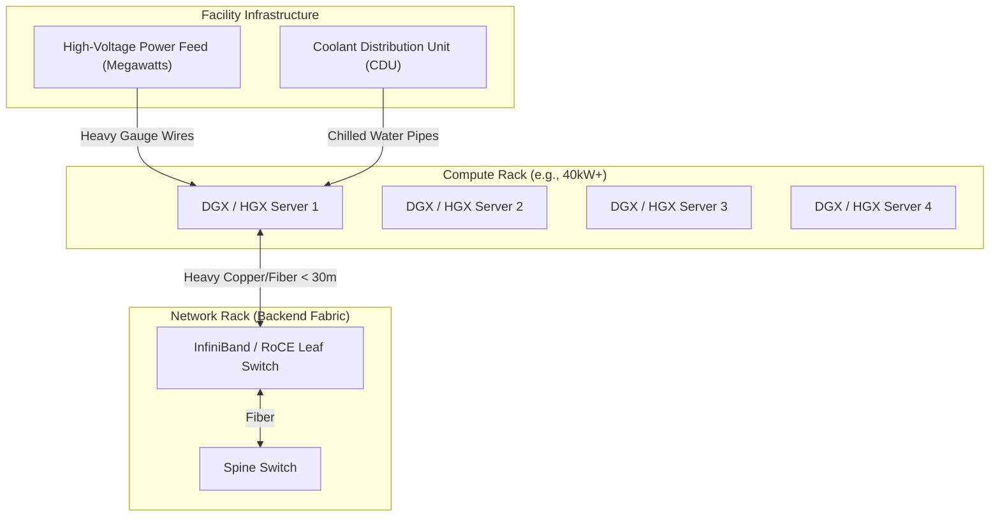

# Chapter 6 — The Modern AI Factory: Power, Cooling, and Facility Scale

| Chapter metadata | Value |
|---|---|
| Volume | 01 — AI Infrastructure Foundations |
| Difficulty | Advanced |
| Estimated reading time | 35 minutes |
| Primary audience | DevOps, SRE, Platform, Cloud and Infrastructure Engineers |
| Core question | If software and networking are perfect, why do massive AI deployments still fail at the physical facility layer? |

## Introduction (The "Why")

Software engineers are used to thinking of infrastructure as infinite. If you need more capacity in AWS, you click a button, and 100 virtual machines appear. 

In the world of AI Infrastructure, the cloud is an illusion. The physical realities of electricity, heat dissipation, and fiber optic cable lengths impose brutal constraints on how clusters are designed. 

A traditional enterprise data center was built to support standard CPU servers. A single rack of these servers typically consumes between 5 to 15 kilowatts (kW) of power. The facility's air conditioning is designed to blow cold air through the floor to cool 15kW of heat per rack.

The modern AI Factory shatters this paradigm. A single rack containing NVIDIA DGX H100 or GB200 systems can consume **40kW to over 120kW of power**. If you roll a 100kW AI rack into a traditional data center, it will trip the circuit breakers instantly. If the breakers survive, the servers will melt themselves within minutes because standard air conditioning cannot physically remove 100kW of heat from a two-square-foot column of air.

## Facility Constraints: The Three Pillars (The "What")

To build a DGX SuperPOD or any large-scale AI cluster, a Senior Infrastructure Engineer must validate three physical pillars before a single server is ordered.

### 1. Power Density (Kilowatts per Rack)
AI GPUs are incredibly power-dense. A single NVIDIA H100 GPU consumes 700 Watts. An 8-GPU server consumes over 10kW. When you stack 4 of these servers in a single rack, alongside the massive InfiniBand network switches required to connect them, the rack exceeds 40kW.
* **The Constraint:** Most legacy colocation facilities max out at 15-20kW per rack. To deploy AI hardware, you often must leave half the rack completely empty just to stay under the power limit.

### 2. Cooling (Air vs. Direct Liquid Cooling)
Removing 100kW of heat from a single rack using air is functionally impossible. The fans would have to spin so fast the noise would be deafening, and the air velocity would be unmanageable.
* **Rear Door Heat Exchangers (RDHx):** A radiator is attached to the back of the server rack. Chilled water flows through it, cooling the hot air as it leaves the rack.
* **Direct Liquid Cooling (DLC):** Cold plates are bolted directly onto the GPUs and CPUs inside the server. Coolant fluid flows directly over the hot silicon, capturing the heat and pumping it out to a facility heat exchanger. NVIDIA's GB200 NVL72 rack relies entirely on liquid cooling.

### 3. Cable Lengths (The Speed of Light)
In a traditional data center, if a server in Rack A needs to talk to Rack Z, the data travels over fiber optics. A few extra microseconds of latency don't matter.
In an AI Factory running synchronized training, microseconds matter. Furthermore, the active copper cables (AEC) used for ultra-high-speed backend networks (like NVLink scale-out or NDR InfiniBand) have strict physical length limits. If racks are placed too far apart in the data center, the cables cannot reach the spine switches, and the network topology collapses.

## Architectural Diagram: The AI Factory Layout

## The NVIDIA DGX SuperPOD (The "How")

NVIDIA does not just sell GPUs; they sell the blueprint for the entire AI Factory, known as the **DGX SuperPOD**.

A SuperPOD is a prescriptive, rigid architecture. It dictates exactly how many servers go in a rack, exactly how the InfiniBand cables are routed (using a Non-Blocking Fat-Tree topology), and exactly what storage systems are certified to connect to it.

By strictly standardizing the physical topology, NVIDIA guarantees that a 1,000-GPU cluster will perform exactly as expected, eliminating the endless variables and bottlenecks of custom enterprise IT designs.

### The Storage Bottleneck
In an AI Factory, storage cannot be an afterthought. If 1,000 GPUs are training an image recognition model, they will churn through petabytes of images per hour. Standard NAS (Network Attached Storage) will instantly bottleneck.
SuperPODs require parallel file systems (like Lustre, Spectrum Scale, or WEKA) equipped with **GPUDirect Storage (GDS)**. GDS allows the NVMe drives to send data directly over the network into the GPU's memory, completely bypassing the host CPU.

## Customer Scenario (Senior Level)

**The Situation:**
A CIO tells you: "We have an empty row in our existing corporate data center. We want to buy 32 NVIDIA DGX H100 servers and stack them into 4 racks (8 servers per rack) to save space. We will plug them into our existing SAN storage."

**The Senior Architect Response:**
"We cannot proceed with this design for three critical facility and architectural reasons:

1. **Power & Weight:** Eight DGX H100 servers in a single rack will draw nearly 85kW of power and weigh over 1,000 pounds. Your corporate data center floor tiles will likely collapse under the weight, and your power distribution units (PDUs) will instantly overload. We must limit the deployment to 2 or 4 servers per rack, depending on your facility's per-rack power maximums.
2. **Cooling:** Your facility utilizes standard forced-air cooling. Pushing 85kW of heat out of a single rack will overwhelm the ambient air conditioning, causing the GPUs to immediately thermal-throttle, wasting your multi-million dollar investment. We either need to space the servers out or retrofit your row with Rear Door Heat Exchangers.
3. **Storage Starvation:** Connecting these servers to your legacy SAN storage will result in massive GPU idle time. The GPUs will process data 10x faster than the SAN can deliver it over standard protocols. We must design a dedicated, high-throughput parallel storage tier attached directly to the InfiniBand backend fabric to leverage GPUDirect Storage."

## Interview Preparation

**Conceptual:** Why can't you deploy dense AI servers in a standard enterprise data center without retrofitting? *(Hint: Power density limits and Air Cooling limits).*

**Architecture:** What is Direct Liquid Cooling (DLC), and why has it become mandatory for the latest generation of AI hardware (like the GB200)? 

**Troubleshooting:** Your Prometheus monitoring shows that GPU utilization is high, but the clock speeds of the GPUs are fluctuating wildly, dropping below base frequencies. What physical facility issue is likely occurring? *(Hint: Thermal Throttling. The facility cooling is failing to remove heat, forcing the GPUs to slow down to prevent melting).*

## Summary

Software engineers treat hardware as an abstraction. Senior AI Infrastructure Architects understand that hardware is bound by the laws of thermodynamics. Building a modern AI Factory requires profound respect for the physical facility: megawatts of power, thousands of gallons of chilled water, and meticulous cable routing. A cluster of 10,000 GPUs is only a supercomputer if the physical facility can keep the silicon powered, cooled, and fed with data at the speed of light.
