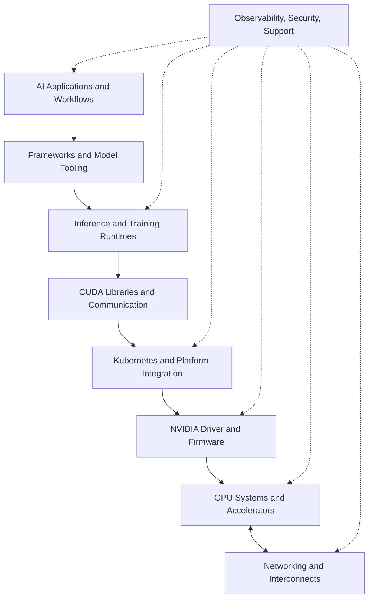
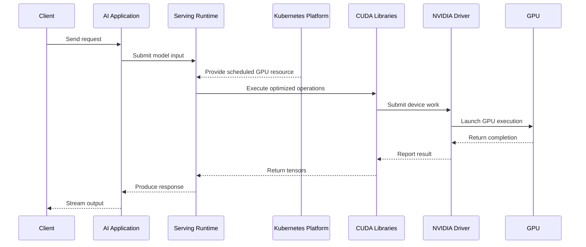

# NVIDIA Ecosystem Overview

## Introduction

NVIDIA is often introduced as a GPU company. That description is historically understandable, but architecturally incomplete. A production AI platform depends on far more than a processor. It requires a complete path from application frameworks to runtime libraries, drivers, interconnects, systems, orchestration, observability, and enterprise support.

The NVIDIA ecosystem exists because accelerated computing only delivers value when every layer cooperates. A fast GPU cannot compensate for an incompatible driver. A high-bandwidth fabric cannot help a workload that is scheduled on the wrong topology. A well-optimized inference engine cannot serve production traffic safely without orchestration, monitoring, and lifecycle management.

This chapter builds a map of the NVIDIA ecosystem. The goal is not to memorize product names. The goal is to understand the responsibility of each layer, how the layers interact, and where infrastructure engineers must make architectural decisions.

| Chapter field | Value |
|---|---|
| Volume | 01 - AI Infrastructure Foundations |
| Difficulty | Foundation |
| Estimated reading time | 40 minutes |
| Primary focus | NVIDIA ecosystem layers and responsibilities |
| Previous chapter | Modern AI Factory |
| Next chapter | Enterprise AI Platforms |

## Story

A financial-services company purchases a group of GPU servers for an internal generative AI program. The procurement team considers the project complete when the hardware arrives. The platform team then discovers that the operating system image is not aligned with the required driver branch. The Kubernetes team has no GPU runtime integration. The application team expects an inference endpoint, but no serving runtime has been selected. The operations team cannot see GPU errors or utilization. Security asks how software will be patched and supported.

The problem is not that any individual component is missing by accident. The problem is that the organization treated the GPU as a standalone product instead of one layer in an ecosystem. A senior architect responds by drawing the entire stack and assigning responsibility for each layer. Once the ecosystem is visible, the deployment plan becomes an engineering program rather than a hardware installation.

## Learning Objectives

After completing this chapter, you will be able to:

- Describe the major layers of the NVIDIA ecosystem.
- Explain how hardware, networking, system software, orchestration, and application runtimes interact.
- Distinguish between NVIDIA systems, platforms, libraries, and services.
- Identify which layers are owned by infrastructure, platform, and application teams.
- Explain why lifecycle compatibility is a system-level concern.

## Big Picture

The NVIDIA ecosystem can be viewed as a layered architecture. Each layer solves a different problem, and each depends on the layers beneath it.

**Figure 1.7.1 - NVIDIA ecosystem layers.** Applications depend on frameworks, runtimes, libraries, platform integration, drivers, hardware, and fabric. Operations and governance span the full stack.

The stack should not be interpreted as a strict one-vendor boundary. Many layers include open-source projects, third-party frameworks, cloud services, and OEM platforms. NVIDIA's role is to provide or optimize key pieces of the accelerated-computing path and ensure they work together across supported configurations.

## Deep Explanation

### Hardware and systems

At the base of the ecosystem are accelerators and systems. Individual GPUs provide compute and memory. GPU platforms such as HGX define a server-level building block. Integrated systems such as DGX combine GPUs, CPUs, memory, interconnects, networking, storage interfaces, firmware, and management into a validated system design.

Infrastructure engineers should distinguish between a GPU product and a complete system architecture. The GPU determines important compute and memory characteristics. The system determines topology, power, cooling, CPU attachment, NIC placement, storage access, management interfaces, and serviceability.

### Interconnect and networking

AI workloads move large amounts of data. NVIDIA therefore treats data movement as a first-class part of the ecosystem. PCIe connects devices to host systems. NVLink and NVSwitch provide high-bandwidth GPU-to-GPU communication within supported designs. ConnectX adapters, InfiniBand, Ethernet, Spectrum switches, and BlueField data processing units support node-to-node and infrastructure communication.

The correct fabric depends on workload requirements. A single-node inference server has different communication needs from a multi-rack training cluster. The ecosystem provides options; architecture determines which option is appropriate.

### System software

The system software layer includes the NVIDIA driver, CUDA runtime and toolkit, communication libraries, math libraries, management libraries, and container integration. This layer translates application intent into device execution.

Compatibility matters here. The application framework, CUDA libraries, container image, host driver, firmware, and hardware must form a supported path. Teams that manage each layer independently without a compatibility policy often create fragile platforms.

### Platform integration

In containerized environments, the GPU must become a schedulable and observable resource. NVIDIA Container Toolkit integrates GPU access with container runtimes. The Kubernetes device plugin advertises GPU resources. GPU Operator automates deployment and lifecycle management of several GPU software components. Node Feature Discovery and GPU Feature Discovery expose hardware capabilities and labels for scheduling.

These components do not replace Kubernetes. They extend the platform so that Kubernetes can understand and manage accelerator resources.

### Application and model runtimes

Above the infrastructure layer are frameworks and runtimes. Training workloads may use PyTorch, JAX, TensorFlow, NCCL, and distributed-training libraries. Inference workloads may use TensorRT, TensorRT-LLM, Triton Inference Server, NVIDIA NIM, vLLM, or other serving systems.

The runtime layer converts models into executable work and determines batching, memory management, concurrency, model placement, and request scheduling. Infrastructure performance cannot be understood without considering these runtime decisions.

## Ecosystem Responsibility Map

| Layer | Representative technologies | Primary responsibility |
|---|---|---|
| Application | Assistants, RAG, vision, recommendation | Business workflow and user experience |
| Framework | PyTorch, JAX, TensorFlow, NeMo | Model development and training logic |
| Runtime | Triton, TensorRT, TensorRT-LLM, NIM | Efficient execution and serving |
| Libraries | CUDA, cuBLAS, cuDNN, NCCL | Compute primitives and communication |
| Platform | GPU Operator, device plugin, Container Toolkit | Scheduling and container integration |
| System software | Driver, firmware, management libraries | Device control and compatibility |
| Systems | GPU, DGX, HGX, OEM platforms | Physical compute and topology |
| Fabric | NVLink, InfiniBand, Ethernet, ConnectX, BlueField | Data movement inside and between systems |
| Operations | DCGM, telemetry, support lifecycle | Health, observability, and maintenance |

The table is a map, not a purchasing checklist. Not every architecture requires every product. The architect selects the smallest complete set that satisfies workload, reliability, security, and operational requirements.

## Internal Working

Consider a model-serving request running on Kubernetes. The request passes through application and runtime layers before reaching the GPU. The platform and system software layers make the device available and translate runtime calls into hardware execution.

**Figure 1.7.2 - Request execution across ecosystem layers.** A serving request depends on coordination between application, runtime, platform, libraries, driver, and hardware.

A failure at any point can appear as an application symptom. A driver mismatch may surface as a container startup failure. A scheduling error may look like missing capacity. A network problem may appear as an NCCL timeout. A memory-management problem may appear as slow inference. Troubleshooting therefore requires a layered mental model.

## Architecture

### Compatibility as an architectural concern

Compatibility should be managed as a tested platform profile, not as a collection of independent version choices. A profile might define the operating system, driver branch, firmware baseline, container runtime, CUDA compatibility target, Kubernetes version, GPU Operator version, monitoring stack, and approved workload images.

The profile should be validated before production rollout. Updates should move through development, staging, canary, and production phases with rollback criteria.

### Standardization and choice

The ecosystem offers many options, but unlimited choice creates operational cost. Enterprises should standardize a small number of supported patterns. For example, one profile may serve latency-sensitive inference, another multi-node training, and another research workloads.

Standardization improves troubleshooting, capacity planning, patching, security review, and supportability. Exceptions should be deliberate and documented.

### Ownership boundaries

A strong operating model defines who owns each layer. Infrastructure teams may own physical systems, firmware, networking, and base operating systems. Platform teams may own Kubernetes, GPU Operator, quotas, scheduling, and observability. Application teams may own models, serving configuration, request-level metrics, and quality evaluation. Shared architecture reviews connect these responsibilities.

## Production Deployment

A production ecosystem rollout should proceed as an integrated lifecycle:

1. **Define workload profiles.** Identify training, inference, batch, and research requirements.
2. **Select system architecture.** Choose GPU class, node design, topology, network, storage, power, and cooling.
3. **Define the software baseline.** Establish operating system, driver, firmware, CUDA, runtime, and orchestration versions.
4. **Validate the node.** Verify hardware health, topology, driver loading, CUDA execution, and network performance.
5. **Integrate the platform.** Deploy container integration, Kubernetes components, scheduling labels, and observability.
6. **Validate representative workloads.** Test actual training or inference paths rather than only `nvidia-smi`.
7. **Operationalize.** Add alerts, upgrade procedures, support escalation, capacity reporting, and incident runbooks.

:::warning Production mistake
A green `nvidia-smi` output proves that the driver can see the device. It does not prove that the complete AI platform is production-ready.
:::

## Production Troubleshooting

### Problem: A container sees no GPU even though the host does

| Layer | Diagnostic question | Example signal |
|---|---|---|
| Hardware | Is the GPU visible to the host? | `nvidia-smi` succeeds |
| Driver | Is the correct kernel module loaded? | Driver modules present |
| Runtime integration | Is the container runtime configured for NVIDIA devices? | Toolkit configuration exists |
| Kubernetes | Is the device plugin healthy? | GPU resource advertised on the node |
| Workload | Did the pod request the GPU resource? | Resource limit is present |

The root cause is often not the GPU itself. It may be missing runtime configuration, a failed device plugin, an invalid RuntimeClass, or a pod specification that never requested a GPU.

### Problem: A distributed workload times out

The symptom may appear in NCCL, but the investigation must cross multiple layers: process launch, GPU topology, NIC placement, RDMA configuration, fabric health, routing, security policy, and collective configuration. The ecosystem map prevents teams from treating every timeout as an application bug.

## Customer Scenario

A customer asks, “Which NVIDIA products do we need for a private AI platform?” A weak answer lists products. A strong answer begins with workloads, scale, latency, data location, security, support, and operating model.

For a small internal inference platform, the design may require a modest number of GPU nodes, standard Ethernet, Kubernetes integration, an inference runtime, and basic observability. For a large distributed-training environment, the design may require integrated GPU systems, high-performance fabric, topology-aware scheduling, parallel storage, advanced telemetry, and a stricter compatibility and support lifecycle.

The ecosystem provides building blocks. Architecture determines the composition.

## Interview Preparation

### Conceptual Questions

1. Why is NVIDIA better understood as an accelerated-computing ecosystem rather than only a GPU vendor?
2. What is the difference between a GPU, an HGX platform, and a DGX system?
3. Why do driver and runtime compatibility belong in architecture discussions?

### Architecture Questions

1. Draw the NVIDIA ecosystem from application to hardware.
2. Define ownership boundaries for infrastructure, platform, and application teams.
3. Design a compatibility profile for a Kubernetes GPU platform.

### Scenario Questions

1. The host sees the GPU, but the pod does not. Which ecosystem layers do you inspect?
2. A customer wants both training and inference. Should both use one platform profile?
3. A driver upgrade causes workload failures. How should the lifecycle have been designed?

## Summary

The NVIDIA ecosystem is a layered accelerated-computing architecture. Hardware, interconnects, networking, drivers, CUDA libraries, orchestration components, runtimes, observability, and support must operate as one system.

The purpose of the ecosystem map is not memorization. It is diagnosis and design. When engineers understand the responsibility of each layer, they can select appropriate components, define ownership, manage compatibility, and troubleshoot failures without jumping immediately to the GPU.

## Key Takeaways

- NVIDIA AI infrastructure spans hardware, networking, software, platforms, runtimes, and operations.
- A complete system is more important than any isolated component.
- Compatibility should be managed through validated platform profiles.
- Kubernetes GPU integration extends the platform; it does not replace core Kubernetes responsibilities.
- Product selection must follow workload and operational requirements.

## Cross References

- Previous: [Modern AI Factory](./chapter-06-modern-ai-factory)
- Next: [Enterprise AI Platforms](./chapter-08-enterprise-ai-platforms)
- Related lab: [Trace an AI Request Through the Infrastructure Stack](./labs/lab-02-trace-an-ai-request-path)
