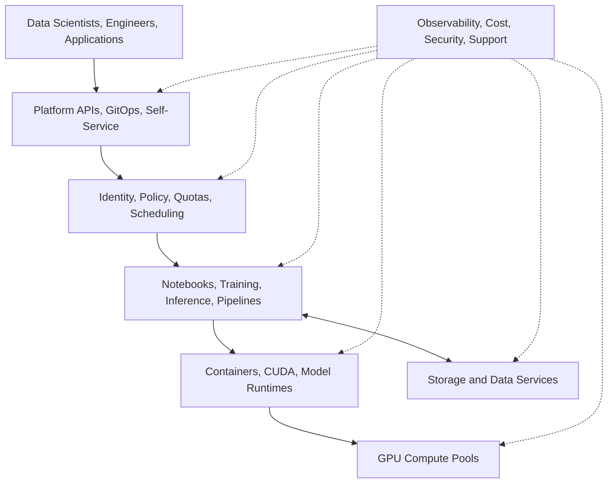
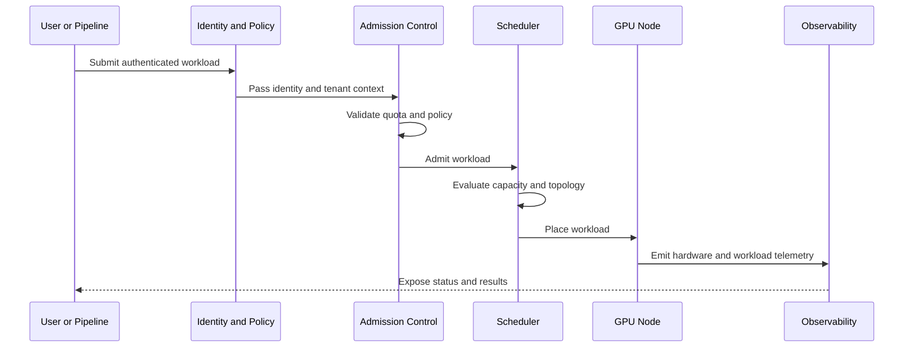

# Enterprise AI Platforms

## Introduction

A GPU cluster is not automatically an enterprise AI platform. A cluster provides compute capacity. A platform provides a controlled path for many teams to access that capacity safely, repeatedly, and with clear operational ownership.

Enterprises need more than model execution. They need identity, tenancy, policy, quotas, deployment standards, observability, upgrade processes, cost reporting, support boundaries, and recovery procedures. These concerns often determine whether an AI program can move beyond a pilot.

This chapter explains the architectural transition from isolated GPU systems to a shared enterprise AI platform. The focus is not a single product. The focus is the capability model required to serve research, training, batch inference, and real-time inference under production constraints.

| Chapter field | Value |
|---|---|
| Volume | 01 - AI Infrastructure Foundations |
| Difficulty | Foundation |
| Estimated reading time | 45 minutes |
| Primary focus | Enterprise platform capabilities and operating model |
| Previous chapter | NVIDIA Ecosystem Overview |
| Next chapter | Volume 01 Summary |

## Story

A global manufacturer has four AI teams. One team develops computer-vision models. Another builds a private assistant. A third runs forecasting jobs. A fourth experiments with robotics simulation. Each team initially receives dedicated GPU servers.

Within months, utilization is uneven. One team is blocked while another has idle GPUs. Driver versions diverge. Security reviews are repeated for every project. Monitoring is inconsistent. Nobody can provide a reliable cost per workload. Upgrades are avoided because ownership is unclear.

The organization did not fail because it bought the wrong GPUs. It failed because it provided infrastructure without a platform. The solution is to create a shared service with standardized environments, workload isolation, scheduling policies, telemetry, and lifecycle management.

## Learning Objectives

After completing this chapter, you will be able to:

- Distinguish a GPU cluster from an enterprise AI platform.
- Identify the control, governance, reliability, and operations capabilities a platform requires.
- Explain how multi-tenancy changes scheduling, security, and observability.
- Design workload zones for research, training, batch inference, and real-time inference.
- Describe a phased enterprise AI platform rollout.

## Big Picture

An enterprise AI platform sits between users and physical infrastructure. It converts raw capacity into governed services.

**Figure 1.8.1 - Enterprise AI platform architecture.** The platform provides self-service, control, workload services, runtime integration, compute, data access, and cross-cutting operations.

The platform creates a stable contract. Users request capabilities. The platform decides where workloads run, which policies apply, how resources are measured, and what operational guarantees exist.

## Why Infrastructure Alone Is Insufficient

Infrastructure answers questions such as:

- Which GPUs are installed?
- How are nodes connected?
- Which storage system is available?
- Which driver is loaded?

A platform must answer additional questions:

- Who may use the GPUs?
- Which workloads receive priority?
- How are teams isolated?
- How are environments reproduced?
- How are failures detected and escalated?
- How are costs attributed?
- How are upgrades validated and rolled back?

Without these answers, the environment remains a collection of systems rather than a service.

## Capability Model

| Capability domain | Platform responsibility | Failure when absent |
|---|---|---|
| Access | Identity, authentication, authorization | Uncontrolled or manual access |
| Scheduling | Placement, priority, fairness, topology awareness | Idle capacity beside blocked users |
| Isolation | Tenant, process, memory, network, data boundaries | Security and noisy-neighbor risk |
| Environment | Images, dependencies, runtime profiles | Configuration drift |
| Delivery | GitOps, CI/CD, model deployment patterns | Slow and inconsistent releases |
| Observability | Metrics, logs, events, traces, health | Long incident diagnosis |
| Governance | Policy, audit, approvals, data controls | Enterprise risk cannot be managed |
| Economics | Utilization, showback, chargeback, forecasting | Costs cannot be explained |
| Lifecycle | Patching, upgrades, compatibility, rollback | Fragile production operations |
| Support | Ownership, escalation, runbooks, SLOs | Incidents bounce between teams |

The platform is complete only when these capabilities work together. A polished self-service portal does not compensate for weak scheduling or missing recovery procedures.

## Internal Working

A workload request moves through several control points before it reaches a GPU.

**Figure 1.8.2 - Enterprise workload admission and placement.** Identity, policy, quota, admission, scheduling, and observability form one control path.

This path is important during failure analysis. A pending workload may not indicate a lack of GPUs. It may be blocked by quota, node labels, topology constraints, image pull failures, policy, or fragmented capacity.

## Workload Zones

Different workload classes require different operational behavior.

| Zone | Primary objective | Typical characteristics |
|---|---|---|
| Research | Flexibility and iteration speed | Interactive notebooks, variable demand, broad tool choice |
| Training | Throughput and scale | Long-running jobs, topology sensitivity, checkpointing |
| Batch inference | Cost efficiency | Queue-based work, flexible start time, high utilization |
| Real-time inference | Predictable latency and availability | Reserved capacity, autoscaling, SLOs, controlled releases |
| Platform services | Reliability | Monitoring, registries, controllers, gateways |

A single physical cluster may host multiple zones, but the policies should remain explicit. Larger environments often use separate node pools or clusters to reduce interference and simplify lifecycle management.

## Multi-Tenancy

Multi-tenancy is not one feature. It is a combination of boundaries.

### Resource isolation

MIG can partition supported GPUs into hardware-isolated instances. Time slicing can improve concurrency but offers different isolation characteristics. Dedicated GPUs provide stronger resource boundaries at higher cost. The correct choice depends on workload sensitivity, performance predictability, and utilization goals.

### Platform isolation

Namespaces, RBAC, quotas, admission policies, network policies, secrets management, and workload identities define tenant boundaries at the orchestration layer.

### Data isolation

Storage permissions, encryption, data classification, lineage, and egress controls determine which data a workload can access. GPU isolation does not protect data by itself.

### Operational isolation

Teams need separate dashboards, budgets, alerts, deployment permissions, and support expectations. A shared cluster without operational boundaries becomes difficult to govern.

:::note
Multi-tenancy is a risk model. The architecture should state which resources are shared, which are isolated, and which residual risks remain.
:::

## Architecture Trade-Offs

### Shared cluster versus dedicated clusters

| Consideration | Shared platform | Dedicated environment |
|---|---|---|
| Utilization | Usually higher | Capacity may remain idle |
| Isolation | Requires strong controls | Simpler boundary |
| Operations | Centralized but complex | Repeated across environments |
| Flexibility | Standardized | Team-specific choices |
| Cost attribution | Requires telemetry | Easier at environment level |
| Upgrade impact | Larger blast radius | Smaller blast radius |

Neither model is universally correct. Many enterprises use a hybrid design: shared pools for common workloads and dedicated environments for highly regulated, latency-sensitive, or exceptionally large workloads.

### Flexibility versus supportability

Every additional driver version, framework image, runtime, and deployment pattern increases support cost. The platform should offer paved roads: validated configurations that are easy to consume and operate. Experimental paths can exist, but they should have different support expectations.

## Production Deployment

A practical rollout can be divided into stages.

### Stage 1: Establish a validated foundation

Create a supported hardware and software baseline. Validate GPU health, networking, storage, drivers, container runtime, orchestration, and telemetry.

### Stage 2: Launch one paved workload path

Choose one use case, such as internal inference or single-node training. Provide standard images, deployment templates, access control, metrics, and a support process.

### Stage 3: Add tenant and capacity controls

Introduce quotas, priorities, scheduling policies, showback, and workload zones. Measure utilization and queue time before expanding capacity.

### Stage 4: Operationalize lifecycle management

Define upgrade rings, compatibility testing, rollback, maintenance windows, incident ownership, and service-level objectives.

### Stage 5: Scale adoption

Expand self-service, automation, workload profiles, disaster recovery, compliance evidence, and financial governance.

The first release should be intentionally narrow. A small supported platform is more valuable than a broad platform that cannot be operated reliably.

## Observability and SLOs

An enterprise platform requires layered telemetry.

| Layer | Example signals |
|---|---|
| User experience | Request latency, job completion, error rate |
| Workload | Queue time, throughput, batch size, checkpoint duration |
| Platform | Pending pods, scheduling failures, quota denials, controller health |
| Runtime | Model load time, memory use, cache behavior, worker health |
| GPU | Utilization, memory, power, thermals, ECC, XID events |
| Fabric | Throughput, errors, congestion, RDMA health |
| Storage | Read/write throughput, metadata latency, capacity |

Service-level objectives should be defined around user outcomes, not only component health. A platform can have healthy nodes while users experience long queue times or unstable inference latency.

## Production Troubleshooting

### Problem: Teams report that the cluster has free GPUs, but workloads remain pending

Possible causes include quota restrictions, mismatched resource requests, topology constraints, taints, node selectors, unavailable MIG profiles, fragmented capacity, admission-policy rejection, or image failures.

A useful diagnosis order is:

1. Read the workload event stream.
2. Confirm quota and admission decisions.
3. Inspect requested GPU resources and profiles.
4. Check node allocatable capacity and labels.
5. Evaluate topology and placement constraints.
6. Verify runtime and image readiness.

### Problem: One tenant degrades another tenant's inference latency

The root cause may be shared GPU execution, CPU contention, storage contention, network saturation, or unbounded request queues. Resolution may require dedicated capacity, MIG, stricter limits, workload separation, admission control, or independent autoscaling.

## Customer Scenario

A bank wants a private AI platform for regulated document processing, internal assistants, and fraud-model training. The platform must support strong access control, data residency, auditability, and predictable operations.

The recommended design begins with separate workload zones. Real-time assistant services receive reserved inference capacity and controlled release pipelines. Training uses a separate pool with checkpointing and high-throughput data access. Research receives constrained self-service environments. Identity, policy, audit, secrets, monitoring, and cost reporting span all zones.

The platform is evaluated not only by GPU performance but by how quickly a team can move from an approved use case to a supported production service.

## Interview Preparation

### Conceptual Questions

1. What is the difference between a GPU cluster and an enterprise AI platform?
2. Why is multi-tenancy more than namespace separation?
3. What is a paved road, and why does it matter?

### Architecture Questions

1. Design workload zones for research, training, batch inference, and real-time inference.
2. Compare shared and dedicated GPU environments.
3. Define an observability model for a multi-tenant AI platform.

### Scenario Questions

1. GPUs appear free, but jobs remain pending. How do you investigate?
2. One tenant causes latency spikes for another. Which isolation layers do you review?
3. A customer requests unlimited framework and driver choice. How do you balance flexibility and supportability?

## Summary

An enterprise AI platform converts GPU infrastructure into a governed service. It provides access control, scheduling, isolation, reproducible environments, deployment patterns, observability, financial accountability, lifecycle management, and support.

The platform should be designed around workload classes and user outcomes. Research, training, batch inference, and real-time inference require different policies. Multi-tenancy requires explicit resource, platform, data, and operational boundaries.

## Key Takeaways

- A GPU cluster provides capacity; a platform provides a controlled service.
- Enterprise readiness depends on governance, operations, and lifecycle management.
- Workload zones reduce interference and clarify service expectations.
- Multi-tenancy requires multiple layers of isolation.
- Standardized paved roads improve reliability and supportability.
- Platform success should be measured through user-facing outcomes and SLOs.

## Cross References

- Previous: [NVIDIA Ecosystem Overview](./chapter-07-nvidia-ecosystem-overview)
- Next: [Volume 01 Summary](./chapter-09-volume-01-summary)
- Related lab: [Trace an AI Request Through the Infrastructure Stack](./labs/lab-02-trace-an-ai-request-path)
