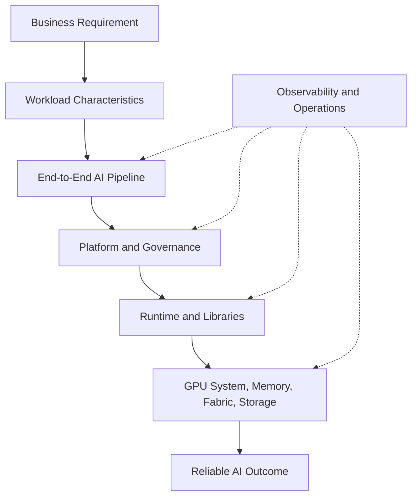
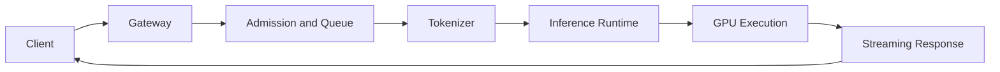
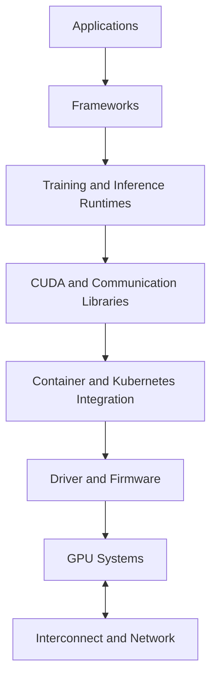
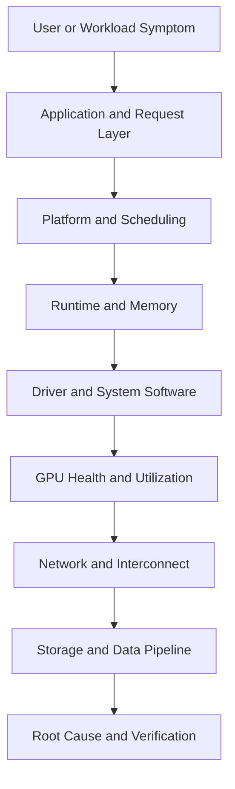

# Volume 01 Summary

## Introduction

Volume 01 established the mental model required for the rest of the bootcamp. The purpose was not to memorize NVIDIA products or deployment commands. It was to understand why AI infrastructure exists, how modern AI workloads differ from conventional applications, and why successful systems must be designed as complete production platforms.

The central lesson is simple: AI performance is a system property. GPUs are essential, but they operate inside a larger path that includes CPUs, memory, storage, networking, drivers, runtimes, schedulers, data pipelines, observability, security, and operations.

This summary consolidates the major architectural ideas from the volume and provides a revision framework before Volume 02 begins the deep study of GPU architecture.

| Chapter field | Value |
|---|---|
| Volume | 01 - AI Infrastructure Foundations |
| Difficulty | Foundation |
| Estimated reading time | 30 minutes |
| Primary focus | Consolidation and architecture revision |
| Previous chapter | Enterprise AI Platforms |
| Next volume | GPU Architecture |

## The Foundation Story

Imagine an enterprise that purchases powerful GPU systems but continues to treat them like ordinary servers. Teams install software manually, choose incompatible versions, move data through slow paths, schedule workloads without topology awareness, and monitor only host CPU and memory.

The organization will own expensive hardware without owning an AI platform. Users will see long queues, inconsistent performance, failed deployments, and unclear operational boundaries. The lesson from this volume is that accelerated computing changes the full infrastructure design, not only the processor.

## Core Mental Model

**Figure 1.9.1 - Foundation architecture model.** Good AI architecture begins with requirements and workload behavior, then designs the complete platform, runtime, system, and operating model.

Technology selection comes after the workload is understood. This protects architects from recommending hardware or software before they know the performance target, data path, scale, reliability requirement, security boundary, and operational constraints.

## What AI Infrastructure Solves

AI infrastructure exists to execute data-intensive parallel workloads efficiently and repeatedly. It must solve several problems at once:

- provide specialized compute for tensor and matrix operations;
- move model weights, activations, datasets, and results efficiently;
- expose accelerators safely to containers and schedulers;
- coordinate work across devices and nodes;
- isolate tenants and control capacity;
- monitor hardware and application behavior;
- recover from expected failures;
- maintain compatibility through upgrades.

A platform that solves only compute is incomplete. A platform that solves compute but cannot be upgraded, observed, or shared safely is not production-ready.

## Why CPUs Became Insufficient

CPUs remain essential. They handle operating systems, control flow, scheduling, preprocessing, orchestration, networking, and many latency-sensitive tasks. The issue is not that CPUs are obsolete. The issue is that massively parallel numerical workloads require a different execution architecture.

| CPU strength | GPU strength |
|---|---|
| Complex control flow | Large-scale parallel arithmetic |
| Low-latency serial work | High-throughput repeated operations |
| General system execution | Tensor and vector computation |
| Branch-heavy workloads | Regular data-parallel workloads |

The correct architecture is heterogeneous. CPUs and GPUs cooperate. Performance depends on assigning work to the correct processor and minimizing inefficient data movement between them.

## What Happens During an AI Request

A request to a large language model passes through many stages: authentication, routing, queueing, tokenization, model scheduling, memory allocation, GPU execution, token generation, and response streaming. Each stage can add latency or cause failure.

**Figure 1.9.2 - Simplified inference request path.** User-visible latency is the sum of multiple infrastructure and runtime stages, not only GPU execution time.

This leads to an important troubleshooting principle: low GPU utilization does not automatically mean the GPU is too slow. The workload may be waiting on CPU preprocessing, storage, networking, request batching, scheduling, or application logic.

## The AI Infrastructure Landscape

The landscape can be grouped into interacting domains:

| Domain | Responsibility |
|---|---|
| Hardware | GPU, CPU, memory, storage, NICs, power, cooling |
| Interconnect | PCIe, NVLink, network fabric, RDMA paths |
| System software | Driver, firmware, CUDA, libraries |
| Platform | Containers, Kubernetes, scheduling, operators |
| Runtime | Training and inference execution |
| Data | Datasets, checkpoints, models, vector stores |
| Governance | Identity, policy, audit, quotas |
| Operations | Metrics, logs, alerts, upgrades, incidents |

Most production failures occur at boundaries between these domains. A storage problem appears as low GPU utilization. A driver problem appears as a container failure. A scheduling problem appears as missing capacity. A network problem appears as a distributed runtime timeout.

## The AI Factory Model

The AI factory describes repeatable delivery rather than one-time deployment. It converts data and requirements into trained models, inference services, predictions, assistants, or automated decisions through a controlled lifecycle.

The factory requires:

- standardized input and data access;
- repeatable development environments;
- validated training and inference paths;
- evaluation and approval gates;
- controlled deployment and rollback;
- monitoring and feedback;
- maintenance and capacity planning.

A single successful model is a project. A reusable path that supports many models and teams is a platform. A repeatable operating model that continuously produces AI outcomes is an AI factory.

## The NVIDIA Ecosystem Model

The NVIDIA ecosystem spans multiple layers. The GPU is the execution engine, but value depends on the complete accelerated-computing path.

**Figure 1.9.3 - NVIDIA ecosystem revision model.** Each layer has a separate responsibility and compatibility relationship.

The architect must avoid product-list thinking. Not every workload needs every technology. Selection begins with workload requirements and ends with the smallest complete, supportable architecture.

## Enterprise Platform Model

A GPU cluster becomes an enterprise platform when it provides a stable service contract. Users need predictable access, supported environments, clear policies, observable workloads, and defined support.

The platform must provide:

- identity and access control;
- quotas, priorities, and fair scheduling;
- resource, data, and network isolation;
- validated images and runtime profiles;
- self-service interfaces and GitOps workflows;
- metrics, logs, events, and cost reporting;
- upgrade, rollback, and maintenance processes;
- incident ownership and service objectives.

Research, training, batch inference, and real-time inference should not automatically receive the same policies. Workload zones allow the platform to optimize each class appropriately.

## Architecture Principles Reinforced

### Understand the workload first

Do not recommend hardware until the workload is described in terms of model size, precision, latency, throughput, concurrency, data volume, communication pattern, reliability, and growth.

### Minimize data movement

Compute is valuable only when data reaches it efficiently. Memory bandwidth, locality, storage paths, host-to-device transfer, and inter-node communication can determine overall performance.

### Optimize the entire pipeline

The slowest stage limits the system. Improving GPU compute does not help when requests are blocked in preprocessing, queueing, network transfer, or storage.

### Observe every layer

Metrics must connect user outcomes to application, runtime, platform, GPU, fabric, and storage behavior. Component health alone is not enough.

### Design for failure and lifecycle

GPUs, nodes, networks, drivers, firmware, controllers, and operators will fail or require maintenance. Recovery, upgrades, rollback, and compatibility testing belong in the original architecture.

### Explain trade-offs

There is no universal best architecture. Shared versus dedicated clusters, Ethernet versus InfiniBand, MIG versus time slicing, cloud versus bare metal, and flexibility versus standardization all depend on constraints.

## Quick Revision Sheet

| Question | Foundation answer |
|---|---|
| Why do AI workloads need GPUs? | They expose large amounts of parallel numerical work that GPUs execute efficiently. |
| Is GPU performance only compute? | No. Memory, data movement, runtime behavior, and the full pipeline matter. |
| What is AI infrastructure? | The complete system that executes, serves, governs, observes, and operates AI workloads. |
| What is an AI factory? | A repeatable operating model for turning data and compute into production AI outcomes. |
| What is the NVIDIA ecosystem? | A layered accelerated-computing stack spanning systems, fabric, software, platforms, and runtimes. |
| What makes a platform enterprise-ready? | Governance, multi-tenancy, lifecycle, observability, support, and predictable service delivery. |
| Where should architecture begin? | Business requirements and workload characteristics. |

## Production Troubleshooting Framework

When an AI workload is slow or unavailable, investigate from the user symptom downward.

**Figure 1.9.4 - Layered troubleshooting path.** Start from the observed symptom, follow the request path, test each layer, and verify the resolution.

Do not jump directly to hardware replacement. Begin with evidence: events, logs, metrics, topology, resource requests, queue behavior, and representative workload tests.

## Architecture Review Questions

Before approving an AI infrastructure design, ask:

1. What exact workload is being served?
2. Which metric defines success: latency, throughput, time-to-train, utilization, cost, or availability?
3. Where does data originate, and how does it reach the GPU?
4. Which components are stateful?
5. Which resources are shared across tenants?
6. What happens when a GPU, node, switch, or controller fails?
7. How will firmware, drivers, runtimes, and Kubernetes be upgraded?
8. Which metrics identify bottlenecks across layers?
9. What is the capacity and cost model?
10. Which assumptions would invalidate the design?

## Interview Preparation

### Conceptual Questions

1. Why is AI performance a system property?
2. Why should CPUs and GPUs be treated as complementary?
3. What separates an AI project from an AI factory?
4. Why is `nvidia-smi` insufficient as platform validation?

### Architecture Questions

1. Draw the end-to-end path of an inference request.
2. Draw a layered enterprise AI platform.
3. Define workload zones for a shared GPU environment.
4. Explain how NVIDIA ecosystem layers interact.

### Scenario Questions

1. GPU utilization is low. Build an investigation plan.
2. The host sees a GPU, but Kubernetes does not. Which layers do you inspect?
3. A customer has many AI pilots but no production services. What platform capabilities are missing?
4. A customer asks which GPU to buy without describing the workload. How do you respond?

## Lab Checklist

Before continuing, confirm that you can:

- describe the host, driver, runtime, and GPU relationship;
- trace an AI request through application and infrastructure layers;
- identify likely bottlenecks outside the GPU;
- explain the difference between a GPU cluster and a platform;
- draw the NVIDIA ecosystem as a layered architecture;
- describe how production monitoring spans multiple layers.

Complete the two Volume 01 labs if any of these areas remain unclear.

## Preparing for Volume 02

Volume 02 moves inside the GPU. It will explain streaming multiprocessors, execution units, warps, thread blocks, scheduling, registers, shared memory, caches, global memory, HBM, occupancy, and instruction dispatch.

The foundation from this volume remains essential. GPU architecture should not be studied as isolated silicon. Every internal feature exists to solve a workload problem, and its production value depends on the system surrounding it.

## Key Takeaways

- AI infrastructure is an end-to-end production system.
- GPUs solve massively parallel compute problems but remain dependent on CPU, memory, data, and control paths.
- AI performance must be analyzed across the complete pipeline.
- The NVIDIA ecosystem is layered and must be managed as a compatible system.
- Enterprise platforms add governance, isolation, observability, lifecycle, and support.
- Architecture begins with workload requirements and explicit trade-offs.
- Volume 02 will explain how GPU hardware executes the work introduced here.

## Cross References

- Previous: [Enterprise AI Platforms](./chapter-08-enterprise-ai-platforms)
- Lab 01: [Inspect an AI Infrastructure Host](./labs/lab-01-inspect-an-ai-infrastructure-host)
- Lab 02: [Trace an AI Request Through the Infrastructure Stack](./labs/lab-02-trace-an-ai-request-path)
