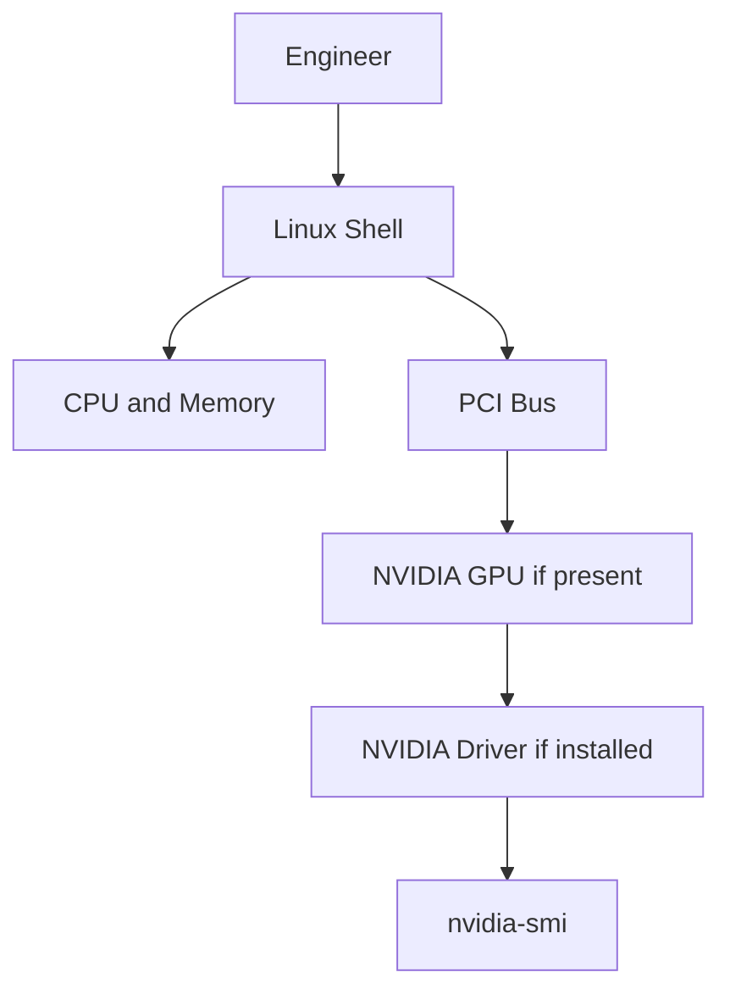

# Lab 01 — Inspect an AI Infrastructure Host

```yaml
Title: Inspect an AI Infrastructure Host
Volume: 01
Chapter: 01-03
Difficulty: Beginner
Estimated Time: 45 Minutes
Prerequisites: Linux shell access
Target Platform: Ubuntu or compatible Linux host
Target Audience: DevOps, SRE, Platform, Cloud, and AI Infrastructure Engineers
Lab Type: Exploration
```

## Objective

Inspect a Linux host and identify the signals that matter before deploying AI workloads.

This lab does not require a GPU.

A host without a GPU is still useful because it teaches what information is present, what information is missing, and which commands become important once NVIDIA hardware is introduced.

## Background

AI infrastructure troubleshooting begins with inspection.

Before installing drivers, deploying Kubernetes operators, or running models, an engineer must understand the host.

The questions are simple:

- What CPU topology exists?
- How much memory is available?
- What PCI devices are present?
- Is NVIDIA hardware visible?
- Is the NVIDIA driver installed?
- Can user-space tools communicate with the driver?

These questions prevent guesswork.

## Learning Outcomes

After completing this lab, you will be able to:

- Inspect CPU and memory characteristics.
- List PCI devices and identify NVIDIA devices when present.
- Check whether `nvidia-smi` is installed and functional.
- Distinguish missing hardware from missing driver tooling.
- Record host facts for later troubleshooting.

## Architecture



Figure L1.1 — Host inspection path.

## Prerequisites

You need:

- Linux shell access.
- Permission to run standard inspection commands.
- `sudo` access for optional package and kernel log checks.

A GPU is optional for this lab.

## Environment

Record your environment before starting.

| Item | Your Value |
|---|---|
| Operating system |  |
| Kernel version |  |
| CPU model |  |
| Memory |  |
| NVIDIA GPU present |  |
| NVIDIA driver present |  |
| Container runtime |  |

## Components

| Component | Why It Matters |
|---|---|
| CPU | Handles operating system, control flow, preprocessing, and scheduling. |
| System memory | Holds application data, buffers, and non-GPU workload state. |
| PCI bus | Shows attached hardware, including GPUs and NICs. |
| NVIDIA driver | Allows the operating system and user-space tools to communicate with GPUs. |
| `nvidia-smi` | Reports NVIDIA GPU and driver state when available. |

## Deployment Steps

This is an exploration lab, so there is no software deployment.

The steps collect facts.

### Step 1 — Identify the Operating System

Purpose: confirm the base operating system.

Command:

```bash
cat /etc/os-release
```

Expected output:

```text
NAME="Ubuntu"
VERSION="24.04.x LTS ..."
```

Your output may differ depending on the host.

Explanation:

AI infrastructure labs must record the operating system because driver packaging, kernel compatibility, container runtime behavior, and troubleshooting steps depend on the distribution.

Common errors:

- File missing on minimal or non-Linux systems.
- Unexpected distribution in cloud images.

### Step 2 — Inspect Kernel Version

Purpose: record the kernel version.

Command:

```bash
uname -r
```

Expected output:

```text
<kernel-version>
```

Explanation:

NVIDIA drivers are kernel modules. Kernel version matters when diagnosing driver load failures and upgrade issues.

Common errors:

- Kernel upgraded but host not rebooted.
- Driver built for a different running kernel.

### Step 3 — Inspect CPU Topology

Purpose: understand CPU capacity and NUMA layout.

Command:

```bash
lscpu
```

Expected output includes:

```text
Architecture:
CPU(s):
Thread(s) per core:
Core(s) per socket:
Socket(s):
NUMA node(s):
```

Explanation:

CPU topology matters because AI systems still rely on CPUs for tokenization, networking, storage, and orchestration. NUMA layout becomes especially important on multi-socket GPU servers.

Common errors:

- Assuming CPU count alone describes performance.
- Ignoring NUMA boundaries on multi-socket systems.

### Step 4 — Inspect Memory

Purpose: check available system memory.

Command:

```bash
free -h
```

Expected output includes:

```text
               total        used        free      shared  buff/cache   available
Mem:
Swap:
```

Explanation:

System memory pressure can slow preprocessing, model loading, container startup, and data movement. Swap usage during active AI workloads is a warning sign.

Common errors:

- Treating free memory alone as the only useful signal.
- Ignoring the available column.

### Step 5 — List PCI Devices

Purpose: identify hardware attached to the system.

Command:

```bash
lspci
```

Expected output:

```text
<PCI devices on the host>
```

Explanation:

GPUs, NICs, storage controllers, and other devices appear on the PCI bus. Before troubleshooting the NVIDIA driver, confirm whether the hardware is visible at the PCI level.

Common errors:

- Assuming a missing `nvidia-smi` result means hardware is absent.
- Failing to distinguish PCI visibility from driver readiness.

### Step 6 — Search for NVIDIA Devices

Purpose: check whether NVIDIA PCI devices are present.

Command:

```bash
lspci | grep -i nvidia
```

Expected output on a GPU host:

```text
<one or more NVIDIA devices>
```

Expected output on a non-GPU host:

```text
<no output>
```

Explanation:

No output means the PCI device list does not show NVIDIA hardware. That may be normal on a CPU-only host.

Common errors:

- Treating no output as a lab failure.
- Confusing absent hardware with missing driver packages.

### Step 7 — Check NVIDIA Management Tooling

Purpose: determine whether `nvidia-smi` exists.

Command:

```bash
which nvidia-smi || echo "nvidia-smi not found"
```

Expected output if installed:

```text
/usr/bin/nvidia-smi
```

Expected output if missing:

```text
nvidia-smi not found
```

Explanation:

`nvidia-smi` is a user-space utility. Its absence does not prove there is no NVIDIA GPU. It means the management tooling is not installed or not available in the shell path.

Common errors:

- Assuming `nvidia-smi` missing equals no GPU.
- Installing drivers before confirming hardware visibility.

### Step 8 — Query NVIDIA Driver and GPU State

Purpose: verify whether user-space tooling can communicate with the NVIDIA driver.

Command:

```bash
nvidia-smi
```

Expected output on a healthy GPU host includes:

```text
Driver Version:
CUDA Version:
GPU Name:
Memory-Usage:
```

Expected output on a host without `nvidia-smi`:

```text
command not found
```

Expected output when the tool exists but the driver is not healthy may include an error indicating it cannot communicate with the NVIDIA driver.

Explanation:

This command is one of the first checks in NVIDIA infrastructure troubleshooting. It verifies more than hardware presence. It checks whether user-space tooling can communicate with the loaded driver.

Common errors:

- Reading CUDA Version as the installed CUDA toolkit version. In `nvidia-smi`, this field indicates the maximum CUDA compatibility exposed by the driver.
- Ignoring process and memory columns when workloads are active.

## Validation

Complete the table below.

| Check | Command | Result |
|---|---|---|
| OS identified | `cat /etc/os-release` |  |
| Kernel identified | `uname -r` |  |
| CPU topology captured | `lscpu` |  |
| Memory captured | `free -h` |  |
| PCI devices listed | `lspci` |  |
| NVIDIA PCI device present | `lspci \| grep -i nvidia` |  |
| `nvidia-smi` available | `which nvidia-smi` |  |
| Driver communication healthy | `nvidia-smi` |  |

## Verification

A successful lab means you can answer these questions:

- Does the host have NVIDIA hardware?
- If yes, is the driver usable?
- If no, which command proved that the GPU was not visible?
- What CPU, memory, and kernel facts would you include in a troubleshooting ticket?

## Observability

This lab uses local host inspection instead of a monitoring stack.

In production, the same signals should eventually be collected through:

- Node exporter for CPU and memory.
- DCGM Exporter for GPU metrics.
- Kubernetes events for scheduling and device plugin state.
- Driver and kernel logs for device issues.

## Performance Measurements

This lab does not benchmark performance.

It establishes baseline host facts.

Performance labs later in the bootcamp will measure GPU utilization, memory usage, latency, throughput, bandwidth, power, and temperature.

## Failure Injection

This lab uses observation-based failure cases rather than destructive changes.

### Failure Case 1 — No NVIDIA Hardware Visible

Symptom:

```bash
lspci | grep -i nvidia
```

returns no output.

Interpretation:

The host does not expose NVIDIA PCI devices to the operating system.

Possible causes:

- The host has no NVIDIA GPU.
- A cloud instance was provisioned without GPU hardware.
- Hardware is hidden from the VM.
- BIOS, firmware, or passthrough configuration prevents visibility.

### Failure Case 2 — NVIDIA Hardware Visible but `nvidia-smi` Missing

Symptom:

`lspci` shows NVIDIA hardware, but `which nvidia-smi` returns nothing.

Interpretation:

Hardware may be present, but NVIDIA user-space tooling is not installed.

### Failure Case 3 — `nvidia-smi` Exists but Cannot Communicate

Symptom:

`nvidia-smi` returns a driver communication error.

Interpretation:

The driver stack is not healthy even though tooling exists.

## Troubleshooting

### Problem

GPU not detected by `nvidia-smi`.

### Symptoms

- `nvidia-smi` fails.
- Workloads cannot access GPUs.
- Kubernetes nodes may not advertise GPU resources later in the bootcamp.

### Detection

Run:

```bash
lspci | grep -i nvidia
which nvidia-smi || echo "nvidia-smi not found"
nvidia-smi
```

### Diagnosis

| Observation | Likely Meaning |
|---|---|
| No NVIDIA device in `lspci` | Hardware not visible to OS. |
| NVIDIA device visible, `nvidia-smi` missing | Tooling or driver packages missing. |
| `nvidia-smi` exists but fails | Driver not loaded or unhealthy. |
| `nvidia-smi` works | Basic driver communication is healthy. |

### Logs

Optional checks:

```bash
dmesg | grep -i nvidia
journalctl -k | grep -i nvidia
```

These commands may require elevated permissions depending on the host.

### Root Cause

The root cause depends on which inspection layer fails: hardware visibility, tooling presence, or driver communication.

### Resolution

Do not skip layers.

Resolve in order:

1. Confirm hardware visibility.
2. Confirm driver and tooling installation.
3. Confirm driver communication.
4. Confirm workload access later through containers or Kubernetes.

### Verification

The basic host-level verification succeeds when:

```bash
nvidia-smi
```

returns GPU and driver information on a GPU host.

On a CPU-only host, verification succeeds when you can clearly prove that no NVIDIA PCI device is visible.

### Prevention

For production GPU nodes, record hardware, OS, kernel, driver, and runtime versions during provisioning.

Do not wait for application deployment to discover host-level problems.

## Cleanup

No cleanup is required.

No persistent changes were made.

## Summary

You inspected the host before deploying AI software.

You identified CPU topology, memory, PCI devices, optional NVIDIA hardware, and NVIDIA driver/tooling state.

This is the first operational habit of AI infrastructure engineering: inspect the system before changing it.

## Challenge Exercises

1. Run the same inspection on a cloud GPU instance and a CPU-only VM. Compare the outputs.
2. Save the command outputs into a host inventory note.
3. If a GPU is present, record GPU model, driver version, and memory capacity.
4. Research which later bootcamp labs require a real GPU.

## Further Reading

- Linux `lspci` documentation.
- NVIDIA System Management Interface documentation.
- NVIDIA Data Center GPU documentation.
- Kubernetes device plugin documentation.

## Production Relevance

In production, this inspection becomes part of node qualification.

A GPU node should not join a cluster until hardware visibility, driver health, and management tooling are validated.

Later labs will automate these checks through Kubernetes, GPU Operator, DCGM, Prometheus, and Grafana.
