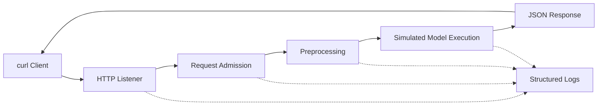

# Lab 02 - Trace an AI Request Through the Infrastructure Stack

## Lab Metadata

| Field | Value |
|---|---|
| Volume | 01 - AI Infrastructure Foundations |
| Related chapters | Chapters 04, 05, 07, and 08 |
| Difficulty | Beginner |
| Estimated time | 60-90 minutes |
| Target platform | Ubuntu 22.04 or 24.04 |
| GPU required | No; optional extension available |
| Lab type | L1 Exploration and failure analysis |

## 1. Objective

Build a small local request-processing service, generate traffic, observe each processing stage, inject a failure, and use evidence to identify the bottleneck.

This lab deliberately uses a lightweight service instead of a large language model. The goal is to learn the request path and troubleshooting method without requiring expensive hardware. The same investigation pattern later applies to Triton, vLLM, NVIDIA NIM, and distributed inference systems.

## 2. Background

A user sees one latency number: the time between sending a request and receiving a response. The infrastructure path contains many smaller stages. A request may wait at the network listener, application queue, tokenizer, runtime scheduler, model execution stage, storage layer, or response stream.

When teams monitor only the GPU, they miss these stages. A GPU can appear idle while users wait because work has not reached the device. This lab creates a visible staged pipeline so that each delay can be measured separately.

## 3. Learning Outcomes

After completing this lab, you will be able to:

- map a request into distinct infrastructure and application stages;
- collect stage-level latency from structured logs;
- distinguish execution time from queue and preprocessing time;
- inject an artificial preprocessing bottleneck;
- identify the root cause from evidence rather than assumption;
- explain how the method maps to production inference platforms.

## 4. Architecture



**Figure L1.2.1 - Lab request path.** The service records timing for admission, preprocessing, execution, and total request latency.

## 5. Prerequisites

You need:

- Ubuntu 22.04 or 24.04;
- Python 3.10 or newer;
- `curl`;
- permission to open a local TCP port;
- two terminal sessions.

Verify the tools:

```bash
python3 --version
curl --version | head -n 1
```

Expected output resembles:

```text
Python 3.12.x
curl 8.x.x (...)
```

The exact versions may differ. Python must be version 3.10 or newer.

## 6. Environment

Create a dedicated workspace:

```bash
mkdir -p ~/nvidia-zero-to-hero/lab-02
cd ~/nvidia-zero-to-hero/lab-02
```

Purpose: keep the service, logs, and generated files isolated from other projects.

## 7. Components

| Component | Role |
|---|---|
| Python HTTP server | Accepts requests and emits responses |
| Request ID | Correlates all events for one request |
| Stage timers | Measure preprocessing and execution |
| JSON logs | Provide machine-readable evidence |
| `curl` | Generates test traffic |

The service uses only the Python standard library. No external package installation is required.

## 8. Deployment Steps

### Step 1: Create the request-path service

Create `request_path_server.py`:

```python
#!/usr/bin/env python3
"""A small staged request service for infrastructure tracing labs."""

from __future__ import annotations

import json
import os
import time
import uuid
from http.server import BaseHTTPRequestHandler, ThreadingHTTPServer
from typing import Any

HOST = "127.0.0.1"
PORT = int(os.getenv("LAB_PORT", "8080"))
PREPROCESS_MS = int(os.getenv("PREPROCESS_MS", "20"))
EXECUTION_MS = int(os.getenv("EXECUTION_MS", "80"))


def now_ms() -> float:
    return time.perf_counter() * 1000


def emit(event: str, request_id: str, **fields: Any) -> None:
    record = {
        "timestamp": time.strftime("%Y-%m-%dT%H:%M:%S%z"),
        "event": event,
        "request_id": request_id,
        **fields,
    }
    print(json.dumps(record), flush=True)


class Handler(BaseHTTPRequestHandler):
    server_version = "RequestPathLab/1.0"

    def do_POST(self) -> None:
        request_id = str(uuid.uuid4())
        total_start = now_ms()

        content_length = int(self.headers.get("Content-Length", "0"))
        raw_body = self.rfile.read(content_length)
        emit("request_received", request_id, bytes_received=len(raw_body))

        preprocessing_start = now_ms()
        time.sleep(PREPROCESS_MS / 1000)
        try:
            payload = json.loads(raw_body or b"{}")
        except json.JSONDecodeError:
            self.send_error(400, "Body must be valid JSON")
            emit("request_failed", request_id, reason="invalid_json")
            return
        preprocessing_ms = now_ms() - preprocessing_start
        emit("preprocessing_complete", request_id, duration_ms=round(preprocessing_ms, 2))

        execution_start = now_ms()
        time.sleep(EXECUTION_MS / 1000)
        prompt = str(payload.get("prompt", ""))
        result = {"request_id": request_id, "output": f"processed: {prompt}"}
        execution_ms = now_ms() - execution_start
        emit("execution_complete", request_id, duration_ms=round(execution_ms, 2))

        response_body = json.dumps(result).encode("utf-8")
        self.send_response(200)
        self.send_header("Content-Type", "application/json")
        self.send_header("Content-Length", str(len(response_body)))
        self.end_headers()
        self.wfile.write(response_body)

        total_ms = now_ms() - total_start
        emit(
            "request_complete",
            request_id,
            preprocessing_ms=round(preprocessing_ms, 2),
            execution_ms=round(execution_ms, 2),
            total_ms=round(total_ms, 2),
        )

    def log_message(self, format: str, *args: Any) -> None:
        return


if __name__ == "__main__":
    print(
        f"Listening on http://{HOST}:{PORT} "
        f"with PREPROCESS_MS={PREPROCESS_MS} and EXECUTION_MS={EXECUTION_MS}",
        flush=True,
    )
    ThreadingHTTPServer((HOST, PORT), Handler).serve_forever()
```

Purpose: create a deterministic service with separately measurable preprocessing and execution stages.

### Step 2: Start the healthy service

In terminal 1:

```bash
cd ~/nvidia-zero-to-hero/lab-02
python3 request_path_server.py | tee healthy.log
```

Expected output:

```text
Listening on http://127.0.0.1:8080 with PREPROCESS_MS=20 and EXECUTION_MS=80
```

Leave this terminal running.

### Step 3: Send a request

In terminal 2:

```bash
curl -sS \
  -H 'Content-Type: application/json' \
  -d '{"prompt":"explain AI infrastructure"}' \
  http://127.0.0.1:8080
```

Expected response:

```json
{"request_id": "<generated-id>", "output": "processed: explain AI infrastructure"}
```

The request ID will differ on every run.

### Step 4: Measure client-visible latency

```bash
curl -sS -o /dev/null \
  -w 'status=%{http_code} total_seconds=%{time_total}\n' \
  -H 'Content-Type: application/json' \
  -d '{"prompt":"measure the request path"}' \
  http://127.0.0.1:8080
```

Expected output is approximately:

```text
status=200 total_seconds=0.10...
```

Do not expect an exact value. Host scheduling and local load introduce variation.

## 9. Validation

Inspect the most recent structured events:

```bash
tail -n 4 healthy.log
```

Expected event order:

```text
request_received
preprocessing_complete
execution_complete
request_complete
```

A healthy `request_complete` event should show preprocessing near 20 ms, execution near 80 ms, and total latency slightly above their sum.

## 10. Verification

Generate five requests:

```bash
for i in $(seq 1 5); do
  curl -sS -o /dev/null \
    -H 'Content-Type: application/json' \
    -d "{\"prompt\":\"request-$i\"}" \
    http://127.0.0.1:8080
done
```

Extract completed requests:

```bash
grep '"event": "request_complete"' healthy.log
```

Interpretation:

- `preprocessing_ms` represents CPU-side preparation;
- `execution_ms` represents the simulated model stage;
- `total_ms` includes both stages plus HTTP and serialization overhead.

In a real inference platform, these fields could correspond to tokenization, queueing, model execution, and streaming.

## 11. Observability

Use a small Python command to calculate average stage latency:

```bash
python3 - <<'PY'
import json
from pathlib import Path

records = []
for line in Path("healthy.log").read_text().splitlines():
    if not line.startswith("{"):
        continue
    record = json.loads(line)
    if record.get("event") == "request_complete":
        records.append(record)

if not records:
    raise SystemExit("No completed requests found")

for field in ("preprocessing_ms", "execution_ms", "total_ms"):
    average = sum(float(r[field]) for r in records) / len(records)
    print(f"{field}: average={average:.2f} ms samples={len(records)}")
PY
```

Expected healthy pattern:

```text
preprocessing_ms: average≈20 ms
execution_ms: average≈80 ms
total_ms: average≈100 ms
```

Exact values will vary.

## 12. Performance Measurements

The important measurement is stage contribution, not the absolute benchmark. Calculate the approximate percentage of time spent in each stage:

```bash
python3 - <<'PY'
import json
from pathlib import Path

records = [
    json.loads(line)
    for line in Path("healthy.log").read_text().splitlines()
    if line.startswith("{") and '"request_complete"' in line
]
last = records[-1]
total = float(last["total_ms"])
for field in ("preprocessing_ms", "execution_ms"):
    value = float(last[field])
    print(f"{field}: {value / total * 100:.1f}% of total")
PY
```

This is the central performance lesson: user latency is composed of stages. Optimizing a stage that contributes little to total time produces little user benefit.

## 13. Failure Injection

### Inject a preprocessing bottleneck

Stop the server in terminal 1 with `Ctrl+C`.

Restart it with a 500 ms preprocessing delay:

```bash
PREPROCESS_MS=500 EXECUTION_MS=80 \
  python3 request_path_server.py | tee broken.log
```

Send another timed request from terminal 2:

```bash
curl -sS -o /dev/null \
  -w 'status=%{http_code} total_seconds=%{time_total}\n' \
  -H 'Content-Type: application/json' \
  -d '{"prompt":"find the bottleneck"}' \
  http://127.0.0.1:8080
```

Expected behavior:

- HTTP status remains 200;
- total latency increases to roughly 0.58 seconds or more;
- execution remains near 80 ms;
- preprocessing becomes the dominant stage.

The service is functionally healthy but operationally degraded. This pattern is common in production: a system can return successful responses while violating its latency objective.

## 14. Troubleshooting

### Symptoms

- requests succeed;
- client-visible latency increases sharply;
- the simulated execution stage is unchanged.

### Detection

```bash
grep '"event": "request_complete"' broken.log | tail -n 1
```

Expected broken pattern:

```text
"preprocessing_ms": 500...
"execution_ms": 80...
"total_ms": 580...
```

### Diagnosis

Compare healthy and broken logs:

```bash
printf '%s\n' 'Healthy:'
grep '"event": "request_complete"' healthy.log | tail -n 1
printf '%s\n' 'Broken:'
grep '"event": "request_complete"' broken.log | tail -n 1
```

### Root Cause

The artificial preprocessing delay increased from 20 ms to 500 ms. The execution stage did not cause the slowdown.

### Resolution

Stop the server and restart with the healthy configuration:

```bash
PREPROCESS_MS=20 EXECUTION_MS=80 \
  python3 request_path_server.py | tee recovered.log
```

### Verification

Repeat the timed request and confirm latency returns near the healthy baseline.

### Prevention

In production:

- measure queue, preprocessing, execution, and response stages separately;
- define latency objectives for the complete request and critical stages;
- alert on percentiles rather than only averages;
- correlate application metrics with CPU, GPU, network, and storage telemetry;
- test representative traffic before release.

## 15. Cleanup

Stop the server with `Ctrl+C`.

Remove the lab directory when no longer needed:

```bash
rm -rf ~/nvidia-zero-to-hero/lab-02
```

Confirm no process remains on port 8080:

```bash
ss -ltnp | grep ':8080' || echo 'Port 8080 is clear'
```

## 16. Summary

You created a staged request service, measured client-visible and stage-level latency, injected a preprocessing bottleneck, and identified the root cause from structured logs.

The lab demonstrated that execution time is only one component of an AI request. Production inference must be observed as an end-to-end pipeline. A GPU may be healthy and underutilized while users experience high latency because the bottleneck occurs before work reaches the accelerator.

## 17. Challenge Exercises

1. Add an `admission_ms` environment variable and a separate queue stage.
2. Run ten concurrent requests with `xargs -P 10` and observe the threaded server.
3. Add a failure mode that returns HTTP 503 when a queue threshold is exceeded.
4. Export the timing fields in Prometheus text format.
5. On a GPU host, record `nvidia-smi` or DCGM metrics beside request timings and explain the correlation.
6. Containerize the service and repeat the investigation through Docker or Kubernetes.

## 18. Production Mapping

| Lab component | Production equivalent |
|---|---|
| HTTP listener | API gateway or inference endpoint |
| Request admission | Queue, scheduler, or admission controller |
| Preprocessing | Tokenization, image decoding, feature preparation |
| Simulated execution | Triton, TensorRT-LLM, vLLM, NIM, or framework execution |
| Structured log | Central logging and request correlation |
| Client timer | End-to-end service latency |
| Environment delay | Misconfiguration or resource bottleneck |

A production implementation should add distributed tracing, request IDs across services, latency histograms, GPU telemetry, queue depth, error classifications, and service-level objectives.

## Further Reading

- [What Actually Happens When ChatGPT Answers?](../chapter-04-what-happens-when-chatgpt-answers)
- [AI Infrastructure Landscape](../chapter-05-ai-infrastructure-landscape)
- [NVIDIA Ecosystem Overview](../chapter-07-nvidia-ecosystem-overview)
- [Enterprise AI Platforms](../chapter-08-enterprise-ai-platforms)
