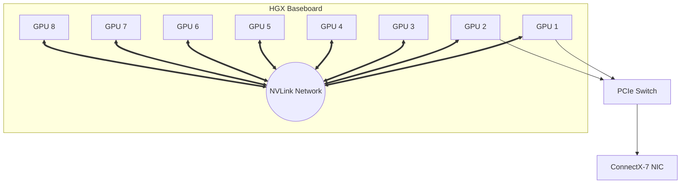

# Masterclass 2: GPU Memory Hierarchy & Topology

## Introduction

Compute capability dictates peak theoretical performance, but memory architecture dictates actual delivered performance. In modern AI infrastructure, particularly Large Language Model (LLM) training and inference, the workload is almost exclusively **Memory Bandwidth Bound**. 

A Senior Infrastructure Architect must view the GPU as a massive data engine. If data does not arrive at the Tensor Cores at exactly the right time, the compute units stall. This masterclass consolidates the GPU memory hierarchy from the register file down to HBM3e, and maps the multi-GPU data paths across NVLink, PCIe, and NVSwitch.

| Chapter field | Value |
|---|---|
| Volume | 02 — GPU Architecture |
| Difficulty | Expert / Masterclass |
| Estimated reading time | 50 minutes |
| Primary focus | Memory Tiers, Data Movement, NVLink, Multi-GPU Topology |
| Previous | Masterclass 1: GPU Compute Architecture & Evolution |
| Next | Masterclass 3: Execution Models & Performance Troubleshooting |

## 1. On-Chip Memory: Registers and Shared Memory

### The Register File: The Absolute Peak
The register file is the fastest, lowest-latency memory on the GPU. Unlike CPUs which have small register files (e.g., hundreds of bytes per core), an NVIDIA H100 GPU has **64KB of registers per processing block**, totaling 256KB per SM, and nearly 33MB across the entire chip. 
Registers are strictly private to a thread.
**Register Pressure:** If a thread demands more registers than available, the compiler is forced to spill variables into "Local Memory" (which physically resides in slow Global Memory/HBM). Register spilling catastrophically degrades performance.

### Shared Memory: Software-Managed Cache
Shared Memory is located physically on the SM alongside the L1 cache. Unlike L1, which is hardware-managed, Shared Memory is explicitly allocated and managed by software (the CUDA programmer).
It serves as a low-latency scratchpad for threads within the same Thread Block to exchange data.

**Bank Conflicts:** Shared memory is divided into 32 interleaved memory banks (to match the 32 threads in a warp). If multiple threads in a warp access different addresses that map to the *same* bank, the hardware must serialize the requests, reducing throughput by $N$-way. For Senior Architects debugging low throughput via `ncu`, high bank conflicts are a primary target for optimization (often solved via memory padding).

## 2. Global Memory: L1, L2, and HBM

### L1 / L2 Cache
- **L1 Cache:** Unified with Shared Memory on the SM. It catches reads/writes to Local and Global memory.
- **L2 Cache:** The central hub of the GPU. It is shared across all SMs. On the H100, the L2 cache is massive (50MB) and heavily partitioned. All memory accesses to Global Memory (HBM) pass through L2. L2 cache hit rate is vital for performance.

### HBM (High Bandwidth Memory)
Global memory on data center GPUs is constructed using HBM. HBM achieves massive bandwidth by using incredibly wide buses (e.g., 5120-bit on H100) and 3D-stacking memory dies directly alongside the GPU die on a silicon interposer.
- **A100 (SXM4):** HBM2e, up to 2.0 TB/s bandwidth.
- **H100 (SXM5):** HBM3, up to 3.35 TB/s bandwidth.
- **H200 / B200:** HBM3e, pushing past 4.8 TB/s.

Data layout dictates HBM performance. **Memory Coalescing** is mandatory: when 32 threads in a warp read global memory, their accesses should fall into contiguous 128-byte segments. Uncoalesced accesses cause the hardware to fetch unnecessary cache lines, wasting precious HBM bandwidth.

## 3. GPU Topology and Data Paths

Scaling past a single GPU introduces interconnect latency. Understanding exactly how GPUs communicate determines cluster design.

### NVLink and NVSwitch
PCIe Gen5 maxes out at 64 GB/s (bidirectional). This is entirely insufficient for Distributed Data Parallel (DDP) or Tensor Parallel (TP) training.
- **NVLink:** Point-to-point interconnect. Hopper 4th-Gen NVLink provides 900 GB/s bidirectional bandwidth per GPU.
- **NVSwitch:** To connect 8 GPUs in an HGX baseboard fully, point-to-point links are insufficient. The NVSwitch fabric sits on the baseboard, routing NVLink traffic between all 8 GPUs in a fully non-blocking all-to-all topology.

### GPUDirect RDMA and Storage
**GPUDirect RDMA** allows Network Interface Cards (NICs) like ConnectX-7 to read and write directly to GPU memory (HBM) over the PCIe bus without routing the data through the CPU system memory (RAM). This eliminates host CPU bottlenecks and memory bounce buffers, making multi-node cluster scaling viable.
**GPUDirect Storage (GDS)** extends this logic to NVMe storage, allowing massive datasets to stream directly from storage to GPU HBM.

## Senior Interview Scenarios

**Scenario 1: NCCL Timeout under Load**
*The Interviewer asks:* "During a 64-GPU distributed training run, NCCL keeps throwing timeout errors. The network links are up. What is your troubleshooting methodology?"
*Expert Answer:* A NCCL timeout means a collective operation (like `AllReduce`) failed to complete. I would immediately check the topology using `nvidia-smi topo -m`. If the PCI topology is suboptimal, NCCL might be falling back to host memory routing. Next, I'd check `nccl-tests` to benchmark the actual bandwidth. If it's hitting PCIe limits (e.g., 20 GB/s) instead of NVLink/Infiniband limits (e.g., 400 GB/s), then either ACS (Access Control Services) is enabled on the PCIe root complexes, blocking Peer-to-Peer (P2P), or GPUDirect RDMA is misconfigured on the Mellanox NICs. I would also verify the NVIDIA fabric manager (`nv-fabricmanager`) is running; without it, NVSwitches stay down, and NVLink degrades to PCIe.

**Scenario 2: The Memory Bound Inference Problem**
*The Interviewer asks:* "We are running a large LLM batch size 1 inference. The GPU compute is at 10%. How do we increase compute utilization?"
*Expert Answer:* Batch size 1 autoregressive generation is strictly memory bandwidth bound. For every single token generated, the entire model weights must be loaded from HBM to the SMs. The Tensor Cores finish the math in nanoseconds, then wait for the next weight load. You *cannot* increase compute utilization without increasing the arithmetic intensity. To fix this, you must increase the batch size (which shares the weight load across multiple sequence generations) or use KV-Cache techniques (like PagedAttention/vLLM), speculative decoding, or weight quantization (e.g., FP8/INT8) to reduce the memory bandwidth pressure per token.
