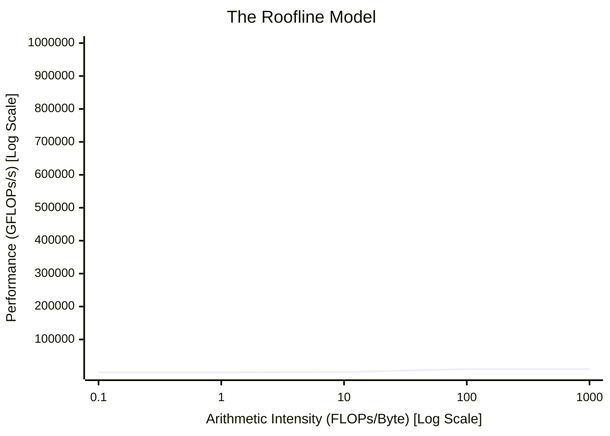

# Masterclass 3: Execution Models & Performance Troubleshooting

## Introduction

Knowing the hardware components is only the first step. True infrastructure mastery requires understanding how the GPU schedules work dynamically and how software behavior limits hardware efficiency. 

This masterclass synthesizes the execution lifecycle: from instruction dispatch and warp scheduling to the architectural cliffs of warp divergence and memory uncoalescing. We will conclude by building a mental GPU performance model (the Roofline Model) to strictly categorize bottlenecks.

| Chapter field | Value |
|---|---|
| Volume | 02 — GPU Architecture |
| Difficulty | Expert / Masterclass |
| Estimated reading time | 45 minutes |
| Primary focus | Occupancy, Warp Divergence, Performance Modeling |
| Previous | Masterclass 2: GPU Memory & Topology |
| Next | Volume 03 Introduction |

## 1. Warp Scheduling and Occupancy

### The Role of the Warp Scheduler
An SM maintains the state of multiple warps concurrently. Unlike a CPU which relies heavily on OS-level context switching (saving registers to RAM), a GPU's context switch is instantaneous. All active warps already have their data loaded in the massive SM register file. 
At every clock cycle, the Warp Scheduler selects a warp that has valid instructions and ready data, and dispatches it to the execution units. If Warp A is waiting on a 400-cycle HBM read, the scheduler instantly swaps to Warp B. 

### Occupancy: The Metric of Concurrency
**Occupancy** is the ratio of active warps on an SM to the maximum possible number of active warps supported by that SM.
- *High Occupancy:* Generally good. It means the scheduler has a large pool of warps to choose from, maximizing the probability of hiding latency.
- *Low Occupancy:* A massive risk. If only 4 warps are resident on an SM, and all 4 issue a global memory read simultaneously, the scheduler runs out of warps to execute. The SM completely stalls.

**Occupancy Limiters:** What prevents a kernel from achieving 100% occupancy?
1. **Register Usage:** If a kernel uses 128 registers per thread, an SM can only fit a fraction of its maximum threads before exhausting the physical register file.
2. **Shared Memory Usage:** If a Thread Block requests 64KB of shared memory, and the SM only has 100KB available for shared memory allocation, only 1 Block can reside on that SM, severely limiting active warps.
3. **Block Dimensioning:** Sub-optimal block sizes (e.g., a block of 1000 threads when an SM only allows max 2048 threads; the second block won't fit, wasting 1048 thread slots).

## 2. Pathological Behaviors: Divergence and Uncoalescing

These two anti-patterns destroy GPU performance.

### Warp Divergence (Control Flow)
Because a warp executes via SIMT (Single Instruction, Multiple Threads), all 32 threads share a single instruction counter. What happens if there is an `if-else` statement, and 16 threads evaluate to `true` while 16 evaluate to `false`?
The hardware must **serialize** the execution. It executes the `true` path for the first 16 threads (masking off the other 16), and then executes the `false` path for the remaining 16 threads (masking off the first 16). 
This reduces execution efficiency by exactly 50%. This is called **Warp Divergence**. AI code generally avoids this by performing matrix math, but complex sampling strategies or graph neural network aggregations can suffer heavily here.

### Memory Uncoalescing
As discussed in Masterclass 2, memory accesses must be contiguous.
- **Coalesced Access:** Thread 0 reads Address 0, Thread 1 reads Address 1... Thread 31 reads Address 31. The hardware issues a single, efficient 128-byte cache line fetch from HBM.
- **Uncoalesced Access:** Threads read random, scattered memory addresses. The hardware must issue 32 separate cache line fetches. Bandwidth utilization drops to $\sim 3\%$. 

## 3. Building a GPU Performance Model (The Roofline)

To stop guessing and start engineering, we use the **Roofline Model**. It visualizes the ultimate limits of hardware.

Every workload has an **Arithmetic Intensity** (AI): The number of Floating Point Operations (FLOPs) performed per Byte of memory accessed.
*(AI = Total FLOPs / Total Bytes Transferred from HBM)*

The hardware has two physical limits:
1. **Peak Compute (TFLOPs/s):** The theoretical maximum operations per second (the flat roof).
2. **Peak Memory Bandwidth (GB/s):** The theoretical maximum data transfer rate (the slanted roof).

**The Ridge Point:** The intersection of peak bandwidth and peak compute.
- If your kernel's AI is to the **left** of the ridge point, you are **Memory Bound**. Optimizing compute (like switching to Tensor Cores) will do *nothing*. You must improve coalescing, use shared memory, or fuse kernels to reduce memory reads.
- If your kernel's AI is to the **right** of the ridge point, you are **Compute Bound**. Here, you should leverage Tensor Cores, FP8/FP16, and optimize loop unrolling.

*Most modern LLM layers (specifically the Attention Mechanism) are inherently Memory Bound.*

## Senior Interview Scenarios

**Scenario 1: Kernel Fusion Explanation**
*The Interviewer asks:* "A junior engineer wrote a PyTorch script that applies GeLU, then Dropout, then LayerNorm. It's very slow. FlashAttention is much faster. Explain fundamentally, at the hardware level, why Kernel Fusion solves this."
*Expert Answer:* When GeLU, Dropout, and LayerNorm are separate kernels, PyTorch launches three independent operations on the GPU. Kernel 1 (GeLU) reads from HBM, computes, and writes the intermediate result back to HBM. Kernel 2 reads that intermediate result from HBM, computes, and writes back. Kernel 3 does it again. 
This is a catastrophic waste of HBM bandwidth (the most constrained resource). Kernel Fusion (like FlashAttention or using `torch.compile` / Triton) combines these operations into a single kernel. The data is loaded from HBM into the SM's fast on-chip registers/shared memory *once*. All three operations are applied locally in registers, and the final result is written back to HBM *once*. We turn a heavily memory-bound workload into a compute-bound workload by increasing the Arithmetic Intensity.

**Scenario 2: Low Occupancy, High Performance?**
*The Interviewer asks:* "You run Nsight Compute on a kernel. It reports an Occupancy of only 25%, but the Memory Throughput is at 98% of peak HBM bandwidth. The junior engineer wants to optimize register usage to increase occupancy. Should they?"
*Expert Answer:* Absolutely not. The goal of occupancy is to hide memory latency to achieve high throughput. If the kernel is already hitting 98% of peak memory bandwidth (the theoretical hardware limit), increasing occupancy will not make the kernel faster; it is already perfectly saturating the bus. This is a classic example of "optimizing a metric instead of a bottleneck." The workload is completely memory-bound. To improve performance further, we would have to reduce total bytes transferred (e.g., via quantization or kernel fusion), not increase occupancy.
