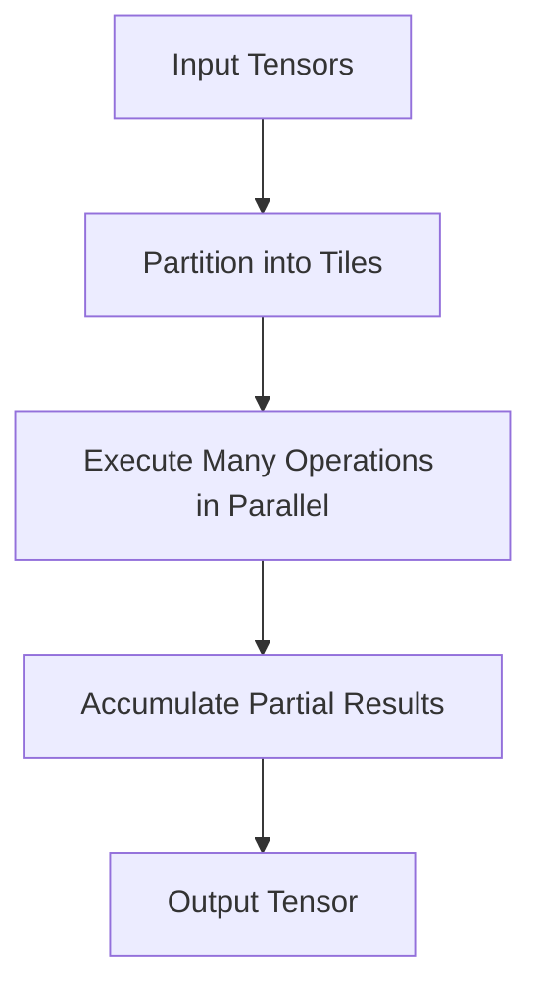
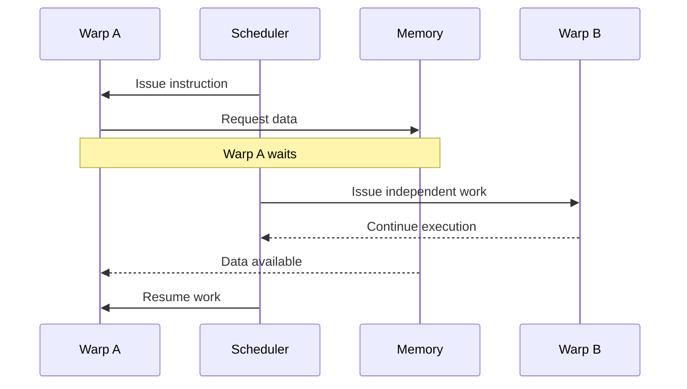

# Why GPU Architecture Evolved

## Introduction

Modern GPUs did not begin as AI processors. They evolved because graphics workloads demanded an unusual kind of computation: enormous numbers of similar operations applied to many independent data elements at once.

A CPU is designed to handle a small number of complex instruction streams with excellent latency, branch prediction, and operating-system responsiveness. A graphics pipeline needs something different. Every frame may require the same transformation, shading, interpolation, and blending operations to be applied across millions of vertices and pixels. The opportunity for parallel execution is too large to ignore.

AI later exposed the same architectural advantage. Neural networks also perform repeated operations across large arrays of numbers. The problem domain changed, but the underlying demand remained familiar: execute large amounts of mathematically regular work with high throughput.

| Chapter field | Value |
|---|---|
| Volume | 02 — GPU Architecture |
| Difficulty | Foundation |
| Estimated reading time | 35 minutes |
| Primary focus | Architectural evolution from graphics to accelerated computing |
| Previous | Volume 01 Summary |
| Next | Inside a Modern NVIDIA GPU |

## Story

A research team ports a numerical simulation from CPU servers to GPUs. The first result is disappointing. The GPU contains far more arithmetic units, yet the application is only slightly faster. The team concludes that the GPU is overrated.

An experienced engineer reviews the code and finds that most work remains sequential. Data is copied repeatedly between host and device. Each kernel performs too little work. Branch-heavy logic causes execution paths to diverge. The hardware is not failing; the workload is failing to expose the parallelism the architecture was built to consume.

This distinction is essential. GPU architecture did not evolve to make every program faster. It evolved to make highly parallel, throughput-oriented programs dramatically more efficient.

## Learning Objectives

After completing this chapter, you will be able to:

- Explain the workload pressures that drove GPU evolution.
- Distinguish latency-oriented and throughput-oriented processor design.
- Describe the transition from fixed-function graphics pipelines to programmable GPUs.
- Explain why AI workloads map naturally to GPU architecture.
- Identify workloads that are poor candidates for GPU acceleration.

## Big Picture

The architectural evolution can be understood as a sequence of constraints. Each stage exists because the previous one hit a specific, provable limit — and each transition left evidence you can still find in a GPU today.

```mermaid
flowchart LR
    Graphics["Massively Parallel Graphics Work<br/>evidence: millions of independent<br/>vertex/pixel ops per frame"]
    Fixed["Fixed-Function Pipelines<br/>evidence: efficient, but no way to<br/>express a custom shading algorithm"]
    Programmable["Programmable Shaders<br/>evidence: vertex/pixel programs<br/>run on dedicated shader units"]
    Unified["Unified Processing Cores<br/>evidence: one core type executes<br/>both vertex and pixel work"]
    GPGPU["General-Purpose GPU Computing<br/>evidence: CUDA runs non-graphics<br/>kernels on the same cores"]
    AI["Tensor-Optimized AI Acceleration<br/>evidence: nvidia-smi shows a<br/>Tensor Core throughput field"]

    Graphics --> Fixed --> Programmable --> Unified --> GPGPU --> AI
    AI --> Check{"Is a workload actually using<br/>the layer it was written for?"}
    Check -->|"Kernel is scalar/branchy,<br/>low FLOPs-per-byte"| General["Falls back to general CUDA-Core<br/>execution — evolution doesn't help it"]
    Check -->|"Kernel is dense matrix multiply,<br/>aligned shapes/dtype"| Tensor["Reaches Tensor Core path —<br/>full benefit of the evolution"]
```



**Figure 2.1.1 — GPU architectural evolution.** Graphics created the need for parallel throughput. Programmability converted specialized pipelines into a more general compute platform, and AI introduced additional specialization for matrix operations. The bottom branch is the practical consequence for infrastructure engineers: a GPU that has *all* of this history built into its silicon does not automatically route your workload through the newest, fastest layer — a scalar, branch-heavy kernel still executes on general-purpose CUDA Core pipelines and gets none of the Tensor Core benefit, no matter how new the card is.

**Reading the evidence chain on real hardware.** You can confirm this history is still architecturally present with one call:

```bash
$ nvidia-smi --query-gpu=name,compute_cap --format=csv
name, compute_cap
NVIDIA H100 80GB HBM3, 9.0
```

`compute_cap` (compute capability) is a version number for the instruction set and feature set a GPU generation exposes — it is the direct, checkable descendant of "unified processing cores" and "GPGPU" in the diagram above: it is the number a build system or framework checks to decide whether Tensor Core instructions, specific data types, or specific memory features are available at all. A workload compiled for a much older compute capability may run on new hardware but silently miss newer execution paths — which is exactly the "falls back to general execution" branch in Figure 2.1.1, verifiable on your own hardware rather than taken on faith.

## The Original Constraint: Rendering a Frame

A rendered frame contains many elements that can be processed independently. Vertices are transformed. Fragments are shaded. Texture values are sampled. Color and depth values are blended. The same mathematical operations are repeated across large collections of data.

A design that executes each element sequentially would waste the natural parallelism. GPU designers therefore devoted a larger proportion of transistor budget to arithmetic throughput and a smaller proportion to the sophisticated control structures found in CPUs.

| Design priority | CPU emphasis | GPU emphasis |
|---|---|---|
| Single-thread latency | High | Secondary |
| Branch prediction | Extensive | Limited relative to CPU |
| Out-of-order execution | Aggressive | Less central to throughput model |
| Number of concurrent threads | Moderate | Very high |
| Arithmetic throughput | Balanced | Primary |
| Latency hiding | Caches and speculation | Large numbers of runnable threads |

The table does not mean GPUs lack caches, schedulers, or control logic. It means they allocate resources differently because they optimize for a different problem.

## From Fixed Function to Programmability

Early graphics pipelines implemented specific stages directly in hardware. The design was efficient but inflexible. Developers could configure the pipeline, but they could not express arbitrary computation.

Programmable vertex and pixel shaders changed the model. Developers could run small programs over graphics data. As programmability increased, separate shader units were consolidated into unified architectures capable of executing different kinds of shader work.

That transition created the foundation for general-purpose GPU computing. Once many programmable arithmetic units existed behind a common execution model, the same hardware could process scientific, financial, engineering, and machine-learning workloads.

:::note
General-purpose GPU computing did not remove specialization. It exposed a programmable layer over hardware still optimized for highly parallel throughput.
:::

## Why AI Fits

Many neural-network operations can be represented as tensor and matrix operations. Training and inference repeatedly multiply, accumulate, normalize, transform, and move large arrays of values.

These operations have three properties that align with GPUs:

1. **Large data parallelism.** Many elements can be processed simultaneously.
2. **Regular computation.** The same operation is repeated across tensors.
3. **High arithmetic intensity.** Useful work can be performed on data once it reaches the accelerator.



**Figure 2.1.2 — Tensor work exposes parallelism.** Large tensor operations are partitioned into smaller regions that can be processed concurrently and combined into a final result.

The architectural match is not automatic. Small models, tiny batches, irregular data structures, branch-heavy algorithms, and frequent host-device synchronization may leave the GPU underused.

**A worked check for "does this actually expose enough parallelism."** Take a single transformer feed-forward matrix multiply: a `[4096, 4096]` weight matrix applied to a batch of `32` tokens, each a `4096`-wide vector. The output is `32 x 4096`, so there are `32 x 4096 ≈ 131,072` independent output elements, each requiring a `4096`-deep dot product. An H100 has 132 Streaming Multiprocessors; even before considering warps or Tensor Core tiling, this single operation already offers roughly `131,072 / 132 ≈ 993` independent output elements per SM — comfortably enough parallel work to keep every SM busy. Compare that with a batch of `1` (a single interactive request with no batching): the output shrinks to `4096` elements, or about `31` per SM — still technically parallel, but thin enough that launch overhead and warp-scheduling inefficiency start to matter more than raw compute. This is the arithmetic behind why inference services batch requests before they ever reach the model: batching directly multiplies the parallelism the hardware evolution described in this chapter was built to consume.

## Internal Working: Throughput Instead of Immediate Completion

A CPU often attempts to make one instruction stream progress as quickly as possible. A GPU keeps many groups of threads ready. When one group waits for data, the scheduler can issue work from another group.



**Figure 2.1.3 — Latency hiding.** The GPU tolerates individual memory delays by switching to other ready work rather than relying only on reducing the delay itself.

This mechanism explains why a GPU needs abundant parallel work. Without enough runnable warps, there is nothing available to execute while another warp waits.

## Architecture Trade-offs

GPU architecture accepts trade-offs to maximize throughput.

### Advantages

- High aggregate arithmetic throughput
- Efficient execution of regular data-parallel workloads
- Large memory bandwidth in accelerator-class systems
- Ability to hide latency using many active threads
- Strong scaling inside suitable kernels

### Costs

- Parallel work must be exposed by software
- Irregular control flow can reduce efficiency
- Data movement can dominate execution
- Small workloads may not fill the device
- Debugging and performance analysis require topology and memory awareness

No architecture is universally superior. The correct processor depends on the workload.

## Production Deployment Perspective

In production systems, GPU selection should follow workload characterization. The architecture team should ask:

- How much parallel work is available?
- How large are the model and working set?
- Is the workload compute-bound, memory-bound, or communication-bound?
- What latency and throughput targets exist?
- Can requests be batched?
- Does the workload require multiple GPUs?
- How frequently does data cross the CPU–GPU boundary?

A workload that cannot answer these questions is not ready for hardware sizing.

## Production Troubleshooting

### Problem: GPU utilization remains low

| Observation | Possible architectural cause |
|---|---|
| Short utilization spikes | Kernels are too small or infrequent |
| CPU fully utilized | Input preparation is feeding the GPU too slowly |
| High copy time | Excessive host-device data movement |
| Low utilization and low memory use | Insufficient parallel work or poor batching |
| High memory use but low compute | Memory-bound workload or stalled execution |

### Diagnosis

Begin with the whole pipeline. Confirm that work reaches the device, inspect kernel duration and launch frequency, measure transfer time, and compare compute activity with memory activity.

**Turning "short utilization spikes" into evidence.** A single `nvidia-smi` snapshot cannot show a spike — you need a sampled series, because the spike is exactly the thing a one-shot query would miss:

```text
$ nvidia-smi --query-gpu=utilization.gpu,utilization.memory,power.draw --format=csv,noheader -l 1 | head -8
98 %, 71 %, 298 W
4 %, 2 %, 92 W
3 %, 1 %, 88 W
97 %, 69 %, 301 W
5 %, 2 %, 90 W
4 %, 2 %, 91 W
96 %, 70 %, 299 W
5 %, 2 %, 89 W
```

This one-second sampling shows a clean pattern: roughly one busy sample followed by two-to-three idle ones. `power.draw` moves in lockstep with `utilization.gpu` (298W busy vs ~90W idle), which confirms the GPU itself is genuinely idle between spikes rather than doing quiet background work the utilization counter under-reports. The "row" this maps to in the table above is the first one — "short utilization spikes" — and this is the concrete signature that would justify writing "kernels are too small or infrequent" in an incident report instead of guessing.

**Turning "CPU fully utilized" into the paired evidence that confirms it, not just asserts it.** Taken at the same moment as the trace above:

```text
$ top -bn1 | head -8
%Cpu(s): 96.8 us,  2.1 sy,  0.0 ni,  1.1 id,  0.0 wa
  PID  USER   %CPU  %MEM  COMMAND
 4021  svc    392.0  4.1  python3 (preprocess worker x4)
 4099  svc    288.5  3.0  python3 (preprocess worker)
```

`96.8% us` (user-space CPU time) with four Python preprocessing workers each consuming 250-400% CPU (multi-core, multi-threaded) taken during the same window as the idle-heavy GPU trace above is the pairing that turns "CPU fully utilized" from a guess into a conclusion: the GPU's idle gaps line up with CPU saturation, not with GPU-internal stalls, which points the fix at input preparation rather than at the accelerator.

### Root Cause Pattern

The most common mistake is assuming that more GPU cores guarantee speed. Hardware can execute only the parallel work supplied to it.

### Prevention

Establish a CPU baseline, define representative workload sizes, measure end-to-end latency, and profile before changing hardware.

## Customer Scenario

A customer asks whether replacing CPU servers with GPUs will make a data-processing application faster. The application reads small records, follows many conditional rules, performs database lookups, and writes individual updates.

A responsible architect does not recommend GPUs based on marketing throughput. The workload has limited regular parallelism and substantial control and I/O behavior. The architect first identifies whether any specific stage—such as vector search, image processing, or model inference—can be isolated and accelerated. The rest may remain on CPUs.

## Interview Preparation

### Conceptual Questions

1. Why do GPUs favor throughput over single-thread latency?
**Model answer:** "A CPU spends a large fraction of its transistor budget making one instruction stream finish as fast as possible — branch prediction, out-of-order execution, deep caches. A GPU instead assumes there will be thousands of independent operations available at once, and spends its budget on having enough parallel lanes and enough resident warps to hide any single operation's latency by simply running a different one. That only pays off if the workload actually has that much independent work — which is exactly the class of problem graphics and, later, tensor math both are."

2. How did programmable shaders contribute to general-purpose computing?
**Model answer:** "Fixed-function pipelines could only run the exact transform-and-shade steps built into the hardware. Once vertex and pixel shaders became programmable, GPUs were running arbitrary small programs over large data sets — and once that programmability was unified into one core type instead of separate vertex/pixel units, there was no architectural reason those programs had to be graphics programs at all. CUDA is what happened when that observation got a real API."

3. Why can a GPU with many cores still be underutilized?
**Model answer:** "Because cores don't get work automatically — software has to expose enough independent parallel work to fill them. I've seen this concretely: a `nvidia-smi` trace sampled once a second showing a spike to 97% utilization followed by two or three samples near 3-5%, with `power.draw` tracking the same pattern almost exactly. That's not a broken GPU, that's a kernel that's too small or launched too infrequently — the hardware is capable, the launch geometry isn't feeding it."

### Architecture Questions

1. Compare the transistor-budget priorities of CPUs and GPUs.
**Model answer:** "I'd draw two pie charts. A CPU's die area goes heavily into branch prediction, out-of-order scheduling logic, and large per-core caches — maybe a handful of cores total. A GPU's die area goes overwhelmingly into replicated arithmetic lanes and register files across many SMs, with comparatively little control logic per lane. The CPU is paying silicon for flexibility per instruction stream; the GPU is paying silicon for lane count."

2. Explain how GPUs hide memory latency.
**Model answer:** "By over-subscribing warps relative to what any one warp needs at a given instant. When Warp A issues a load and has to wait for HBM, the scheduler doesn't stall the whole SM — it switches to Warp B, which has independent, ready work. As long as there are enough resident warps with independent work, the SM stays busy across the whole memory latency instead of blocking on it. That's why occupancy and grid size matter even before you touch a memory optimization."

3. Identify the workload properties that justify GPU acceleration.
**Model answer:** "Three things, and I'd want at least two of them clearly present: large data parallelism — many elements that can be processed independently; regular computation — the same operation repeated rather than lots of unique branchy logic; and enough arithmetic intensity that the data transferred to the device is worth the transfer cost. A workload with none of these — small records, heavy branching, one-off database lookups — is a poor GPU candidate regardless of how fast the GPU is."

### Scenario Questions

1. A GPU port is only 1.2 times faster than the CPU version. What do you investigate?
**Model answer:** "First I'd check whether the workload spends most of its time sequential — the classic mistake is porting one hot loop to the GPU while everything around it, including repeated host-device copies, stays serial. I'd profile kernel duration and launch frequency, measure host-to-device transfer time separately from compute time, and check whether each kernel actually has enough parallel work to fill the device. A 1.2x speedup on a GPU with orders of magnitude more raw throughput almost always means the software isn't exposing the parallelism, not that the hardware is disappointing."

2. A workload contains heavy branching and small inputs. Would you use a GPU?
**Model answer:** "Probably not for that stage. Heavy branching causes warp divergence — different threads in the same warp taking different paths — which serializes execution within the warp and throws away the SIMT advantage. Small inputs compound that by not giving the scheduler enough independent warps to hide any latency that remains. I'd isolate whether any sub-piece of the workload — a specific matrix operation, a batchable transform — has the right shape, and leave the branchy control logic on the CPU."

3. GPU utilization appears as short spikes. What architectural behavior might cause this?
**Model answer:** "That pattern — a busy sample followed by several near-idle ones, with power draw moving the same way — usually means kernels are too small or too infrequent to keep the device continuously fed. I'd check launch frequency and kernel duration first, then look upstream at whether batching, CPU preprocessing, or per-request synchronization is creating the gaps between launches."

## Summary

GPU architecture evolved from the need to process enormous amounts of graphics data concurrently. Programmability transformed specialized graphics pipelines into general parallel processors. AI workloads later benefited from the same throughput-oriented design because tensor operations expose large amounts of regular parallel work.

The key lesson is not that GPUs are faster than CPUs. It is that GPUs are faster for workloads that match their execution model. Understanding that match is the beginning of GPU architecture.

## Key Takeaways

- GPU evolution was driven by parallel throughput requirements.
- Programmability enabled general-purpose accelerated computing.
- GPUs hide latency by keeping many thread groups available.
- AI maps well to GPUs because tensor operations are highly parallel and regular.
- Hardware selection must follow workload analysis.

## Cross References

- Volume introduction: [GPU Architecture](./index)
- Next: [Inside a Modern NVIDIA GPU](./chapter-02-inside-a-modern-nvidia-gpu)
- Related lab: [Inspect GPU Architecture and Topology](./labs/lab-01-inspect-gpu-architecture-and-topology)
