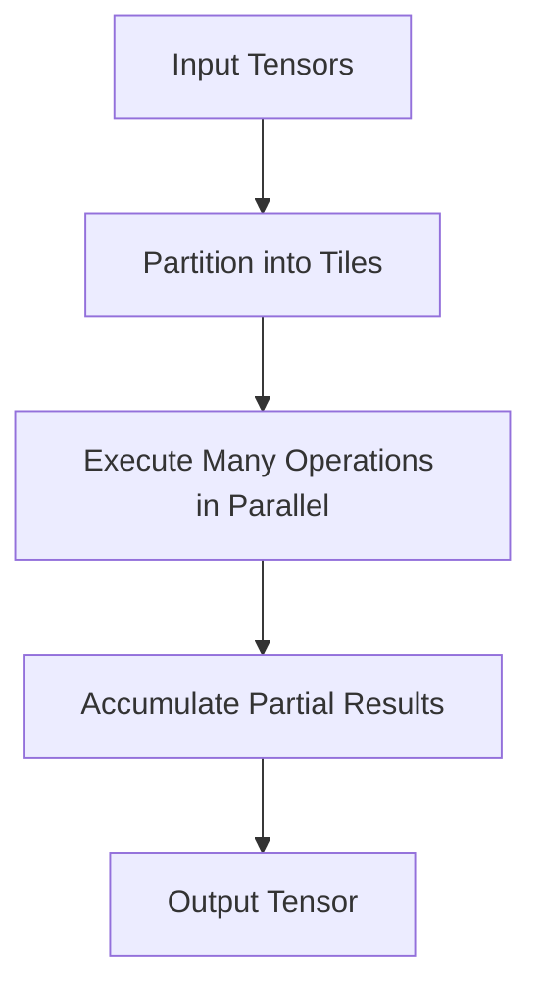
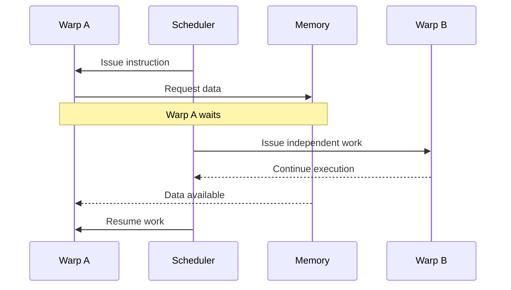

# Why GPU Architecture Evolved

## Introduction

Modern GPUs did not begin as AI processors. They evolved because graphics workloads demanded an unusual kind of computation: enormous numbers of similar operations applied to many independent data elements at once.

A CPU is designed to handle a small number of complex instruction streams with excellent latency, branch prediction, and operating-system responsiveness. A graphics pipeline needs something different. Every frame may require the same transformation, shading, interpolation, and blending operations to be applied across millions of vertices and pixels. The opportunity for parallel execution is too large to ignore.

AI later exposed the same architectural advantage. Neural networks also perform repeated operations across large arrays of numbers. The problem domain changed, but the underlying demand remained familiar: execute large amounts of mathematically regular work with high throughput.

| Chapter field | Value |
|---|---|
| Volume | 02 — GPU Architecture |
| Difficulty | Foundation |
| Estimated reading time | 35 minutes |
| Primary focus | Architectural evolution from graphics to accelerated computing |
| Previous | Volume 01 Summary |
| Next | Inside a Modern NVIDIA GPU |

## Story

A research team ports a numerical simulation from CPU servers to GPUs. The first result is disappointing. The GPU contains far more arithmetic units, yet the application is only slightly faster. The team concludes that the GPU is overrated.

An experienced engineer reviews the code and finds that most work remains sequential. Data is copied repeatedly between host and device. Each kernel performs too little work. Branch-heavy logic causes execution paths to diverge. The hardware is not failing; the workload is failing to expose the parallelism the architecture was built to consume.

This distinction is essential. GPU architecture did not evolve to make every program faster. It evolved to make highly parallel, throughput-oriented programs dramatically more efficient.

## Learning Objectives

After completing this chapter, you will be able to:

- Explain the workload pressures that drove GPU evolution.
- Distinguish latency-oriented and throughput-oriented processor design.
- Describe the transition from fixed-function graphics pipelines to programmable GPUs.
- Explain why AI workloads map naturally to GPU architecture.
- Identify workloads that are poor candidates for GPU acceleration.

## Big Picture

The architectural evolution can be understood as a sequence of constraints.

**Figure 2.1.1 — GPU architectural evolution.** Graphics created the need for parallel throughput. Programmability converted specialized pipelines into a more general compute platform, and AI introduced additional specialization for matrix operations.

## The Original Constraint: Rendering a Frame

A rendered frame contains many elements that can be processed independently. Vertices are transformed. Fragments are shaded. Texture values are sampled. Color and depth values are blended. The same mathematical operations are repeated across large collections of data.

A design that executes each element sequentially would waste the natural parallelism. GPU designers therefore devoted a larger proportion of transistor budget to arithmetic throughput and a smaller proportion to the sophisticated control structures found in CPUs.

| Design priority | CPU emphasis | GPU emphasis |
|---|---|---|
| Single-thread latency | High | Secondary |
| Branch prediction | Extensive | Limited relative to CPU |
| Out-of-order execution | Aggressive | Less central to throughput model |
| Number of concurrent threads | Moderate | Very high |
| Arithmetic throughput | Balanced | Primary |
| Latency hiding | Caches and speculation | Large numbers of runnable threads |

The table does not mean GPUs lack caches, schedulers, or control logic. It means they allocate resources differently because they optimize for a different problem.

## From Fixed Function to Programmability

Early graphics pipelines implemented specific stages directly in hardware. The design was efficient but inflexible. Developers could configure the pipeline, but they could not express arbitrary computation.

Programmable vertex and pixel shaders changed the model. Developers could run small programs over graphics data. As programmability increased, separate shader units were consolidated into unified architectures capable of executing different kinds of shader work.

That transition created the foundation for general-purpose GPU computing. Once many programmable arithmetic units existed behind a common execution model, the same hardware could process scientific, financial, engineering, and machine-learning workloads.

:::note
General-purpose GPU computing did not remove specialization. It exposed a programmable layer over hardware still optimized for highly parallel throughput.
:::

## Why AI Fits

Many neural-network operations can be represented as tensor and matrix operations. Training and inference repeatedly multiply, accumulate, normalize, transform, and move large arrays of values.

These operations have three properties that align with GPUs:

1. **Large data parallelism.** Many elements can be processed simultaneously.
2. **Regular computation.** The same operation is repeated across tensors.
3. **High arithmetic intensity.** Useful work can be performed on data once it reaches the accelerator.

**Figure 2.1.2 — Tensor work exposes parallelism.** Large tensor operations are partitioned into smaller regions that can be processed concurrently and combined into a final result.

The architectural match is not automatic. Small models, tiny batches, irregular data structures, branch-heavy algorithms, and frequent host-device synchronization may leave the GPU underused.

## Internal Working: Throughput Instead of Immediate Completion

A CPU often attempts to make one instruction stream progress as quickly as possible. A GPU keeps many groups of threads ready. When one group waits for data, the scheduler can issue work from another group.

**Figure 2.1.3 — Latency hiding.** The GPU tolerates individual memory delays by switching to other ready work rather than relying only on reducing the delay itself.

This mechanism explains why a GPU needs abundant parallel work. Without enough runnable warps, there is nothing available to execute while another warp waits.

## Architecture Trade-offs

GPU architecture accepts trade-offs to maximize throughput.

### Advantages

- High aggregate arithmetic throughput
- Efficient execution of regular data-parallel workloads
- Large memory bandwidth in accelerator-class systems
- Ability to hide latency using many active threads
- Strong scaling inside suitable kernels

### Costs

- Parallel work must be exposed by software
- Irregular control flow can reduce efficiency
- Data movement can dominate execution
- Small workloads may not fill the device
- Debugging and performance analysis require topology and memory awareness

No architecture is universally superior. The correct processor depends on the workload.

## Production Deployment Perspective

In production systems, GPU selection should follow workload characterization. The architecture team should ask:

- How much parallel work is available?
- How large are the model and working set?
- Is the workload compute-bound, memory-bound, or communication-bound?
- What latency and throughput targets exist?
- Can requests be batched?
- Does the workload require multiple GPUs?
- How frequently does data cross the CPU–GPU boundary?

A workload that cannot answer these questions is not ready for hardware sizing.

## Production Troubleshooting

### Problem: GPU utilization remains low

| Observation | Possible architectural cause |
|---|---|
| Short utilization spikes | Kernels are too small or infrequent |
| CPU fully utilized | Input preparation is feeding the GPU too slowly |
| High copy time | Excessive host-device data movement |
| Low utilization and low memory use | Insufficient parallel work or poor batching |
| High memory use but low compute | Memory-bound workload or stalled execution |

### Diagnosis

Begin with the whole pipeline. Confirm that work reaches the device, inspect kernel duration and launch frequency, measure transfer time, and compare compute activity with memory activity.

### Root Cause Pattern

The most common mistake is assuming that more GPU cores guarantee speed. Hardware can execute only the parallel work supplied to it.

### Prevention

Establish a CPU baseline, define representative workload sizes, measure end-to-end latency, and profile before changing hardware.

## Customer Scenario

A customer asks whether replacing CPU servers with GPUs will make a data-processing application faster. The application reads small records, follows many conditional rules, performs database lookups, and writes individual updates.

A responsible architect does not recommend GPUs based on marketing throughput. The workload has limited regular parallelism and substantial control and I/O behavior. The architect first identifies whether any specific stage—such as vector search, image processing, or model inference—can be isolated and accelerated. The rest may remain on CPUs.

## Interview Preparation

### Conceptual Questions

1. Why do GPUs favor throughput over single-thread latency?
2. How did programmable shaders contribute to general-purpose computing?
3. Why can a GPU with many cores still be underutilized?

### Architecture Questions

1. Compare the transistor-budget priorities of CPUs and GPUs.
2. Explain how GPUs hide memory latency.
3. Identify the workload properties that justify GPU acceleration.

### Scenario Questions

1. A GPU port is only 1.2 times faster than the CPU version. What do you investigate?
2. A workload contains heavy branching and small inputs. Would you use a GPU?
3. GPU utilization appears as short spikes. What architectural behavior might cause this?

## Summary

GPU architecture evolved from the need to process enormous amounts of graphics data concurrently. Programmability transformed specialized graphics pipelines into general parallel processors. AI workloads later benefited from the same throughput-oriented design because tensor operations expose large amounts of regular parallel work.

The key lesson is not that GPUs are faster than CPUs. It is that GPUs are faster for workloads that match their execution model. Understanding that match is the beginning of GPU architecture.

## Key Takeaways

- GPU evolution was driven by parallel throughput requirements.
- Programmability enabled general-purpose accelerated computing.
- GPUs hide latency by keeping many thread groups available.
- AI maps well to GPUs because tensor operations are highly parallel and regular.
- Hardware selection must follow workload analysis.

## Cross References

- Volume introduction: [GPU Architecture](./index)
- Next: [Inside a Modern NVIDIA GPU](./chapter-02-inside-a-modern-nvidia-gpu)
- Related lab: [Inspect GPU Architecture and Topology](./labs/lab-01-inspect-gpu-architecture-and-topology)
