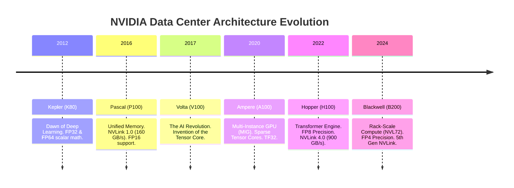
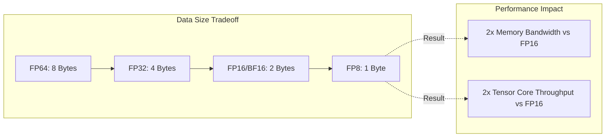

# Why GPU Architecture Evolved

| Chapter metadata | Value |
|---|---|
| Volume | 02 — GPU Architecture |
| Difficulty | Foundation to Advanced |
| Estimated reading time | 40 minutes |
| Primary audience | DevOps, SRE, Platform, Cloud and Infrastructure Engineers |
| Core question | How did a chip designed to render video games become the foundation of global supercomputing and AI? |

## Introduction

Modern GPUs did not begin as Artificial Intelligence processors. They evolved because graphics workloads demanded a profoundly unusual kind of computation: enormous numbers of identical mathematical operations applied to many independent data elements at the exact same time.

A traditional CPU is designed to handle a small number of complex instruction streams with excellent latency, aggressive branch prediction, and deep out-of-order execution pipelines. A 3D graphics pipeline, however, needs something different. To render a 4K screen at 60 frames per second, the processor must calculate the light, shading, interpolation, and geometry for over 8 million pixels, 60 times a second. 

Applying the exact same lighting transformation to 8 million independent pixels is an "embarrassingly parallel" problem. The opportunity for parallel execution was too large to ignore, prompting the invention of the Graphics Processing Unit (GPU)—a chip that sacrificed complex branching logic to pack thousands of simple Arithmetic Logic Units (ALUs) onto a single die.

Years later, researchers realized that Neural Networks exposed the exact same architectural demand. Training a neural network requires massive, repeated Matrix Multiplications (GEMM - General Matrix Multiply). The problem domain changed from pixels to tensors, but the underlying demand remained identical: execute massive amounts of mathematically regular work with absurdly high throughput.

:::info Principal Engineer View
To master AI Infrastructure, you must understand the historical pressures that shaped NVIDIA's silicon. The transition from fixed-function graphics pipelines, to programmable shaders, to general-purpose compute (CUDA), to AI-specific acceleration (Tensor Cores) explains exactly *why* a modern GPU behaves the way it does in your Kubernetes clusters today.
:::

## Story

Imagine a high-performance computing (HPC) team in 2010 trying to simulate molecular dynamics. They have a massive Linux cluster with thousands of Intel CPUs. The simulation requires calculating the gravitational and electromagnetic forces between millions of atoms at every timestep. Because every atom interacts with every other atom, the math is immense ($O(N^2)$ complexity).

The team scales out the CPU cluster, adding hundreds of nodes. The power bill skyrockets, the network switches become completely saturated with MPI (Message Passing Interface) traffic, but the simulation only speeds up marginally. 

Then, a rogue researcher rewrites the simulation code in C using an early, experimental NVIDIA toolkit called CUDA. They run the simulation on a single desktop containing four NVIDIA "Fermi" gaming GPUs. 

The simulation completes faster on that single workstation than it did on a $5 million CPU cluster. 

The HPC world is forever altered. The team realizes that the GPU is no longer a display adapter; it is a general-purpose supercomputer on a PCIe card. The focus shifts entirely from CPU clock speeds to GPU parallel scaling. Over the next decade, this exact revelation spreads from molecular dynamics to deep learning, culminating in the Generative AI revolution.

## Learning Objectives

After completing this chapter, you will be able to:
1. Explain the architectural shift from fixed-function graphics pipelines to unified programmable shaders.
2. Define GPGPU (General-Purpose computing on Graphics Processing Units) and the revolutionary role of CUDA.
3. Trace the evolution of NVIDIA architectures (Kepler, Pascal, Volta, Ampere, Hopper, Blackwell) and the specific AI bottlenecks each generation solved.
4. Understand how architectural evolution impacts workload placement and cluster design.

## Big Picture: The Timeline of Acceleration

Understanding the hardware generations is not about memorizing code names; it is about understanding how the hardware adapted to solve the specific bottlenecks of the era.

## Deep Explanation: How We Got Here

### 1. The Fixed-Function Era (Pre-2006)
Early GPUs were rigid. They had "Vertex Processors" that only calculated geometry, and "Pixel Processors" that only calculated color. You could not use them for anything else. If you wanted to do scientific math on them, you had to trick the GPU by disguising your math equations as textures and colors.

### 2. Unified Programmable Shaders & CUDA (2006)
NVIDIA released the G80 architecture. They removed the specialized vertex and pixel pipelines and replaced them with **Unified Streaming Multiprocessors (SMs)**. These SMs could run any code you gave them. 
Concurrently, NVIDIA released **CUDA (Compute Unified Device Architecture)**. For the first time, software engineers could write standard C code, mark a function with `__global__`, and the compiler would automatically execute that function across thousands of GPU cores. **GPGPU** was born.

### 3. The AI Pivot: The Invention of the Tensor Core (Volta - 2017)
By 2016, Deep Learning was dominating GPU clusters. Neural networks didn't need the extreme 64-bit precision (FP64) used by weather simulators. They needed massive throughput of 16-bit and 32-bit matrix multiplications.
NVIDIA responded with the Volta architecture (V100) and introduced the **Tensor Core**. 
Instead of multiplying two scalar numbers in a clock cycle, a Tensor Core could multiply an entire 4x4 matrix of FP16 numbers and accumulate the result in FP32 in a single clock cycle. This was an exponential leap in hardware capability, permanently diverging AI hardware from standard graphics hardware.

### 4. Hardware Isolation: MIG (Ampere - 2020)
As GPUs became absurdly powerful, a new problem arose: underutilization. If a user ran a simple Jupyter Notebook inference script on an A100 GPU, the GPU would sit at 5% utilization, wasting $15,000 of hardware.
NVIDIA introduced **Multi-Instance GPU (MIG)**. The silicon was physically partitioned at the hardware level. An SRE could slice a single A100 into 7 completely isolated GPUs, each with its own L2 cache, memory bandwidth, and compute cores, allowing 7 different Kubernetes pods to run simultaneously without "noisy neighbor" interference.

### 5. Optimizing for LLMs: The Transformer Engine (Hopper - 2022)
Large Language Models (LLMs) are based on the Transformer architecture. These models are so massive that memory bandwidth (moving the weights) became the primary bottleneck.
Hopper (H100) introduced the **Transformer Engine**. It allowed the GPU to dynamically drop the math precision from 16-bit to 8-bit (FP8) on the fly, depending on the layer of the neural network. By halving the precision to FP8, the memory footprint halved, and the memory bandwidth effectively doubled, unlocking the real-time generation of LLMs like ChatGPT.

### 6. Rack-Scale Architecture (Blackwell - 2024)
Models grew so large they could no longer fit in an 8-GPU server. The network between servers became the bottleneck. 
Blackwell (B200 / GB200) solved this by expanding the NVLink domain. Instead of just 8 GPUs talking natively, the GB200 NVL72 uses a massive copper backplane to allow 72 GPUs across an entire rack to act as a single, massive GPU. 

## Internal Working: Precision vs Throughput

The evolution of the GPU is a story of trading precision for throughput. 

In traditional CPU programming, a float is 64-bit (Double Precision) or 32-bit (Single Precision). Every time you drop precision, you require fewer transistors to perform the math, and less memory bandwidth to move the data. 

* **FP64 (Scientific Compute):** Required for weather and fluid simulations where a rounding error causes the simulation to explode.
* **FP32 (Early Deep Learning):** The standard for training neural networks prior to 2017.
* **FP16 / BF16 (Modern Training):** The standard for training today. BF16 (Brain Float) sacrifices precision to maintain the same dynamic range as FP32, preventing gradients from "underflowing" (becoming zero) during training.
* **FP8 (Modern Inference):** Used heavily in Hopper architectures for LLM inference.
* **FP4 / INT4 (Next Generation):** Used in Blackwell. Requires highly advanced quantization techniques.

## Production Deployment

When an architect understands this evolution, they understand how to procure and place workloads:
* **The "L" Series (e.g., L4, L40S):** Based on Ada Lovelace architecture. These are cheaper, PCIe-based GPUs. They lack NVLink scale-up capability and extreme memory bandwidth. They are excellent for visual rendering, video encoding, and small-batch inference.
* **The "H/B" Series (e.g., H100, B200):** Based on Hopper/Blackwell. These are SXM form factors placed on HGX baseboards. They possess massive HBM3 memory bandwidth and NVSwitch fabrics. They are strictly designed for distributed training and massive LLM inference.

Deploying an H100 for a workload that cannot utilize FP8 Tensor Cores (e.g., legacy custom C++ code written for FP32 scalar math) is an architectural failure. The workload will bypass the Transformer Engine entirely, leaving the most expensive silicon on the chip idle.

## Hands-on Troubleshooting

### Problem: Low Utilization on New Hardware
| Signal | Interpretation | Action |
|---|---|---|
| **High CUDA Core, Low Tensor Core %** | The workload is likely executing in FP32. It cannot use the Tensor Cores. | Refactor code to use Automatic Mixed Precision (AMP) or compile with TensorRT to FP16/INT8. |
| **GPU Compute is low, PCIe Bandwidth is pegged** | The application is trying to use the GPU like a CPU, constantly copying small amounts of data back and forth to Host RAM. | Keep data on the device (`.to('cuda')`). Process in large batches. Use Pinned Memory. |
| **Out Of Memory (OOM) on a 80GB GPU** | The model is too large, or batch size is too high. | Apply quantization (FP8/INT8) to halve the model footprint, or use Tensor Parallelism to split across GPUs. |

## Customer Scenario (Senior Level)

**The Situation:**
A CTO approaches you and says: "We are migrating off our aging cluster of NVIDIA V100s. We want to buy a fleet of the new H100s. Our data scientists run highly specialized, legacy fluid-dynamics simulations written in raw CUDA that rely heavily on Double Precision (FP64) math. Will the H100 speed up our workloads?"

**The Senior Architect Response:**
"Before we spend millions of dollars on H100s, we need to profile your specific application. 

The H100 is an AI powerhouse, heavily optimized for FP8 and FP16 Tensor Core math. While it does possess FP64 capabilities, the ratio of FP64 cores to Tensor Cores has shifted dramatically since the V100 era. NVIDIA diverged their architecture. 

If your code strictly enforces FP64 and cannot be refactored, the H100 will certainly provide a speedup over a V100 due to pure clock speed, massive HBM3 memory bandwidth, and larger L2 caches. However, you will be paying an extreme premium for the Hopper Transformer Engine and FP8 Tensor Cores, which your fluid dynamics code will entirely ignore. We should benchmark your specific FP64 code on a test H100 node first. If it is purely compute-bound on FP64, you might find that older or differently configured architectures offer a better return on investment, or we must investigate refactoring your simulations to use lower-precision mathematical approximations where acceptable."

## Interview Preparation

**Conceptual:** Why did the gaming industry's demand for faster pixel rendering inadvertently create the perfect hardware for Artificial Intelligence? *(Hint: Both require embarrassingly parallel, identical mathematical operations applied to massive arrays of data).*

**Architecture:** What is the difference between a CUDA Core and a Tensor Core? When was the Tensor Core introduced? *(Hint: Volta architecture. CUDA core = scalar math. Tensor Core = 4x4 matrix math in a single clock cycle).*

**Operations:** You have a cluster of A100 GPUs. You have 5 different data science teams that need to test small Python scripts, but none of the scripts need a full 80GB GPU. How do you share the hardware safely without Kubernetes Pods crashing each other? *(Hint: Use Multi-Instance GPU (MIG) to slice the A100 into up to 7 hardware-isolated instances).*

**Troubleshooting:** Why does moving from FP16 to FP8 speed up an LLM, even if the GPU's clock speed doesn't change? *(Hint: It halves the size of the model weights, which doubles the effective memory bandwidth—the primary bottleneck in autoregressive token generation).*

## Summary

The evolution of the GPU is the story of identifying mathematical bottlenecks and physically altering silicon to bypass them. It began by replacing fixed graphics pipelines with programmable CUDA cores. It accelerated AI by inventing the Tensor Core to handle matrix math in a single clock cycle. It solved the memory wall by adopting High-Bandwidth Memory (HBM) and dynamic FP8 precision (Transformer Engine). It solved the cluster bottleneck by inventing NVLink and NVSwitch. A Senior Architect understands this timeline because it dictates exactly which hardware generation is required to run a specific workload efficiently.

## Key Takeaways

- The fundamental architecture of a GPU is driven by the need for massive, regular, parallel throughput (SIMT).
- **Volta** introduced Tensor Cores (Matrix Math).
- **Ampere** introduced MIG (Hardware Isolation).
- **Hopper** introduced the Transformer Engine (FP8 Precision for LLMs).
- Lowering precision (FP32 -> BF16 -> FP8) is the primary method for increasing throughput and hiding the memory bandwidth wall in modern AI.

## Related Chapters

- Previous: [Volume 01 Summary](../volume-01/06-volume-01-summary.md)
- Next: Inside a Modern NVIDIA GPU
- Related lab: Inspect GPU Architecture and Topology
