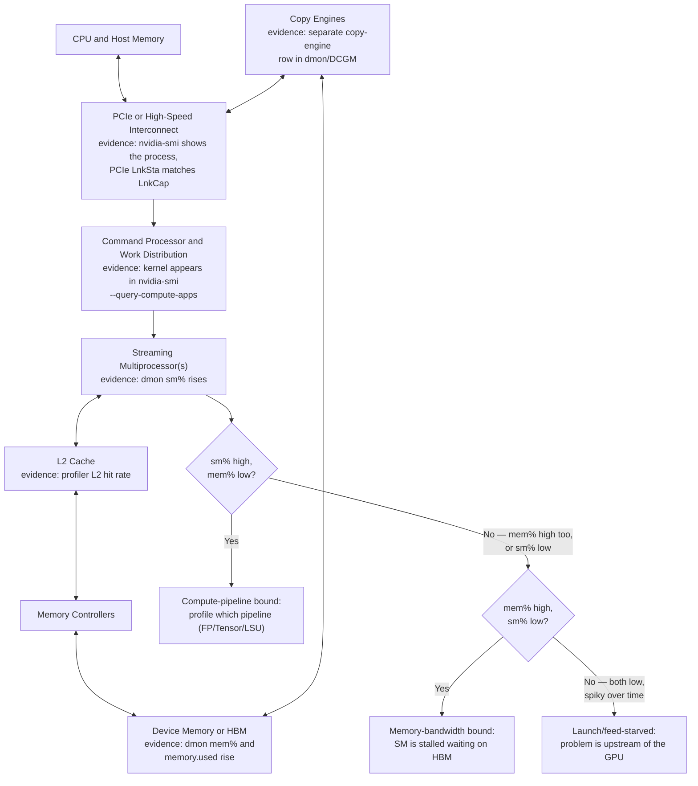
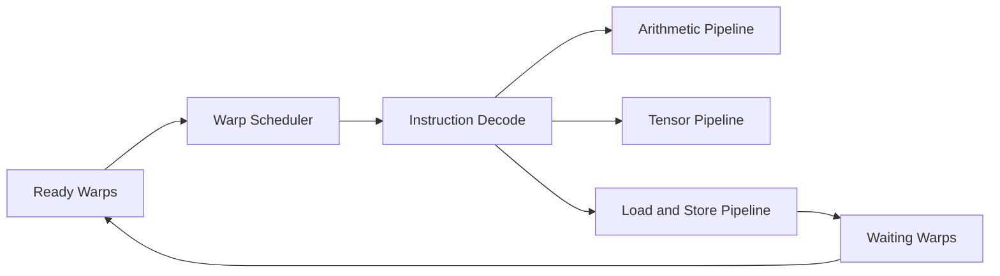
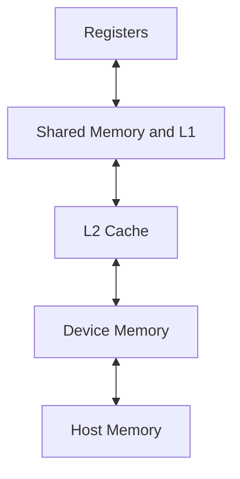

# Inside a Modern NVIDIA GPU

## Introduction

A modern NVIDIA GPU is not a flat collection of identical cores. It is a hierarchy of compute units, schedulers, register files, caches, shared memory, memory controllers, copy engines, and interconnect interfaces. Performance depends on how work and data move through that hierarchy.

Infrastructure engineers often encounter GPU specifications as a list of numbers: core count, memory capacity, bandwidth, power, and peak floating-point throughput. Those numbers matter, but they are not enough to explain behavior. Two workloads on the same GPU can produce very different utilization because they stress different internal resources.

This chapter builds the architectural map required to interpret those differences.

| Chapter field | Value |
|---|---|
| Volume | 02 — GPU Architecture |
| Difficulty | Foundation |
| Estimated reading time | 40 minutes |
| Primary focus | GPU components and their responsibilities |
| Previous | Why GPU Architecture Evolved |
| Next | Threads, Warps, Blocks, and Streaming Multiprocessors |

## Story

A model-serving team sees 95 percent GPU utilization and assumes the device is operating near maximum capability. Yet request throughput remains below target. Power draw is moderate, memory bandwidth is high, and arithmetic activity is lower than expected.

The utilization metric indicates that the device was busy during the sampling window. It does not reveal which internal resource was busy. The workload may be waiting on memory, executing unsupported code paths, moving data, or issuing inefficient kernels.

A senior engineer explains that the GPU must be treated as a system. Utilization is only the first signal. The investigation must identify which subsystem limits progress.

## Learning Objectives

After completing this chapter, you will be able to:

- Identify the major architectural regions inside a modern NVIDIA GPU.
- Explain the role of Streaming Multiprocessors, schedulers, execution units, and register files.
- Describe the relationship between on-chip memory, cache, and device memory.
- Explain how copy engines and interconnects affect data movement.
- Interpret common performance symptoms using subsystem-level reasoning.

## Big Picture

The GPU can be divided into a control-and-execution hierarchy and a memory-and-data-movement hierarchy.



**Figure 2.2.1 — Simplified GPU architecture.** Work arrives through the host interface, is distributed across Streaming Multiprocessors, and accesses device memory through shared cache and memory controllers. Each arrow is labeled with the specific tool output that proves that hop is actually active, and the bottom branch turns the diagram into the same three-way split every "GPU is slow" ticket eventually reduces to: compute-bound, memory-bound, or starved before it ever reaches the device.

**The evidence in practice — one `dmon` sample makes the diagnosis:**

```text
$ nvidia-smi dmon -s ucm -c 1
# gpu   sm   mem   enc   dec   fb   bar1
# Idx     %     %     %     %    MB     MB
    0    97    22     0     0 41200    412
```

Reading this against the decision diagram above: `sm=97%` (compute pipelines busy) with `mem=22%` (memory subsystem comparatively idle) lands on the **compute-bound** branch — the fix is a faster or more efficient kernel, not more memory bandwidth. If those two numbers were reversed (`sm` low, `mem` high), the same diagram would point at memory-bandwidth-bound instead, and the fix would be data layout or reuse, not raw FLOPs.

## Streaming Multiprocessors

The Streaming Multiprocessor, or SM, is the main programmable execution building block. A GPU contains multiple SMs. Each SM includes the resources required to keep many threads in flight.

Typical SM responsibilities include:

- Holding thread state in registers
- Scheduling ready warps
- Issuing instructions to execution pipelines
- Providing low-latency shared memory
- Accessing cache and device memory
- Coordinating synchronization within a thread block

An SM is not equivalent to a CPU core. A CPU core is designed to advance a small number of instruction streams quickly. An SM manages many warps and relies on their concurrency to sustain throughput.

## Execution Resources

Different instructions use different execution pipelines. Depending on GPU generation and product class, the architecture may include general arithmetic units, tensor-oriented units, load/store pipelines, special-function units, and other specialized resources.

| Execution resource | Typical responsibility | Common pressure signal |
|---|---|---|
| General arithmetic pipelines | Integer and floating-point operations | Compute pipeline saturation |
| Tensor-oriented pipelines | Matrix multiply-accumulate operations | High tensor activity |
| Load/store units | Move data between registers and memory hierarchy | Memory instruction pressure |
| Special-function units | Transcendental and specialized math | Serialization or pipeline limits |
| Branch/control units | Manage execution paths and predicates | Divergence and control overhead |

A kernel can saturate one pipeline while leaving others underused. Peak device throughput assumes a workload that maps efficiently to the relevant hardware.

## Warp Schedulers and Instruction Issue

Threads are grouped into warps for execution. A scheduler selects a ready warp and issues its next instruction to an appropriate pipeline. If a warp waits on memory or synchronization, another ready warp can be selected.



**Figure 2.2.2 — Warp issue model.** The scheduler chooses from ready warps and directs instructions to different pipelines. Waiting work returns to the ready pool when its dependency clears.

The scheduler does not make a serial workload parallel. Software must provide enough independent work for the scheduler to choose from.

## Register File

Registers are the fastest storage available to executing threads. They hold operands, intermediate values, pointers, and thread-local state.

The register file is large in aggregate but finite per SM. A kernel that requires many registers per thread can reduce the number of threads that fit concurrently. This can lower occupancy and reduce the GPU's ability to hide latency.

This creates a common trade-off:

- More registers can reduce spills and improve per-thread efficiency.
- Excessive register use can reduce concurrency.

The correct balance depends on the kernel.

**A worked residency calculation.** Take an SM with a 65,536 (64K) 32-bit register file and a maximum of 2,048 resident threads. If a kernel's compiler-reported register use is 32 registers/thread, the register file alone permits `65,536 / 32 = 2,048` resident threads — the full architectural maximum, register-limited exactly at the ceiling. Increase the kernel to 64 registers/thread (a plausible result of loop unrolling or caching more intermediate values) and the same register file now permits only `65,536 / 64 = 1,024` resident threads — occupancy relative to the architectural maximum is cut in half before any other resource is even considered. This is the concrete arithmetic behind the "small changes can cross allocation boundaries" warning above, and it's checkable directly from `nvcc -Xptxas=-v` output, which reports registers/thread per kernel at compile time.

## Shared Memory and L1 Cache

Shared memory is an on-chip memory region visible to threads in the same block. It enables threads to cooperate without repeatedly accessing slower device memory.

Common uses include:

- Reusing tiles of matrix data
- Exchanging partial results
- Implementing block-level reductions
- Reordering data for efficient memory access

Shared memory is fast, but capacity is limited. Large per-block allocations reduce the number of blocks that can reside on an SM.

In many architectures, L1 cache and shared-memory resources are closely related or share configurable capacity. The exact implementation varies by generation, but the architectural lesson is stable: on-chip storage is limited and must be budgeted carefully.

## L2 Cache and Device Memory

L2 cache is shared across SMs and sits between the execution units and device memory. It can reduce repeated accesses to external memory and support data sharing across the device.

Device memory provides much greater capacity than on-chip storage but has higher latency. Accelerator-class GPUs often use High Bandwidth Memory to deliver very high aggregate bandwidth. Bandwidth does not eliminate latency, and workloads must still expose enough concurrency to tolerate memory delays.



**Figure 2.2.3 — Simplified memory hierarchy.** Storage closer to execution is faster and smaller. Storage farther away is larger but more expensive to access.

| Memory level | Scope | Relative latency | Relative capacity |
|---|---|---|---|
| Registers | Individual thread | Lowest | Smallest per thread |
| Shared memory | Thread block | Very low | Limited per SM |
| L1 cache | Local to SM | Low | Limited |
| L2 cache | Shared by GPU | Moderate | Larger on-chip |
| Device memory | Whole device | High | Large |
| Host memory | CPU-visible system memory | Higher and interconnect-dependent | Very large |

## Copy Engines and Data Movement

GPUs may include dedicated engines for moving data independently of compute execution. When software uses asynchronous transfers and suitable memory, data movement can overlap with computation.

Without overlap, the pipeline becomes serial:

```text
Copy input → wait → compute → wait → copy output
```

With overlap, different batches can occupy different stages:

```text
Copy batch B while computing batch A
```

Overlap requires software support, sufficient work, and correct stream usage. Hardware capability alone does not guarantee concurrency.

## Interconnect Interfaces

The GPU communicates with CPUs, peer GPUs, NICs, and storage through system interconnects. PCIe is the common host attachment. Some platforms also use higher-bandwidth GPU interconnects or switching fabrics for peer communication.

The interface matters because data movement outside the GPU can dominate end-to-end performance. A kernel may execute quickly while the application remains slow due to host transfer, peer communication, or network synchronization.

## Architecture Trade-offs

Every internal resource is finite. GPU optimization is therefore a resource-allocation problem.

| Resource | Benefit of using more | Cost of using too much |
|---|---|---|
| Registers | Fewer spills, fast local state | Lower concurrency |
| Shared memory | Fast data reuse | Fewer resident blocks |
| Cache | Reduces external memory traffic | Limited capacity and workload dependent |
| Warps | Hides latency | Scheduling and resource pressure |
| Device memory | Holds large models and working sets | Higher access latency |
| Interconnect bandwidth | Faster external movement | Cost, topology, and platform complexity |

## Production Troubleshooting

### Symptom: High utilization, low throughput

Possible causes include:

- Memory bandwidth saturation
- Inefficient instruction mix
- Small kernels launched frequently
- Synchronization overhead
- Data movement outside the device
- Runtime-level batching or scheduling limits

### Symptom: Out-of-memory errors with free memory reported earlier

Possible causes include:

- Fragmentation
- Dynamic cache growth
- Concurrent model replicas
- Temporary workspace allocations
- Activation or KV-cache expansion

### Symptom: Strong single-GPU performance, weak multi-GPU scaling

Possible causes include:

- Peer communication through a slower path
- Poor GPU-to-NIC locality
- Synchronization overhead
- Imbalanced work distribution
- Network or collective bottlenecks

:::warning
A single utilization percentage cannot identify the limiting subsystem. Always correlate compute, memory, power, clocks, transfer activity, and application throughput.
:::

**Turning "high utilization, low throughput" into evidence.** The single most useful pairing for this symptom is `dmon`'s per-engine breakdown against application-level throughput measured over the same window:

```text
$ nvidia-smi dmon -s ucm -c 5
# gpu   sm   mem   enc   dec   fb   bar1
# Idx     %     %     %     %    MB     MB
    0    94    91     0     0 68120    512
    0    95    93     0     0 68120    512
    0    93    90     0     0 68124    512
    0    96    92     0     0 68120    512
    0    94    91     0     0 68120    512
```

`sm=94-96%` and `mem=90-93%` sustained together, not just briefly, is the signature of a genuinely memory-bandwidth-saturated kernel: the SMs report busy because they are actively issuing memory requests, but they are largely stalled waiting on those requests to return, not performing FLOPs. Application throughput (tokens/s, samples/s) measured during this same window will be well below what the GPU's peak compute spec would suggest — and that gap is the actual proof for the table's first row ("Memory bandwidth saturation"), not the utilization number alone.

**Turning "out-of-memory errors with free memory reported earlier" into evidence.** The per-process breakdown, taken right before the failure, distinguishes fragmentation from genuine growth:

```text
$ nvidia-smi --query-gpu=memory.used,memory.total --format=csv,noheader
78,850 MiB, 81,559 MiB

$ nvidia-smi --query-compute-apps=pid,used_memory --format=csv,noheader
22104, 39,200 MiB
22188, 39,650 MiB
```

`78,850 / 81,559 MiB` (~97%) allocated, split almost evenly across two processes, each near 39GB, leaves under 3GiB of headroom — the next allocation (a new request's KV cache, a growing activation buffer) has nowhere to go and fails with an out-of-memory error even though the failure "appeared" only under concurrent load, when both processes' memory grew at the same time. This is the concrete pattern behind "Concurrent model replicas" and "Activation or KV-cache expansion" in the table above.

## Customer Scenario

A customer compares two GPUs using only peak compute throughput. Their workload is a memory-intensive recommendation model with large embedding tables. The faster arithmetic specification does not produce proportional improvement because the workload spends much of its time moving data.

A strong architect evaluates memory capacity, memory bandwidth, cache behavior, batching, data placement, and end-to-end system design. Peak compute remains relevant, but it is not the dominant requirement.

## Interview Preparation

### Conceptual Questions

1. What is the role of a Streaming Multiprocessor?
2. Why can high GPU utilization coexist with poor throughput?
3. How do registers and shared memory affect concurrency?

### Architecture Questions

1. Draw the major compute and memory regions inside a GPU.
2. Explain how work moves from the host to an SM.
3. Compare registers, shared memory, L2 cache, and device memory.

### Scenario Questions

1. A workload is memory-bound. Which metrics and components matter?
2. A kernel uses many registers. What performance trade-off may occur?
3. Multi-GPU performance is poor while single-GPU performance is strong. Where do you look?

## Summary

A modern GPU is a hierarchy of execution, scheduling, memory, and data-movement resources. Streaming Multiprocessors execute warps, register files hold thread state, shared memory enables block-level cooperation, caches reduce memory traffic, device memory provides capacity, and interconnects connect the accelerator to the rest of the system.

Performance depends on which resource limits progress. Understanding the internal map allows engineers to move beyond generic utilization metrics and reason about actual bottlenecks.

## Key Takeaways

- The GPU is a system, not a flat array of cores.
- SMs schedule and execute many warps concurrently.
- On-chip memory is fast but capacity-constrained.
- Device memory provides bandwidth and capacity but has higher latency.
- End-to-end performance includes host, peer, storage, and network data movement.

## Cross References

- Previous: [Why GPU Architecture Evolved](./chapter-01-why-gpu-architecture-evolved)
- Next: [Threads, Warps, Blocks, and Streaming Multiprocessors](./chapter-03-threads-warps-blocks-and-sms)
- Related lab: [Inspect GPU Architecture and Topology](./labs/lab-01-inspect-gpu-architecture-and-topology)
