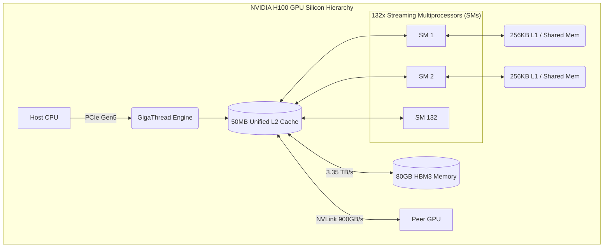

# Inside a Modern NVIDIA GPU

| Chapter metadata | Value |
|---|---|
| Volume | 02 — GPU Architecture |
| Difficulty | Advanced |
| Estimated reading time | 40 minutes |
| Primary audience | DevOps, SRE, Platform, Cloud and Infrastructure Engineers |
| Core question | When you submit a PyTorch script, what exactly happens inside the silicon of an NVIDIA GPU? |

## Introduction

In the previous chapter, we covered the high-level evolution of GPU architectures. Now, we zoom into the silicon. 

A modern NVIDIA GPU (like the H100) is not just a flat array of 14,000 identical cores. It is an incredibly complex, hierarchical distributed system contained within a single piece of silicon. It has its own operating system (the GigaThread Engine), its own intricate memory hierarchy (Registers, L1, L2, HBM), and discrete hardware blocks dedicated to very specific tasks (Tensor Cores, Copy Engines, NVDEC).

Understanding this internal geography is mandatory for a Senior Infrastructure Engineer. When a PyTorch job runs out of memory, or `nvidia-smi` shows 100% PCIe utilization but 0% Compute utilization, you cannot diagnose the root cause without knowing how data physically moves from the host, through the PCIe bus, into the L2 cache, and finally into the registers of a Streaming Multiprocessor.

:::info Principal Engineer View
Stop viewing the GPU as a black box that magically makes math fast. View it as a highly structured factory. Data enters through the loading dock (PCIe/NVLink), is stored in the warehouse (HBM), distributed to the assembly lines (L2 to L1 Cache), and processed by the workers (Streaming Multiprocessors). Bottlenecks occur when one part of the factory outpaces another.
:::

## The Hardware Map: The H100 Architecture

Let's dissect the NVIDIA Hopper H100 (SXM5) GPU. 

If you peel back the heat sink, you will see a massive central die (the GPU processor) surrounded by several smaller silicon chips. Those smaller chips are the High-Bandwidth Memory (HBM3) stacks. They are fused together on a single silicon "interposer" to allow data to travel between them at 3.35 Terabytes per second.

Inside that central GPU die, the architecture is strictly hierarchical.

### 1. The GigaThread Engine (The Boss)
When the host CPU sends a CUDA kernel (a program) to the GPU, it arrives at the **GigaThread Engine**. This is the GPU's master hardware scheduler. It receives the massive block of work, breaks it into smaller chunks (Thread Blocks), and assigns those chunks to the individual Streaming Multiprocessors. 

### 2. The L2 Cache (The Central Hub)
In the dead center of the GPU die sits a massive, unified L2 Cache (50MB in the H100). Every single compute core, memory controller, and PCIe/NVLink interface connects to this L2 Cache. 
* If a core needs data from HBM, the data is pulled into the L2 cache first.
* If a GPU receives data from another GPU over NVLink, it writes directly into the L2 cache.
* Bypassing HBM and hitting the L2 cache saves immense amounts of power and latency.

### 3. The Streaming Multiprocessor (SM) (The Assembly Line)
The **Streaming Multiprocessor (SM)** is the fundamental unit of compute in an NVIDIA GPU. 
An H100 contains up to **132 SMs**. 
When the GigaThread Engine assigns a chunk of work, it assigns it to a specific SM. Once work is on an SM, it cannot move to another SM.

Inside a single Hopper SM, you will find:
* **128 FP32 CUDA Cores:** For standard scalar math.
* **4 Tensor Cores:** For massive 4x4 matrix multiplications (utilizing the Transformer Engine for FP8).
* **4 Texture Units:** (Mostly ignored in AI, used for graphics).
* **256 KB of L1 Data Cache / Shared Memory:** Ultra-fast memory located mere micrometers from the math cores.
* **A massive Register File:** (65,536 registers per SM). This is where the actual numbers sit the moment before they are multiplied.

## Internal Working: The Memory Hierarchy

To master GPU performance, you must master the memory hierarchy. The closer memory is to the ALU (the math core), the faster it is, but the smaller its capacity.

1. **Registers (Fastest, Smallest):** Located inside the SM. This is where the variables in a CUDA thread live. Access takes 1 clock cycle.
2. **L1 Cache / Shared Memory (Very Fast, Very Small):** Also inside the SM (256KB). Shared Memory is explicitly managed by the programmer. If 32 threads in a Warp need to read the exact same array, the programmer loads it into Shared Memory once, preventing 32 slow trips to main memory.
3. **L2 Cache (Fast, Medium):** Shared across the entire GPU (50MB). 
4. **HBM3 Global Memory (Slowest, Largest):** The 80GB of memory surrounding the die. Accessing HBM takes hundreds of clock cycles. If an SM constantly has to fetch from HBM, it will stall. This is the **Memory Wall**.

### The PCIe & Copy Engine Bottleneck
The GPU cannot read files from the host's NVMe drive (unless using GPUDirect Storage). The host CPU must read the file into System RAM, and then push it over the PCIe bus to the GPU's HBM. 
The PCIe Gen5 bus maxes out at ~64 GB/s. The H100 HBM3 operates at 3,350 GB/s. 
*If your Python script constantly moves variables back and forth between the CPU and the GPU (`.to('cuda')` and `.cpu()`), your code will run at the speed of the PCIe bus (64 GB/s), entirely negating the $30,000 GPU.*

GPUs contain specialized **Copy Engines (DMA Controllers)**. These allow the GPU to pull data from the host RAM asynchronously, without interrupting the math cores. Senior engineers structure their code to overlap Compute and Copy: while the SMs are processing Batch 1, the Copy Engines are simultaneously pulling Batch 2 over PCIe.

## Advanced Silicon: Beyond Math

A modern data center GPU contains specialized hardware blocks outside of the SMs that are critical for specific workloads.

1. **NVDEC / NVENC (Video Decoders/Encoders):** If you are running an AI pipeline that analyzes security camera footage, passing raw MP4 files to the CUDA cores to decode is an extreme waste of resources. GPUs possess dedicated hardware chips (NVDEC) that decode H.264/HEVC video streams natively, dumping the raw pixels directly into HBM for the Tensor Cores to analyze. 
2. **Optical Flow Accelerator (OFA):** Specialized hardware to calculate the movement of pixels between two video frames.

## Production Deployment & Operations

Understanding the SM and Memory hierarchy dictates how you manage clusters.

### 1. MIG (Multi-Instance GPU) Architecture
When you use MIG to slice an A100 or H100 into 7 instances, you are not using software virtualization. You are configuring the hardware to physically wall off SMs, L2 Cache, and HBM memory controllers. 
If MIG Instance 1 is assigned 14 SMs and 10GB of HBM, it physically cannot access the L2 cache assigned to MIG Instance 2. This guarantees absolute QoS (Quality of Service) and prevents Cache Eviction attacks, making MIG safe for multi-tenant enterprise environments.

### 2. Monitoring the Hardware
A standard SRE looks at `nvidia-smi` and sees `GPU-Util: 100%`. A Senior SRE queries DCGM (Data Center GPU Manager) via Prometheus to see *what* is at 100%.
* `DCGM_FI_PROF_SM_ACTIVE`: Are the SMs actually doing math?
* `DCGM_FI_PROF_PIPE_TENSOR_ACTIVE`: Are the Tensor Cores being used, or is the workload falling back to legacy FP32 CUDA cores?
* `DCGM_FI_PROF_DRAM_ACTIVE`: Is the global HBM memory bandwidth pegged at 100%? (The workload is memory-bound).
* `DCGM_FI_PROF_PCIE_TX_BYTES`: Is the PCIe bus saturated? (The data loader is inefficient).

## Customer Scenario (Senior Level)

**The Situation:**
A Computer Vision team is training a ResNet-50 image classification model on a new DGX H100. They complain: "The GPU utilization in `nvidia-smi` keeps spiking from 0% to 100% and back to 0% every few seconds. Training is taking twice as long as it should."

**The Senior Architect Response:**
"Your GPU is experiencing severe Host Starvation. 

You are loading millions of JPEG images from your local NVMe drive. Your PyTorch `DataLoader` is currently using the host CPU to open the JPEGs, decode them into uncompressed pixel tensors, resize them, and then send them over the PCIe bus to the GPU. 

Because CPUs are slow at decoding JPEGs, the GPU's Streaming Multiprocessors (SMs) finish analyzing the images in a fraction of a second (the 100% spike), and then sit idle waiting for the CPU to decode the next batch (the 0% valley).

We need to rewrite your data pipeline using a library like **NVIDIA DALI** (Data Loading Library). This will allow the CPU to simply pass the raw, compressed JPEG bytes over the PCIe bus. We will then utilize the GPU's dedicated **NVDEC hardware decoders** to decompress the images directly inside the GPU's memory, completely bypassing the CPU bottleneck and keeping the Tensor Cores fed continuously."

## Interview Preparation

**Conceptual:** Explain the journey of a matrix from the Host CPU to the Tensor Cores. *(Hint: Host RAM -> PCIe Bus -> GPU Global Memory (HBM) -> L2 Cache -> SM L1 Cache / Registers -> Tensor Core).*

**Architecture:** What is the difference between the GigaThread Engine and a Streaming Multiprocessor (SM)? *(Hint: The GigaThread engine is the global scheduler that distributes thread blocks. The SM is the actual worker that executes the math).*

**Troubleshooting:** An engineer writes a Python loop that modifies a 10GB tensor on the GPU, but applies a `.cpu().numpy()` conversion inside the loop to print a debug statement. Why does the performance drop by 90%? *(Hint: Converting to CPU forces the GPU to halt, wait for the massive 10GB tensor to traverse the slow 64GB/s PCIe bus to Host RAM, print, and then copy it back. Never move data across PCIe unless absolutely necessary).*

**Hardware Features:** Why is MIG (Multi-Instance GPU) considered safer for multi-tenant Kubernetes clusters than traditional Time-Slicing? *(Hint: Time-slicing shares the same L2 cache and memory bandwidth, allowing a noisy neighbor to evict another pod's data from cache. MIG physically partitions the L2 cache and memory controllers).*

## Summary

To operate AI infrastructure effectively, you must discard the mental model of the GPU as a single processor. It is a massive, factory-like hierarchy. The GigaThread engine distributes workloads to dozens of Streaming Multiprocessors. Those SMs must pull data through a strict memory hierarchy (HBM -> L2 -> L1 -> Registers). By understanding this physical layout, a Senior Architect can look at telemetry metrics and instantly diagnose whether a workload is compute-bound (Tensor Cores saturated), memory-bound (HBM bandwidth saturated), or I/O bound (PCIe/Copy Engines saturated), allowing for precise, code-level optimizations.

## Key Takeaways

- **Streaming Multiprocessors (SMs)** are the fundamental compute units. Work assigned to an SM stays on that SM.
- The **Memory Hierarchy** dictates performance: Registers (Fastest/Smallest) > L1/Shared Memory > L2 Cache > HBM Global Memory (Slowest/Largest).
- Data movement across the **PCIe bus** is the most common and devastating bottleneck in poorly written AI code.
- Specialized hardware like **NVDEC** (Video Decoding) and **Copy Engines** (DMA) operate independently of the mathematical SMs and should be utilized to prevent host CPU starvation.

## Related Chapters

- Previous: [Why GPU Architecture Evolved](./chapter-01-why-gpu-architecture-evolved.md)
- Next: [Threads, Warps, Blocks, and Streaming Multiprocessors](./chapter-03-threads-warps-blocks-and-sms.md)
- Related lab: [Inspect GPU Engine and Memory Behavior](./labs/lab-02-inspect-gpu-engine-and-memory-behavior.md)
