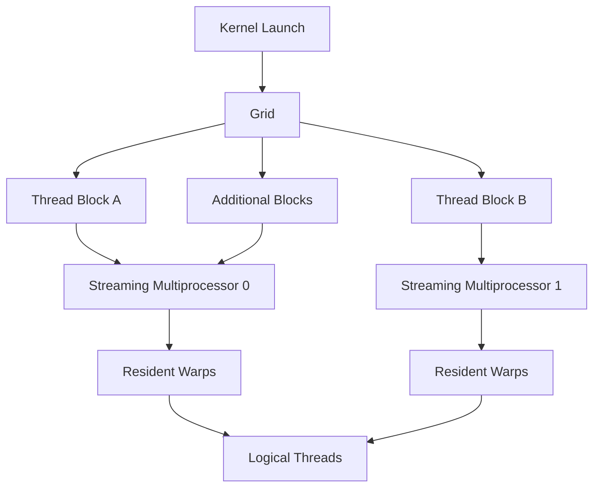
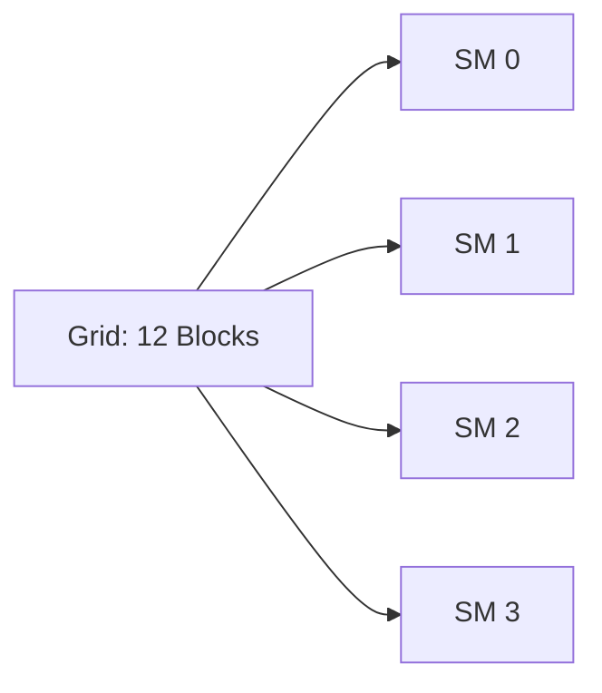
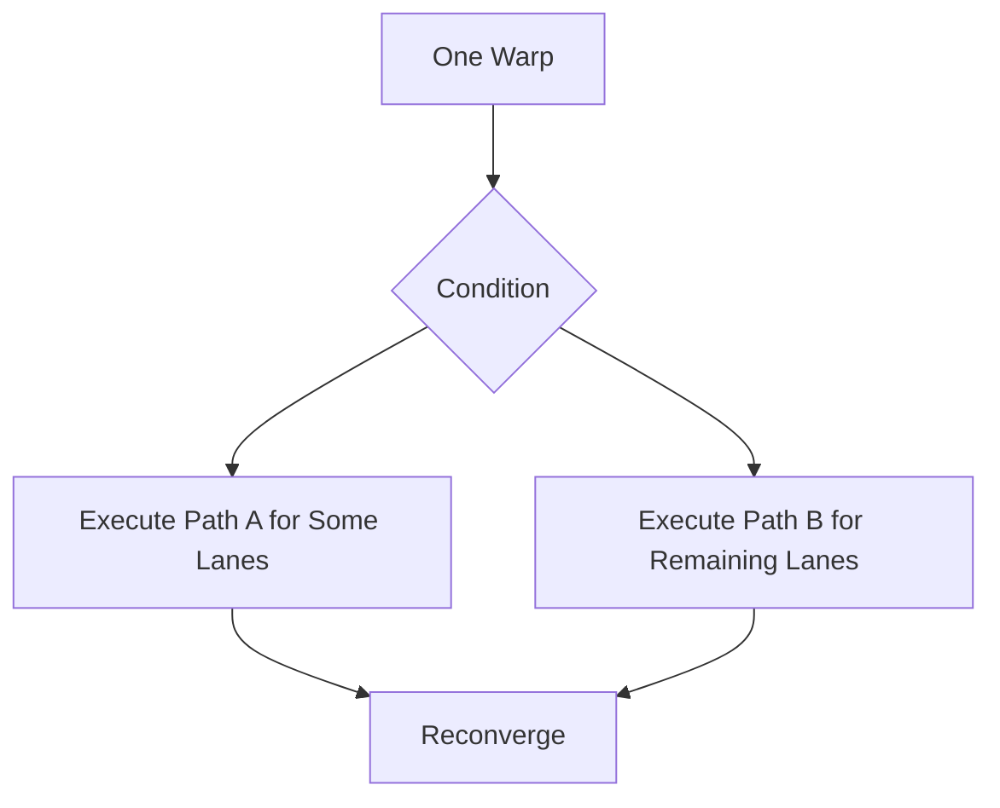
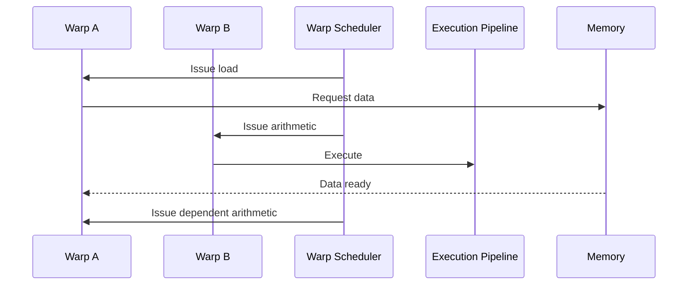

# Threads, Warps, Blocks, and Streaming Multiprocessors

## Introduction

GPU software describes a large amount of parallel work using a hierarchy: threads are grouped into blocks, blocks form a grid, and the hardware executes groups of threads called warps on Streaming Multiprocessors.

These terms are easy to memorize and easy to misunderstand. A thread is not permanently assigned to a physical core. A block is not the same as an operating-system process. A warp is not usually created explicitly by application code. The hierarchy is a contract between software and hardware that allows the GPU to scale the same program across different device sizes.

This chapter explains that contract from both the programming and infrastructure perspectives.

| Chapter field | Value |
|---|---|
| Volume | 02 — GPU Architecture |
| Difficulty | Foundation |
| Estimated reading time | 45 minutes |
| Primary focus | GPU execution hierarchy and scheduling |
| Previous | Inside a Modern NVIDIA GPU |
| Next | CUDA Cores and Tensor Cores |

## Story

A team runs the same kernel on two GPUs. The newer GPU has more Streaming Multiprocessors, but performance improves only slightly. The team expected the workload to scale automatically.

Profiling shows that the grid contains only a small number of blocks. Once those blocks are assigned, many SMs have no work. The kernel is correct, but its launch geometry cannot expose enough parallelism for the larger device.

The lesson is fundamental: hardware scale is useful only when software presents enough independent work to occupy it.

## Learning Objectives

After completing this chapter, you will be able to:

- Explain the relationship between grids, blocks, warps, and threads.
- Describe how blocks are assigned to Streaming Multiprocessors.
- Explain why warps are the practical execution unit.
- Identify branch divergence and insufficient parallelism.
- Reason about occupancy without treating it as a universal performance target.

## Big Picture

**Figure 2.3.1 — Execution hierarchy.** A kernel launch creates a grid of blocks. Blocks are assigned to SMs, where their threads are organized into warps for instruction issue.

## Threads

A GPU thread is a logical execution instance of a kernel. Each thread receives an index and usually operates on a different element or region of data.

For example, a vector-addition kernel may assign one output element to each thread. All threads run the same kernel code, but their indices lead them to different data.

Threads have private state such as registers and local variables. They can cooperate with threads in the same block through shared memory and block-level synchronization.

## Thread Blocks

A thread block is a group of threads that can cooperate efficiently. The block is the unit of placement on an SM.

Important properties include:

- All threads in a block execute on the same SM during the block's lifetime.
- Threads in a block can share on-chip shared memory.
- Threads in a block can synchronize at block-level barriers.
- Blocks should be independent so they can run in any order.

Block independence is what makes the programming model scalable. A grid can execute on a small GPU with fewer SMs or a larger GPU with more SMs without changing the algorithm.

## Grids

A grid is the complete collection of thread blocks created by one kernel launch. The grid describes the total amount of parallel work.

A grid with too few blocks may underfill the GPU. A grid with many blocks gives the scheduler more freedom to distribute work and recover from differences in block execution time.

**Figure 2.3.2 — Blocks distributed across SMs.** The hardware assigns blocks to available SMs. As blocks finish, additional blocks can be scheduled.

## Warps

A warp is a hardware-managed group of threads that execute instructions together. NVIDIA GPUs traditionally use warps of 32 threads.

Application code usually defines threads and blocks. The hardware partitions each block into warps. A block of 256 threads contains eight warps.

The warp matters because instruction issue occurs at warp granularity. Threads in the warp share an instruction stream, although predicates can disable individual lanes for particular instructions.

## Branch Divergence

When threads in the same warp take different control-flow paths, the warp may need to execute each path separately while disabling threads that do not belong to that path.

**Figure 2.3.3 — Simplified divergence.** Different paths inside one warp reduce the number of active lanes during each path.

Divergence is most harmful when it is frequent, long-lived, and evenly splits threads across complex paths. Not every branch is expensive. Uniform branches, where all threads choose the same path, do not create the same penalty.

## Block Residency

An SM can hold multiple blocks at once if resources permit. Residency depends on limits such as:

- Threads per SM
- Blocks per SM
- Warps per SM
- Registers per SM
- Shared memory per SM
- Architectural scheduling limits

A block that uses large amounts of shared memory or many registers per thread may reduce the number of blocks that can reside concurrently.

| Kernel characteristic | Possible effect |
|---|---|
| Many registers per thread | Fewer resident warps |
| Large shared-memory allocation | Fewer resident blocks |
| Very small blocks | May not use execution resources efficiently |
| Very large blocks | Can reduce scheduling flexibility |
| Few total blocks | Some SMs may remain idle |

## Occupancy

Occupancy is commonly defined as the ratio of active warps on an SM to the maximum number of warps the architecture supports.

Higher occupancy can improve latency hiding because more warps are available while others wait. However, maximum occupancy is not automatically maximum performance.

A kernel with lower occupancy may still perform well if it has:

- High instruction-level parallelism
- Efficient memory access
- Strong data reuse
- Few long-latency stalls

A kernel with high occupancy may still perform poorly if it is bandwidth-bound, divergent, or dominated by synchronization.

:::important
Treat occupancy as a diagnostic dimension, not a score. The correct question is whether the kernel has enough active work to hide its dominant latencies.
:::

## Scheduling Inside an SM

An SM maintains state for resident warps. Warp schedulers select ready warps and issue instructions to execution pipelines.

**Figure 2.3.4 — Warp scheduling hides latency.** The scheduler issues another ready warp while Warp A waits for memory.

This scheduling is inexpensive because the state of many threads already resides on the SM. The GPU does not perform a heavyweight operating-system context switch between these warps.

## Mapping Work to Data

A well-designed kernel maps thread indices to data in a way that supports efficient access and balanced work.

Common mapping problems include:

- Threads in one warp accessing scattered memory locations
- Some blocks receiving far more work than others
- Dimensions that create partially filled warps
- More synchronization than the algorithm requires
- Too little work per kernel launch

These problems originate in application design but appear as infrastructure symptoms such as low utilization, long runtimes, or poor scaling.

## Architecture Trade-offs

### Smaller blocks

Advantages:

- More placement flexibility
- Lower per-block resource demand
- Useful for irregular workloads

Risks:

- Too few warps per block
- Poor execution-resource utilization
- More block-management overhead relative to work

### Larger blocks

Advantages:

- More threads available for cooperation
- Potentially efficient shared-memory tiling
- More warps per resident block

Risks:

- Higher register and shared-memory pressure
- Fewer resident blocks
- Reduced scheduling flexibility

The correct size depends on resource usage and workload structure.

## Production Troubleshooting

### Problem: Newer GPU provides little speedup

Check:

1. Total number of blocks
2. Blocks per SM
3. Kernel duration
4. Register and shared-memory limits
5. Memory bandwidth and transfer time
6. Whether the application serializes launches

### Problem: Utilization oscillates

Possible causes:

- Bursty kernel launches
- CPU preprocessing gaps
- Small grids
- Frequent synchronization
- Request batching that is too small

### Problem: High occupancy but poor performance

Possible causes:

- Uncoalesced memory access
- Branch divergence
- Bandwidth saturation
- Excess synchronization
- Low arithmetic intensity

## Customer Scenario

A customer sizes a cluster using only GPU count. Their inference service processes one request at a time with small batches. Each request launches kernels that expose little parallel work. Adding GPUs reduces queueing only slightly because individual requests still underfill each device.

The architectural options include batching, request concurrency, smaller GPU partitions, or a GPU class better matched to the workload. Purchasing larger GPUs without changing execution geometry may increase idle capacity.

## Interview Preparation

### Conceptual Questions

1. What is the difference between a thread block and a warp?
2. Why must all threads in a block execute on the same SM?
3. Why is maximum occupancy not always the goal?

### Architecture Questions

1. Draw the path from kernel launch to warp execution.
2. Explain which resources limit block residency.
3. Describe how warp scheduling hides latency.

### Scenario Questions

1. A grid contains fewer blocks than the GPU has SMs. What happens?
2. A kernel has high register use and low occupancy. Is that necessarily bad?
3. Threads in a warp follow different long code paths. What performance effect do you expect?

## Summary

The GPU execution hierarchy separates logical parallel work from physical hardware. Applications launch grids of thread blocks. Blocks are assigned to SMs. The hardware divides their threads into warps and schedules ready warps onto execution pipelines.

Performance depends on exposing enough independent work while respecting finite register, shared-memory, and scheduling resources. Occupancy, divergence, and launch geometry are tools for reasoning about that balance.

## Key Takeaways

- Threads are logical kernel instances.
- Blocks are cooperative groups and the unit of SM placement.
- Warps are the practical instruction-issue groups.
- SMs keep multiple warps resident to hide latency.
- Occupancy is useful only in the context of the workload's bottleneck.

## Cross References

- Previous: [Inside a Modern NVIDIA GPU](./chapter-02-inside-a-modern-nvidia-gpu)
- Volume introduction: [GPU Architecture](./index)
- Related lab: [Inspect GPU Architecture and Topology](./labs/lab-01-inspect-gpu-architecture-and-topology)
