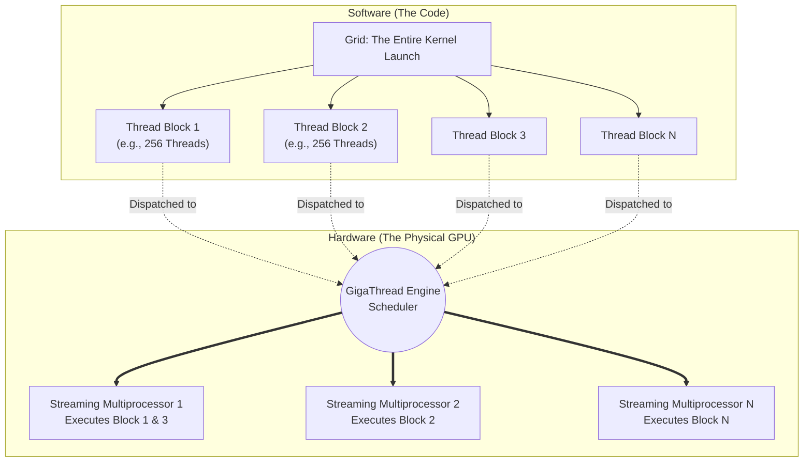

# Threads, Warps, Blocks, and Streaming Multiprocessors

| Chapter metadata | Value |
|---|---|
| Volume | 02 — GPU Architecture |
| Difficulty | Advanced |
| Estimated reading time | 45 minutes |
| Primary audience | DevOps, SRE, Platform, Cloud and Infrastructure Engineers |
| Core question | How does the software concept of a "Thread Block" map exactly to the physical hardware of a GPU? |

## Introduction

In Chapter 2, we mapped the physical hardware of the GPU: the GigaThread Engine, the L2 Cache, and the Streaming Multiprocessors (SMs). 

Now, we must map the *software* to that hardware. When a Python script or a C++ program tells the GPU to multiply two massive matrices, how does the GPU physically divide that work? 

NVIDIA solves this using a strict execution hierarchy: **Threads, Warps, Thread Blocks, and Grids**. 

If a Data Scientist configures this hierarchy incorrectly, a $30,000 H100 GPU will run slower than a laptop CPU. As an Infrastructure Architect, you will not write this CUDA code daily, but you *must* understand the terminology to profile the workload, interpret `nsys` (Nsight Systems) performance traces, and explain to application teams why their code is severely underutilizing the cluster.

:::info Principal Engineer View
The CUDA execution hierarchy is a contract between the software and the hardware. Software defines the logical grouping (Blocks and Grids), and the hardware handles the physical execution (Warps scheduling on SMs). This abstraction is what allows a PyTorch script written 5 years ago for a Volta GPU to automatically scale and run seamlessly on a massive Blackwell GPU today.
:::

## The Software Hierarchy (The "What")

When a developer writes a function to be executed on the GPU, that function is called a **Kernel**. To execute a Kernel across millions of data points (like pixels in an image or tokens in an LLM), the GPU spawns millions of **Threads**.

These threads are not spawned randomly. They are grouped into a strict, three-tier software hierarchy.

### 1. The Thread (The Worker)
A single Thread executes the Kernel function on a single piece of data. 
* Unlike an OS thread (which is heavy and requires context switching), a CUDA thread is incredibly lightweight. The GPU holds thousands of them in physical registers simultaneously.

### 2. The Thread Block (The Team)
Threads are grouped into **Thread Blocks**. 
* A Thread Block typically contains between 32 and 1024 threads.
* **Crucial Rule:** All threads within the *same* Thread Block are guaranteed to be scheduled on the *same* physical Streaming Multiprocessor (SM). 
* Because they are on the same SM, they can communicate with each other incredibly fast using the SM's L1 Shared Memory, and they can synchronize their execution using hardware barriers.

### 3. The Grid (The Entire Job)
Thread Blocks are grouped into a **Grid**. 
* The Grid represents the entire Kernel launch. If you have 1 million threads, you might group them into 1,000 Thread Blocks (of 1,000 threads each).
* **Crucial Rule:** Thread Blocks within a Grid are completely independent. They can execute in any order, simultaneously or sequentially. They *cannot* communicate with each other using fast Shared Memory (they must use slow Global HBM).

## Mapping Software to Hardware (The "How")

The genius of CUDA is how this software hierarchy dynamically maps to whatever physical hardware is available.



### The Abstraction Advantage
If you run this code on an old laptop GPU with only 2 SMs, the GigaThread Engine will schedule Block 1 on SM 1, and Block 2 on SM 2. Block 3 will have to wait in a queue.
If you run the *exact same code* on an H100 with 132 SMs, the GigaThread Engine will distribute all 132 blocks instantly across all 132 SMs. 

This is why Thread Blocks must be independent. It allows the GPU architecture to scale massively generation-over-generation without requiring developers to rewrite their code.

## The Secret Hardware Layer: Warps

We know that a Thread Block is assigned to an SM. But how does the SM actually execute the hundreds of threads inside that block? 

It does not execute them all independently. It chops the Thread Block into groups of **32 threads** called **Warps**.

### SIMT Execution (Single Instruction, Multiple Threads)
A Warp is the fundamental physical unit of execution in an NVIDIA GPU. 
When a Warp executes, **all 32 threads in the Warp must execute the exact same instruction at the exact same time**. 

If the instruction is `C = A + B`:
* Thread 0 adds `A[0] + B[0]`
* Thread 1 adds `A[1] + B[1]`
* ...
* Thread 31 adds `A[31] + B[31]`

They do this simultaneously, sharing a single instruction decoder on the SM. This is incredibly efficient for silicon space.

### The Danger: Warp Divergence
Because all 32 threads in a Warp share an instruction decoder, they *must* walk in lockstep. What happens if the code contains an `if/else` statement?

```python
if data > 0:
    # Do Path A
else:
    # Do Path B
```

If 16 threads in the Warp evaluate to True (Path A), and 16 threads evaluate to False (Path B), the Warp suffers from **Warp Divergence**. 
The hardware cannot execute Path A and Path B at the same time. The SM must *pause* the 16 False threads, execute Path A for the True threads, and then *pause* the True threads to execute Path B for the False threads. 

**The execution time doubles.** The mathematical throughput of the GPU drops by 50% instantly. 
*(Senior Rule: Never put complex branching logic inside a GPU kernel. Data preprocessing and branching should happen on the CPU).*

## Occupancy and Hiding Latency

If a GPU core is waiting for data to arrive from Global Memory (HBM), it is stalling. GPUs solve this not with massive CPU-style caches, but with massive concurrency.

**Occupancy** is the ratio of active Warps on an SM compared to the maximum number of Warps that SM can physically hold.

If an SM is currently executing Warp 1, and Warp 1 requests data from HBM (which takes 300 clock cycles), the SM's Warp Scheduler instantly swaps out Warp 1 and begins executing Warp 2, which already has its data ready in the physical registers.

To hide memory latency completely, the SM must have a high Occupancy. It needs enough "backup" Warps sitting in the registers to switch to whenever the current Warp stalls. 

### What limits Occupancy?
If you assign too many threads to a block, or if the threads use too many physical registers or too much L1 Shared Memory, the SM will not have enough physical resources to hold many blocks at once. The Occupancy will drop, the SM will run out of backup Warps to switch to, and the entire GPU will stall waiting on memory.

## Customer Scenario (Senior Level)

**The Situation:**
A machine learning engineer approaches the Platform Team. "I wrote a custom PyTorch CUDA extension to process our financial timeseries data. I set my Thread Block size to 1,024 threads because I want maximum parallelism. But when I profile it on the A100, Nsight Systems shows the GPU is memory-stalling constantly, and my Occupancy is only 15%."

**The Senior Architect Response:**
"Your Thread Block size is actually causing the stall. You have configured your code for 'maximum parallelism' logically, but you have violated the physical limits of the Streaming Multiprocessor (SM).

An A100 SM has a finite number of hardware registers (65,536). When you launch a Thread Block of 1,024 threads, those threads require a massive number of registers to hold their local variables. Because your block consumes so many registers, the SM physically cannot fit a second Thread Block onto the core simultaneously. 

Therefore, you only have one active block per SM. When the Warps in that single block issue a read to Global Memory (HBM) and stall, the SM has no other blocks to swap to. The entire SM sits idle waiting for RAM. 

To fix this, we need to reconfigure your kernel launch parameters. We should reduce your Thread Block size to 128 or 256 threads. This will consume fewer registers per block, allowing the hardware scheduler to pack 4 or 8 blocks onto the SM simultaneously. This will drastically increase your Occupancy, providing the SM with dozens of backup Warps to execute while waiting for memory, completely hiding the latency."

## Interview Preparation

**Conceptual:** What is a Warp? Why is the number 32 critical to GPU performance? *(Hint: A Warp is 32 threads executing SIMT in lockstep. Memory accesses and neural network layers should align to multiples of 32 for optimal hardware utilization).*

**Architecture:** Explain the difference between a Thread Block and a Grid. Why can threads in a Block communicate fast, but threads across a Grid cannot? *(Hint: A Block is physically locked to a single SM, allowing use of ultra-fast L1 Shared Memory. A Grid spans the entire GPU across dozens of SMs).*

**Troubleshooting:** What is Warp Divergence? How does it impact the TeraFLOPS output of a GPU? *(Hint: Branching if/else logic forces the 32 threads in a warp to execute sequentially rather than parallel, immediately halving or quartering the compute throughput).*

**Advanced Tuning:** Why does high "Occupancy" hide memory latency on a GPU? *(Hint: Zero-cost context switching. If a Warp stalls on a memory read, the scheduler instantly executes another resident Warp).*

## Summary

The immense power of an NVIDIA GPU is not magic; it is the result of strict, mechanical scheduling. Software dictates the logical grouping (Grids and Blocks), but the hardware enforces the physical reality (Streaming Multiprocessors and Warps). By understanding that GPUs execute in rigid lockstep (SIMT), Senior Engineers can instantly identify why branching `if/else` logic destroys AI performance (Warp Divergence), and why tuning Block Sizes is mandatory to maintain high Occupancy and hide memory latency. 

## Key Takeaways

- **Grid:** The entire job.
- **Thread Block:** A group of threads (max 1024) guaranteed to run on the *same* physical SM, sharing L1 cache.
- **Warp:** The physical execution unit. 32 threads executing the *exact same instruction* simultaneously (SIMT).
- **Warp Divergence:** Branching logic causes threads in a Warp to execute sequentially, devastating performance.
- **Occupancy:** Keeping enough Warps resident on the SM to hide memory latency through zero-cost context switching.

## Related Chapters

- Previous: [Inside a Modern NVIDIA GPU](./chapter-02-inside-a-modern-nvidia-gpu.md)
- Next: [CUDA Cores and Tensor Cores](./chapter-04-cuda-cores-tensor-cores-and-rt-cores.md)
