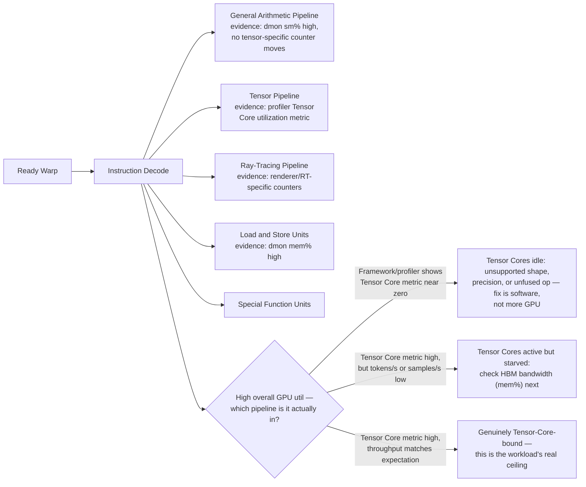
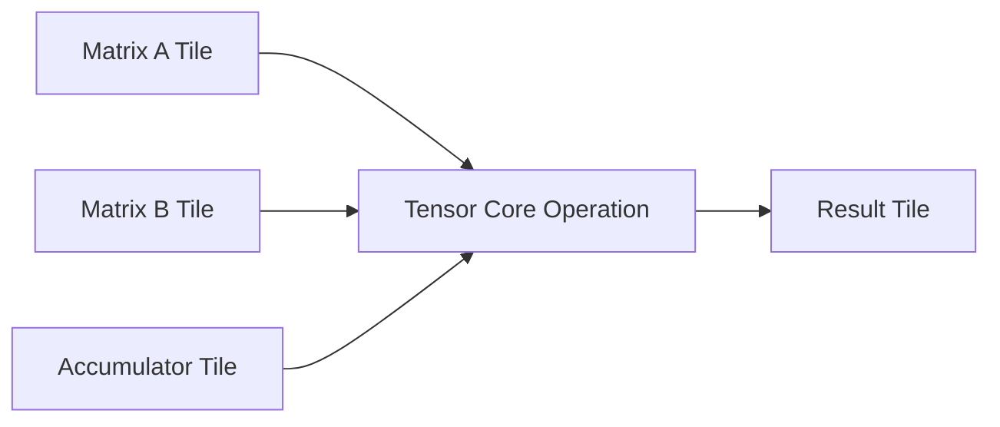
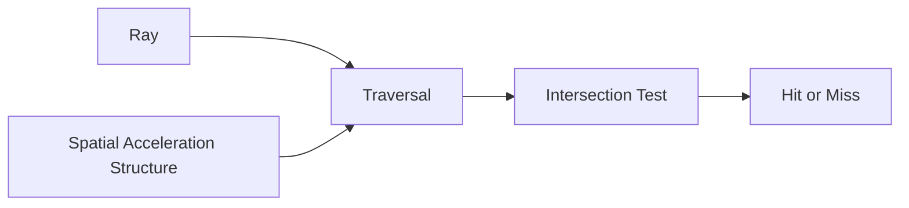
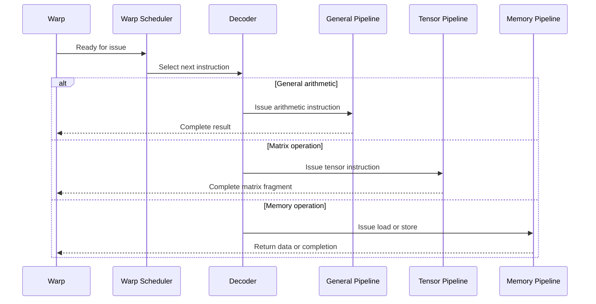

# CUDA Cores, Tensor Cores, and RT Cores

## Introduction

A modern GPU is not built from one repeated arithmetic unit. It contains several execution engines, each optimized for a different class of work. This is easy to misunderstand because product specifications often reduce the architecture to counts: CUDA Cores, Tensor Cores, RT Cores, clock rates, and theoretical throughput.

Those numbers are useful only after the reader understands what each engine is designed to execute. A CUDA Core is not simply a slower Tensor Core. A Tensor Core is not a replacement for general-purpose arithmetic. An RT Core is not an AI accelerator. Each exists because different workloads place different demands on the hardware.

This chapter explains why NVIDIA introduced specialized execution engines, how work reaches them, and why software determines whether the hardware is used effectively.

| Chapter field | Value |
|---|---|
| Volume | 02 - GPU Architecture |
| Difficulty | Foundation |
| Estimated reading time | 40 minutes |
| Primary focus | GPU execution engines |
| Previous chapter | Threads, Warps, Blocks, and Streaming Multiprocessors |
| Next chapter | GPU Memory Hierarchy |

## Story

A platform team compares two inference workloads on the same GPU. The first workload performs traditional preprocessing and custom CUDA kernels. The second performs large matrix multiplications using an optimized deep learning framework. Both workloads report high GPU utilization, but the second finishes much faster.

The team initially assumes the difference comes from better code. That is only part of the answer. The framework is dispatching matrix operations to Tensor Cores, while the custom kernels are using general arithmetic pipelines. The same physical GPU is behaving like two different machines because different execution engines are active.

The lesson is architectural: utilization percentages do not explain which part of the GPU is doing useful work.

## Learning Objectives

After completing this chapter, you will be able to:

- Explain why GPUs use specialized execution engines.
- Distinguish CUDA Cores, Tensor Cores, and RT Cores by workload type.
- Describe how warps issue instructions to different execution pipelines.
- Explain why software libraries determine access to specialized hardware.
- Diagnose cases where a workload fails to use the expected engine.

## Big Picture

Inside a Streaming Multiprocessor, multiple execution pipelines coexist. The warp scheduler selects ready warps and issues instructions to the pipeline that can execute the required operation.



**Figure 2.4.1 - Specialized execution inside an SM.** A warp does not choose a core directly. Its instructions are decoded and routed to the appropriate pipeline. The exact arrangement varies by GPU generation, but the principle remains stable: general arithmetic, matrix acceleration, memory operations, special functions, and ray-tracing work are handled by different resources. The decision branch is the chapter's central warning made checkable: `nvidia-smi`'s single utilization number cannot tell you *which* pipeline is busy, so a high overall percentage still requires a separate, pipeline-specific check before you can say a model is actually using Tensor Cores.

**The gap between "GPU busy" and "Tensor Cores busy," made concrete.** `nvidia-smi`'s headline utilization field only reports whether *any* engine was active — it does not break down which one:

```text
$ nvidia-smi --query-gpu=utilization.gpu,utilization.memory --format=csv,noheader
91 %, 18 %
```

`utilization.gpu=91%` alone is consistent with three very different situations: a Tensor-Core-bound matmul, a purely scalar CUDA-Core kernel doing indexing work, or a kernel stalled on load/store units. `utilization.memory=18%` here at least rules out a memory-bandwidth-bound explanation, but distinguishing "Tensor Cores busy" from "CUDA Cores busy" still requires a profiler's pipeline-specific counter (Nsight Compute's Tensor Core utilization metric, or a framework-level op trace showing which kernels were dispatched) — `nvidia-smi` alone cannot answer the question this chapter opens with.

## Why Specialization Exists

General-purpose hardware is flexible, but flexibility consumes transistors, power, and time. When an operation appears frequently enough, implementing a dedicated datapath can produce more useful work per clock and per watt.

AI workloads repeatedly execute dense matrix operations. Graphics workloads repeatedly evaluate ray and geometry intersections. General compute workloads still require scalar arithmetic, comparisons, address calculations, and control logic. A single universal pipeline would either waste resources or perform specialized work inefficiently.

| Workload pattern | Best-suited engine | Reason |
|---|---|---|
| Scalar and vector arithmetic | CUDA Core pipelines | Flexible execution of general instructions |
| Matrix multiply-accumulate | Tensor Cores | High-throughput fused matrix operations |
| Ray traversal and intersection | RT Cores | Dedicated acceleration for ray-tracing algorithms |
| Memory movement | Load/store units | Address generation and memory transactions |
| Transcendental math | Special function units | Hardware support for selected complex functions |

Specialization improves efficiency, but it also creates a software responsibility. Applications must express work in a form that libraries and compilers can map to the correct engine.

## CUDA Cores

The term **CUDA Core** is commonly used for arithmetic execution lanes that process general-purpose floating-point and integer instructions. They are the most flexible compute resources in the GPU.

CUDA Cores participate in operations such as:

- floating-point addition and multiplication
- integer arithmetic
- logical operations
- address calculations
- comparisons
- portions of custom CUDA kernels

A warp instruction operates across active threads. The scheduler issues that instruction to an eligible execution pipeline. The hardware then processes the instruction over one or more cycles depending on pipeline width, instruction type, dependencies, and active lanes.

:::note
A CUDA Core count is not directly comparable across GPU generations. Pipeline organization, clock rate, instruction support, scheduling, data type, and memory behavior all influence real performance.
:::

### When CUDA Cores dominate

CUDA Core pipelines are heavily used when workloads contain custom element-wise operations, control-heavy kernels, reductions, indexing, preprocessing, post-processing, or arithmetic that cannot be represented as large tensor operations.

They are also essential around Tensor Core operations. A neural network does not consist only of matrix multiplication. Data preparation, activation functions, normalization, memory movement, indexing, and control still require general execution resources.

## Tensor Cores

Tensor Cores were introduced to accelerate matrix multiply-accumulate operations. Conceptually, they evaluate a pattern similar to:

```text
D = A × B + C
```

where `A`, `B`, `C`, and `D` are matrix fragments. The hardware performs many multiply-accumulate operations as a coordinated unit rather than issuing each multiplication and addition separately through general arithmetic lanes.



**Figure 2.4.2 - Tensor Core operation.** Tensor Cores accelerate structured matrix operations using tiles and supported data types.

Tensor Cores are useful because training and inference workloads spend substantial time in matrix multiplication, convolution, attention, and related linear algebra. Frameworks and libraries such as cuBLAS, cuDNN, TensorRT, and deep learning frameworks can transform higher-level operations into Tensor Core instructions.

### Data types matter

Tensor Core behavior depends on the GPU generation and supported numerical formats. Lower-precision formats can increase throughput and reduce memory traffic, but they may affect numerical behavior. Software often combines lower-precision inputs with higher-precision accumulation to balance speed and accuracy.

Architects should avoid treating “Tensor Core enabled” as a binary property. Real use depends on:

- tensor dimensions and alignment
- selected data type
- framework and library versions
- kernel implementation
- model structure
- precision policy
- memory layout

**A worked comparison: FP32 versus Tensor-Core FP16, in real GB moved.** A `[4096, 4096]` weight matrix stored at FP32 (4 bytes/element) is `4096 x 4096 x 4 ≈ 67.1 MB`. The same matrix at FP16 (2 bytes/element, the common Tensor Core input format) is `4096 x 4096 x 2 ≈ 33.6 MB` — half the bytes moved from HBM for the identical matrix multiply. This is why switching a model to FP16/BF16 for Tensor Core eligibility is not just "faster math" — it directly halves the memory-bandwidth demand of every weight read, which is often the larger practical win for a memory-bound serving workload. The arithmetic-throughput increase from Tensor Cores is additional, separate benefit on top of that bandwidth halving.

### Why Tensor Cores may remain idle

A workload can run on a GPU without using Tensor Cores. Common causes include unsupported dimensions, unsupported precision, unoptimized kernels, small operations, framework configuration, or graph transformations that prevent efficient fusion.

High overall GPU utilization therefore does not prove effective Tensor Core usage.

## RT Cores

RT Cores accelerate ray-tracing operations used in graphics, rendering, simulation, visualization, and some spatial workloads. They are designed to reduce the cost of traversing acceleration structures and testing ray intersections.



**Figure 2.4.3 - Simplified RT Core workflow.** Dedicated hardware accelerates traversal and intersection operations that would otherwise consume general compute resources.

RT Cores are important in visualization and digital-twin workflows, but they should not be confused with Tensor Cores. Their purpose is geometric acceleration, not general AI matrix execution.

## Internal Working

A kernel is compiled into instructions. At runtime, warps become eligible when their operands are ready and required resources are available. The scheduler selects a warp and issues its next instruction.



**Figure 2.4.4 - Instruction routing.** The scheduler chooses a warp, while the instruction type determines which pipeline executes the work.

Execution engines can become imbalanced. A workload may saturate Tensor Cores while waiting on memory. Another may leave Tensor Cores idle while general pipelines perform indexing and element-wise operations. Performance engineering requires identifying the active bottleneck rather than assuming every engine should be fully utilized.

## Architecture Considerations

### Throughput is pipeline-specific

Theoretical GPU throughput is usually quoted for a specific data type and operation class. FP32 arithmetic throughput, low-precision Tensor Core throughput, and ray-tracing performance measure different capabilities. They should not be combined into a single generic performance number.

### Memory can dominate compute

Specialized engines are useful only when data arrives fast enough. Tensor Cores can complete matrix operations rapidly, but they still depend on registers, shared memory, caches, and HBM. Poor tiling or low data reuse can make a Tensor Core kernel memory-bound.

### Workload diversity matters

An inference service may contain tokenization on CPU, embeddings, attention, normalization, sampling, and network response handling. Only part of the request uses Tensor Cores. End-to-end performance therefore depends on the whole pipeline.

## Production Deployment

In production, engine utilization is influenced by software choice. Teams should validate representative models using the exact framework, precision mode, batch profile, sequence length, and runtime configuration planned for deployment.

A useful validation sequence is:

1. Confirm the workload executes correctly.
2. Measure end-to-end latency and throughput.
3. Profile kernel categories.
4. Confirm expected data types.
5. Check whether matrix operations use optimized libraries.
6. Inspect memory behavior and occupancy.
7. Compare results against a known baseline.

Do not optimize by core count alone. Select systems based on workload evidence.

## Production Troubleshooting

### Problem: Tensor Cores appear underused

| Symptom | Possible cause | Investigation |
|---|---|---|
| High GPU utilization but low model throughput | General kernels dominate | Profile kernel mix |
| Matrix kernels use general pipelines | Unsupported precision or shape | Inspect framework and kernel configuration |
| Tensor kernels are present but short | Small batches or small matrices | Test representative batching |
| Tensor kernels wait frequently | Memory bottleneck | Inspect memory throughput and stalls |

**Turning "high GPU utilization but low model throughput" into evidence.** A `dmon` trace during inference, paired with the application's own tokens/s counter over the same window, is the concrete version of "general kernels dominate":

```text
$ nvidia-smi dmon -s ucm -c 4
# gpu   sm   mem
# Idx     %     %
    0    92    24
    0    90    22
    0    93    25
    0    91    23
```

`sm=90-93%` with `mem` comparatively low (22-25%) rules out a memory-bandwidth explanation, and if the application-level throughput logged during this same window is well below what the model's known FLOPs and this GPU's peak FP16 throughput would predict, the gap points at exactly the row's hypothesis: general-purpose CUDA-Core kernels (indexing, normalization, activation functions, unfused ops between matmuls) are consuming SM cycles that should be going to Tensor Core matmuls. The next step — confirming which kernels are actually running — needs a profiler kernel-mix breakdown (Nsight Systems timeline or framework op trace), not `dmon` alone; `dmon` only tells you *that* the SMs are busy, not *with what*.

**Turning "matrix kernels use general pipelines" into evidence.** The most common concrete cause is a shape or precision mismatch, and it is checkable from the framework's own dtype reporting before touching a profiler:

```python
>>> import torch
>>> w = torch.randn(4096, 4097, device="cuda", dtype=torch.float16)  # note: 4097, not 4096
>>> x = torch.randn(32, 4097, device="cuda", dtype=torch.float16)
>>> (x @ w.T).dtype
torch.float16
```

A width of `4097` instead of `4096` looks trivial but breaks the tile-alignment assumptions many Tensor Core kernel implementations rely on — frameworks commonly fall back silently to a general (non-Tensor-Core) matmul kernel for misaligned or odd-sized dimensions rather than erroring. The symptom is identical to the row above (high `sm%`, low throughput); the root cause here is specifically a shape that fails Tensor Core eligibility, confirmable by checking the framework's kernel-selection log or profiler trace for which matmul implementation was actually dispatched.

### Problem: Upgrading hardware does not improve latency

A newer GPU may provide much higher Tensor Core throughput, but the application may be CPU-bound, memory-bound, network-bound, or dominated by small sequential operations. Compare request-stage latency rather than assuming the GPU is the only limiting component.

### Problem: RT Core count is used to justify an AI purchase

This is a requirements error. RT Cores may be valuable for visualization or simulation, but they are not a substitute for Tensor Core suitability, memory capacity, memory bandwidth, and software compatibility in AI workloads.

## Customer Scenario

A customer asks why two GPUs with similar power envelopes perform differently on the same model. A strong architect does not answer with core counts alone. The architect examines precision, memory capacity, memory bandwidth, Tensor Core generation, software stack, batch size, model shape, and end-to-end bottlenecks.

The recommendation should explain which execution engines the workload actually uses and whether the rest of the system can feed them efficiently.

## Interview Preparation

### Conceptual Questions

1. Why do modern GPUs contain specialized execution engines?
**Model answer:** "Because a fully general pipeline that's good at everything is good at nothing in particular — flexibility costs transistors and power. Matrix multiply-accumulate shows up constantly enough in AI and graphics workloads that a dedicated datapath for it produces far more useful work per watt than routing it through general arithmetic lanes. So the GPU keeps flexible CUDA Core pipelines for the long tail of general work, and adds Tensor Cores specifically for the operation that dominates training and inference time."

2. How do CUDA Cores differ from Tensor Cores?
**Model answer:** "CUDA Cores execute one scalar or vector arithmetic instruction per thread — flexible, general-purpose, used for indexing, elementwise ops, control logic, anything that isn't a clean dense matmul. Tensor Cores instead take small matrix fragments — A, B, and an accumulator C — and compute D = A×B+C as a single fused hardware operation across many values at once. You don't get to choose a Tensor Core directly from a for-loop; a library like cuBLAS or cuDNN has to recognize the operation shape and dispatch to it."

3. Why can GPU utilization be high while Tensor Core utilization is low?
**Model answer:** "Because `nvidia-smi`'s utilization number just means *some* engine was active during the sample window — it doesn't say which one. I've seen this concretely: `dmon` showing `sm=92%` sustained, but application throughput far below what the model's FLOPs and the GPU's rated Tensor Core throughput would predict. That gap means the SMs are busy running general-purpose kernels — normalization, activation functions, unfused glue ops between matmuls — while the Tensor Cores that should be doing the heavy lifting sit comparatively idle. You need a profiler's pipeline-specific metric, not `nvidia-smi`, to actually see that."

### Architecture Questions

1. Explain how a warp instruction reaches an execution pipeline.
**Model answer:** "The warp scheduler picks an eligible warp — operands ready, no outstanding dependency — and the decode stage looks at the instruction's opcode to determine which pipeline can execute it: general arithmetic, Tensor, load/store, or special function. The warp itself never chooses; routing happens at decode based purely on what the instruction actually is. That's why a kernel can be 'running' at high occupancy while still routing every instruction through the wrong, oversubscribed pipeline."

2. Design a validation plan for confirming Tensor Core use in an inference workload.
**Model answer:** "I'd start by confirming the workload runs correctly and produces expected output, then measure baseline end-to-end latency and throughput. Next I'd profile the kernel mix with Nsight Systems or a framework trace to see which kernels actually get dispatched, and cross-check dtype — is the model genuinely running FP16/BF16/INT8, or silently upcast to FP32 somewhere. Then I'd check for a Tensor-Core-specific utilization metric from the profiler, not just `nvidia-smi`. Only after all of that would I compare against a known-good baseline and conclude Tensor Cores are actually engaged, not just available."

3. Explain why memory architecture still matters when Tensor Core throughput is high.
**Model answer:** "Because Tensor Cores can only compute as fast as data reaches them — a Tensor Core kernel with poor tiling or low data reuse is still bottlenecked by HBM bandwidth even though the 'compute' engine involved happens to be a Tensor Core. I'd check `dmon`'s `mem%` alongside `sm%`: both high together, sustained, is the actual signature of a memory-bound Tensor Core kernel, and no amount of additional Tensor Core throughput fixes that — you need better reuse or a different memory hierarchy."

### Scenario Questions

1. A model becomes faster after switching precision. What changed architecturally?
**Model answer:** "Two things changed together, and I'd want to know which one actually mattered. First, the bytes moved per weight halved — FP16 is 2 bytes versus FP32's 4, so a 4096×4096 matrix drops from about 67MB to about 34MB, directly cutting HBM bandwidth demand. Second, the operation may now be Tensor-Core-eligible, since Tensor Cores commonly require lower-precision inputs. If the workload was memory-bound, the bandwidth halving is doing most of the work; if it was compute-bound, the Tensor Core eligibility matters more. I'd check `dmon`'s `mem%` before and after to tell which one actually moved the needle."

2. A custom CUDA kernel does not benefit from Tensor Cores. What do you investigate?
**Model answer:** "First, whether the kernel is even attempting a matmul shape at all — custom kernels for indexing, reductions, or elementwise ops have no Tensor Core path to fall back to, and that's not a bug. If it genuinely is a matmul, I'd check dimensions for tile-alignment issues, confirm the data type is one Tensor Cores actually accept, and check whether the kernel is hand-written CUDA C++ rather than going through cuBLAS/cuDNN — hand-written matmul kernels usually don't hit Tensor Core paths unless they explicitly target the relevant intrinsics or MMA instructions."

3. A customer compares GPUs using only CUDA Core count. How do you correct the analysis?
**Model answer:** "I'd explain that CUDA Core count isn't even comparable across generations — pipeline width, clock rate, and per-instruction throughput all differ, so a raw count tells you almost nothing about delivered performance. Then I'd ask what the workload actually is: if it's a modern transformer model, Tensor Core generation and supported precision formats matter far more than CUDA Core count, and if the workload is memory-bound, HBM capacity and bandwidth matter more than either. I'd redirect the comparison to the workload's actual bottleneck rather than a single spec-sheet number."

## Summary

Modern NVIDIA GPUs combine general and specialized execution engines. CUDA Core pipelines provide flexible arithmetic. Tensor Cores accelerate structured matrix operations. RT Cores accelerate ray-tracing traversal and intersection work. Additional units handle memory access and special functions.

The software stack determines whether these engines are used effectively. Core counts alone do not explain performance. Architects must connect workload structure, data type, libraries, memory behavior, and end-to-end system constraints.

## Key Takeaways

- Different GPU engines exist because different workloads benefit from different datapaths.
- CUDA Cores provide flexible general arithmetic.
- Tensor Cores accelerate supported matrix operations.
- RT Cores target ray-tracing and spatial workloads.
- Utilization must be interpreted by pipeline and workload stage.
- Specialized compute is valuable only when memory and software can feed it.

## Cross References

- Previous: [Threads, Warps, Blocks, and Streaming Multiprocessors](./chapter-03-threads-warps-blocks-and-sms)
- Next: [GPU Memory Hierarchy](./chapter-05-gpu-memory-hierarchy)
- Related lab: [Inspect GPU Engine and Memory Behavior](./labs/lab-02-inspect-gpu-engine-and-memory-behavior)
