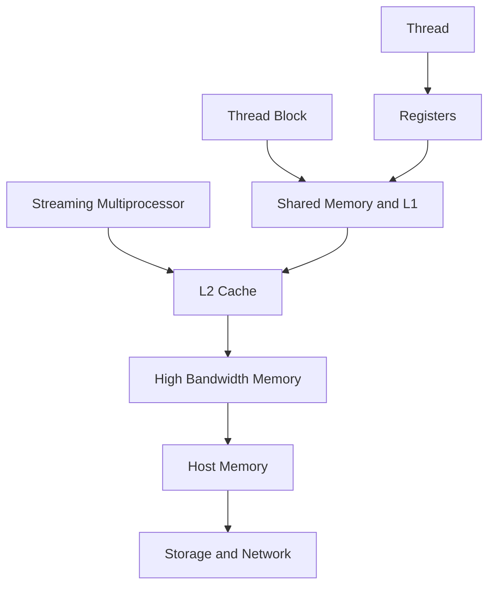
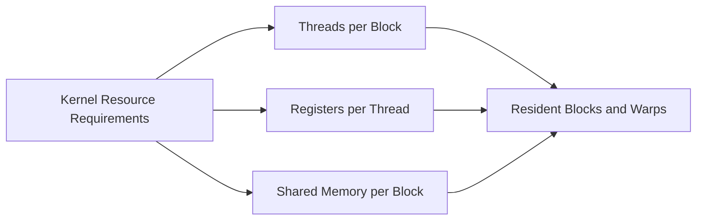
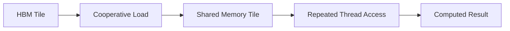
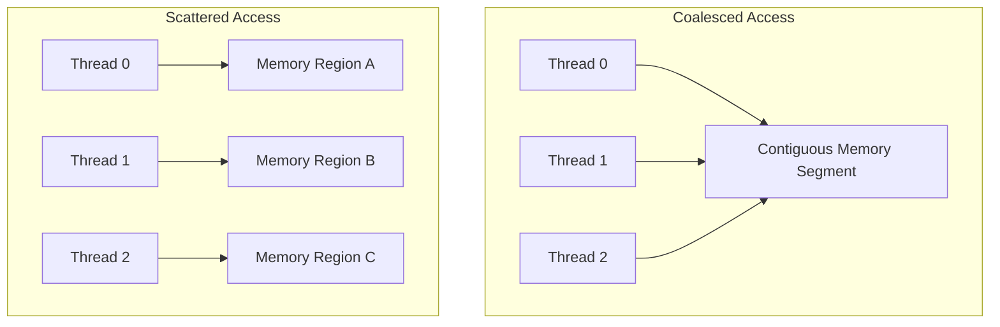
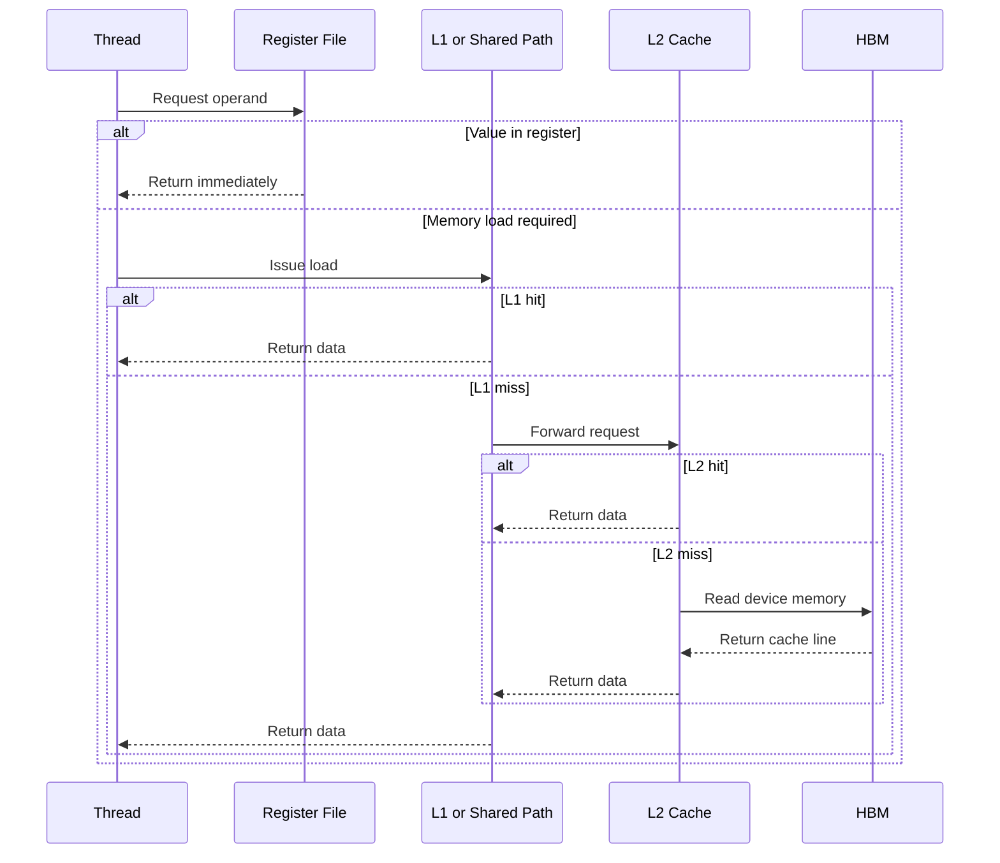

# GPU Memory Hierarchy

## Introduction

A GPU can contain enormous arithmetic capability and still perform poorly because its execution engines spend time waiting for data. This is the central reason memory architecture matters. Compute engines consume operands, produce results, and depend on a hierarchy of storage structures with different capacities, latencies, bandwidths, and scopes.

The hierarchy exists because no single memory technology can be simultaneously tiny, fast, inexpensive, and large. Registers are extremely close to execution but limited in quantity. Shared memory is fast and programmable but scoped to a thread block. Caches reduce repeated access cost but are managed largely by hardware. High Bandwidth Memory provides large capacity and high aggregate bandwidth, but it is still much slower than on-chip storage.

Understanding this hierarchy is essential for explaining occupancy, memory-bound kernels, model capacity, inference latency, training throughput, and why adding compute does not always improve performance.

| Chapter field | Value |
|---|---|
| Volume | 02 - GPU Architecture |
| Difficulty | Foundation |
| Estimated reading time | 45 minutes |
| Primary focus | GPU memory hierarchy and data locality |
| Previous chapter | CUDA Cores, Tensor Cores, and RT Cores |
| Next chapter | Scheduling, Occupancy, and Instruction Dispatch |

## Story

A team ports a data-processing kernel from CPU to GPU. The kernel launches thousands of threads and reports high occupancy, yet performance remains disappointing. Profiling shows that arithmetic pipelines are frequently idle while global-memory requests are pending.

The implementation is parallel, but it is not data-efficient. Each thread repeatedly loads the same values from HBM. The access pattern is poorly coalesced, and intermediate values consume so many registers that the scheduler cannot keep enough warps resident to hide latency.

The solution is not another GPU. The solution is to redesign data movement: improve access patterns, reuse data through shared memory, reduce unnecessary transfers, and balance register usage against occupancy.

## Learning Objectives

After completing this chapter, you will be able to:

- Describe the major levels of GPU memory.
- Explain the trade-off between capacity, latency, bandwidth, and scope.
- Distinguish registers, shared memory, L1, L2, and HBM.
- Explain coalescing, locality, and data reuse.
- Recognize common memory bottlenecks in production workloads.
- Design a measurement plan for memory-bound GPU behavior.

## Big Picture

The GPU memory hierarchy moves from small, fast, and local storage near execution to larger, slower, and more widely shared storage farther away.

**Figure 2.5.1 - GPU memory hierarchy.** Storage becomes larger and more broadly visible farther from the execution lanes, but access cost generally increases.

The exact cache arrangement and sizes vary by architecture. The stable principle is locality: data reused close to execution is usually cheaper than data repeatedly fetched from distant memory.

## Memory Hierarchy at a Glance

| Level | Typical scope | Relative capacity | Relative latency | Managed by |
|---|---|---:|---:|---|
| Registers | Individual thread | Very small | Lowest | Compiler and hardware |
| Shared memory | Thread block | Small | Very low | Programmer and runtime |
| L1 cache | SM-local | Small | Low | Hardware with architectural controls |
| L2 cache | Entire GPU | Medium | Moderate | Hardware |
| HBM or device memory | Entire GPU | Large | Higher | Application, runtime, hardware |
| Host memory | CPU and system | Very large | Much higher | OS, runtime, application |
| Storage or remote memory | System or cluster | Massive | Highest | Platform and application |

“Faster” and “slower” are relative. HBM provides high aggregate bandwidth compared with conventional host memory, yet a load from HBM is still costly relative to reading a register.

## Registers

Registers hold values used directly by a thread. They store operands, loop variables, addresses, intermediate values, and compiler-generated state. Registers are private to the thread and provide the fastest commonly used storage in the execution path.

The register file is large in aggregate, but the allocation per thread matters. A kernel that uses many registers per thread can reduce the number of blocks and warps resident on an SM. This can lower the scheduler's ability to hide memory and instruction latency.

**Figure 2.5.2 - Resource allocation and residency.** Register and shared-memory usage influence how many blocks and warps can reside on an SM.

When compiler demand exceeds available registers, values may spill into local memory. Despite its name, local memory is generally backed by device memory and can introduce expensive accesses, though caches may reduce some cost.

## Shared Memory

Shared memory is on-chip storage shared by threads in the same block. It is explicitly managed by the program and is often used to stage data, exchange values between threads, and reuse data that would otherwise be loaded repeatedly from HBM.

A common pattern is tiling:

1. Threads cooperatively load a tile from global memory.
2. The block synchronizes.
3. Threads reuse the tile for multiple operations.
4. Results are written back.

**Figure 2.5.3 - Shared-memory tiling.** Data is loaded once from HBM and reused by threads in the block.

Shared memory is fast but finite. Excessive allocation per block reduces block residency. Access patterns also matter because shared memory is divided into banks. Conflicting accesses can serialize requests and reduce effective throughput.

## L1 Cache

L1 cache sits close to the SM and reduces the cost of repeated or spatially local memory access. In many architectures, L1 resources are closely related to the shared-memory subsystem. The precise organization varies, but the architectural purpose is stable: retain recently or nearby accessed data close to execution.

Applications do not manage L1 in the same explicit way as shared memory. Access patterns still determine whether the cache helps. Irregular streaming accesses with little reuse can bypass the benefit of a small cache.

## L2 Cache

L2 is shared across the GPU and acts as a common caching layer between SMs and device memory. It can serve repeated accesses, reduce HBM traffic, support communication between GPU components, and influence performance when working sets fit or partially fit within it.

L2 is important for workloads with reuse across kernels or SMs, but it is not a substitute for sound data layout. A workload that streams a dataset much larger than cache capacity may remain HBM-bandwidth bound.

## High Bandwidth Memory

High Bandwidth Memory, commonly called HBM, is the GPU's primary large-capacity device memory in many data-center accelerators. It stores model weights, activations, gradients, optimizer state, input batches, output tensors, and application data.

HBM combines wide interfaces and multiple memory stacks to provide high aggregate bandwidth. That bandwidth is essential because thousands of execution lanes can generate enormous demand. However, real throughput depends on access patterns, concurrency, controller behavior, data type, and workload structure.

### Capacity versus bandwidth

Memory capacity answers: **Can the workload fit?**

Memory bandwidth answers: **How quickly can data be supplied?**

A model may fit into HBM but still perform poorly because its operations repeatedly stream weights or activations. Conversely, a workload may have excellent arithmetic intensity but fail because its model and runtime state exceed capacity.

## Global Memory Access and Coalescing

Threads in a warp often access memory together. When their addresses fall into a small number of aligned memory transactions, the accesses are coalesced. When addresses are scattered, the hardware may need more transactions to serve the same warp.

**Figure 2.5.4 - Coalesced and scattered access.** Contiguous warp access usually requires fewer memory transactions than scattered access.

Coalescing is one reason data layout matters. Structure-of-arrays and array-of-structures layouts can produce different access behavior depending on which fields adjacent threads read.

## Arithmetic Intensity

Arithmetic intensity describes the amount of computation performed per unit of data moved. A workload with low arithmetic intensity performs little computation for each byte loaded and is more likely to be memory-bound. A workload with high arithmetic intensity reuses data and performs many operations before returning to memory.

| Pattern | Data movement | Computation | Likely limit |
|---|---:|---:|---|
| Simple vector copy | High | Very low | Memory bandwidth |
| Element-wise transform | High | Low | Often memory bandwidth |
| Tiled matrix multiplication | Reused | High | Compute or mixed |
| Irregular lookup | High and scattered | Low | Latency and cache behavior |

The roofline model, introduced later in the performance volume, formalizes the relationship between arithmetic intensity, memory bandwidth, and compute throughput.

## Host and Device Transfers

Data entering the GPU may travel from storage to host memory and then through PCIe or another interconnect into device memory. Transfers can become a major bottleneck when applications move small buffers repeatedly, fail to overlap transfers with execution, or copy data unnecessarily.

Pinned host memory, asynchronous copies, batching, unified-memory behavior, GPUDirect technologies, and workload placement all influence transfer cost. These topics will be covered in later volumes, but the architectural lesson begins here: the GPU memory hierarchy extends beyond the GPU package.

## Internal Working

A simplified memory request follows several stages:

**Figure 2.5.5 - Simplified GPU memory request.** A request is satisfied at the closest available level or forwarded deeper into the hierarchy.

While a warp waits, the scheduler may run another ready warp. This is latency hiding, not latency elimination. If too few warps are resident or all warps wait on similar requests, the SM can stall.

## Architecture Considerations

### Locality is a design property

Locality is created by data layout, scheduling, tiling, batching, model partitioning, and workload placement. Hardware caches can help, but they cannot fully repair poor access patterns.

### Capacity planning must include runtime state

For AI workloads, memory demand includes more than model weights. Training may require gradients, activations, optimizer state, communication buffers, and checkpoints. Inference may require model weights, KV cache, temporary workspaces, batching buffers, and multiple model replicas.

### More memory is not automatically faster

Higher capacity solves fit and scale problems. Performance still depends on bandwidth, cache behavior, data reuse, and computation. Architects should separate capacity requirements from throughput requirements.

## Production Deployment

Production validation should use the real model, sequence lengths, batch sizes, concurrency, precision, and runtime. Synthetic allocation tests can confirm capacity but do not reproduce cache and bandwidth behavior.

Useful measurements include:

- device-memory allocation and peak usage
- memory bandwidth and controller utilization
- cache hit rates where available
- kernel stall reasons
- host-to-device and device-to-host transfer time
- allocation failures and fragmentation symptoms
- request latency as KV cache grows

The goal is to connect a user-visible symptom to a level of the memory hierarchy.

## Production Troubleshooting

### Problem: GPU utilization is high but throughput is low

High utilization may indicate that kernels are active, not that execution engines are productive. If memory pipelines are saturated and arithmetic units wait for data, the workload is memory-bound.

| Signal | Interpretation |
|---|---|
| High memory bandwidth, lower compute throughput | Likely bandwidth-bound |
| Low cache hit rate | Working set or access pattern defeats cache |
| High register use, low residency | Kernel resource pressure |
| Repeated host-device copies | Pipeline transfer bottleneck |
| OOM with free memory reported elsewhere | Fragmentation or per-process allocation behavior |

### Problem: Out-of-memory errors appear only under load

Static model weights may fit, but concurrency creates KV cache, activation, workspace, or batching growth. Measure memory by request stage and concurrency level rather than only after model load.

### Problem: Adding batch size stops improving throughput

The workload may reach HBM bandwidth, cache-capacity, workspace, or latency limits. Increasing batch size can also increase queueing and memory pressure. The correct batch size is an end-to-end trade-off, not a universal maximum.

## Customer Scenario

A customer asks whether a higher-compute GPU will accelerate a recommendation model. Profiling shows that the model performs large embedding lookups with irregular access and limited reuse. The correct discussion focuses on memory capacity, bandwidth, cache behavior, data placement, batching, and software design rather than only Tensor Core throughput.

A strong recommendation explains what data moves, how often it is reused, and which hierarchy level is likely to limit performance.

## Interview Preparation

### Conceptual Questions

1. Why does a GPU need multiple memory levels?
2. What is the difference between shared memory and L1 cache?
3. Why can high HBM bandwidth still be insufficient?

### Architecture Questions

1. Draw the GPU memory hierarchy and explain visibility at each level.
2. Explain how register pressure affects occupancy.
3. Design a memory-capacity estimate for an inference service with KV cache.

### Scenario Questions

1. A kernel has high occupancy but low throughput. What memory signals do you inspect?
2. A model fits at startup but fails under concurrency. What additional memory consumers exist?
3. Two GPUs have similar compute but different memory bandwidth. Which workloads are most affected?

## Summary

GPU performance depends on feeding execution engines with data at the correct time and from the closest practical storage level. Registers provide thread-local speed. Shared memory enables block-level reuse. L1 and L2 caches reduce repeated device-memory access. HBM provides large capacity and high aggregate bandwidth, while host memory and storage sit farther away in the data path.

Memory optimization is fundamentally about locality, reuse, access pattern, and minimizing unnecessary movement. Adding compute does not solve a memory bottleneck.

## Key Takeaways

- The memory hierarchy balances latency, bandwidth, capacity, and scope.
- Registers are fastest but can limit occupancy when overused.
- Shared memory enables explicit data reuse within a block.
- Caches help only when access patterns provide locality.
- HBM capacity and bandwidth solve different problems.
- Coalescing reduces the number of memory transactions.
- End-to-end data movement includes host, network, and storage paths.

## Cross References

- Previous: [CUDA Cores, Tensor Cores, and RT Cores](./chapter-04-cuda-cores-tensor-cores-and-rt-cores)
- Next: [Scheduling, Occupancy, and Instruction Dispatch](./chapter-06-scheduling-occupancy-and-instruction-dispatch)
- Related lab: [Inspect GPU Engine and Memory Behavior](./labs/lab-02-inspect-gpu-engine-and-memory-behavior)
