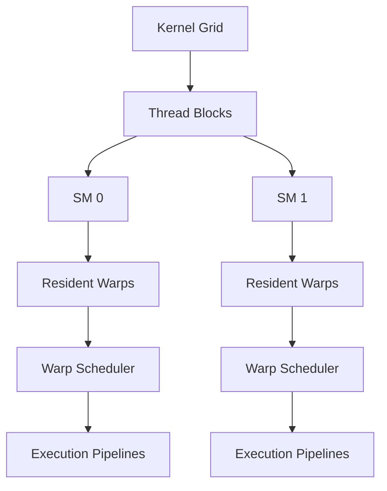
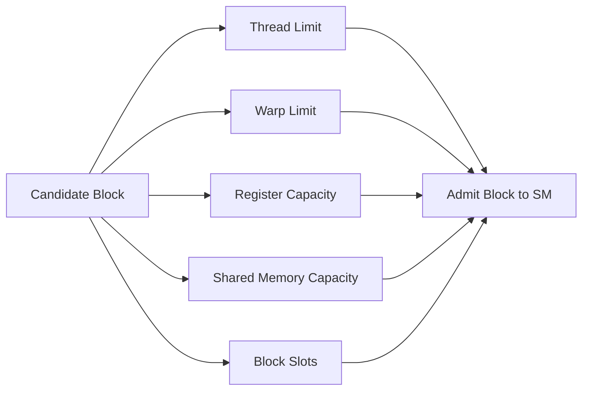
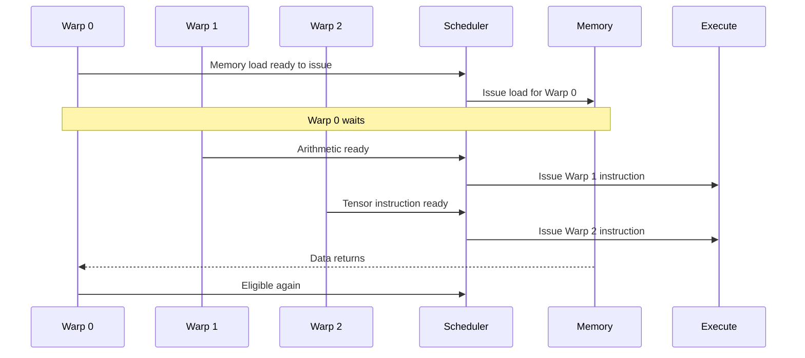
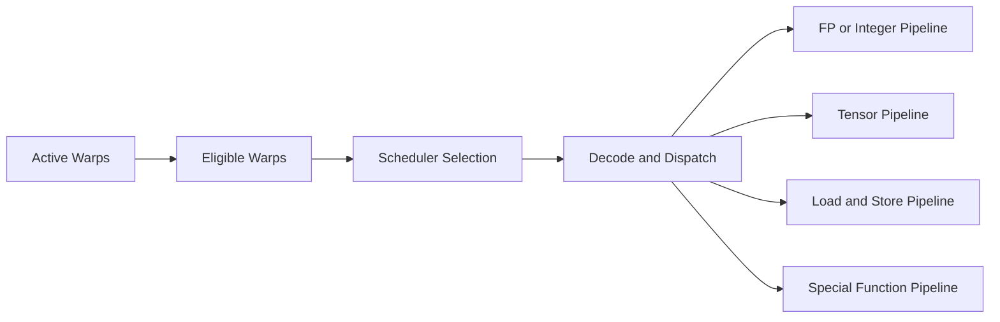
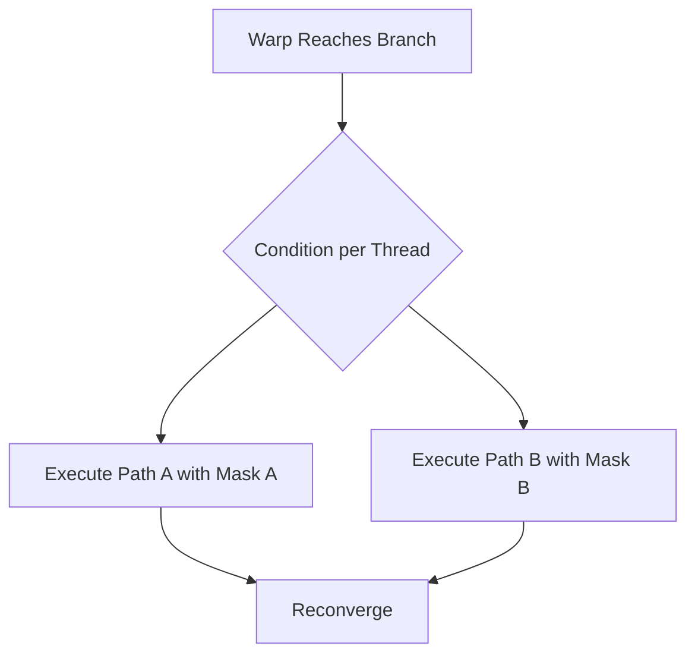

# Scheduling, Occupancy, and Instruction Dispatch

## Introduction

A GPU contains many execution pipelines, but those pipelines do not remain busy automatically. Work must be organized into warps, warps must be resident on a Streaming Multiprocessor, operands must be ready, and the scheduler must find an instruction that can issue.

This is why occupancy and scheduling matter. The hardware hides latency by keeping multiple warps available. When one warp waits for memory or an instruction dependency, another warp may execute. The design is powerful, but it is often misunderstood. High occupancy does not guarantee high performance, and low occupancy is not always a defect.

This chapter explains how blocks become resident, how warps become eligible, how instructions are dispatched, and how architects should interpret occupancy in production workloads.

| Chapter field | Value |
|---|---|
| Volume | 02 - GPU Architecture |
| Difficulty | Intermediate |
| Estimated reading time | 45 minutes |
| Primary focus | Warp scheduling and latency hiding |
| Previous chapter | GPU Memory Hierarchy |
| Next chapter | GPU Architecture Performance Model |

## Story

Two kernels perform the same calculation. The first launches many small blocks and reaches high reported occupancy. The second uses fewer blocks because each block consumes more shared memory, yet it completes faster.

The team assumes the profiler is wrong. It is not. The second kernel reuses data efficiently and performs more useful work per memory transaction. The first keeps many warps resident, but those warps repeatedly compete for memory bandwidth.

Occupancy describes the amount of active warp state relative to a hardware limit. It does not directly measure instruction efficiency, cache behavior, Tensor Core use, or useful throughput.

## Learning Objectives

After completing this chapter, you will be able to:

- Explain block, warp, and thread residency on an SM.
- Distinguish active, eligible, selected, stalled, and completed warps.
- Describe how warp schedulers hide latency.
- Explain how registers, shared memory, and block size limit occupancy.
- Interpret occupancy as one performance signal rather than a goal.
- Diagnose common scheduling and instruction-issue bottlenecks.

## Big Picture

A kernel launch creates a grid of thread blocks. The GPU assigns blocks to SMs when enough resources are available. Each resident block contributes one or more warps. Warp schedulers choose ready warps and issue instructions to execution pipelines.



**Figure 2.6.1 - From grid to instruction issue.** Blocks become resident on SMs, produce warps, and feed schedulers that issue instructions to execution pipelines.

The GPU schedules blocks independently. A block remains on an SM until it completes. Threads inside the block can synchronize and share data through shared memory, which is why blocks are the unit of residency and resource allocation.

## Residency

A block can become resident only when the SM has enough resources for it. The important constraints include:

- threads per block
- warps per block
- registers per thread
- shared memory per block
- architectural limits on resident blocks
- architectural limits on resident warps and threads

The tightest constraint determines how many blocks can reside simultaneously.



**Figure 2.6.2 - Block residency constraints.** A block is admitted only when all required SM resources are available.

A kernel with high register usage may allow fewer resident blocks. A kernel with large shared-memory tiles may face the same limitation. Large blocks may consume thread or warp capacity even when registers and shared memory remain available.

## Occupancy

Occupancy is commonly expressed as:

```text
active warps per SM / maximum supported warps per SM
```

This ratio indicates how much warp state is resident relative to the architectural maximum. It is useful because resident warps provide the scheduler with alternatives when some warps stall.

Occupancy is not a measure of:

- GPU utilization across the entire device
- percentage of useful instructions
- memory-bandwidth efficiency
- Tensor Core utilization
- end-to-end application throughput

:::warning Common mistake
Do not optimize for 100 percent occupancy without evidence. A lower-occupancy kernel can be faster when it performs more work per instruction, improves locality, or reduces memory traffic.
:::

## Warp States

A resident warp moves through several practical states during execution.

| State | Meaning |
|---|---|
| Active | Resident on the SM and not completed |
| Eligible | Ready to issue its next instruction |
| Selected | Chosen by the scheduler for issue |
| Stalled | Waiting for data, dependency, synchronization, or resource availability |
| Completed | All required instructions have finished |

A scheduler needs eligible warps. Many active warps do not help if all are waiting on the same long-latency event.

## Latency Hiding

GPUs tolerate latency by switching among warps rather than relying primarily on large out-of-order execution structures. When one warp waits, the scheduler may issue from another ready warp.



**Figure 2.6.3 - Latency hiding across warps.** While one warp waits for memory, other eligible warps can use execution pipelines.

Latency hiding works only when independent work exists. If all warps access the same slow dependency, wait at a barrier, or saturate the same resource, adding more resident warps may not improve progress.

## Instruction Dependencies

A warp cannot issue an instruction until required operands are ready. Consider:

```text
A = B + C
D = A × E
```

The second instruction depends on the result of the first. The scheduler may issue work from another warp while waiting for `A` to become available.

Dependencies may arise from:

- arithmetic results
- memory loads
- synchronization
- atomic operations
- communication
- execution-pipeline availability

The scoreboard tracks dependencies and prevents instructions from using unavailable operands.

## Instruction Dispatch

Warp schedulers select eligible warps, and dispatch logic routes instructions to compatible execution pipelines. The number and arrangement of schedulers and dispatch units vary by architecture, so performance should not be inferred from a generic scheduler count alone.



**Figure 2.6.4 - Warp selection and dispatch.** Eligibility depends on operands and resources; instruction type determines the execution pipeline.

A warp can be ready while its required pipeline is busy. This creates a structural limitation. A workload dominated by one instruction class may leave other pipelines underused.

## Divergence and Scheduling

Threads in a warp share an instruction stream. When branches send threads down different paths, the warp may execute multiple paths with different active masks. Divergence reduces lane efficiency even though the warp remains scheduled.



**Figure 2.6.5 - Warp divergence.** Different branch outcomes can require serial execution of paths with different active lanes.

Not every branch is harmful. Uniform branches, where all threads take the same path, do not create lane divergence. The performance effect depends on branch frequency, path length, and active-lane distribution.

## Occupancy Limits in Practice

### Register pressure

The compiler assigns registers per thread. Multiplying that value by threads per block and resident blocks creates aggregate register demand. Small changes can cross allocation boundaries and reduce residency.

### Shared-memory pressure

Shared memory is allocated per block. Larger tiles may improve reuse while reducing resident blocks. This is a classic performance trade-off: lower occupancy may be acceptable when each block performs more efficient work.

### Block size

Block size determines the number of warps per block. Very small blocks may underuse block-level resources. Very large blocks may reduce scheduling flexibility or exceed resource limits.

### Kernel duration and grid size

Even a well-configured kernel cannot occupy the whole GPU when the grid contains too few blocks. Small workloads may not expose enough parallel work to fill all SMs.

## Architecture Considerations

### Occupancy is a means, not an objective

The purpose of occupancy is to provide enough independent work to hide relevant latency. Once that requirement is met, further occupancy may not improve throughput.

### Scheduling cannot repair every bottleneck

Warp switching can hide some latency but cannot create memory bandwidth, increase cache capacity, remove branch divergence, or overcome serial application stages.

### End-to-end systems need multiple schedulers

GPU warp scheduling is only one layer. Kubernetes schedules pods, inference runtimes schedule requests, distributed frameworks schedule collectives, and the GPU schedules warps. Poor decisions at a higher layer can starve the hardware regardless of SM efficiency.

## Production Deployment

A production performance review should distinguish four scheduling layers:

| Layer | Scheduling unit | Common failure |
|---|---|---|
| Cluster | Pod or job | Workload placed on unsuitable node or topology |
| Runtime | Request, batch, model | Small batches or queue imbalance |
| Kernel | Grid and blocks | Insufficient parallel work or poor block shape |
| SM | Warp and instruction | Stalls, divergence, dependency pressure |

Measure each layer before modifying kernel occupancy. A request queue may be empty because upstream preprocessing is slow. A kernel may be efficient but launched too infrequently to sustain GPU utilization.

## Production Troubleshooting

### Problem: High occupancy but low throughput

| Possible cause | Why occupancy does not solve it |
|---|---|
| HBM bandwidth saturated | More warps create more demand for the same bandwidth |
| Heavy divergence | Active warps contain few active lanes |
| Long dependency chains | Warps have limited independent instructions |
| Pipeline imbalance | One execution pipeline is saturated |
| Small grid over time | Occupancy is high only during short kernel bursts |

### Problem: Low occupancy after a code change

Inspect register count, shared-memory allocation, block size, and compiler changes. Then compare actual runtime. The new kernel may still be faster due to reduced memory traffic or instruction count.

### Problem: GPU utilization oscillates

The cause may exist above the SM. Check CPU preprocessing, data loading, request batching, synchronization between kernels, host-device transfers, and distributed barriers.

### Problem: One kernel dominates request latency

Profile stall reasons and instruction mix. Determine whether the kernel waits on memory, dependencies, barriers, or a saturated pipeline. Occupancy tuning should follow this diagnosis.

## Customer Scenario

A customer reports only 45 percent occupancy and asks whether the cluster is misconfigured. The architect first asks whether throughput, latency, and scaling targets are being met. Profiling shows that the primary kernel uses large shared-memory tiles, achieves strong data reuse, and runs near the expected throughput baseline.

The correct recommendation is not to force higher occupancy. It is to preserve the efficient tiling and continue monitoring end-to-end performance. Architecture decisions must optimize outcomes rather than isolated metrics.

## Interview Preparation

### Conceptual Questions

1. What does GPU occupancy measure?
2. How do multiple resident warps hide latency?
3. Why can 100 percent occupancy be slower than lower occupancy?

### Architecture Questions

1. Draw the path from a kernel grid to instruction dispatch.
2. Explain how registers and shared memory limit block residency.
3. Describe scheduling at cluster, runtime, kernel, and SM layers.

### Scenario Questions

1. A kernel has high occupancy and low throughput. What do you investigate?
2. A shared-memory optimization lowers occupancy but improves speed. Why?
3. GPU utilization oscillates between zero and full. Which layers do you inspect?

## Summary

GPU scheduling keeps execution pipelines busy by maintaining multiple resident warps and issuing instructions from warps whose operands and resources are ready. Blocks are the unit of SM residency. Registers, shared memory, threads, warps, and architectural limits determine how many blocks can reside.

Occupancy measures resident warp capacity, not useful performance. The correct goal is enough independent work to hide latency while preserving efficient memory access, instruction execution, and data reuse.

## Key Takeaways

- Blocks consume SM resources and remain resident until completion.
- Warp schedulers select eligible warps, not merely active warps.
- Latency hiding requires independent ready work.
- Register and shared-memory use can reduce occupancy.
- Higher occupancy is not automatically faster.
- Divergence reduces active-lane efficiency.
- Scheduling must be analyzed across cluster, runtime, kernel, and SM layers.

## Cross References

- Previous: [GPU Memory Hierarchy](./chapter-05-gpu-memory-hierarchy)
- Next: GPU Architecture Performance Model
- Related lab: [Inspect GPU Engine and Memory Behavior](./labs/lab-02-inspect-gpu-engine-and-memory-behavior)
