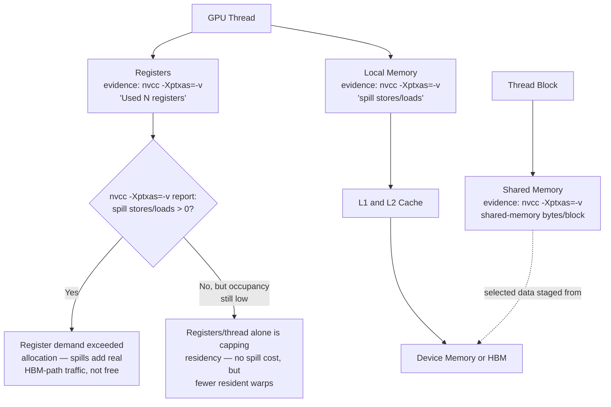
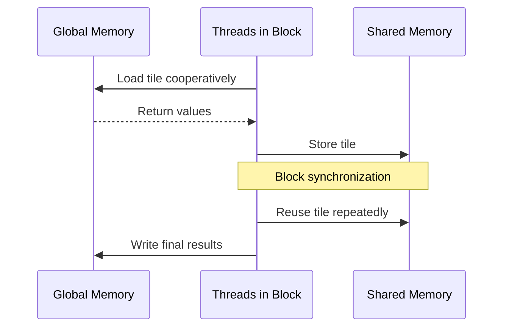

# Registers, Shared Memory, and Local Memory

## Introduction

A GPU kernel may perform only a few arithmetic instructions, yet still run slowly because the data feeding those instructions is stored in the wrong place. The fastest values usually live in registers. Data shared by threads in the same block can often be staged in shared memory. Values that do not fit in registers may spill into local memory, which despite its name is backed by device memory and can be much slower.

These storage classes are not interchangeable. They differ in scope, lifetime, capacity, latency, allocation policy, and visibility. Together they determine how much state a Streaming Multiprocessor can hold and how many warps can remain resident.

| Chapter field | Value |
|---|---|
| Volume | 02 — GPU Architecture |
| Difficulty | Intermediate |
| Estimated reading time | 45 minutes |
| Primary focus | On-chip thread and block storage |
| Previous | Scheduling, Occupancy, and Instruction Dispatch |
| Next | Global Memory, L1, L2, and HBM |

## Story

A team optimizes a kernel by unrolling loops and caching more intermediate values. Instruction count falls, but throughput becomes worse. Profiling shows that register use per thread increased enough to reduce resident warps. In another version, the compiler spills variables into local memory, creating extra device-memory traffic.

The optimization was locally reasonable but globally harmful. Fewer instructions did not compensate for lower latency-hiding capacity and additional memory operations.

This is a recurring GPU lesson: performance depends on resource balance, not on minimizing one metric in isolation.

## Learning Objectives

After completing this chapter, you will be able to:

- Explain the purpose and scope of registers, shared memory, and local memory.
- Describe how per-thread and per-block resource use limits residency.
- Explain register spilling and why local memory is not physically local.
- Identify when shared-memory staging can improve data reuse.
- Diagnose resource-pressure symptoms without treating occupancy as a universal target.

## Big Picture



**Figure 2.7.1 — Thread and block storage.** Registers are private to a thread, shared memory belongs to a block, and local memory is a per-thread address space commonly backed by device memory. The branch shows why this diagram's most important question — "is this kernel actually paying for local-memory traffic, or just capped on occupancy" — has a one-line, compile-time answer, not something that requires guesswork or a full profiling pass.

**The compiler report that answers the diagram's branch directly:**

```text
$ nvcc -O3 -Xptxas=-v kernel.cu -o kernel
ptxas info    : Function properties for _Z6kernelPKfPfm
    64 bytes stack frame, 96 bytes spill stores, 128 bytes spill loads
ptxas info    : Used 96 registers, 0 bytes cmem[0]
```

`96 registers` alone would only affect occupancy — the "Bounded" branch. But `96 bytes spill stores, 128 bytes spill loads` is the "Spilling" branch made concrete: this kernel's register demand already exceeded what the compiler could keep resident, and the compiler silently generated extra load/store instructions routing those specific values through the local-memory path (backed by the same cache/HBM path as any other device-memory access) instead of erroring. A kernel with spills is paying two costs at once — reduced occupancy from register pressure, and real memory traffic from the spilled values — which is why "reduce registers" as a blind fix can sometimes make things worse if it increases spilling rather than reducing genuine register demand.

## Registers

Registers are the fastest general storage available to a thread. They hold frequently used variables, addresses, loop state, and intermediate values. Register access is normally much cheaper than accessing device memory because registers are physically located inside the Streaming Multiprocessor.

Registers are private to each thread. One thread cannot directly read another thread's registers. Their lifetime normally matches the execution of the thread.

The register file is finite. If a kernel uses many registers per thread, fewer threads and warps may fit on an SM at the same time.

| Register behavior | Architectural consequence |
|---|---|
| Low register use | More threads may reside concurrently |
| High register use | Residency may fall |
| Excess live values | Compiler may spill to local memory |
| Aggressive register limiting | May raise occupancy but increase spills |

The important quantity is not register use alone. It is register use multiplied by the number of resident threads, combined with the architecture's allocation granularity.

## Shared Memory

Shared memory is an on-chip memory region visible to threads in the same block. It supports fast cooperation, data reuse, tiling, reductions, and reorganization of memory access patterns.

A common pattern is to load data from global memory into shared memory, synchronize the block, reuse the data several times, and then write results back.



**Figure 2.7.2 — Shared-memory tiling.** Threads cooperate to stage data once and reuse it many times, reducing repeated global-memory traffic.

Shared memory is allocated per block. Large allocations can reduce the number of blocks that fit on an SM. Therefore, using more shared memory can improve data reuse while simultaneously reducing residency.

## Static and Dynamic Shared Memory

Shared memory can be declared with a size known at compile time or requested dynamically when the kernel launches. Dynamic allocation allows one kernel to support different tile sizes, but the launch configuration must account for the requested bytes per block.

Infrastructure engineers usually do not configure these values directly, yet they should understand them when interpreting profiler reports or application tuning decisions.

## Banked Access

Shared memory is divided into banks so multiple threads can access different locations concurrently. When multiple threads address locations that map to the same bank in an incompatible pattern, accesses may serialize.

The exact bank behavior is architecture-dependent, but the general principle is stable: shared memory is fast when thread access patterns align with its parallel organization.

:::note
Shared memory is not automatically fast. Poor access patterns, unnecessary synchronization, or excessive allocation can remove its advantage.
:::

## Local Memory

Local memory is a per-thread logical address space. The name describes visibility, not physical location. Local memory is commonly backed by device memory and served through the cache hierarchy.

Compilers may place data in local memory when:

- A thread uses more registers than can be allocated.
- An array has dynamic indexing that prevents efficient register placement.
- The compiler cannot prove that a value can remain in registers.
- The program contains large per-thread data structures.

Local-memory traffic can therefore appear even when source code does not explicitly request it.

## Register Spilling

Register spilling occurs when values that would ideally live in registers are stored in local memory. Spills add load and store instructions and may create pressure on caches and HBM.


**Figure 2.7.3 — Register spilling path.** Excess live state can move from registers into a per-thread memory space backed by the normal device-memory path.

Reducing spills may require smaller live ranges, less unrolling, different data structures, or a different algorithm. Simply forcing a lower register count can worsen spilling.

**A worked cost estimate for spilling.** Suppose a kernel spills 2 float values (8 bytes) per thread, and the kernel launches with 65,536 threads total (`256 threads/block x 256 blocks`). Each spilled store and the matching later load is a separate device-memory transaction routed through the same cache/HBM path as any other load/store — in the worst case (no cache reuse of the spilled value), that's `65,536 threads x 8 bytes x 2 (store + load) ≈ 1.05 MB` of additional traffic for this one kernel launch, purely from spills that don't exist in the source code at all — they're a compiler-generated side effect of register pressure. On a bandwidth-constrained kernel, this is directly measurable as a jump in `dmon`'s `mem%` between a version with and without spills, for logically identical output.

## Resource Interaction and Occupancy

Registers and shared memory are both residency constraints. The scheduler can place another block on an SM only if enough threads, warps, registers, shared memory, and block slots remain.

| Resource pressure | Typical effect |
|---|---|
| High registers per thread | Fewer active warps |
| High shared memory per block | Fewer resident blocks |
| Both high | Strong residency reduction |
| Lower use with poor access patterns | High occupancy but weak performance |

A kernel does not need maximum occupancy. It needs enough independent work to hide its dominant stalls while preserving useful instruction-level parallelism and data reuse.

## Architecture Trade-offs

### Registers versus occupancy

More registers can reduce memory traffic and preserve intermediate values. The trade-off is lower residency. The correct balance depends on whether the kernel is latency-bound, instruction-bound, or memory-bound.

### Shared memory versus cache

Shared memory gives software explicit control over data placement and reuse. Caches are easier to use but less predictable. Shared memory is most valuable when the access pattern and reuse are well understood.

### Shared memory versus synchronization

Cooperative use often requires barriers. If the work saved is small, synchronization overhead may exceed the benefit.

## Production Perspective

Resource pressure often appears as an application performance issue rather than a platform fault. Two containers can use the same GPU and driver yet show different performance because their kernels allocate resources differently.

Operational teams should preserve profiler evidence before changing cluster configuration. Useful questions include:

- Did register use change after a software update?
- Did compiler flags change?
- Did shared-memory demand increase?
- Did local-memory load/store activity rise?
- Did active warps per SM fall?
- Is the workload now limited by memory traffic?

## Production Troubleshooting

### Problem: Throughput drops after a kernel optimization

**Symptoms**

- Lower instruction count
- Lower occupancy
- Higher local-memory traffic
- Reduced active warps

**Diagnosis**

Compare register use, shared-memory allocation, spill loads and stores, and achieved occupancy between versions.

**Turning this into evidence.** The `-Xptxas=-v` diff is the fastest confirmation, run on both the old and new kernel binary:

```text
# Before optimization
ptxas info: Used 44 registers, 0 bytes spill stores, 0 bytes spill loads

# After optimization
ptxas info: Used 88 registers, 40 bytes spill stores, 48 bytes spill loads
```

This single comparison proves two things at once: registers/thread doubled (44→88, an occupancy-reducing change on its own), and the optimization pushed the kernel *past* the point where the compiler could keep all live values in registers, generating real spill traffic that didn't exist before. That combination — more registers *and* new spills — is a stronger, more specific root cause than "lower occupancy" alone, and it is visible without running a profiler at all.

**Root cause**

The optimization increased per-thread live state, causing fewer resident warps or register spilling.

**Resolution**

Reduce live ranges, reconsider loop unrolling, split the kernel only when launch overhead and extra memory traffic are acceptable, or redesign the algorithm.

### Problem: Shared-memory kernel is not faster

Possible causes include low reuse, bank conflicts, excessive synchronization, large per-block allocation, or a global-memory path that was already cache-efficient.

**Turning "bank conflicts" into evidence.** A profiler's shared-memory efficiency metric is the direct confirmation, since bank conflicts are invisible in `dmon` or `nvidia-smi` — they're purely an on-chip access-pattern effect:

```text
$ ncu --metrics l1tex__data_bank_conflicts_pipe_lsu.sum ./kernel
  l1tex__data_bank_conflicts_pipe_lsu.sum          412,800
```

A non-trivial, non-zero bank-conflict count on a kernel expected to have conflict-free access (e.g., adjacent threads reading adjacent shared-memory addresses) points directly at the access pattern — commonly a stride that maps multiple threads in the same warp onto the same shared-memory bank, forcing those accesses to serialize instead of completing in parallel. The fix is usually a small stride/padding change in the shared-memory layout, not a broader kernel rewrite.

### Prevention

Record kernel resource usage in performance baselines and compare it during release validation.

## Customer Scenario

A customer observes that a new model release consumes the same GPU memory but delivers lower throughput. Infrastructure checks show healthy temperature, power, clocks, and PCIe links. Profiling reveals increased register pressure in a custom kernel and lower active-warps-per-SM.

The customer initially asks for larger GPUs. The architect instead recommends software-level analysis because the bottleneck is per-kernel resource use, not cluster capacity.

## Interview Preparation

### Conceptual Questions

1. Why is local memory not necessarily physically local?
**Model answer:** "The name describes scope, not physical placement — 'local' means private to one thread, the same way 'global' means visible to every thread. In practice, local memory is backed by the same device-memory path as any other global access, routed through the normal cache hierarchy. It gets used when a thread needs more per-thread storage than fits in registers — either because of a dynamically indexed array the compiler can't keep in a register file, or because the compiler ran out of registers and spilled. Either way, an access that sounds 'local' and cheap can actually be a full HBM-path transaction."

2. How can high register use reduce throughput?
**Model answer:** "Indirectly, through occupancy — more registers per thread means fewer threads fit in the SM's fixed register file, so fewer warps are resident to hide latency. I'd walk through the arithmetic: a 65,536-register file at 40 registers/thread supports far more resident threads than the same file at 88 registers/thread. If the kernel's dominant stall is memory latency and it no longer has enough resident warps to hide it, throughput drops — but if the kernel has other sources of efficiency (better reuse, fewer instructions), the higher register use might still be a net win. It's never automatic in either direction."

3. When is shared memory preferable to relying on cache?
**Model answer:** "When I know the access and reuse pattern well enough to stage data deliberately, and want a hard guarantee that data stays resident until I say so. Cache is convenient — no code changes needed — but it's managed by hardware heuristics and can evict data based on other traffic I don't control. Shared memory costs explicit tiling code and synchronization barriers, but for a well-understood pattern like matrix-multiply tiling, that predictability is worth the added complexity."

### Architecture Questions

1. Draw the path of a spilled register value.
**Model answer:** "Value needs to live somewhere, register file doesn't have room, compiler emits a store to local memory instead of a register write. That store goes through the same L1/L2/HBM cache path any global-memory write would use. Later, when the value is needed, the compiler emits a load along that same path instead of a register read. I'd point out while drawing it: neither the store nor the load is visible in the source code at all — this entire path only shows up in `nvcc -Xptxas=-v`'s spill counts, which is why checking that output is the first, not last, step in diagnosing a suspicious performance regression."

2. Explain how registers and shared memory constrain block residency.
**Model answer:** "Both are finite per-SM pools shared among however many blocks are resident at once. Registers/thread times threads/block times number of resident blocks caps out at the SM's total register file; shared-memory bytes/block times resident blocks caps out at the SM's shared-memory capacity. A block is only admitted if there's simultaneously enough of *both* remaining — whichever resource runs out first sets the actual residency ceiling, and it's computable directly from compiler and kernel-launch information rather than needing to be measured empirically."

3. Compare the scope and lifetime of registers and shared memory.
**Model answer:** "Registers are private to one thread and live for that thread's execution — no other thread can read them, ever. Shared memory is visible to every thread in the same block and persists for the block's lifetime, which is why it needs explicit `__syncthreads()` barriers to coordinate access — without a barrier, one thread might read a value another thread in the block hasn't written yet. The scope difference is exactly what each is used for: registers for private working values, shared memory for deliberate cooperation."

### Scenario Questions

1. Occupancy increases after limiting registers, but runtime becomes worse. Why?
**Model answer:** "Almost always spilling — forcing the compiler to use fewer registers than the kernel's live-value count actually needs doesn't make those values disappear, it forces them into local memory instead. I'd check `nvcc -Xptxas=-v` immediately for spill stores/loads; if they went from zero to non-zero after the register limit was applied, that's the answer — higher occupancy, but now paying real memory-bandwidth cost for values that used to be free register reads."

2. A kernel allocates large shared-memory tiles. What trade-off must be evaluated?
**Model answer:** "Reuse gained versus resident blocks lost. Larger tiles mean fewer blocks fit per SM — I'd compute that directly from the SM's shared-memory capacity divided by bytes/block — but if each block now reuses that tile many times instead of re-fetching from HBM repeatedly, the reduction in memory traffic can outweigh the lower occupancy. I'd confirm with `dmon`'s `mem%` before and after rather than assuming either direction wins by default."

3. Local-memory traffic rises after a compiler upgrade. What do you inspect?
**Model answer:** "First, whether the new compiler changed register allocation for the same source — a compiler upgrade can shift register-allocation heuristics without any code change, introducing spills that weren't there before. I'd diff `nvcc -Xptxas=-v` output between compiler versions for the identical kernel, specifically the spill store/load counts. If those went from zero to non-zero, that's the compiler's doing, not the workload's, and the fix might be a compiler flag or a targeted register hint rather than a source rewrite."

## Summary

Registers provide the fastest private storage for each thread. Shared memory provides fast, explicitly managed cooperation within a block. Local memory provides a private address space but is commonly backed by device memory and may indicate register pressure or dynamic per-thread storage.

These resources influence both data-access cost and how much work can remain resident. Efficient GPU execution depends on balancing reuse, latency, synchronization, and occupancy rather than maximizing any one resource metric.

## Key Takeaways

- Registers are private, fast, and finite.
- Shared memory enables block-level cooperation and explicit reuse.
- Local memory is per-thread in scope but usually not on-chip.
- Register spills can create hidden device-memory traffic.
- Resource use must be evaluated together with occupancy and bottleneck evidence.

## Cross References

- Previous: [Scheduling, Occupancy, and Instruction Dispatch](./chapter-06-scheduling-occupancy-and-instruction-dispatch)
- Next: [Global Memory, L1, L2, and HBM](./chapter-08-global-memory-l1-l2-and-hbm)
- Related lab: [Profile Memory and Warp Efficiency](./labs/lab-03-profile-memory-and-warp-efficiency)
