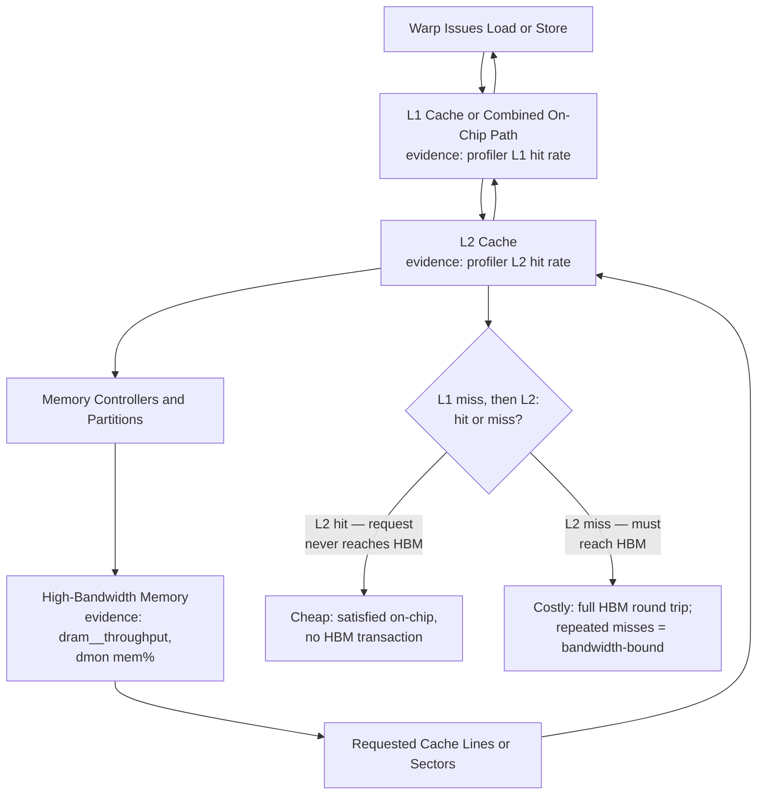
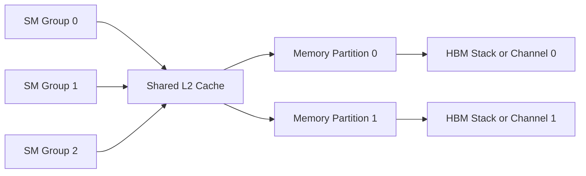
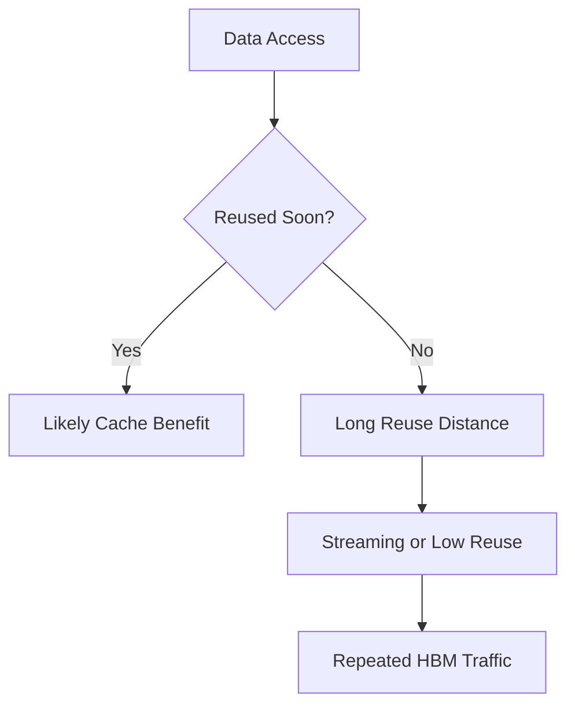

# Global Memory, L1, L2, and HBM

## Introduction

Modern GPUs can execute enormous numbers of arithmetic operations, but those operations are useful only when data arrives quickly enough. The device-memory system therefore combines a large global address space, on-chip caches, memory controllers, and high-bandwidth memory packages.

Peak bandwidth numbers describe an upper bound, not delivered application performance. Access pattern, locality, cache reuse, request size, concurrency, partition balance, and competing traffic determine how much bandwidth a workload actually receives.

| Chapter field | Value |
|---|---|
| Volume | 02 — GPU Architecture |
| Difficulty | Intermediate |
| Estimated reading time | 50 minutes |
| Primary focus | Device-memory path and bandwidth behavior |
| Previous | Registers, Shared Memory, and Local Memory |
| Next | Divergence, Coalescing, and Bottleneck Reasoning |

## Story

A model-serving team upgrades to a GPU with substantially higher arithmetic throughput. Latency improves only slightly. Power and compute-pipeline activity remain below expectation, while memory throughput is consistently high.

The model is dominated by reading weights and KV-cache data. The additional arithmetic capability cannot help because the execution units spend much of their time waiting for data. The upgrade improved the wrong resource.

The correct question is not “How many operations can this GPU perform?” It is “How many useful operations can the workload perform for each byte moved?”

## Learning Objectives

After completing this chapter, you will be able to:

- Explain the role of global memory, L1 cache, L2 cache, memory controllers, and HBM.
- Distinguish memory capacity, bandwidth, latency, and effective throughput.
- Describe how locality and reuse affect cache behavior.
- Explain why memory partition balance matters.
- Recognize memory-bound workload symptoms.

## Big Picture



**Figure 2.8.1 — Simplified device-memory path.** A request may be satisfied by cache or continue through L2, memory partitions, and HBM before data returns to the requesting warp. The precise implementation varies across GPU generations. The architectural lesson remains stable: each level trades capacity for access cost, and efficient workloads maximize useful reuse before reaching slower levels — the branch names the exact, checkable fork every load takes, and profiler hit-rate metrics are how you find out which side of it a real kernel is landing on.

**Confirming which side of the fork a real kernel lands on:**

```text
$ ncu --metrics lts__t_sector_hit_rate.pct,l1tex__t_sector_hit_rate.pct ./kernel
  l1tex__t_sector_hit_rate.pct    %    12.4
  lts__t_sector_hit_rate.pct      %    18.9
```

An L1 hit rate of 12.4% and an L2 hit rate of 18.9% together mean the overwhelming majority of this kernel's loads are taking the "Costly" branch — a full HBM round trip — despite both caches being present and functioning correctly. This is the direct evidence for a streaming, low-reuse access pattern, and it's the number that turns "the kernel might be memory-bound" into "the kernel's cache hit rates confirm it's mostly bypassing cache."

## Global Memory

Global memory is the large device-accessible memory space used for model weights, activations, tensors, buffers, and application data. On data-center GPUs, the physical implementation may use high-bandwidth memory located near the GPU package.

“Global” describes visibility across threads and blocks, not a separate physical chip type. A global-memory access may hit in cache or travel to HBM.

Global memory offers large capacity compared with registers or shared memory, but its access latency is much higher. GPUs tolerate this latency by keeping many warps ready and by combining requests efficiently.

## L1 Cache

L1 cache is close to the execution resources of an SM. It captures spatial and temporal locality for loads that are eligible to use it. In many architectures, L1 resources interact with or share physical capacity with shared-memory functionality.

L1 is useful when nearby threads access nearby addresses or when the same data is reused before eviction. It is less useful for large streaming datasets with little reuse.

## L2 Cache

L2 is a larger cache shared across broader portions of the GPU. It provides a common point for data reuse across SMs, reduces repeated HBM traffic, and participates in memory coherence and atomic-operation behavior.

A larger L2 can improve workloads with working sets or access patterns that fit effectively within it. Capacity alone does not guarantee benefit; reuse distance and contention determine hit rate.



**Figure 2.8.2 — Shared cache and memory partitions.** Requests from many SMs converge on L2 and are distributed across memory-controller partitions.

## High-Bandwidth Memory

High-Bandwidth Memory places multiple memory dies in stacks connected through a wide interface. The design provides far more aggregate bandwidth than conventional narrow memory interfaces, which is valuable for tensor-heavy and data-intensive workloads.

HBM still has finite bandwidth and latency. Large model weights, activation traffic, KV-cache access, checkpointing, peer communication, and memory copies can compete for the same memory system.

| Memory property | Meaning |
|---|---|
| Capacity | Total bytes that can be stored |
| Peak bandwidth | Maximum theoretical transfer rate |
| Effective bandwidth | Useful bytes delivered by a workload per unit time |
| Latency | Time from request to usable data |
| Reuse | Number of useful operations performed before data must be fetched again |

A workload may fit in memory but still be too bandwidth-intensive. Capacity and bandwidth are separate sizing dimensions.

**A worked bandwidth-utilization check.** An H100 SXM's peak HBM bandwidth is roughly 3.35 TB/s. Suppose a kernel processes 8 GB of input and produces 8 GB of output (a simple element-wise transform, low arithmetic intensity) in a profiled 6 ms. Effective bandwidth achieved is `16 GB / 0.006 s ≈ 2,667 GB/s`, or `2,667 / 3,350 ≈ 80%` of peak — a workload that's already close to the ceiling for this memory-bound access pattern, meaning further speedup has to come from moving fewer bytes (fusion, compression, reduced precision) rather than from a "faster" kernel, since the memory system is already running close to its physical limit. Contrast that with a kernel achieving only `500 GB/s` (~15% of peak) on the same GPU: that gap points at an access-pattern problem — uncoalesced or scattered addresses generating far more transactions than the useful-byte count would require — not a hardware ceiling.

## Memory Controllers and Partitions

The GPU memory system is divided into partitions. Address mapping distributes requests across controllers and memory channels. Balanced traffic can use aggregate bandwidth; concentrated traffic may overload a subset of partitions while others remain underused.

Partition imbalance can emerge from stride patterns, tensor layouts, alignment, or allocator behavior. The workload then delivers less than expected even though total theoretical bandwidth is high.

## Locality and Reuse

### Temporal locality

The same data is reused within a short period. Cache can avoid repeated HBM reads.

### Spatial locality

Nearby addresses are accessed together. A memory transaction can serve multiple useful values.

### Working-set size

The active data set must compete for cache capacity. When reuse occurs only after the data has been evicted, the cache provides little benefit.



**Figure 2.8.3 — Reuse determines cache value.** Cache is most useful when data is reused before competing traffic evicts it.

## Arithmetic Intensity

Arithmetic intensity relates useful computation to bytes transferred. A workload with high arithmetic intensity performs many operations per byte and is more likely to benefit from additional compute. A workload with low arithmetic intensity may be limited by memory bandwidth.

The concept supports the roofline mental model: performance is constrained either by compute throughput or by memory bandwidth, depending on the workload's operation-to-byte ratio.

:::important
High GPU utilization does not prove a compute-bound workload. Always compare compute-pipeline activity, memory throughput, stall reasons, and delivered application throughput.
:::

## Architecture Trade-offs

### Cache versus explicit shared-memory staging

Caches require less application complexity and adapt automatically. Shared memory provides explicit control and predictable reuse but consumes per-block resources and requires synchronization.

### Larger batches

Larger batches can improve arithmetic reuse and throughput, but increase memory footprint and latency. In inference, batching decisions must respect service-level objectives.

### Compression and reduced precision

Smaller representations reduce memory traffic and capacity demand, but may require conversion, calibration, or accuracy validation.

### Recomputing versus storing

Some workloads recompute intermediate values instead of storing and reloading them. This trades arithmetic work for memory traffic.

## Production Deployment Perspective

Memory sizing should include more than model weights. Depending on the workload, total demand may include:

- Model parameters
- Activations
- Optimizer state
- Gradients
- Temporary workspaces
- KV cache
- Communication buffers
- Runtime fragmentation and allocator reserves

Operational capacity plans should measure representative peak behavior rather than rely only on static model size.

## Production Troubleshooting

### Problem: GPU has high memory throughput but low compute activity

**Likely pattern:** memory-bound execution.

**Diagnosis:** compare memory throughput, cache hit behavior, arithmetic intensity, kernel stall reasons, and end-to-end data movement.

**Resolution options:** improve reuse, use a better data layout, increase batching where latency permits, reduce precision, fuse operations, or select hardware with a more appropriate bandwidth-to-compute ratio.

### Problem: Delivered bandwidth is far below expectation

Possible causes include:

- Uncoalesced or small transactions
- Insufficient concurrent requests
- Cache-thrashing access patterns
- Memory-partition imbalance
- Host-device transfer bottlenecks mistaken for HBM limits
- Synchronization gaps between kernels

**Turning "GPU has high memory throughput but low compute activity" into evidence.** The `sm%`/`mem%` pairing from earlier chapters is the same diagnostic here, applied to this row specifically:

```text
$ nvidia-smi dmon -s ucm -c 3
# gpu   sm   mem
# Idx     %     %
    0    16    94
    0    15    93
    0    17    95
```

`mem` at 93-95% while `sm` sits at 15-17% is the direct evidence for "memory-bound execution" as stated in this row — the memory subsystem is doing nearly all it can while the compute pipelines wait. This reading alone doesn't distinguish *why* (poor reuse versus genuinely low arithmetic intensity by design); that requires the L1/L2 hit-rate check from the Big Picture section above as the next step.

**Turning "uncoalesced or small transactions" into evidence.** The profiler's sector-efficiency metric is the direct measure of wasted bandwidth from bad access patterns:

```text
$ ncu --metrics l1tex__average_t_sectors_per_request_pipe_lsu_mem_global_op_ld.ratio ./kernel
  l1tex__average_t_sectors_per_request_pipe_lsu_mem_global_op_ld.ratio    4.8
```

On architectures where a fully coalesced 32-thread warp load ideally maps to close to 1 sector-per-thread-worth of transactions, a ratio of 4.8 sectors per request indicates the memory system is fetching roughly 4-5x more data than the warp actually needs — the signature of scattered or strided addressing. This is the concrete number behind "delivered bandwidth is far below expectation": the *effective* useful-byte bandwidth is a fraction of the *raw* bytes-moved bandwidth when this ratio is high.

### Problem: Out-of-memory failures are intermittent

Investigate peak workspace use, allocator fragmentation, concurrent requests, KV-cache growth, and memory retained by framework pools.

## Customer Scenario

A customer compares two GPU options using only memory capacity and peak compute. Their inference workload repeatedly streams large model weights and uses small batches. The architect adds memory bandwidth, L2 behavior, expected cache reuse, and latency targets to the evaluation.

The less compute-dense GPU may be more appropriate if it provides the required memory capacity and bandwidth at lower cost. Architecture follows the workload's limiting resource, not the largest specification number.

## Interview Preparation

### Conceptual Questions

1. What is the difference between global memory and HBM?
**Model answer:** "Global memory is an address-space concept — it means visible to every thread and block in the kernel, as opposed to registers or shared memory. HBM is a physical memory technology — stacked DRAM dies on a wide interface, sitting near the GPU package. On data-center GPUs, global memory is physically backed by HBM, but the two terms answer different questions: one is about software visibility, the other about what silicon actually holds the bytes. I'd be careful not to conflate them in an answer, since the distinction matters when reasoning about cache — a global load can still be served by L1/L2 without ever touching HBM."

2. Why can a larger L2 cache improve inference?
**Model answer:** "Because it increases the chance that data reused across requests or across SMs — model weights being the clearest example in inference — stays resident on-chip instead of round-tripping to HBM every time. If a model's active working set, or a meaningful fraction of it, fits within L2, repeated reads of the same weights across concurrent requests can be served from cache. I'd add the caveat immediately: this only helps if there's actual reuse to capture — a larger cache does nothing for a genuinely one-pass streaming access pattern with no data reused."

3. How do capacity and bandwidth differ in sizing decisions?
**Model answer:** "Capacity answers 'does it fit' — a yes/no gate. Bandwidth answers 'how fast can it be supplied,' which is a continuous, workload-dependent number. I'd use the decode example: a model's weights might fit in 26GB of an 80GB GPU with plenty of room to spare, satisfying capacity — but if decode re-reads those weights every token, the bandwidth math (bytes ÷ peak GB/s) sets a real latency floor regardless of how much spare capacity exists. Sizing has to check both, separately, because passing one says nothing about the other."

### Architecture Questions

1. Draw the path of a global-memory load.
**Model answer:** "Warp issues a load instruction; the request first checks L1 (or the combined L1/shared-memory path) — hit, and it's satisfied on-chip, cheap. Miss, and it goes to L2, shared across the whole GPU — hit there, still cheaper than the alternative. Miss at L2 too, and the request finally goes to a memory controller, across a specific partition, out to HBM, and the data returns back up through L2 and L1 to the warp. The point I'd stress while drawing it: 'global' describes visibility, not which of these levels actually serves the request — the same global load might be an L1 hit for one thread and an HBM round-trip for another, depending on access pattern."

2. Explain how memory partitions contribute to aggregate bandwidth.
**Model answer:** "HBM bandwidth is delivered in parallel across multiple independent memory partitions and channels, not through one single wide pipe. Address mapping distributes requests across those partitions, and aggregate bandwidth is only achieved when traffic is balanced across them. If an access pattern happens to concentrate requests onto a subset of partitions — a bad stride relative to the interleaving scheme, for instance — the workload can deliver far less than peak bandwidth even though the total theoretical number is high, because the other partitions sit comparatively idle."

3. Describe when shared-memory staging is preferable to cache.
**Model answer:** "When I know the reuse pattern well enough to guarantee data stays resident for exactly as long as I need it, rather than trusting a hardware eviction policy I don't control. Classic case: matrix-multiply tiling, where a block cooperatively loads a tile once and every thread in the block reuses it multiple times — shared memory gives a hard guarantee that tile survives until the block explicitly moves on. Cache is the right default otherwise, since it needs no extra code and adapts automatically; I'd only reach for explicit staging when the access pattern and reuse are well-understood and the win is worth the added synchronization complexity."

### Scenario Questions

1. Memory throughput is high while compute activity is low. What does this suggest?
**Model answer:** "Memory-bound execution — I'd confirm with `dmon`'s `sm%`/`mem%` pair, expecting something like `mem` in the 90s while `sm` sits well below that. That combination means the compute pipelines are largely waiting on data rather than being starved of work to do — the fix direction is reuse, layout, or bandwidth, not more compute resources. I'd follow up with an L1/L2 hit-rate check to see whether the memory traffic is inherent to the algorithm's arithmetic intensity or a symptom of poor cache utilization that better tiling could fix."

2. A model fits in GPU memory but misses latency targets. What memory questions do you ask?
**Model answer:** "First, is this a bandwidth problem, not a capacity problem — fitting and being fast enough are different questions entirely. I'd compute the theoretical bandwidth floor: weight bytes divided by the GPU's peak HBM bandwidth, and compare that against the latency target. If the floor alone exceeds budget, no software optimization changes the physics — I'd need batching to amortize the read, a smaller or quantized model, or more bandwidth. If the floor is well under budget, the gap is elsewhere — kernel efficiency, launch overhead, or the non-GPU part of the request path."

3. Effective bandwidth is low despite coalesced access. What else might limit it?
**Model answer:** "Coalescing fixes one specific inefficiency — too many transactions for the useful bytes requested — but doesn't guarantee the *aggregate* system is balanced. I'd check memory-partition balance next: a coalesced but poorly strided access pattern relative to the interleaving scheme can still concentrate traffic on a subset of partitions. I'd also check whether there are simply not enough concurrent in-flight requests to keep the memory pipeline saturated — bandwidth requires both efficient transactions and enough concurrency to hide the latency of each one."

## Summary

The device-memory system is a hierarchy. Loads and stores may be served by L1 or L2 cache or continue through memory partitions to HBM. HBM provides high aggregate bandwidth and large capacity, but application performance depends on access pattern, locality, reuse, concurrency, and balance.

Understanding this hierarchy prevents a common architectural mistake: treating peak compute as the primary predictor of performance when the workload is actually constrained by data movement.

## Key Takeaways

- Global memory is an address space; HBM is a physical memory technology.
- L1 and L2 reduce repeated HBM traffic when locality exists.
- Memory capacity and memory bandwidth solve different problems.
- Effective bandwidth depends on access efficiency and partition balance.
- Arithmetic intensity helps distinguish compute-bound and memory-bound workloads.

## Cross References

- Previous: [Registers, Shared Memory, and Local Memory](./chapter-07-registers-shared-memory-and-local-memory)
- Next: [Divergence, Coalescing, and Bottleneck Reasoning](./chapter-09-divergence-coalescing-and-bottleneck-reasoning)
- Related lab: [Profile Memory and Warp Efficiency](./labs/lab-03-profile-memory-and-warp-efficiency)
