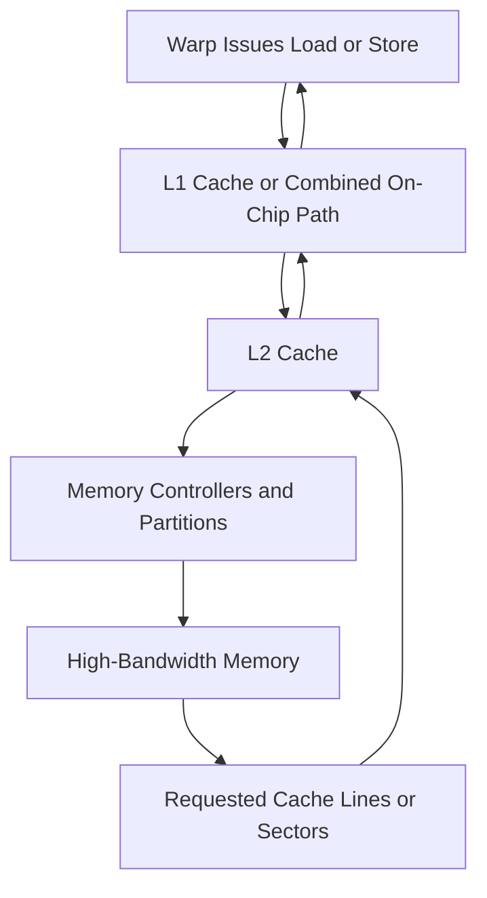
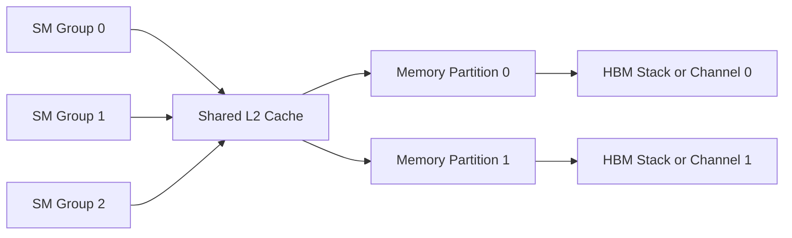
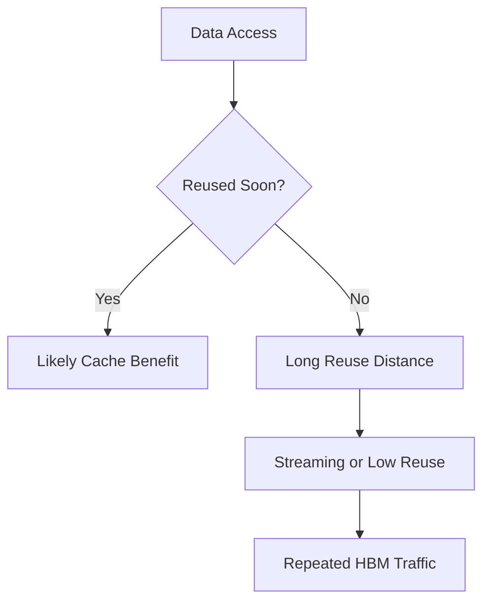

# Global Memory, L1, L2, and HBM

## Introduction

Modern GPUs can execute enormous numbers of arithmetic operations, but those operations are useful only when data arrives quickly enough. The device-memory system therefore combines a large global address space, on-chip caches, memory controllers, and high-bandwidth memory packages.

Peak bandwidth numbers describe an upper bound, not delivered application performance. Access pattern, locality, cache reuse, request size, concurrency, partition balance, and competing traffic determine how much bandwidth a workload actually receives.

| Chapter field | Value |
|---|---|
| Volume | 02 — GPU Architecture |
| Difficulty | Intermediate |
| Estimated reading time | 50 minutes |
| Primary focus | Device-memory path and bandwidth behavior |
| Previous | Registers, Shared Memory, and Local Memory |
| Next | Divergence, Coalescing, and Bottleneck Reasoning |

## Story

A model-serving team upgrades to a GPU with substantially higher arithmetic throughput. Latency improves only slightly. Power and compute-pipeline activity remain below expectation, while memory throughput is consistently high.

The model is dominated by reading weights and KV-cache data. The additional arithmetic capability cannot help because the execution units spend much of their time waiting for data. The upgrade improved the wrong resource.

The correct question is not “How many operations can this GPU perform?” It is “How many useful operations can the workload perform for each byte moved?”

## Learning Objectives

After completing this chapter, you will be able to:

- Explain the role of global memory, L1 cache, L2 cache, memory controllers, and HBM.
- Distinguish memory capacity, bandwidth, latency, and effective throughput.
- Describe how locality and reuse affect cache behavior.
- Explain why memory partition balance matters.
- Recognize memory-bound workload symptoms.

## Big Picture

**Figure 2.8.1 — Simplified device-memory path.** A request may be satisfied by cache or continue through L2, memory partitions, and HBM before data returns to the requesting warp.

The precise implementation varies across GPU generations. The architectural lesson remains stable: each level trades capacity for access cost, and efficient workloads maximize useful reuse before reaching slower levels.

## Global Memory

Global memory is the large device-accessible memory space used for model weights, activations, tensors, buffers, and application data. On data-center GPUs, the physical implementation may use high-bandwidth memory located near the GPU package.

“Global” describes visibility across threads and blocks, not a separate physical chip type. A global-memory access may hit in cache or travel to HBM.

Global memory offers large capacity compared with registers or shared memory, but its access latency is much higher. GPUs tolerate this latency by keeping many warps ready and by combining requests efficiently.

## L1 Cache

L1 cache is close to the execution resources of an SM. It captures spatial and temporal locality for loads that are eligible to use it. In many architectures, L1 resources interact with or share physical capacity with shared-memory functionality.

L1 is useful when nearby threads access nearby addresses or when the same data is reused before eviction. It is less useful for large streaming datasets with little reuse.

## L2 Cache

L2 is a larger cache shared across broader portions of the GPU. It provides a common point for data reuse across SMs, reduces repeated HBM traffic, and participates in memory coherence and atomic-operation behavior.

A larger L2 can improve workloads with working sets or access patterns that fit effectively within it. Capacity alone does not guarantee benefit; reuse distance and contention determine hit rate.

**Figure 2.8.2 — Shared cache and memory partitions.** Requests from many SMs converge on L2 and are distributed across memory-controller partitions.

## High-Bandwidth Memory

High-Bandwidth Memory places multiple memory dies in stacks connected through a wide interface. The design provides far more aggregate bandwidth than conventional narrow memory interfaces, which is valuable for tensor-heavy and data-intensive workloads.

HBM still has finite bandwidth and latency. Large model weights, activation traffic, KV-cache access, checkpointing, peer communication, and memory copies can compete for the same memory system.

| Memory property | Meaning |
|---|---|
| Capacity | Total bytes that can be stored |
| Peak bandwidth | Maximum theoretical transfer rate |
| Effective bandwidth | Useful bytes delivered by a workload per unit time |
| Latency | Time from request to usable data |
| Reuse | Number of useful operations performed before data must be fetched again |

A workload may fit in memory but still be too bandwidth-intensive. Capacity and bandwidth are separate sizing dimensions.

## Memory Controllers and Partitions

The GPU memory system is divided into partitions. Address mapping distributes requests across controllers and memory channels. Balanced traffic can use aggregate bandwidth; concentrated traffic may overload a subset of partitions while others remain underused.

Partition imbalance can emerge from stride patterns, tensor layouts, alignment, or allocator behavior. The workload then delivers less than expected even though total theoretical bandwidth is high.

## Locality and Reuse

### Temporal locality

The same data is reused within a short period. Cache can avoid repeated HBM reads.

### Spatial locality

Nearby addresses are accessed together. A memory transaction can serve multiple useful values.

### Working-set size

The active data set must compete for cache capacity. When reuse occurs only after the data has been evicted, the cache provides little benefit.

**Figure 2.8.3 — Reuse determines cache value.** Cache is most useful when data is reused before competing traffic evicts it.

## Arithmetic Intensity

Arithmetic intensity relates useful computation to bytes transferred. A workload with high arithmetic intensity performs many operations per byte and is more likely to benefit from additional compute. A workload with low arithmetic intensity may be limited by memory bandwidth.

The concept supports the roofline mental model: performance is constrained either by compute throughput or by memory bandwidth, depending on the workload's operation-to-byte ratio.

:::important
High GPU utilization does not prove a compute-bound workload. Always compare compute-pipeline activity, memory throughput, stall reasons, and delivered application throughput.
:::

## Architecture Trade-offs

### Cache versus explicit shared-memory staging

Caches require less application complexity and adapt automatically. Shared memory provides explicit control and predictable reuse but consumes per-block resources and requires synchronization.

### Larger batches

Larger batches can improve arithmetic reuse and throughput, but increase memory footprint and latency. In inference, batching decisions must respect service-level objectives.

### Compression and reduced precision

Smaller representations reduce memory traffic and capacity demand, but may require conversion, calibration, or accuracy validation.

### Recomputing versus storing

Some workloads recompute intermediate values instead of storing and reloading them. This trades arithmetic work for memory traffic.

## Production Deployment Perspective

Memory sizing should include more than model weights. Depending on the workload, total demand may include:

- Model parameters
- Activations
- Optimizer state
- Gradients
- Temporary workspaces
- KV cache
- Communication buffers
- Runtime fragmentation and allocator reserves

Operational capacity plans should measure representative peak behavior rather than rely only on static model size.

## Production Troubleshooting

### Problem: GPU has high memory throughput but low compute activity

**Likely pattern:** memory-bound execution.

**Diagnosis:** compare memory throughput, cache hit behavior, arithmetic intensity, kernel stall reasons, and end-to-end data movement.

**Resolution options:** improve reuse, use a better data layout, increase batching where latency permits, reduce precision, fuse operations, or select hardware with a more appropriate bandwidth-to-compute ratio.

### Problem: Delivered bandwidth is far below expectation

Possible causes include:

- Uncoalesced or small transactions
- Insufficient concurrent requests
- Cache-thrashing access patterns
- Memory-partition imbalance
- Host-device transfer bottlenecks mistaken for HBM limits
- Synchronization gaps between kernels

### Problem: Out-of-memory failures are intermittent

Investigate peak workspace use, allocator fragmentation, concurrent requests, KV-cache growth, and memory retained by framework pools.

## Customer Scenario

A customer compares two GPU options using only memory capacity and peak compute. Their inference workload repeatedly streams large model weights and uses small batches. The architect adds memory bandwidth, L2 behavior, expected cache reuse, and latency targets to the evaluation.

The less compute-dense GPU may be more appropriate if it provides the required memory capacity and bandwidth at lower cost. Architecture follows the workload's limiting resource, not the largest specification number.

## Interview Preparation

### Conceptual Questions

1. What is the difference between global memory and HBM?
2. Why can a larger L2 cache improve inference?
3. How do capacity and bandwidth differ in sizing decisions?

### Architecture Questions

1. Draw the path of a global-memory load.
2. Explain how memory partitions contribute to aggregate bandwidth.
3. Describe when shared-memory staging is preferable to cache.

### Scenario Questions

1. Memory throughput is high while compute activity is low. What does this suggest?
2. A model fits in GPU memory but misses latency targets. What memory questions do you ask?
3. Effective bandwidth is low despite coalesced access. What else might limit it?

## Summary

The device-memory system is a hierarchy. Loads and stores may be served by L1 or L2 cache or continue through memory partitions to HBM. HBM provides high aggregate bandwidth and large capacity, but application performance depends on access pattern, locality, reuse, concurrency, and balance.

Understanding this hierarchy prevents a common architectural mistake: treating peak compute as the primary predictor of performance when the workload is actually constrained by data movement.

## Key Takeaways

- Global memory is an address space; HBM is a physical memory technology.
- L1 and L2 reduce repeated HBM traffic when locality exists.
- Memory capacity and memory bandwidth solve different problems.
- Effective bandwidth depends on access efficiency and partition balance.
- Arithmetic intensity helps distinguish compute-bound and memory-bound workloads.

## Cross References

- Previous: [Registers, Shared Memory, and Local Memory](./chapter-07-registers-shared-memory-and-local-memory)
- Next: [Divergence, Coalescing, and Bottleneck Reasoning](./chapter-09-divergence-coalescing-and-bottleneck-reasoning)
- Related lab: [Profile Memory and Warp Efficiency](./labs/lab-03-profile-memory-and-warp-efficiency)
