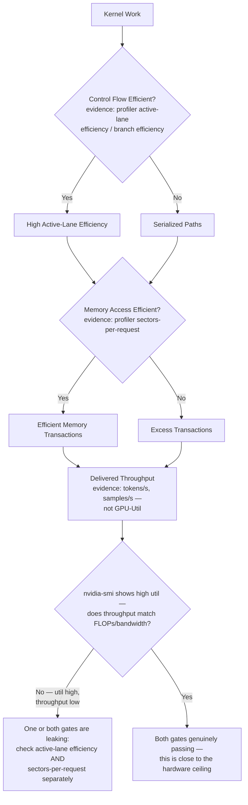
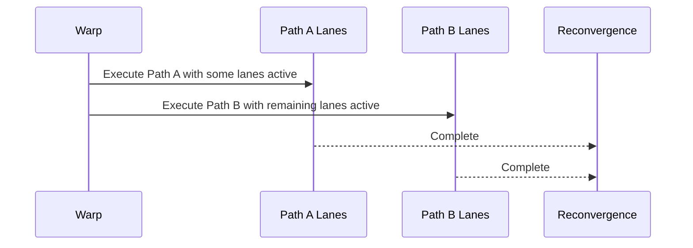
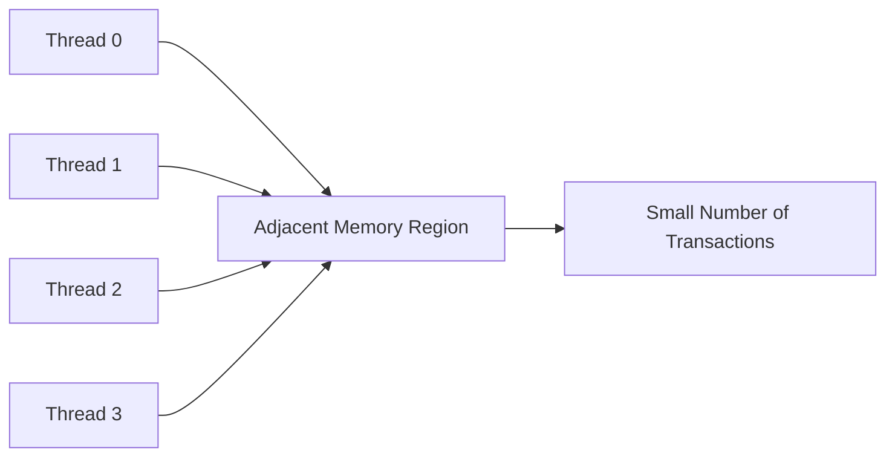
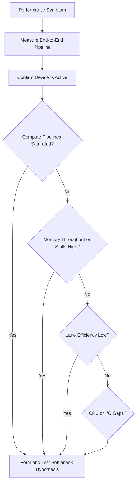

# Divergence, Coalescing, and Bottleneck Reasoning

## Introduction

A GPU may contain enough execution units, memory bandwidth, and active warps, yet still deliver poor throughput. Two common causes are inefficient control flow and inefficient memory access.

Control-flow divergence reduces the number of useful lanes executing together inside a warp. Uncoalesced memory access forces the memory system to perform more transactions than the amount of useful data requires. Both problems waste parallel hardware without necessarily producing an obvious error.

The deeper skill is not memorizing these two terms. It is learning to identify the dominant bottleneck and separate root cause from secondary symptoms.

| Chapter field | Value |
|---|---|
| Volume | 02 — GPU Architecture |
| Difficulty | Intermediate |
| Estimated reading time | 50 minutes |
| Primary focus | Warp efficiency, memory transactions, and bottleneck analysis |
| Previous | Global Memory, L1, L2, and HBM |
| Next | Volume 02 synthesis and architecture review |

## Story

A fraud-analysis kernel reports high occupancy and moderate GPU utilization, but throughput is poor. The team increases block size and launches more work. Performance barely changes.

Profiling shows two independent inefficiencies. Threads in each warp follow different rule paths, so only a fraction of lanes are active during long sections. The surviving threads then read scattered records, causing many memory transactions for relatively little useful data.

The GPU is busy, but much of the activity is wasted. The issue is not insufficient work; it is inefficient work.

## Learning Objectives

After completing this chapter, you will be able to:

- Explain how warp divergence reduces useful execution efficiency.
- Describe how coalesced access reduces memory transactions.
- Distinguish occupancy, utilization, and useful throughput.
- Build a bottleneck hypothesis from metrics and workload behavior.
- Avoid optimization changes that move rather than remove the bottleneck.

## Big Picture



**Figure 2.9.1 — Two major efficiency gates.** A workload must use both warp lanes and memory transactions efficiently to convert hardware capability into delivered throughput. Both gates can leak independently and simultaneously — a kernel can waste lanes to divergence *and* waste transactions to poor coalescing at the same time — which is why the closing check compares delivered application throughput (not `nvidia-smi`'s utilization number) against what the hardware's own specs would predict, and only then decides which gate to open next.

**Reading both gates from one profiler pass:**

```text
$ ncu --metrics smsp__thread_inst_executed_per_inst_executed.ratio,l1tex__average_t_sectors_per_request_pipe_lsu_mem_global_op_ld.ratio ./kernel
  smsp__thread_inst_executed_per_inst_executed.ratio               19.4
  l1tex__average_t_sectors_per_request_pipe_lsu_mem_global_op_ld.ratio    3.2
```

The first metric is active-lane efficiency expressed as threads-executed-per-instruction out of a possible 32 — `19.4` means only about 60% of each warp's lanes are contributing useful work on average, the direct fingerprint of the "Control Flow" gate leaking. The second metric, `3.2` sectors per load request against an ideal near `1`, is the "Memory Access" gate leaking at the same time. Neither number is visible in `nvidia-smi`; both are why the same kernel can report 90%+ `GPU-Util` while delivering a small fraction of the throughput its FLOPs and bandwidth specs would suggest.

## Warp Divergence

A warp executes a common instruction stream across its lanes. When threads choose different branches, the hardware may execute one path for the lanes that require it and another path for the remaining lanes.



**Figure 2.9.2 — Simplified divergent execution.** Different paths are executed with subsets of lanes active before control reconverges.

Divergence severity depends on:

- How many lanes choose each path
- How long the paths remain separate
- Whether both paths perform expensive work
- How frequently the branch occurs
- Whether threads can be reorganized by similar behavior

A branch is not automatically harmful. If every lane takes the same path, execution remains uniform. Short divergent regions may also have limited impact.

## Predication

For short conditional regions, the compiler may use predication. Instructions execute for the warp, while predicates determine which lanes commit results. This avoids a control-flow branch but still spends instruction slots on inactive lanes.

Predication changes the mechanism, not the fundamental cost: work issued to inactive lanes does not contribute useful results.

## Memory Coalescing

Threads in a warp often access memory at the same time. When their addresses fall into an efficient set of aligned regions, the hardware can combine the requests into a small number of transactions. This is coalesced access.



**Figure 2.9.3 — Coalesced access.** Nearby thread addresses allow the memory system to serve useful data with relatively few transactions.

If addresses are scattered, strided, or poorly aligned, the same amount of useful data may require many more transactions.

| Access pattern | Expected behavior |
|---|---|
| Adjacent threads access adjacent elements | Usually efficient |
| Threads access large-stride elements | May require more transactions |
| Threads access random records | Often transaction-heavy |
| Data structure stores fields together by type | Often improves vector-style access |
| Data structure stores many unrelated fields per object | May fetch unused bytes |

## Array of Structures versus Structure of Arrays

An Array of Structures groups all fields for one object together. A Structure of Arrays groups the same field from many objects together.

For workloads where neighboring threads read the same field from neighboring objects, Structure of Arrays often supports more coalesced access. Array of Structures may be better when each thread consumes most fields of one object.

The correct layout follows access behavior, not a universal rule.

## Useful Bytes versus Transferred Bytes

A memory system may transfer more data than the application actually uses. The ratio between requested useful bytes and transferred bytes is a practical measure of access efficiency.

High device-memory bandwidth with poor application throughput can indicate that the memory system is moving many unnecessary bytes or serving too many small transactions.

**A worked useful-bytes calculation.** A warp of 32 threads each reading one 4-byte float, at fully coalesced adjacent addresses, needs 128 useful bytes and (on typical architectures with 32-byte sector granularity) around 4 sectors — close to the minimum possible transaction count for that data. The same 32 threads reading the same 128 bytes but scattered across 32 different cache lines can require up to 32 separate sector transactions — 8x the transaction count for the identical useful-byte count. If each sector fetch moves 32 bytes regardless of how many bytes are actually used, this scattered case transfers `32 sectors x 32 bytes = 1,024 bytes` from HBM to deliver 128 useful bytes — an 8x amplification. This is the arithmetic behind why a memory-bound kernel's *effective* bandwidth (useful bytes ÷ time) can be a small fraction of its *measured* bandwidth (total bytes moved ÷ time): `dmon`'s `mem%` reports the latter, not the former.

## Occupancy, Utilization, and Efficiency

These metrics describe different things.

| Metric | What it indicates | What it does not prove |
|---|---|---|
| Occupancy | Resident warps relative to a hardware limit | Useful work or high throughput |
| GPU utilization | Time during which kernels are active | Efficient lane or memory use |
| Memory utilization | Activity in memory subsystem | Useful byte efficiency |
| Active-lane efficiency | Fraction of lanes contributing | Memory efficiency |
| Application throughput | Delivered business or scientific work | Root cause of limitation |

A busy GPU can be inefficient. A lower-utilization GPU can still meet service goals. Architecture decisions should follow delivered outcomes and evidence.

## Bottleneck Reasoning

A disciplined investigation starts with a hypothesis about the limiting resource.



**Figure 2.9.4 — Bottleneck investigation.** Measurements narrow the problem from end-to-end symptoms to compute, memory, control-flow, or workload-feeding constraints.

### Compute-bound pattern

- High execution-pipeline activity
- High arithmetic intensity
- Memory throughput below saturation
- Performance improves with additional or faster compute resources

### Memory-bound pattern

- High memory throughput or memory-related stalls
- Low arithmetic intensity
- Limited benefit from additional compute
- Performance improves with reuse, compression, fusion, or bandwidth

### Control-flow-bound pattern

- Low active-lane efficiency
- Significant divergent execution
- Irregular work per thread
- Performance improves after grouping similar work or restructuring branches

### Launch- or feed-bound pattern

- Gaps between kernels
- Short kernels with high launch frequency
- CPU, storage, tokenization, or preprocessing delays
- Low power and low sustained device activity

## Optimization Order

Optimize the largest verified bottleneck first. Common mistakes include:

- Increasing occupancy when memory bandwidth is already saturated
- Fusing kernels until register pressure causes spills
- Increasing batch size beyond latency or memory limits
- Reorganizing branches while CPU input remains the real bottleneck
- Buying larger GPUs before validating software efficiency

A successful optimization may expose a new bottleneck. This is expected. Performance engineering is iterative.

:::warning
Do not compare isolated profiler percentages without context. Metrics change with GPU generation, kernel mix, workload size, and profiler methodology.
:::

## Production Deployment Perspective

Production performance baselines should include:

- Application throughput and latency percentiles
- GPU utilization and power
- Compute-pipeline activity
- Memory throughput and cache behavior
- Active-lane or branch efficiency
- Kernel duration and launch frequency
- CPU, storage, and network feeding rates

Baselines should be collected with representative data, concurrency, batch sizes, and model configurations.

## Production Troubleshooting

### Problem: GPU utilization is high but throughput is low

**Diagnosis**

Check active-lane efficiency, memory transaction efficiency, cache hit behavior, kernel mix, and application-level work completed per second.

**Possible root causes**

- Divergent control flow
- Uncoalesced access
- Excessive synchronization
- Memory bandwidth saturation
- Repeated work or poor algorithmic complexity

**Turning this into evidence, both gates at once.** The paired profiler read from the Big Picture section is exactly the confirmation this row needs:

```text
$ ncu --metrics smsp__thread_inst_executed_per_inst_executed.ratio,l1tex__average_t_sectors_per_request_pipe_lsu_mem_global_op_ld.ratio,dram__throughput.avg.pct_of_peak_sustained_elapsed ./kernel
  smsp__thread_inst_executed_per_inst_executed.ratio                  14.1
  l1tex__average_t_sectors_per_request_pipe_lsu_mem_global_op_ld.ratio  5.6
  dram__throughput.avg.pct_of_peak_sustained_elapsed                  38.2
```

`14.1 / 32 ≈ 44%` active-lane efficiency (divergence is real and severe), `5.6` sectors/request (uncoalesced access is also real), and only `38.2%` of peak HBM bandwidth actually achieved (so this is not simply bandwidth-saturated — there's real headroom being wasted). Together, this one profiler pass rules out "memory bandwidth saturation" as the root cause (bandwidth achieved is well under the ceiling) and confirms both divergence and uncoalesced access are compounding — the two problems described in this chapter's opening Story, reproduced as measurable numbers instead of narrative.

### Problem: A data-layout change improves bandwidth but increases latency

The new layout may require preprocessing, transposition, extra copies, or more complicated indexing. Evaluate end-to-end latency, not kernel bandwidth alone.

### Problem: Performance changes with input data

Irregular branches and data-dependent access patterns can make execution efficiency depend on the distribution of inputs. Test multiple representative data sets.

## Customer Scenario

A customer reports that GPU utilization is consistently above 90 percent and concludes the cluster is efficiently used. Their business throughput remains below target.

The architect separates activity from efficiency. Profiling shows low active-lane efficiency in a custom preprocessing kernel and poor memory transaction efficiency in an embedding lookup. The recommendation focuses on software layout and workload grouping rather than additional GPUs.

## Interview Preparation

### Conceptual Questions

1. Why does a divergent warp not execute both branches fully in parallel?
**Model answer:** "Because all 32 threads in a warp share one instruction stream — there's one program counter driving the warp, not 32 independent ones. When threads disagree on which branch to take, the hardware has to execute each distinct path as a separate pass, masking off the lanes that don't belong to that path on each pass. It's not that the hardware refuses to parallelize — there's no way to parallelize two different instruction streams through one shared issue slot. I'd back this with the profiler metric: `smsp__thread_inst_executed_per_inst_executed.ratio` directly measures how many of a warp's 32 lanes were actually contributing on average, and a divergent kernel shows that number well below 32."

2. What makes a global-memory access coalesced?
**Model answer:** "When the addresses a warp's 32 threads touch in one instruction fall into a small number of aligned, contiguous memory segments, so the hardware can combine them into a small number of transactions instead of one per thread. I'd give the concrete case: 32 threads reading 32 adjacent floats is close to the minimum transaction count; the same 32 threads reading 32 floats scattered across different cache lines can multiply that transaction count up to 8x or more for the identical useful-byte count — I've seen `l1tex__average_t_sectors_per_request` values around 5-6 on a kernel like that, versus close to 1 for the coalesced version."

3. Why is high utilization not proof of high efficiency?
**Model answer:** "Because 'utilization' just means an engine was busy during the sample window — it says nothing about whether the work being done was useful. I've seen a concrete case: a kernel at `smsp__thread_inst_executed_per_inst_executed.ratio` of 14 out of 32 possible — meaning under half of each warp's lanes were doing real work — while `nvidia-smi` would still happily report high GPU-Util for that same kernel, because the SM genuinely was issuing instructions continuously. Utilization measures activity; active-lane efficiency and transaction efficiency measure whether that activity produced useful results."

### Architecture Questions

1. Compare an Array of Structures with a Structure of Arrays for GPU access.
**Model answer:** "AoS stores all fields of one object together — good when one thread needs most fields of one object, since that access is naturally local. SoA stores each field across all objects in its own contiguous array — good when neighboring threads read the same field from neighboring objects, since that's exactly what coalescing rewards. I'd give a concrete case: a warp reading the `.x` field of 32 particles is one clean coalesced access under SoA, but under AoS those 32 `.x` values are scattered every `sizeof(struct)` bytes apart, which can force one transaction per thread instead of a handful. The right layout follows the access pattern, not a universal rule — an algorithm that consumes whole objects per thread might actually prefer AoS."

2. Build a decision tree for compute-bound versus memory-bound behavior.
**Model answer:** "I'd start with `dmon`'s `sm%` and `mem%` together, sampled during the workload. Both high and sustained: check whether it's genuinely compute-limited (arithmetic pipeline activity high, Tensor Core metric matches expectation) or actually memory-limited despite the SM number, since SMs issuing stalled memory requests still show as 'busy.' `mem%` high, `sm%` low: that's the clean memory-bound signature — confirm with an L1/L2 hit-rate check to see if it's inherent low arithmetic intensity or a fixable access-pattern problem. Both low, oscillating over time: that's not a compute-vs-memory question at all, it's a launch/feed problem upstream of the kernel. I'd walk an interviewer through exactly that branching, in that order."

3. Explain how occupancy and divergence can interact.
**Model answer:** "They're mostly independent axes, and that independence is the trap — you can have high occupancy and severe divergence at the same time, because occupancy only counts resident warp *slots*, not whether the lanes within those warps are doing useful work. A kernel can report 90% occupancy while `smsp__thread_inst_executed_per_inst_executed.ratio` shows only 40% of lanes active on average — plenty of warps resident, but each one wasting more than half its width on masked-off lanes from divergent branches. Fixing occupancy wouldn't touch this problem at all; the two need separate diagnosis and separate fixes."

### Scenario Questions

1. Memory bandwidth is high but useful throughput is low. What do you investigate?
**Model answer:** "First whether 'high bandwidth' means high *achieved* bandwidth relative to peak, or just high `mem%` in `dmon` — those aren't the same thing, and I'd pull `dram__throughput.avg.pct_of_peak_sustained_elapsed` to get the real number. Then I'd check sectors-per-request: if it's well above 1, the memory system is moving several times more raw bytes than the useful-byte count requires, which explains low throughput despite high raw bandwidth — the fix is a layout or access-pattern change, not more bandwidth."

2. Performance varies sharply with input data. What architectural behavior may explain it?
**Model answer:** "Data-dependent branching or data-dependent access patterns — both of this chapter's two efficiency gates can be input-sensitive. Uniformly-distributed rule paths in a fraud-detection kernel, for instance, might have every thread in most warps agree on the same branch for one input distribution but split evenly for another, changing active-lane efficiency dramatically between runs. Same idea for access patterns: sparse or skewed data can turn what looked like a coalesced access on test data into a scattered one on production data. I'd test with multiple representative datasets, not just one, precisely because of this."

3. A branch-removal optimization increases register pressure. How do you evaluate the trade-off?
**Model answer:** "I'd measure both sides concretely rather than assume either direction wins. Check `nvcc -Xptxas=-v` for the registers/thread delta and whether spills appear — that tells me the occupancy cost. Check active-lane efficiency before and after — that tells me the divergence benefit. If removing the branch (say, via predication or restructuring) meaningfully raises active-lane efficiency and the register increase doesn't push into spilling or an occupancy cliff, it's very likely a net win. If it triggers spills, I'd weigh the new memory traffic against the divergence saved — sometimes explicitly, with a before/after `dmon` `mem%` comparison, since spills are themselves memory traffic."

## Summary

Divergence wastes execution lanes when threads in a warp require different control paths. Uncoalesced access wastes memory transactions when threads request poorly organized addresses. Both reduce useful throughput without necessarily reducing raw GPU activity.

The architect's job is to connect symptoms to the limiting resource. Occupancy, utilization, lane efficiency, bandwidth, cache behavior, and application throughput must be interpreted together.

## Key Takeaways

- Branches are costly when they create long, uneven paths within a warp.
- Coalesced access reduces the number of transactions required for useful data.
- Data layout should follow the access pattern of neighboring threads.
- High utilization can coexist with poor efficiency.
- Optimize only after identifying and testing the dominant bottleneck.

## Cross References

- Previous: [Global Memory, L1, L2, and HBM](./chapter-08-global-memory-l1-l2-and-hbm)
- Related: [Threads, Warps, Blocks, and Streaming Multiprocessors](./chapter-03-threads-warps-blocks-and-sms)
- Related lab: [Profile Memory and Warp Efficiency](./labs/lab-03-profile-memory-and-warp-efficiency)
