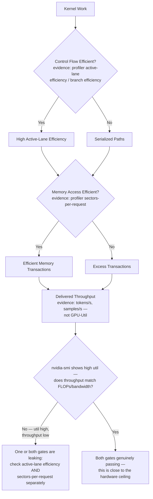
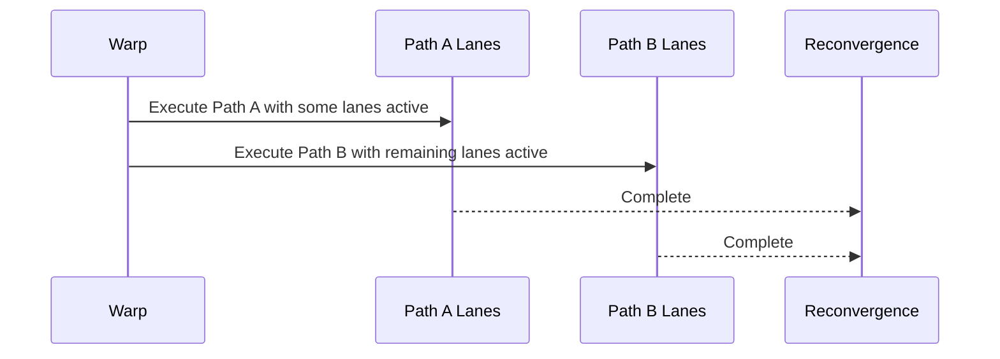
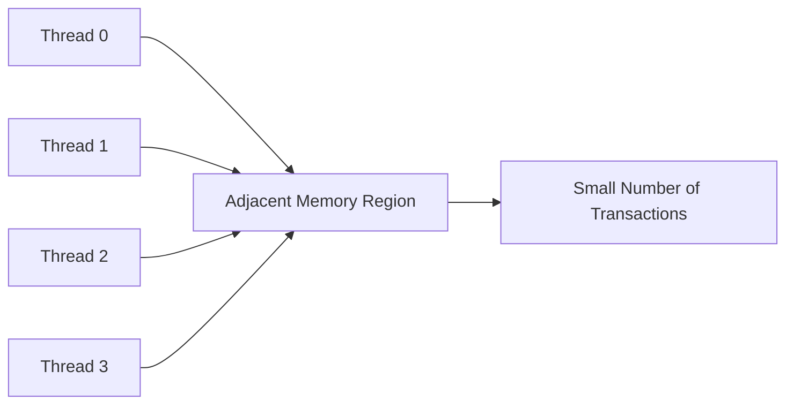
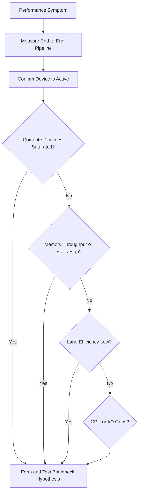

# Divergence, Coalescing, and Bottleneck Reasoning

## Introduction

A GPU may contain enough execution units, memory bandwidth, and active warps, yet still deliver poor throughput. Two common causes are inefficient control flow and inefficient memory access.

Control-flow divergence reduces the number of useful lanes executing together inside a warp. Uncoalesced memory access forces the memory system to perform more transactions than the amount of useful data requires. Both problems waste parallel hardware without necessarily producing an obvious error.

The deeper skill is not memorizing these two terms. It is learning to identify the dominant bottleneck and separate root cause from secondary symptoms.

| Chapter field | Value |
|---|---|
| Volume | 02 — GPU Architecture |
| Difficulty | Intermediate |
| Estimated reading time | 50 minutes |
| Primary focus | Warp efficiency, memory transactions, and bottleneck analysis |
| Previous | Global Memory, L1, L2, and HBM |
| Next | Volume 02 synthesis and architecture review |

## Story

A fraud-analysis kernel reports high occupancy and moderate GPU utilization, but throughput is poor. The team increases block size and launches more work. Performance barely changes.

Profiling shows two independent inefficiencies. Threads in each warp follow different rule paths, so only a fraction of lanes are active during long sections. The surviving threads then read scattered records, causing many memory transactions for relatively little useful data.

The GPU is busy, but much of the activity is wasted. The issue is not insufficient work; it is inefficient work.

## Learning Objectives

After completing this chapter, you will be able to:

- Explain how warp divergence reduces useful execution efficiency.
- Describe how coalesced access reduces memory transactions.
- Distinguish occupancy, utilization, and useful throughput.
- Build a bottleneck hypothesis from metrics and workload behavior.
- Avoid optimization changes that move rather than remove the bottleneck.

## Big Picture



**Figure 2.9.1 — Two major efficiency gates.** A workload must use both warp lanes and memory transactions efficiently to convert hardware capability into delivered throughput. Both gates can leak independently and simultaneously — a kernel can waste lanes to divergence *and* waste transactions to poor coalescing at the same time — which is why the closing check compares delivered application throughput (not `nvidia-smi`'s utilization number) against what the hardware's own specs would predict, and only then decides which gate to open next.

**Reading both gates from one profiler pass:**

```text
$ ncu --metrics smsp__thread_inst_executed_per_inst_executed.ratio,l1tex__average_t_sectors_per_request_pipe_lsu_mem_global_op_ld.ratio ./kernel
  smsp__thread_inst_executed_per_inst_executed.ratio               19.4
  l1tex__average_t_sectors_per_request_pipe_lsu_mem_global_op_ld.ratio    3.2
```

The first metric is active-lane efficiency expressed as threads-executed-per-instruction out of a possible 32 — `19.4` means only about 60% of each warp's lanes are contributing useful work on average, the direct fingerprint of the "Control Flow" gate leaking. The second metric, `3.2` sectors per load request against an ideal near `1`, is the "Memory Access" gate leaking at the same time. Neither number is visible in `nvidia-smi`; both are why the same kernel can report 90%+ `GPU-Util` while delivering a small fraction of the throughput its FLOPs and bandwidth specs would suggest.

## Warp Divergence

A warp executes a common instruction stream across its lanes. When threads choose different branches, the hardware may execute one path for the lanes that require it and another path for the remaining lanes.



**Figure 2.9.2 — Simplified divergent execution.** Different paths are executed with subsets of lanes active before control reconverges.

Divergence severity depends on:

- How many lanes choose each path
- How long the paths remain separate
- Whether both paths perform expensive work
- How frequently the branch occurs
- Whether threads can be reorganized by similar behavior

A branch is not automatically harmful. If every lane takes the same path, execution remains uniform. Short divergent regions may also have limited impact.

## Predication

For short conditional regions, the compiler may use predication. Instructions execute for the warp, while predicates determine which lanes commit results. This avoids a control-flow branch but still spends instruction slots on inactive lanes.

Predication changes the mechanism, not the fundamental cost: work issued to inactive lanes does not contribute useful results.

## Memory Coalescing

Threads in a warp often access memory at the same time. When their addresses fall into an efficient set of aligned regions, the hardware can combine the requests into a small number of transactions. This is coalesced access.



**Figure 2.9.3 — Coalesced access.** Nearby thread addresses allow the memory system to serve useful data with relatively few transactions.

If addresses are scattered, strided, or poorly aligned, the same amount of useful data may require many more transactions.

| Access pattern | Expected behavior |
|---|---|
| Adjacent threads access adjacent elements | Usually efficient |
| Threads access large-stride elements | May require more transactions |
| Threads access random records | Often transaction-heavy |
| Data structure stores fields together by type | Often improves vector-style access |
| Data structure stores many unrelated fields per object | May fetch unused bytes |

## Array of Structures versus Structure of Arrays

An Array of Structures groups all fields for one object together. A Structure of Arrays groups the same field from many objects together.

For workloads where neighboring threads read the same field from neighboring objects, Structure of Arrays often supports more coalesced access. Array of Structures may be better when each thread consumes most fields of one object.

The correct layout follows access behavior, not a universal rule.

## Useful Bytes versus Transferred Bytes

A memory system may transfer more data than the application actually uses. The ratio between requested useful bytes and transferred bytes is a practical measure of access efficiency.

High device-memory bandwidth with poor application throughput can indicate that the memory system is moving many unnecessary bytes or serving too many small transactions.

## Occupancy, Utilization, and Efficiency

These metrics describe different things.

| Metric | What it indicates | What it does not prove |
|---|---|---|
| Occupancy | Resident warps relative to a hardware limit | Useful work or high throughput |
| GPU utilization | Time during which kernels are active | Efficient lane or memory use |
| Memory utilization | Activity in memory subsystem | Useful byte efficiency |
| Active-lane efficiency | Fraction of lanes contributing | Memory efficiency |
| Application throughput | Delivered business or scientific work | Root cause of limitation |

A busy GPU can be inefficient. A lower-utilization GPU can still meet service goals. Architecture decisions should follow delivered outcomes and evidence.

## Bottleneck Reasoning

A disciplined investigation starts with a hypothesis about the limiting resource.



**Figure 2.9.4 — Bottleneck investigation.** Measurements narrow the problem from end-to-end symptoms to compute, memory, control-flow, or workload-feeding constraints.

### Compute-bound pattern

- High execution-pipeline activity
- High arithmetic intensity
- Memory throughput below saturation
- Performance improves with additional or faster compute resources

### Memory-bound pattern

- High memory throughput or memory-related stalls
- Low arithmetic intensity
- Limited benefit from additional compute
- Performance improves with reuse, compression, fusion, or bandwidth

### Control-flow-bound pattern

- Low active-lane efficiency
- Significant divergent execution
- Irregular work per thread
- Performance improves after grouping similar work or restructuring branches

### Launch- or feed-bound pattern

- Gaps between kernels
- Short kernels with high launch frequency
- CPU, storage, tokenization, or preprocessing delays
- Low power and low sustained device activity

## Optimization Order

Optimize the largest verified bottleneck first. Common mistakes include:

- Increasing occupancy when memory bandwidth is already saturated
- Fusing kernels until register pressure causes spills
- Increasing batch size beyond latency or memory limits
- Reorganizing branches while CPU input remains the real bottleneck
- Buying larger GPUs before validating software efficiency

A successful optimization may expose a new bottleneck. This is expected. Performance engineering is iterative.

:::warning
Do not compare isolated profiler percentages without context. Metrics change with GPU generation, kernel mix, workload size, and profiler methodology.
:::

## Production Deployment Perspective

Production performance baselines should include:

- Application throughput and latency percentiles
- GPU utilization and power
- Compute-pipeline activity
- Memory throughput and cache behavior
- Active-lane or branch efficiency
- Kernel duration and launch frequency
- CPU, storage, and network feeding rates

Baselines should be collected with representative data, concurrency, batch sizes, and model configurations.

## Production Troubleshooting

### Problem: GPU utilization is high but throughput is low

**Diagnosis**

Check active-lane efficiency, memory transaction efficiency, cache hit behavior, kernel mix, and application-level work completed per second.

**Possible root causes**

- Divergent control flow
- Uncoalesced access
- Excessive synchronization
- Memory bandwidth saturation
- Repeated work or poor algorithmic complexity

### Problem: A data-layout change improves bandwidth but increases latency

The new layout may require preprocessing, transposition, extra copies, or more complicated indexing. Evaluate end-to-end latency, not kernel bandwidth alone.

### Problem: Performance changes with input data

Irregular branches and data-dependent access patterns can make execution efficiency depend on the distribution of inputs. Test multiple representative data sets.

## Customer Scenario

A customer reports that GPU utilization is consistently above 90 percent and concludes the cluster is efficiently used. Their business throughput remains below target.

The architect separates activity from efficiency. Profiling shows low active-lane efficiency in a custom preprocessing kernel and poor memory transaction efficiency in an embedding lookup. The recommendation focuses on software layout and workload grouping rather than additional GPUs.

## Interview Preparation

### Conceptual Questions

1. Why does a divergent warp not execute both branches fully in parallel?
2. What makes a global-memory access coalesced?
3. Why is high utilization not proof of high efficiency?

### Architecture Questions

1. Compare an Array of Structures with a Structure of Arrays for GPU access.
2. Build a decision tree for compute-bound versus memory-bound behavior.
3. Explain how occupancy and divergence can interact.

### Scenario Questions

1. Memory bandwidth is high but useful throughput is low. What do you investigate?
2. Performance varies sharply with input data. What architectural behavior may explain it?
3. A branch-removal optimization increases register pressure. How do you evaluate the trade-off?

## Summary

Divergence wastes execution lanes when threads in a warp require different control paths. Uncoalesced access wastes memory transactions when threads request poorly organized addresses. Both reduce useful throughput without necessarily reducing raw GPU activity.

The architect's job is to connect symptoms to the limiting resource. Occupancy, utilization, lane efficiency, bandwidth, cache behavior, and application throughput must be interpreted together.

## Key Takeaways

- Branches are costly when they create long, uneven paths within a warp.
- Coalesced access reduces the number of transactions required for useful data.
- Data layout should follow the access pattern of neighboring threads.
- High utilization can coexist with poor efficiency.
- Optimize only after identifying and testing the dominant bottleneck.

## Cross References

- Previous: [Global Memory, L1, L2, and HBM](./chapter-08-global-memory-l1-l2-and-hbm)
- Related: [Threads, Warps, Blocks, and Streaming Multiprocessors](./chapter-03-threads-warps-blocks-and-sms)
- Related lab: [Profile Memory and Warp Efficiency](./labs/lab-03-profile-memory-and-warp-efficiency)
