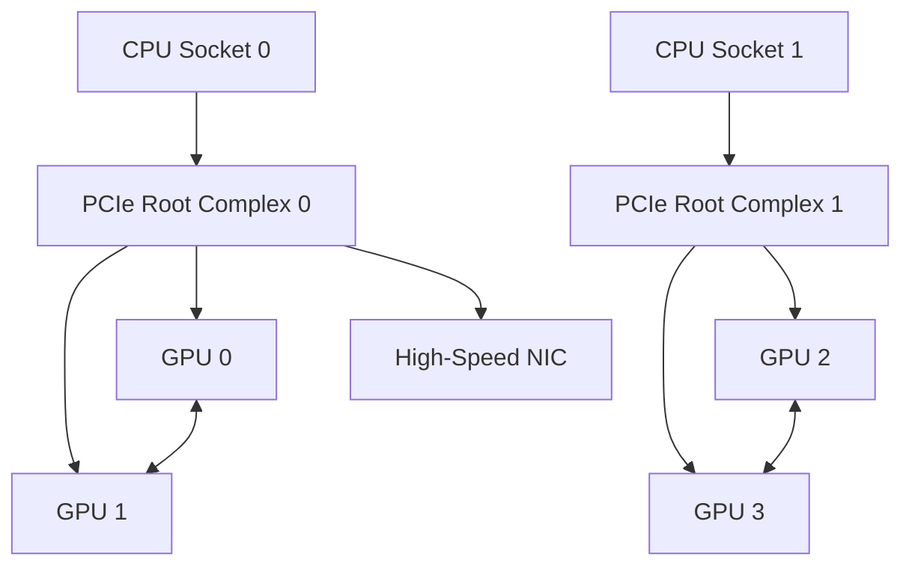
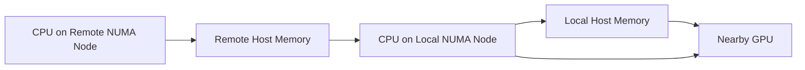
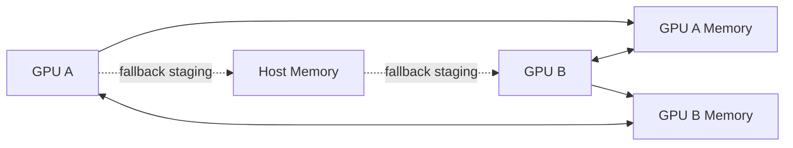
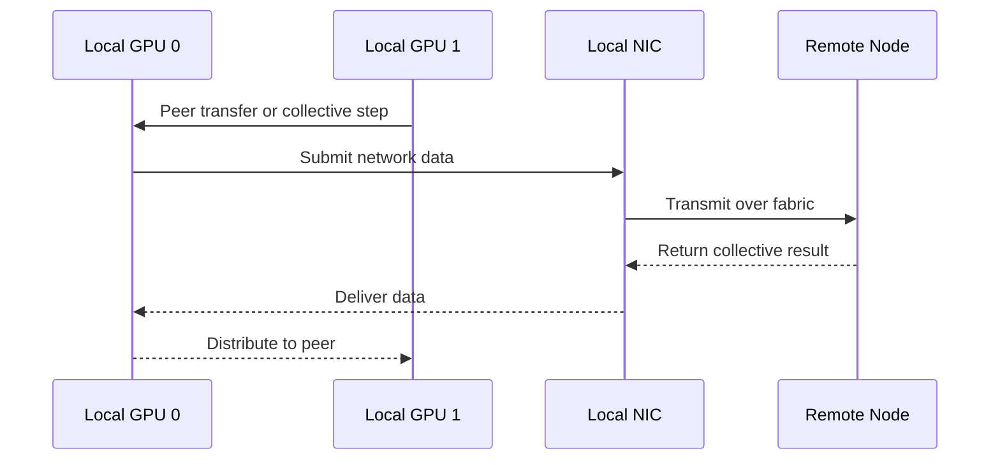

# GPU Topology, Peer Access, and Data Paths

## Introduction

A multi-GPU server may contain several identical accelerators, yet communication between two selected devices can be much faster than communication between another pair. The difference is not the GPU model. It is the path between them.

Data may travel through a direct GPU interconnect, across a PCIe switch, through a host bridge, or even across CPU sockets. Each additional boundary introduces bandwidth limits, latency, contention, and operational consequences. For this reason, GPU count alone is not an architecture.

Topology explains how accelerators, CPUs, memory controllers, network adapters, and storage devices are physically connected. Peer access explains whether one GPU can address another GPU's memory directly. Together, they determine whether software placement matches the machine that actually exists.

| Chapter field | Value |
|---|---|
| Volume | 02 — GPU Architecture |
| Difficulty | Intermediate |
| Estimated reading time | 50 minutes |
| Primary focus | Multi-GPU locality and communication paths |
| Previous | Divergence, Coalescing, and Bottleneck Reasoning |
| Next | Building a GPU Performance Model |

## Story

A training job uses four GPUs in one server. The framework reports that all four devices are healthy, but scaling from two GPUs to four produces little improvement. The team suspects the collective library.

Topology inspection shows that the first two GPUs share a direct high-bandwidth path, while the other pair sits behind a different PCIe hierarchy. The network adapter used for inter-node traffic is also closest to only one CPU socket. Processes were assigned by GPU index rather than by physical locality.

Nothing was broken. The workload was simply mapped onto the wrong communication paths.

## Learning Objectives

After completing this chapter, you will be able to:

- Explain why logical GPU indices do not describe physical locality.
- Distinguish direct peer paths from host-mediated paths.
- Interpret PCIe, NUMA, and high-speed GPU interconnect relationships.
- Explain the role of peer memory access.
- Identify placement problems that reduce multi-GPU performance.
- Describe how topology influences scheduling and troubleshooting.

## Big Picture

**Figure 2.10.1 — Example multi-GPU topology.** GPUs under the same root complex may have a shorter PCIe path, while selected pairs may also have a direct high-bandwidth peer interconnect.

The diagram is intentionally generic. Real systems may include multiple PCIe switches, NVSwitch fabrics, integrated CPUs, several NICs, or more complex board-level routing.

## Logical Identity versus Physical Placement

GPU software often exposes devices as `GPU 0`, `GPU 1`, and so on. Those indices are convenient, but they are not stable architectural identifiers. Enumeration order can change after firmware updates, device replacement, or operating-system changes.

A topology-aware design uses stable identifiers and physical relationships:

- GPU UUID
- PCI bus address
- NUMA node
- CPU affinity
- NIC affinity
- peer-access capability
- direct-link or switch path

A scheduler that sees only a count of four GPUs knows capacity. It does not automatically know which two GPUs should be paired for a communication-heavy workload.

## PCIe Hierarchy

PCI Express connects GPUs to host CPUs and often to network or storage devices. A typical path contains endpoints, switches, root ports, and root complexes.

Two GPUs can communicate through PCIe peer-to-peer transactions when the platform, firmware, driver, and device path support it. However, peer traffic may still cross one or more switches, and path quality varies.

| Path characteristic | Architectural implication |
|---|---|
| Same PCIe switch | Shorter path and shared switch bandwidth |
| Different switches under one root complex | Additional switching and possible contention |
| Different root complexes on one socket | More host-fabric traversal |
| Different CPU sockets | Possible inter-socket traffic and NUMA penalty |
| GPU and NIC share locality | Better potential for communication placement |

A shorter path is usually preferable, but architecture must also consider shared-bandwidth contention. Several fast devices behind one switch can compete for the same upstream link.

## NUMA Locality

Non-Uniform Memory Access means that CPU cores do not access every region of host memory with the same cost. I/O devices are also associated with particular CPU sockets or NUMA nodes.

When a CPU prepares data for a GPU attached to another socket, traffic may cross the inter-socket fabric before reaching the GPU. The same problem appears when a process uses a network adapter far from its assigned GPU.

**Figure 2.10.2 — Simplified local and remote host paths.** Remote CPU or memory placement can add an inter-socket hop before data reaches the GPU.

NUMA penalties do not always dominate end-to-end performance, but they become important in input-heavy inference, CPU preprocessing, storage pipelines, and network-intensive training.

## Direct GPU Interconnects

High-bandwidth GPU interconnects provide a path designed specifically for accelerator communication. Depending on the system, GPUs may be connected directly or through a switch fabric.

The architectural purpose is to reduce dependence on host-mediated PCIe paths for communication-heavy operations such as:

- collective communication
- tensor exchange
- model parallelism
- peer memory copies
- shared working sets

Direct connectivity does not make every GPU pair equivalent. Some systems provide full-fabric connectivity; others expose specific link neighborhoods. Software must understand the actual matrix.

## Peer Memory Access

Peer access allows one GPU to access memory associated with another GPU through a supported peer path. Without peer access, applications may need to stage data through host memory or use another communication mechanism.

**Figure 2.10.3 — Peer access and host-staged fallback.** Supported peer access can avoid an additional host-memory staging step.

Peer access is not the same as guaranteed high performance. The path may still be limited by PCIe topology, switch bandwidth, address-translation behavior, or concurrent traffic.

## Topology-Aware Placement

Applications and schedulers should align communication partners with the strongest available paths.

For a multi-GPU job, placement decisions may include:

1. selecting GPUs connected through the same high-speed fabric
2. binding CPU workers to nearby NUMA nodes
3. choosing network adapters close to the participating GPUs
4. preserving topology groups for collective communication
5. avoiding fragmented allocation across weakly connected devices

A topology-unaware scheduler can satisfy the resource request and still produce poor performance.

## Internal Working

Consider an inter-node collective operation. A GPU may first move data to a local peer, send data through a nearby NIC, receive remote data, and distribute results to other GPUs.

**Figure 2.10.4 — Simplified topology-dependent collective path.** GPU-to-GPU, GPU-to-NIC, and inter-node relationships all affect the communication path.

## Architecture Trade-offs

### Dense connectivity versus cost

More direct links and larger switch fabrics improve communication flexibility but increase system cost, power, complexity, and validation requirements.

### Locality versus scheduling flexibility

Strict topology placement can improve performance but reduce scheduler flexibility and cluster utilization. The platform must decide when performance justifies preserving specific device groups.

### Shared fabric versus isolation

A shared high-bandwidth path improves connectivity, but multiple jobs may contend for the same links or switches. Observability and admission control become important.

## Production Deployment

A production topology policy should include:

- a validated physical topology map
- stable device identifiers
- NUMA-aware CPU allocation
- GPU-to-NIC affinity rules
- topology-aware scheduling labels
- baseline peer-bandwidth measurements
- expected path matrices for each approved server design

Commissioning should verify the topology delivered by firmware and operating-system enumeration against the approved hardware design.

:::warning Production mistake
+Do not assume that identical servers expose identical device numbering. Validate UUID, PCI address, NUMA affinity, and link relationships on every node class.
+:::

## Production Troubleshooting

### Problem: Four-GPU scaling is worse than two-GPU scaling

**Symptoms**

- healthy device state
- increasing communication time
- strong performance on one GPU pair
- weak performance on another pair

**Diagnosis**

Inspect the topology matrix, peer-access capability, collective traces, CPU affinity, and NIC locality. Compare the selected GPU set with a known-good topology group.

**Root cause**

The scheduler allocated GPUs across weaker communication paths or across NUMA boundaries.

**Resolution**

Constrain the workload to an appropriate topology group, adjust process binding, or redesign the placement policy.

### Problem: GPU-to-NIC throughput is inconsistent

Possible causes include remote NUMA placement, a shared PCIe switch, link down-training, IOMMU configuration, or competing traffic.

### Prevention

Record topology and bandwidth baselines during node commissioning and compare them after firmware, BIOS, driver, or hardware changes.

## Customer Scenario

A customer buys eight-GPU servers for distributed training and asks why the orchestration platform cannot treat every GPU as an interchangeable unit. The architect explains that capacity is interchangeable only for workloads with little peer communication. Training jobs that exchange gradients or model partitions depend on specific data paths.

The recommended design exposes topology groups to the scheduler, aligns CPU and NIC affinity, and reserves fragmented placement for workloads that do not require strong peer communication.

## Interview Preparation

### Conceptual Questions

1. Why is GPU index insufficient for topology-aware scheduling?
2. What is the difference between peer access and a high-bandwidth peer path?
3. How can NUMA placement affect GPU workloads?

### Architecture Questions

1. Draw a two-socket, four-GPU server and identify strong and weak paths.
2. Explain how GPU-to-NIC affinity influences distributed training.
3. Design a topology-aware allocation policy for multi-GPU jobs.

### Scenario Questions

1. A job is fast on GPUs 0 and 1 but slow on GPUs 1 and 2. What do you inspect?
2. All GPUs are healthy, but collective latency increased after a firmware change. Why might topology matter?
3. A scheduler allocates free GPUs across two sockets. What trade-off has it made?

## Summary

GPU topology determines how data moves between accelerators, CPUs, memory, network adapters, and storage. Peer access can remove host staging, but path quality still depends on the physical hierarchy.

A production platform must treat locality as a scheduling input. Healthy devices placed on weak paths can deliver a healthy-looking but inefficient system.

## Key Takeaways

- Logical GPU indices do not describe physical locality.
- PCIe hierarchy, NUMA, direct interconnects, and NIC placement shape performance.
- Peer access enables direct addressing but does not guarantee equal bandwidth.
- Topology-aware scheduling can improve communication-heavy workloads.
- Commissioning should validate actual device paths, not only device visibility.

## Cross References

- Previous: [Divergence, Coalescing, and Bottleneck Reasoning](./chapter-09-divergence-coalescing-and-bottleneck-reasoning)
- Next: [Building a GPU Performance Model](./chapter-11-building-a-gpu-performance-model)
- Related lab: [Build a Topology-Aware GPU Placement Plan](./labs/lab-04-build-a-topology-aware-gpu-placement-plan)
