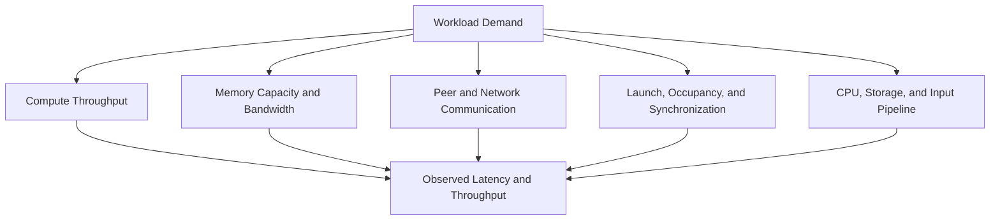
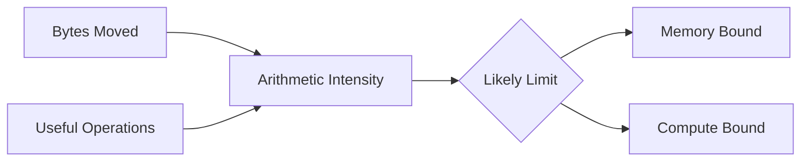
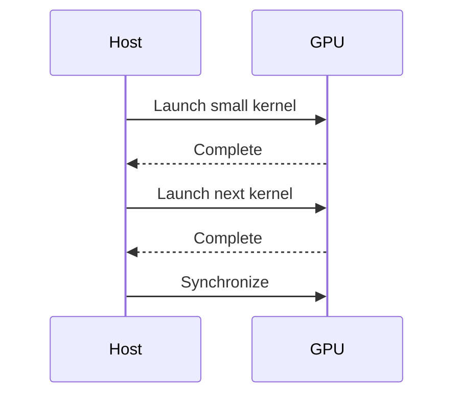
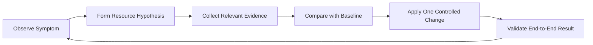

# Building a GPU Performance Model

## Introduction

Performance engineering begins before profiling. It begins with a model of what the workload asks the system to do.

A GPU can be limited by arithmetic throughput, memory bandwidth, memory latency, launch overhead, synchronization, host preparation, or communication. Utilization alone cannot distinguish these cases. A device may report high activity while performing little useful work, or low activity because the real bottleneck sits outside the accelerator.

A performance model connects workload demand to architectural limits. It does not predict every microsecond. It narrows the investigation to the resources that could plausibly explain the observation.

| Chapter field | Value |
|---|---|
| Volume | 02 — GPU Architecture |
| Difficulty | Intermediate |
| Estimated reading time | 55 minutes |
| Primary focus | Evidence-driven GPU bottleneck analysis |
| Previous | GPU Topology, Peer Access, and Data Paths |
| Next | Volume 02 Architecture Summary |

## Story

An inference service misses its latency target. The GPU shows 90 percent utilization, so the platform team recommends adding more GPUs. Profiling later shows that kernels spend most of their time moving weights and cache data. The arithmetic pipelines are not the limiting resource.

Adding GPUs may reduce queueing, but it does not improve the latency of one request. A better model identifies memory traffic, batching, model placement, and request concurrency as the relevant variables.

The lesson is simple: a metric becomes useful only after it is connected to a resource model.

## Learning Objectives

After completing this chapter, you will be able to:

- Separate compute, memory, communication, and pipeline bottlenecks.
- Explain arithmetic intensity and why it influences performance limits.
- Distinguish utilization from useful throughput.
- Build a baseline using representative workloads.
- Use counter evidence to test a performance hypothesis.
- Avoid common optimization anti-patterns.

## Big Picture

**Figure 2.11.1 — Performance is a system result.** The slowest relevant resource or pipeline stage constrains delivered performance.

## Start with the Workload

Before reading counters, define the unit of useful work.

For inference, that unit may be:

- requests per second
- tokens per second
- time to first token
- inter-token latency
- batch completion time

For training, it may be:

- samples per second
- tokens per second
- step time
- time to convergence
- scaling efficiency

A device metric is meaningful only when correlated with a workload outcome.

## Arithmetic Intensity

Arithmetic intensity is the amount of computation performed for each byte moved from a limiting memory level. A workload with low arithmetic intensity moves many bytes for relatively little compute. A workload with high arithmetic intensity reuses data enough to perform more computation per byte.

**Figure 2.11.2 — Arithmetic intensity helps classify limits.** Low reuse tends to expose memory limits; high reuse can expose compute limits.

The exact threshold depends on the GPU's balance of peak compute and memory bandwidth. The concept matters more than one fixed number.

## Compute-Bound Workloads

A compute-bound workload keeps arithmetic pipelines busy and has enough data reuse that memory bandwidth does not dominate.

Evidence may include:

- high activity in the relevant execution pipelines
- strong sensitivity to precision or tensor-core usage
- limited improvement from higher memory bandwidth
- throughput scaling with additional compute resources

Compute-bound does not mean perfectly efficient. Instruction mix, dependencies, divergence, and pipeline imbalance can still waste cycles.

## Memory-Bound Workloads

A memory-bound workload is constrained by moving data through caches or device memory.

Evidence may include:

- high device-memory throughput
- low arithmetic work per byte
- strong sensitivity to data layout or cache reuse
- limited benefit from additional arithmetic units
- stalls associated with memory dependencies

Memory capacity and memory bandwidth are different constraints. A model may fit in memory but still move data too slowly. Another model may have adequate bandwidth but fail because its working set does not fit.

## Latency-Bound Workloads

Some kernels do not generate enough concurrent work to hide access latency. They may use little total bandwidth and little compute while still waiting on dependent operations.

Common causes include:

- small grids
- low request concurrency
- serial dependencies
- frequent synchronization
- insufficient resident warps
- pointer-heavy or irregular access

This is why low bandwidth does not prove that memory is irrelevant. The workload may be latency-bound rather than bandwidth-bound.

## Launch and Synchronization Limits

Small kernels can spend a significant fraction of time in launch, dispatch, or synchronization overhead. A sequence of individually fast kernels may still produce poor end-to-end performance.

**Figure 2.11.3 — Fragmented execution.** Repeated launch and synchronization boundaries can prevent the device from receiving a deep queue of useful work.

Kernel fusion, asynchronous execution, graphs, batching, or better pipeline overlap may help, but each introduces trade-offs.

## Communication-Bound Workloads

Multi-GPU jobs may be limited by peer or network communication. Strong single-GPU performance does not guarantee strong scaling.

Measure:

- time spent in collectives
- bytes exchanged per step
- overlap between communication and compute
- topology of participating GPUs
- network and peer bandwidth
- synchronization imbalance across ranks

A slow rank can hold every other rank at a collective boundary.

## Host and Pipeline Bottlenecks

The GPU may be idle because the surrounding system cannot feed it.

Potential constraints include:

- CPU tokenization or preprocessing
- storage reads
- data decompression
- network request handling
- Python serialization
- container CPU limits
- scheduler gaps

A complete performance model follows the request or training step from input to output.

## Interpreting Utilization

GPU utilization commonly indicates that the device was active during sampled intervals. It does not say:

- which engine was active
- whether instructions were useful
- whether execution lanes were full
- whether the workload met its service objective
- whether another component was idle

| Observation | Possible interpretation |
|---|---|
| High utilization, low throughput | inefficient kernels, memory pressure, contention, or queueing |
| Low utilization, high latency | small workload, synchronization, or external bottleneck |
| High memory use, low bandwidth | capacity-heavy but inactive working set |
| High bandwidth, low compute | memory-bound behavior |
| Good single-GPU performance, poor scaling | communication or synchronization limit |

## Baseline before Optimization

A useful baseline records:

1. workload version and model
2. input shape and batch size
3. software and driver versions
4. GPU model and topology
5. latency and throughput distributions
6. compute, memory, and communication counters
7. power and clock state
8. CPU, storage, and network conditions

Without a baseline, optimization becomes anecdotal.

## Hypothesis-Driven Investigation

Use a repeatable loop:

**Figure 2.11.4 — Performance investigation loop.** Each change should test a specific explanation and be validated against the workload outcome.

## Architecture Trade-offs

### Throughput versus latency

Larger batches often improve throughput and utilization but increase waiting time. Real-time inference may accept lower utilization to protect latency.

### Fusion versus flexibility

Fusing operations can reduce launch and memory overhead but may increase register pressure, compilation complexity, and maintenance cost.

### Occupancy versus per-thread efficiency

Reducing registers may increase occupancy while creating spills. Increasing shared memory may reduce global traffic while reducing resident blocks.

### Scale-out versus efficiency

More GPUs can increase aggregate throughput while reducing per-GPU efficiency because of communication overhead.

## Production Deployment

Performance gates should be part of release engineering. A model or runtime update should be tested against representative traffic before production rollout.

A production process should include:

- fixed reference workloads
- warm-up and steady-state periods
- percentile latency reporting
- topology-aware test placement
- counter collection
- regression thresholds
- rollback criteria

:::important
A benchmark that does not represent production shapes, concurrency, and data paths can validate the wrong architecture.
:::

## Production Troubleshooting

### Problem: High utilization but low throughput

**Diagnosis**

Break utilization into execution, memory, communication, and pipeline evidence. Compare useful work per second with the previous baseline.

**Possible root causes**

- memory-bound kernels
- branch divergence
- reduced tensor-core eligibility
- contention from another workload
- thermal or power limits
- smaller batch sizes

### Problem: Scaling efficiency falls after adding GPUs

Inspect communication time, rank imbalance, topology, collective configuration, and workload granularity.

### Problem: Latency regresses after a software release

Compare kernel count, launch frequency, register use, local-memory traffic, batching, and CPU preprocessing.

## Customer Scenario

A customer asks which GPU will deliver twice the inference performance. The architect refuses to answer from product specifications alone. The current workload is measured first.

If the service is memory-bound, a GPU with more relevant memory bandwidth may help. If requests are too small, batching or concurrency may matter more. If the CPU cannot tokenize fast enough, changing the GPU may produce no improvement. Hardware selection follows the measured limit.

## Interview Preparation

### Conceptual Questions

1. Why is GPU utilization insufficient for bottleneck identification?
2. What does arithmetic intensity tell an architect?
3. How can a workload be latency-bound without saturating memory bandwidth?

### Architecture Questions

1. Build a performance model for an LLM inference request.
2. Explain how to distinguish compute-bound and memory-bound behavior.
3. Design a release performance gate for a GPU platform.

### Scenario Questions

1. Memory throughput is high and compute activity is moderate. What is your hypothesis?
2. A fused kernel lowers memory traffic but becomes slower. Why?
3. Single-GPU performance is healthy, but eight-GPU scaling is poor. What evidence do you collect?

## Summary

A GPU performance model connects workload outcomes with compute, memory, latency, communication, scheduling, and host constraints. It turns metrics into hypotheses and prevents teams from optimizing the wrong resource.

The objective is not to maximize utilization. It is to meet workload goals with evidence, predictable trade-offs, and repeatable baselines.

## Key Takeaways

- Define useful workload outcomes before interpreting counters.
- Arithmetic intensity helps distinguish compute and memory limits.
- Low activity may indicate latency, launch, synchronization, or host bottlenecks.
- Multi-GPU scaling introduces topology and communication limits.
- Controlled baselines are essential for optimization and regression detection.

## Cross References

- Previous: [GPU Topology, Peer Access, and Data Paths](./chapter-10-gpu-topology-peer-access-and-data-paths)
- Next: [Volume 02 Architecture Summary](./chapter-12-volume-02-architecture-summary)
- Related lab: [Build a Topology-Aware GPU Placement Plan](./labs/lab-04-build-a-topology-aware-gpu-placement-plan)
