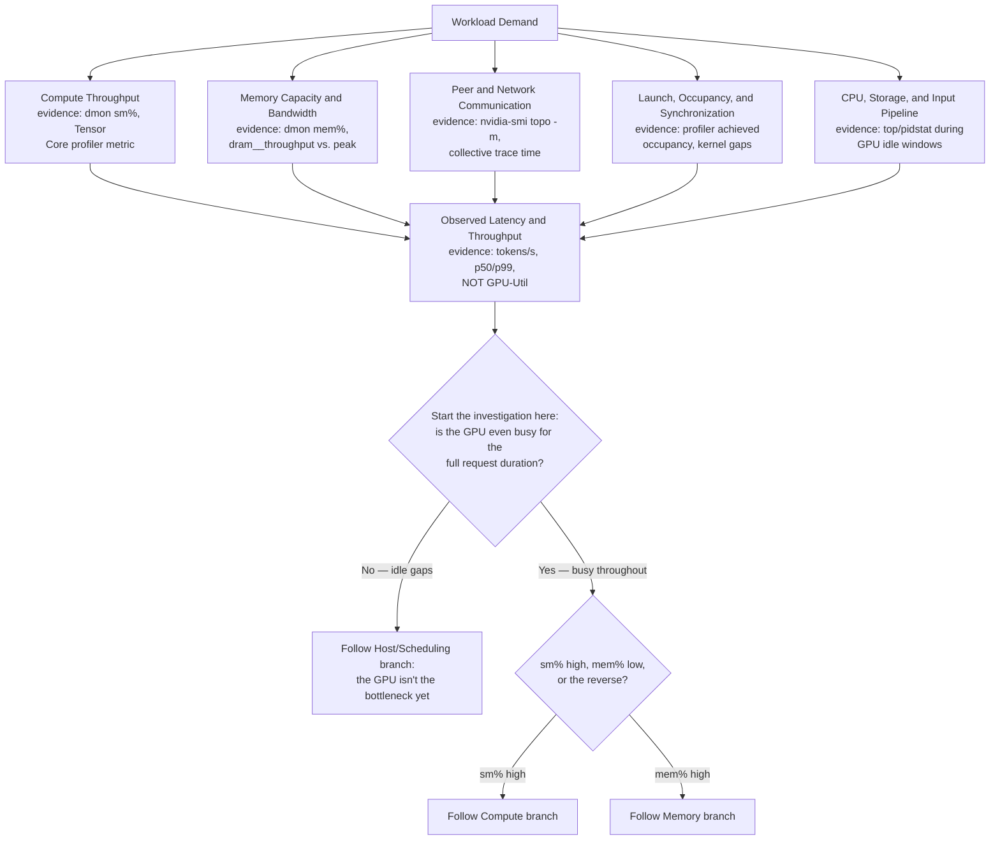
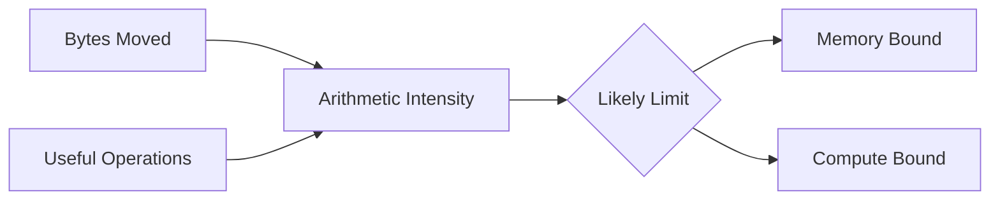
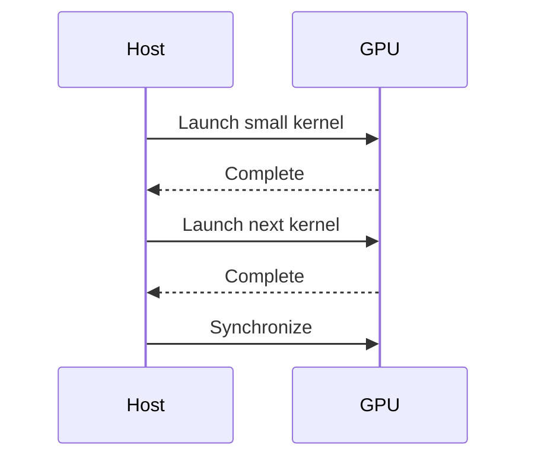
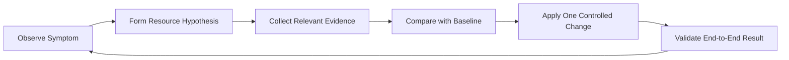

# Building a GPU Performance Model

## Introduction

Performance engineering begins before profiling. It begins with a model of what the workload asks the system to do.

A GPU can be limited by arithmetic throughput, memory bandwidth, memory latency, launch overhead, synchronization, host preparation, or communication. Utilization alone cannot distinguish these cases. A device may report high activity while performing little useful work, or low activity because the real bottleneck sits outside the accelerator.

A performance model connects workload demand to architectural limits. It does not predict every microsecond. It narrows the investigation to the resources that could plausibly explain the observation.

| Chapter field | Value |
|---|---|
| Volume | 02 — GPU Architecture |
| Difficulty | Intermediate |
| Estimated reading time | 55 minutes |
| Primary focus | Evidence-driven GPU bottleneck analysis |
| Previous | GPU Topology, Peer Access, and Data Paths |
| Next | Volume 02 Architecture Summary |

## Story

An inference service misses its latency target. The GPU shows 90 percent utilization, so the platform team recommends adding more GPUs. Profiling later shows that kernels spend most of their time moving weights and cache data. The arithmetic pipelines are not the limiting resource.

Adding GPUs may reduce queueing, but it does not improve the latency of one request. A better model identifies memory traffic, batching, model placement, and request concurrency as the relevant variables.

The lesson is simple: a metric becomes useful only after it is connected to a resource model.

## Learning Objectives

After completing this chapter, you will be able to:

- Separate compute, memory, communication, and pipeline bottlenecks.
- Explain arithmetic intensity and why it influences performance limits.
- Distinguish utilization from useful throughput.
- Build a baseline using representative workloads.
- Use counter evidence to test a performance hypothesis.
- Avoid common optimization anti-patterns.

## Big Picture



**Figure 2.11.1 — Performance is a system result.** The slowest relevant resource or pipeline stage constrains delivered performance. The decision branch converts the diagram from "five things that could matter" into the actual order of investigation: confirm the GPU is busy for the whole request before reasoning about which GPU-internal resource is the limit, since a GPU that's idle half the time has a scheduling or host problem no amount of kernel tuning fixes.

## Start with the Workload

Before reading counters, define the unit of useful work.

For inference, that unit may be:

- requests per second
- tokens per second
- time to first token
- inter-token latency
- batch completion time

For training, it may be:

- samples per second
- tokens per second
- step time
- time to convergence
- scaling efficiency

A device metric is meaningful only when correlated with a workload outcome.

## Arithmetic Intensity

Arithmetic intensity is the amount of computation performed for each byte moved from a limiting memory level. A workload with low arithmetic intensity moves many bytes for relatively little compute. A workload with high arithmetic intensity reuses data enough to perform more computation per byte.



**Figure 2.11.2 — Arithmetic intensity helps classify limits.** Low reuse tends to expose memory limits; high reuse can expose compute limits.

The exact threshold depends on the GPU's balance of peak compute and memory bandwidth. The concept matters more than one fixed number.

**Resolving the chapter's opening Story with a worked number.** The Story describes a service at 90% GPU utilization missing its latency target, where profiling shows kernels spend most of their time moving weights and cache data. Suppose the model is 13B parameters at FP16 (`≈26GB` of weights) and the GPU is an H100 SXM (`≈3.35 TB/s` peak HBM bandwidth, `≈989 TFLOPS` peak FP16 Tensor Core throughput, dense). The ridge point — the arithmetic intensity where compute and bandwidth limits cross — is roughly `peak FLOPS / peak bandwidth ≈ 989e12 / 3.35e12 ≈ 295 FLOPs/byte`. Ungathered single-request decode, which re-reads most of the weight bytes for a small amount of new compute per token, sits at an arithmetic intensity of roughly single digits to low tens of FLOPs/byte — two orders of magnitude below the ridge point. That gap is the proof, in one calculation, that "add more GPUs" cannot fix this Story's symptom: the workload's arithmetic intensity places it deep in the memory-bound region of the roofline, far from where additional compute throughput would matter at all.

## Compute-Bound Workloads

A compute-bound workload keeps arithmetic pipelines busy and has enough data reuse that memory bandwidth does not dominate.

Evidence may include:

- high activity in the relevant execution pipelines
- strong sensitivity to precision or tensor-core usage
- limited improvement from higher memory bandwidth
- throughput scaling with additional compute resources

Compute-bound does not mean perfectly efficient. Instruction mix, dependencies, divergence, and pipeline imbalance can still waste cycles.

## Memory-Bound Workloads

A memory-bound workload is constrained by moving data through caches or device memory.

Evidence may include:

- high device-memory throughput
- low arithmetic work per byte
- strong sensitivity to data layout or cache reuse
- limited benefit from additional arithmetic units
- stalls associated with memory dependencies

Memory capacity and memory bandwidth are different constraints. A model may fit in memory but still move data too slowly. Another model may have adequate bandwidth but fail because its working set does not fit.

## Latency-Bound Workloads

Some kernels do not generate enough concurrent work to hide access latency. They may use little total bandwidth and little compute while still waiting on dependent operations.

Common causes include:

- small grids
- low request concurrency
- serial dependencies
- frequent synchronization
- insufficient resident warps
- pointer-heavy or irregular access

This is why low bandwidth does not prove that memory is irrelevant. The workload may be latency-bound rather than bandwidth-bound.

## Launch and Synchronization Limits

Small kernels can spend a significant fraction of time in launch, dispatch, or synchronization overhead. A sequence of individually fast kernels may still produce poor end-to-end performance.



**Figure 2.11.3 — Fragmented execution.** Repeated launch and synchronization boundaries can prevent the device from receiving a deep queue of useful work.

Kernel fusion, asynchronous execution, graphs, batching, or better pipeline overlap may help, but each introduces trade-offs.

## Communication-Bound Workloads

Multi-GPU jobs may be limited by peer or network communication. Strong single-GPU performance does not guarantee strong scaling.

Measure:

- time spent in collectives
- bytes exchanged per step
- overlap between communication and compute
- topology of participating GPUs
- network and peer bandwidth
- synchronization imbalance across ranks

A slow rank can hold every other rank at a collective boundary.

## Host and Pipeline Bottlenecks

The GPU may be idle because the surrounding system cannot feed it.

Potential constraints include:

- CPU tokenization or preprocessing
- storage reads
- data decompression
- network request handling
- Python serialization
- container CPU limits
- scheduler gaps

A complete performance model follows the request or training step from input to output.

## Interpreting Utilization

GPU utilization commonly indicates that the device was active during sampled intervals. It does not say:

- which engine was active
- whether instructions were useful
- whether execution lanes were full
- whether the workload met its service objective
- whether another component was idle

| Observation | Possible interpretation |
|---|---|
| High utilization, low throughput | inefficient kernels, memory pressure, contention, or queueing |
| Low utilization, high latency | small workload, synchronization, or external bottleneck |
| High memory use, low bandwidth | capacity-heavy but inactive working set |
| High bandwidth, low compute | memory-bound behavior |
| Good single-GPU performance, poor scaling | communication or synchronization limit |

## Baseline before Optimization

A useful baseline records:

1. workload version and model
2. input shape and batch size
3. software and driver versions
4. GPU model and topology
5. latency and throughput distributions
6. compute, memory, and communication counters
7. power and clock state
8. CPU, storage, and network conditions

Without a baseline, optimization becomes anecdotal.

## Hypothesis-Driven Investigation

Use a repeatable loop:



**Figure 2.11.4 — Performance investigation loop.** Each change should test a specific explanation and be validated against the workload outcome.

## Architecture Trade-offs

### Throughput versus latency

Larger batches often improve throughput and utilization but increase waiting time. Real-time inference may accept lower utilization to protect latency.

### Fusion versus flexibility

Fusing operations can reduce launch and memory overhead but may increase register pressure, compilation complexity, and maintenance cost.

### Occupancy versus per-thread efficiency

Reducing registers may increase occupancy while creating spills. Increasing shared memory may reduce global traffic while reducing resident blocks.

### Scale-out versus efficiency

More GPUs can increase aggregate throughput while reducing per-GPU efficiency because of communication overhead.

## Production Deployment

Performance gates should be part of release engineering. A model or runtime update should be tested against representative traffic before production rollout.

A production process should include:

- fixed reference workloads
- warm-up and steady-state periods
- percentile latency reporting
- topology-aware test placement
- counter collection
- regression thresholds
- rollback criteria

:::important
A benchmark that does not represent production shapes, concurrency, and data paths can validate the wrong architecture.
:::

## Production Troubleshooting

### Problem: High utilization but low throughput

**Diagnosis**

Break utilization into execution, memory, communication, and pipeline evidence. Compare useful work per second with the previous baseline.

**Possible root causes**

- memory-bound kernels
- branch divergence
- reduced tensor-core eligibility
- contention from another workload
- thermal or power limits
- smaller batch sizes

**Turning this into evidence, ruling causes in and out.** A single `dmon` pass plus a power/clock check can eliminate several of these six causes in one step:

```text
$ nvidia-smi --query-gpu=utilization.gpu,utilization.memory,power.draw,power.limit,clocks.sm,clocks_throttle_reasons.active --format=csv,noheader
94 %, 91 %, 305 W, 700 W, 1980 MHz, Active clock throttle reasons: N/A
```

`power.draw` (305W) well under `power.limit` (700W) and no active throttle reasons rules out thermal/power limits as the cause. `clocks.sm` at its rated boost value rules out a clock-related explanation entirely. That leaves `utilization.memory=91%` alongside `utilization.gpu=94%` pointing squarely at memory-bound kernels as the remaining, evidence-backed explanation — the same reading used throughout this volume, here applied as the first elimination pass across a six-item list instead of a guess at which item applies.

### Problem: Scaling efficiency falls after adding GPUs

Inspect communication time, rank imbalance, topology, collective configuration, and workload granularity.

**Turning this into evidence.** Compare per-rank step time against the topology matrix — a rank sitting on a weak communication path shows up directly as an outlier:

```text
$ for r in 0 1 2 3; do echo "rank $r step_time_ms=$(grep step_time rank_${r}.log | tail -1 | awk '{print $NF}')"; done
rank 0 step_time_ms=48
rank 1 step_time_ms=51
rank 2 step_time_ms=142
rank 3 step_time_ms=139
```

Ranks 2 and 3 running roughly 3x slower per step than ranks 0 and 1 is the direct signature of a collective boundary — every rank has to wait for the slowest one at each synchronization point, so the whole job's step time regresses to match ranks 2-3 even though ranks 0-1 are individually healthy. Cross-referencing this against `nvidia-smi topo -m` (as in the previous chapter) to check whether ranks 2-3 landed on a weaker path than 0-1 turns "scaling efficiency falls" from a vague symptom into a specific, addressable placement problem.

### Problem: Latency regresses after a software release

Compare kernel count, launch frequency, register use, local-memory traffic, batching, and CPU preprocessing.

**Turning this into evidence.** A compiler-report diff between releases, the same technique used in earlier chapters, often finds the regression before a profiler run is even needed:

```text
# Previous release
ptxas info: Used 52 registers, 0 bytes spill stores, 0 bytes spill loads

# New release
ptxas info: Used 96 registers, 88 bytes spill stores, 96 bytes spill loads
```

A jump from 52 to 96 registers/thread, with newly-introduced spills, is a concrete, compile-time-visible regression candidate — a dependency upgrade, a new compiler version, or a code change that increased per-thread live state can all produce exactly this signature. This is worth checking before assuming the regression is architectural (batching, CPU preprocessing) since it's a five-second check against release artifacts that either confirms or rules out a whole category of explanation.

## Customer Scenario

A customer asks which GPU will deliver twice the inference performance. The architect refuses to answer from product specifications alone. The current workload is measured first.

If the service is memory-bound, a GPU with more relevant memory bandwidth may help. If requests are too small, batching or concurrency may matter more. If the CPU cannot tokenize fast enough, changing the GPU may produce no improvement. Hardware selection follows the measured limit.

## Interview Preparation

### Conceptual Questions

1. Why is GPU utilization insufficient for bottleneck identification?
**Model answer:** "Because it only tells you an engine was active during the sample window — not which engine, not whether the work was useful, and not whether the result met the workload's actual goal. I'd use the chapter's own story: 90% utilization with a missed latency target, where profiling showed the time was going into moving weights and cache data, not compute. A single percentage genuinely cannot distinguish that from a compute-bound kernel running efficiently at the same 90% — you need the `sm%`/`mem%` pairing at minimum, and ideally arithmetic-intensity reasoning, before the number means anything."

2. What does arithmetic intensity tell an architect?
**Model answer:** "Where a workload sits relative to a GPU's own compute-to-bandwidth ratio — its ridge point. I'd walk through the calculation: an H100's ridge point is roughly peak FLOPS divided by peak bandwidth, around 295 FLOPs/byte. A workload with intensity far below that, like single-request LLM decode at maybe single-digit FLOPs/byte, is deep in memory-bound territory — more compute literally cannot help it. A workload near or above the ridge point is where additional Tensor Core throughput would actually move the needle. It's the single number that tells you which lever is worth pulling before you pull it."

3. How can a workload be latency-bound without saturating memory bandwidth?
**Model answer:** "When there isn't enough concurrent, independent work to keep either compute or memory busy — small grids, low request concurrency, serial dependency chains, or frequent synchronization. The kernel might use very little of either the compute or memory ceiling while still being slow, because it's waiting on dependencies rather than being throttled by a saturated resource. I'd check achieved occupancy and resident warp count here rather than bandwidth utilization — low bandwidth doesn't mean memory is irrelevant, it can mean the workload never got enough in-flight requests to stress memory bandwidth in the first place."

### Architecture Questions

1. Build a performance model for an LLM inference request.
**Model answer:** "I'd separate prefill and decode, since they have opposite arithmetic-intensity profiles. Prefill processes the whole prompt as one large matmul — high arithmetic intensity, likely compute-bound, and I'd expect `sm%` high with reasonable `mem%`. Decode generates one token at a time, re-reading the KV cache and much of the weights for comparatively little new compute — low arithmetic intensity, memory-bandwidth-bound, `mem%` high and `sm%` comparatively low despite both showing 'high utilization' in `nvidia-smi`. I'd size the model against both phases separately and note that continuous batching specifically targets decode's low arithmetic intensity by amortizing the same memory read across more concurrent sequences."

2. Explain how to distinguish compute-bound and memory-bound behavior.
**Model answer:** "Start with `dmon`'s paired `sm%`/`mem%` — both sustained high needs a follow-up profiler pass to see which one is genuinely the ceiling, since SMs stalled on memory requests still register as 'busy.' High `sm%` with comparatively low `mem%` and throughput scaling with added compute resources is the compute-bound signature. High `mem%` with low `sm%`, or achieved bandwidth close to the GPU's peak spec, is the memory-bound signature. I'd always cross-check with arithmetic intensity reasoning — knowing the workload's FLOPs-per-byte ratio ahead of time predicts which signature to expect, which is a stronger position than reading counters cold."

3. Design a release performance gate for a GPU platform.
**Model answer:** "I'd run a fixed reference workload — representative model, batch size, sequence length, concurrency — against every release candidate, with a proper warm-up period before measuring. I'd capture percentile latency, not just the average, since tail latency regressions are what actually hurt users. Alongside application metrics I'd capture `dmon`'s `sm%`/`mem%` and `nvcc -Xptxas=-v` register/spill counts as release artifacts, so a regression can be traced to a specific mechanism instead of just 're-profile from scratch.' I'd set explicit regression thresholds and automatic rollback criteria tied to those percentiles, not to GPU utilization."

### Scenario Questions

1. Memory throughput is high and compute activity is moderate. What is your hypothesis?
**Model answer:** "Memory-bound, with the compute pipelines partially fed but not saturated — I'd confirm with `dram__throughput.avg.pct_of_peak_sustained_elapsed` to see how close to the actual bandwidth ceiling this is, not just `dmon`'s relative percentage. If it's close to peak, the fix is reducing bytes moved — reuse, fusion, lower precision — not adding compute. If it's well under peak despite high `mem%`, I'd check sectors-per-request next, since that combination usually means transaction inefficiency rather than genuine bandwidth saturation."

2. A fused kernel lowers memory traffic but becomes slower. Why?
**Model answer:** "Fusion trades launch and memory overhead for often-higher register pressure and compilation complexity — combining several kernels into one commonly increases live state per thread. I'd check `nvcc -Xptxas=-v` first: if registers/thread jumped enough to reduce occupancy significantly, or worse, introduced spills, the kernel could be paying more in reduced latency-hiding than it saved in memory traffic. This is the same 'fewer instructions doesn't guarantee faster' lesson from earlier in the volume, just at kernel-fusion scale instead of loop-unrolling scale."

3. Single-GPU performance is healthy, but eight-GPU scaling is poor. What evidence do you collect?
**Model answer:** "Per-rank step time across all eight ranks first — a few slow outliers holding the rest at a collective boundary is the most common cause, and it's visible directly by comparing each rank's logged step time. Then `nvidia-smi topo -m` to check whether those slow ranks landed on weaker communication paths than the fast ones. Then time spent in collectives versus compute, and whether communication overlaps with compute or serializes with it. I would not start by re-profiling the single-GPU kernel — single-GPU health already rules that code path out, and the story here is almost always topology or collective configuration, not per-kernel efficiency."

## Summary

A GPU performance model connects workload outcomes with compute, memory, latency, communication, scheduling, and host constraints. It turns metrics into hypotheses and prevents teams from optimizing the wrong resource.

The objective is not to maximize utilization. It is to meet workload goals with evidence, predictable trade-offs, and repeatable baselines.

## Key Takeaways

- Define useful workload outcomes before interpreting counters.
- Arithmetic intensity helps distinguish compute and memory limits.
- Low activity may indicate latency, launch, synchronization, or host bottlenecks.
- Multi-GPU scaling introduces topology and communication limits.
- Controlled baselines are essential for optimization and regression detection.

## Cross References

- Previous: [GPU Topology, Peer Access, and Data Paths](./chapter-10-gpu-topology-peer-access-and-data-paths)
- Next: [Volume 02 Architecture Summary](./chapter-12-volume-02-architecture-summary)
- Related lab: [Build a Topology-Aware GPU Placement Plan](./labs/lab-04-build-a-topology-aware-gpu-placement-plan)
