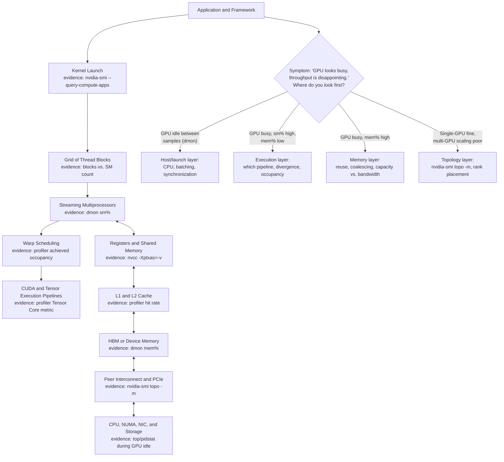
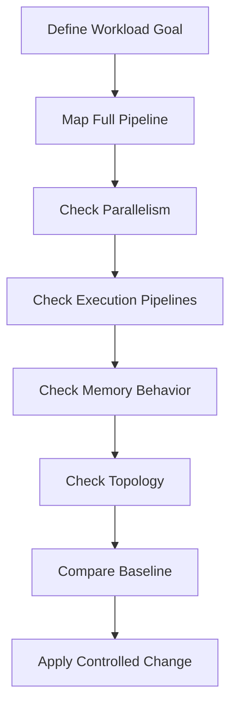

# Volume 02 Architecture Summary

## Introduction

Volume 02 moved from the outside of the accelerator to its internal execution model. The goal was not to turn infrastructure engineers into kernel specialists. It was to build enough architectural understanding to explain why a GPU can be visible, healthy, and still inefficiently used.

The central idea is that GPU performance emerges from a balance between parallel work, execution resources, memory movement, scheduling, and topology. No single counter describes that balance.

| Chapter field | Value |
|---|---|
| Volume | 02 — GPU Architecture |
| Difficulty | Intermediate |
| Estimated reading time | 35 minutes |
| Primary focus | Consolidation and architectural reasoning |
| Previous | Building a GPU Performance Model |
| Next volume | CUDA Fundamentals |

## Story Revisited

Imagine a production team reporting that an eight-GPU server delivers only half the expected throughput. A weak investigation checks whether all eight devices appear in `nvidia-smi` and then recommends larger GPUs.

An architecture-led investigation asks different questions:

- Does the workload expose enough blocks and warps?
- Are execution lanes active or diverging?
- Is data access coalesced?
- Are registers or shared memory reducing residency?
- Is HBM bandwidth the limit?
- Are the selected GPUs connected through strong peer paths?
- Is the CPU and NIC placement local?
- Is the application waiting on another pipeline stage?

Volume 02 provided the vocabulary needed to ask those questions in the correct order.

## The Complete Mental Model



**Figure 2.12.1 — GPU architecture as one execution and data-movement system.** Software hierarchy, execution pipelines, memory hierarchy, and physical topology must cooperate. The triage branch is this volume's twelve chapters compressed into one starting question and four possible next moves — every worked evidence example in every prior chapter is a deeper instance of one of these four branches.

## Architectural Layers

### Work decomposition

Applications express parallel work as kernels. Kernels create grids. Grids contain blocks. Blocks contain threads. Hardware groups threads into warps and assigns blocks to Streaming Multiprocessors.

The workload must expose enough independent work to use the device. A larger GPU does not help when the grid is too small or execution remains serial.

### Execution resources

CUDA Cores, Tensor Cores, and other specialized pipelines execute different instruction classes. A workload benefits only when its operations, data types, and software path can use the relevant pipeline.

Peak specifications describe capability. Delivered throughput depends on instruction eligibility, issue rate, data supply, and pipeline balance.

### Scheduling and occupancy

Warp schedulers select ready warps. When one warp waits, another can execute. This latency-hiding model requires enough resident work.

Occupancy is therefore useful, but not absolute. High occupancy can coexist with poor memory behavior. Lower occupancy can perform well when each warp has strong reuse and instruction-level parallelism.

### On-chip storage

Registers hold private thread state. Shared memory enables block-level cooperation. Local memory is a per-thread address space that may be backed by device memory.

Resource usage influences both access cost and residency. Register spilling, oversized shared-memory allocations, or unnecessary barriers can reduce performance.

### Device-memory hierarchy

L1 and L2 caches reduce the need to access HBM. HBM provides large capacity and high aggregate bandwidth, but only efficient requests approach that bandwidth.

Coalescing, locality, reuse, and balanced partition access determine effective throughput.

### Topology

GPU indices do not describe physical relationships. PCIe hierarchy, direct GPU links, switch fabrics, CPU sockets, NUMA nodes, and NIC placement determine communication paths.

Topology-aware scheduling is essential for workloads that exchange large amounts of data.

## Symptom-to-Layer Map

| Production symptom | First architectural questions |
|---|---|
| Low utilization | Is enough work reaching the GPU? Are launches fragmented? |
| High utilization, low throughput | Which pipeline is active? Is work useful or stalled? |
| High memory throughput | Is the workload memory-bound? Is data reused? |
| High memory use | Is capacity the issue, or only allocation? |
| Poor multi-GPU scaling | What are the peer and NIC paths? How much time is communication? |
| Performance regression after build change | Did register use, spills, kernel count, or instruction eligibility change? |
| Oscillating utilization | Are CPU, storage, batching, or synchronization creating gaps? |
| One GPU pair slower than another | Does topology differ? |

The map is a starting point, not a diagnosis. Each hypothesis must be tested with evidence.

**Turning the map's first two rows into evidence, side by side, on the same GPU.** The distinction between "low utilization" and "high utilization, low throughput" is not visible from a single number — it requires the paired `dmon` read used throughout this volume:

```text
# Case A: "Low utilization" row — grid too small / launches fragmented
$ nvidia-smi dmon -s u -c 3
    0     4     2
    0     3     1
    0     5     2

# Case B: "High utilization, low throughput" row — memory-bound or divergent
$ nvidia-smi dmon -s u -c 3
    0    93    91
    0    95    89
    0    92    90
```

Case A's `sm%` near zero confirms the device genuinely has nothing to do — the fix is upstream (batching, launch frequency, grid size). Case B's `sm%` near-saturated but paired with `mem%` equally high is the opposite problem entirely — the device is fully busy and still not delivering throughput, so the fix is inside the kernel (reuse, coalescing, divergence), not in feeding it more work. Both cases can look identical in an alert that only tracks "is GPU utilization above some threshold" — which is exactly why this map insists on architectural questions instead of a single metric.

**Turning "poor multi-GPU scaling" into evidence.** This is the per-rank timing check from Chapter 11, restated here as the map's own row:

```text
$ for r in 0 1 2 3; do echo "rank $r: $(tail -1 rank_${r}.log)"; done
rank 0: step_time_ms=49
rank 1: step_time_ms=52
rank 2: step_time_ms=138
rank 3: step_time_ms=141
```

Two ranks running roughly 3x slower per step, cross-checked against `nvidia-smi topo -m` for whether those specific ranks landed on a weaker path, is the concrete evidence behind this row — and it demonstrates the map's larger point: "poor multi-GPU scaling" is a symptom with a specific mechanism (a slow rank holding every other rank at a collective barrier), not a vague statement about GPU count being insufficient.

## Architecture Decision Framework

When evaluating a GPU workload, follow this sequence:

1. **Define the workload outcome.** Latency, throughput, step time, tokens per second, or another useful unit.
2. **Map the pipeline.** Identify CPU, storage, network, runtime, and GPU stages.
3. **Inspect parallelism.** Confirm that the workload exposes enough blocks, warps, and concurrency.
4. **Inspect execution.** Determine which pipelines perform the work.
5. **Inspect memory.** Separate capacity, bandwidth, latency, and access-pattern issues.
6. **Inspect topology.** Verify GPU, CPU, NIC, and peer placement.
7. **Compare with a baseline.** Use the same shapes, versions, and environment.
8. **Change one variable.** Validate the end-to-end result.



**Figure 2.12.2 — GPU architecture investigation order.** The sequence reduces the risk of optimizing a secondary symptom.

## Production Anti-Patterns

### Choosing hardware from peak numbers

Peak compute, bandwidth, or memory capacity does not describe application fit. Hardware selection must follow measured workload demand.

### Treating every GPU as interchangeable

Communication-heavy workloads depend on topology. Resource count without locality can produce fragmented and inefficient placement.

### Maximizing occupancy blindly

Higher occupancy can introduce register spills or reduce data reuse. The objective is enough latency hiding, not a perfect percentage.

### Using utilization as the only health signal

Utilization indicates activity, not efficiency, quality of service, or bottleneck location.

### Optimizing the GPU before the pipeline

A fast kernel cannot compensate for slow tokenization, storage, network handling, or request scheduling.

## Customer Architecture Conversation

A customer asks, “Which GPU should we buy?” The architect reframes the question:

- What workload will run?
- What model and precision?
- What batch sizes and concurrency?
- What latency and throughput targets?
- How much memory capacity is required?
- Is the workload compute-bound, memory-bound, or communication-bound?
- Does it need one GPU, several GPUs, or several nodes?
- What operational and cost constraints apply?

The answer may be a larger GPU, a different topology, a smaller partition, better batching, a faster input pipeline, or a software optimization. Architecture prevents product selection from replacing problem definition.

**A worked version of this conversation.** Suppose the customer's actual workload is a 13B-parameter model served for internal chat, targeting 50 concurrent users with a per-token latency budget. Weights at FP16 are `13e9 x 2 bytes ≈ 26 GB` — comfortably under an 80GB GPU's capacity, so a single GPU can hold the model. The real question is decode throughput: if unbatched decode re-reads most of the 26GB per token, the bandwidth-bound floor on an H100 (`≈3.35 TB/s`) is roughly `26 GB / 3,350 GB/s ≈ 7.8 ms/token` — and 50 concurrent users each waiting on their own unbatched decode loop would serialize far past any reasonable latency target. Continuous batching changes the arithmetic entirely by amortizing that same 26GB read across all 50 concurrent decode steps at once, which is the concrete reason the recommendation here is "enable continuous batching on one GPU" rather than "buy a bigger GPU" — the bottleneck is arithmetic intensity, not raw capability, and this is answerable before any hardware is purchased.

## Knowledge Questions

1. Why are blocks, rather than individual threads, assigned to SMs?
2. What role do warps play in latency hiding?
3. How can register use affect occupancy?
4. Why can local memory be slower than its name suggests?
5. What is the difference between memory capacity and bandwidth?
6. Why does coalescing matter?
7. How can branch divergence waste execution capacity?
8. Why is topology important inside one server?
9. What does arithmetic intensity help explain?
10. Why is utilization not a performance objective?

## Architecture Questions

1. Draw the path from a kernel launch to execution on an SM.
2. Draw the memory path from a register spill to HBM.
3. Design a topology-aware four-GPU allocation policy.
4. Explain how to distinguish a memory-bound workload from a compute-bound workload.
5. Build a performance validation plan for a new model release.

## Scenario Questions

Each of these is worth being able to answer out loud, as a model answer, not just as a bullet point — an interviewer is listening for the reasoning path as much as the conclusion.

1. A new GPU has twice the compute capability but delivers only ten percent more performance. What do you investigate?
**Model answer:** "I'd check arithmetic intensity first, before touching a profiler — if this workload's FLOPs-per-byte ratio is well below the new GPU's ridge point, doubling compute capability was never going to help, because the workload was never compute-bound to begin with. I'd confirm with `dmon`'s `sm%`/`mem%` pair on the new GPU: high `mem%` with comparatively low `sm%` would confirm the workload is memory-bandwidth-bound, and unless the new GPU's bandwidth also roughly doubled — which compute-focused generational jumps don't always deliver — a 10% gain is exactly what I'd expect."

2. Limiting registers increases occupancy but slows the kernel. Why?
**Model answer:** "Almost always spilling — forcing fewer registers than the kernel's actual live-value count doesn't eliminate those values, it pushes them into local memory, which is backed by the same cache/HBM path as any global access. I'd check `nvcc -Xptxas=-v` for spill stores/loads before and after the register limit; going from zero to non-zero spills is the direct proof that the occupancy gain is being paid for with new memory traffic that didn't exist before."

3. Two identical jobs run at different speeds on the same server. What topology evidence do you compare?
**Model answer:** "`nvidia-smi topo -m` for both jobs' actual GPU assignments, since 'identical jobs' with different GPU pairs is the single most common explanation on a multi-socket host. I'd specifically compare the path label — NVLink versus a `SYS` path crossing sockets can be a 30x difference for the same data volume, which dwarfs anything a code-level difference between 'identical' jobs could produce. I'd check this before assuming there's any real difference between the two jobs at all."

4. GPU utilization is low while CPU usage is high. Where is the likely bottleneck?
**Model answer:** "Upstream of the GPU — tokenization, preprocessing, or request handling most likely. I'd confirm with `top`/`pidstat` and `nvidia-smi dmon` sampled during the same window: multiple CPU-bound worker processes each near or above 100% CPU, paired with `dmon` showing `sm%` near zero for the same period, is the direct evidence. The fix is CPU capacity, preprocessing efficiency, or moving work off the request path — not a GPU change, since the GPU isn't the constrained resource here at all."

5. Single-GPU throughput is strong, but scaling efficiency collapses at four GPUs. Which layers matter?
**Model answer:** "Topology and communication, almost exclusively — single-GPU health already rules out kernel-level problems. I'd pull per-rank step times across all four ranks first; a couple of slow outliers holding the rest at a collective barrier is the most common pattern, and it's visible directly from logged step times without a profiler. Then I'd cross-reference `nvidia-smi topo -m` to see whether those specific ranks landed on weaker paths than the others. I would not re-profile the kernel itself here — the single-GPU number already answered that question."

## Quick Revision Sheet

| Concept | One-sentence revision |
|---|---|
| Thread | Logical instance of a kernel |
| Block | Cooperative thread group and SM placement unit |
| Warp | Hardware-managed instruction-issue group |
| SM | Scheduling and execution unit that holds resident warps |
| Register | Fast private thread storage |
| Shared memory | Fast block-scoped cooperative storage |
| Local memory | Private address space commonly backed by device memory |
| L1/L2 | Caches that reduce repeated lower-level accesses |
| HBM | High-capacity, high-bandwidth device memory |
| Occupancy | Resident warps relative to architectural capacity |
| Divergence | Different control paths within a warp |
| Coalescing | Combining nearby thread memory requests efficiently |
| Peer access | One GPU addressing another GPU's memory through a supported path |
| NUMA locality | Physical relationship among CPUs, memory, and I/O devices |
| Arithmetic intensity | Useful computation performed per byte moved |

## Lab Checklist

Before leaving Volume 02, the reader should be able to:

- inventory GPUs and stable identifiers
- interpret a topology matrix
- map GPUs to NUMA nodes
- explain active versus idle execution
- describe register and shared-memory constraints
- distinguish capacity, bandwidth, and latency
- identify coalesced and scattered access patterns
- form a compute, memory, communication, or pipeline hypothesis
- build a topology-aware placement recommendation

## Summary

GPU architecture is a system of execution hierarchy, specialized pipelines, schedulers, storage resources, memory hierarchy, and physical data paths. Performance depends on how well software maps onto that system.

The durable skill is not memorizing one GPU generation. It is learning to translate a production symptom into architectural questions and then test those questions with evidence.

## Key Takeaways

- GPU performance requires enough parallel work and efficient data movement.
- Execution, memory, scheduling, and topology must be analyzed together.
- Occupancy and utilization are diagnostic dimensions, not goals.
- Physical locality influences multi-GPU and host-device performance.
- Evidence-driven performance models are more valuable than peak specifications.

## Cross References

- Previous: [Building a GPU Performance Model](./chapter-11-building-a-gpu-performance-model)
- Related lab: [Build a Topology-Aware GPU Placement Plan](./labs/lab-04-build-a-topology-aware-gpu-placement-plan)
- Continue with Volume 03: CUDA Fundamentals
