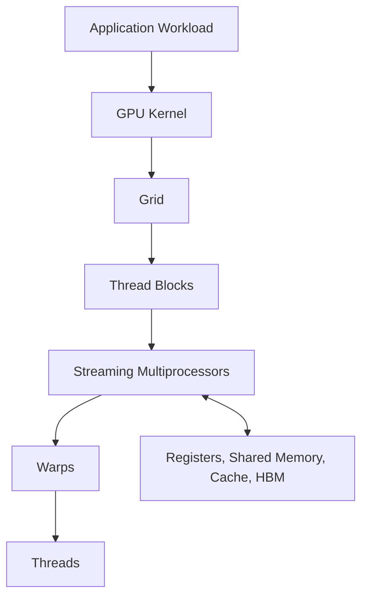

# Volume 02 — GPU Architecture

Volume 01 established why AI infrastructure exists. Volume 02 moves inside the accelerator.

The objective is not to memorize component names. It is to understand how a GPU turns software instructions into parallel execution, how work is grouped and scheduled, where data is stored, and why topology and memory behavior often matter more than peak arithmetic throughput.

A platform engineer does not need to become a kernel developer to operate GPU infrastructure. However, the engineer must understand enough architecture to explain low utilization, memory pressure, occupancy limits, topology penalties, and the difference between a healthy device and an efficiently used device.

| Volume field | Value |
|---|---|
| Difficulty | Foundation |
| Estimated reading time | 10–12 hours |
| Primary focus | GPU execution, memory, scheduling, and performance |
| Prerequisite | Volume 01 — AI Infrastructure Foundations |
| Outcome | Reason about GPU behavior from architecture rather than symptoms |

## The Mental Model

A GPU can be viewed as a hierarchy of execution and storage resources.

**Figure 2.0.1 — GPU execution hierarchy.** Software expresses work as kernels, grids, blocks, and threads. Hardware schedules that work across Streaming Multiprocessors and their memory resources.

## Chapters in This Batch

1. [Why GPU Architecture Evolved](./chapter-01-why-gpu-architecture-evolved)
2. [Inside a Modern NVIDIA GPU](./chapter-02-inside-a-modern-nvidia-gpu)
3. [Threads, Warps, Blocks, and Streaming Multiprocessors](./chapter-03-threads-warps-blocks-and-sms)
4. [Lab 01 — Inspect GPU Architecture and Topology](./labs/lab-01-inspect-gpu-architecture-and-topology)

## What You Will Learn Across the Volume

Later batches will extend this foundation into:

- CUDA Cores and Tensor Cores
- Instruction issue and warp scheduling
- Registers and shared memory
- L1 and L2 cache
- High Bandwidth Memory
- Occupancy and latency hiding
- Branch divergence
- Memory coalescing
- GPU topology and peer access
- Performance counters and bottleneck analysis

## Production Perspective

GPU architecture matters because production symptoms are architectural signals.

| Production symptom | Architectural question |
|---|---|
| Low GPU utilization | Is the device receiving enough parallel work? |
| High memory use | Are model weights, activations, and caches competing for capacity? |
| Poor multi-GPU scaling | Is communication aligned with topology? |
| High latency with low power draw | Is the workload waiting on CPU, storage, or synchronization? |
| Strong utilization but poor throughput | Is the workload memory-bound or instruction-bound? |

The rest of this volume develops the vocabulary required to answer those questions correctly.
