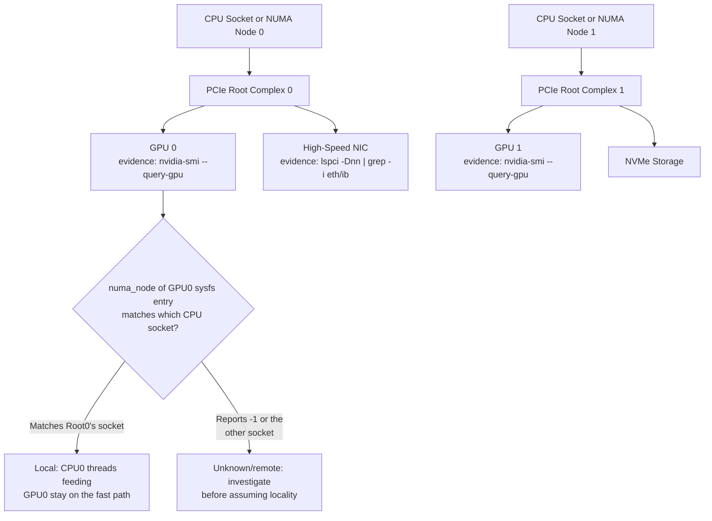

# Lab 01 — Inspect GPU Architecture and Topology

## Lab Metadata

| Field | Value |
|---|---|
| Volume | 02 — GPU Architecture |
| Difficulty | Beginner |
| Estimated time | 60–90 minutes |
| Lab level | L1 — Exploration |
| Target platform | Linux host with one or more NVIDIA GPUs |
| Primary tools | `nvidia-smi`, `lspci`, `numactl`, `/sys`, optional `dcgmi` |

## 1. Objective

Inspect a GPU-enabled Linux host and build an evidence-based map of its accelerator architecture and system topology.

The lab does not install drivers or run a benchmark. Its purpose is to teach the inspection workflow that should happen before deployment, performance testing, or troubleshooting.

## 2. Background

A host can report that a GPU is present while still being poorly configured for the intended workload. Device visibility does not prove correct NUMA placement, peer connectivity, link width, driver health, or workload suitability.

Production engineers should be able to answer:

- Which GPUs are installed?
- Which driver controls them?
- How much device memory is available?
- Which PCIe paths connect the devices?
- Which CPU NUMA nodes are closest to each GPU?
- Which GPUs can communicate through direct high-speed paths?
- Are links operating at expected width and generation?

## 3. Learning Outcomes

After completing this lab, you will be able to:

- Identify installed NVIDIA GPUs and their stable identifiers.
- Read device memory, power, temperature, and driver state.
- Interpret `nvidia-smi topo -m` output.
- Map a GPU PCI address to Linux sysfs and NUMA information.
- Distinguish healthy visibility from healthy topology.
- Produce a concise host architecture report.

## 4. Architecture



**Figure 2.L1.1 — Example host topology.** Device placement beneath CPU sockets and PCIe root complexes affects memory access and communication paths. Your host may differ — the goal of this lab is to discover the actual topology, and the branch above is exactly what Step 5 (`numa_node`) and Step 6 (`numactl --hardware`) verify: a GPU's *sysfs*-reported NUMA node either agrees with which physical socket it's wired to, or it doesn't, and you don't know which until you check.

## 5. Prerequisites

### Hardware

- One or more NVIDIA GPUs
- Access to the Linux host

### Software

- NVIDIA driver installed
- `nvidia-smi`
- `pciutils` package for `lspci`
- `numactl` package for `numactl`
- Optional: NVIDIA Data Center GPU Manager

### Permissions

Most inspection commands work as a normal user. Some sysfs or management details may require elevated privileges.

## 6. Environment

Record the environment before running the lab.

```bash
cat /etc/os-release
uname -r
nvidia-smi --query-gpu=driver_version --format=csv,noheader | sort -u
```

### Expected Output

The output should identify the operating-system release, kernel version, and one NVIDIA driver version.

### Common Problems

- `nvidia-smi: command not found`: NVIDIA utilities are not installed or not in `PATH`.
- `NVIDIA-SMI has failed`: the driver may not be loaded, may not match the running kernel, or may not communicate with the device.
- Multiple driver versions in output: investigate containerized tooling or inconsistent command context.

## 7. Components

| Component | Why it matters |
|---|---|
| GPU | Executes parallel kernels and owns device memory |
| NVIDIA driver | Controls the device and exposes management state |
| PCIe fabric | Connects the GPU to CPUs and other devices |
| NUMA node | Represents locality between CPUs, memory, and I/O devices |
| NIC | Carries inter-node traffic in distributed workloads |
| NVLink or peer path | Provides direct GPU-to-GPU communication on supported systems |
| Sysfs | Exposes Linux device and topology metadata |

## 8. Deployment Steps

This is an exploration lab, so there is no software deployment. The steps build the host map progressively.

### Step 1 — List GPUs

#### Purpose

Identify the installed devices using concise, script-friendly output.

#### Command

```bash
nvidia-smi --query-gpu=index,name,uuid,pci.bus_id,memory.total --format=csv
```

#### Expected Output

```text
index, name, uuid, pci.bus_id, memory.total [MiB]
0, NVIDIA H100 80GB HBM3, GPU-3a1f9e02-4c11-4b8a-9e2d-7f6b1c0a55e1, 00000000:1B:00.0, 81559 MiB
1, NVIDIA H100 80GB HBM3, GPU-7b2e0c14-8a33-4f9c-a1de-2c9d5e7f0b3a, 00000000:3D:00.0, 81559 MiB
```

Exact model names, UUIDs, bus IDs, and memory values depend on the host — the two rows above are an illustrative dual-GPU example, not a value to expect verbatim. `uuid` is the value worth recording as the durable identifier: `index` can change after a reboot or driver reload, but `GPU-3a1f9e02-...` names this specific physical device regardless of which index it later enumerates as.

#### Explanation

- `index` is convenient but may change after reboot or hardware changes.
- `uuid` is a more stable workload identifier.
- `pci.bus_id` links NVIDIA tooling to Linux PCI topology.
- `memory.total` reports device-memory capacity visible to the driver.

#### Common Errors

An empty list means the driver sees no GPUs. Do not continue to topology analysis until host visibility is fixed.

### Step 2 — Inspect Runtime State

#### Purpose

Capture utilization, memory, temperature, power, and clocks.

#### Command

```bash
nvidia-smi --query-gpu=index,utilization.gpu,utilization.memory,memory.used,temperature.gpu,power.draw,clocks.sm,clocks.mem --format=csv
```

#### Expected Healthy Output

```text
index, utilization.gpu [%], utilization.memory [%], memory.used [MiB], temperature.gpu, power.draw [W], clocks.sm [MHz], clocks.mem [MHz]
0, 0 %, 0 %, 412 MiB, 34, 68.21 W, 345 MHz, 400 MHz
1, 0 %, 0 %, 4 MiB, 33, 65.94 W, 345 MHz, 400 MHz
```

An idle host usually shows low utilization and low memory use, with valid temperature, power, and clock fields.

#### Interpretation

`utilization.gpu`/`utilization.memory` at `0%` is expected and healthy here, not an error — this host has no active workload. `memory.used` on GPU 0 (412MiB) versus GPU 1 (4MiB) is worth noting even at idle: a nonzero idle baseline usually means a persistent process (a monitoring agent, a notebook kernel, a leaked allocation from a previous job) still holds device memory, and it's worth identifying with `nvidia-smi --query-compute-apps` before assuming the device is fully clear. `clocks.sm` sitting well below the GPU's rated boost clock (which can exceed 1900MHz on this class of device) is also expected at idle — clocks scale down with power state when there's no work queued, and ramping up under load is normal, not a fault. Missing or `N/A` fields may be normal for some products, but repeated management failures require investigation.

### Step 3 — Inspect PCI Devices

#### Purpose

Verify that Linux enumerates the NVIDIA device and identify its PCI function.

#### Command

```bash
lspci -Dnn | grep -i nvidia
```

#### Expected Output

```text
0000:1b:00.0 3D controller [0302]: NVIDIA Corporation GH100 [H100 80GB HBM3] [10de:2330]
0000:3d:00.0 3D controller [0302]: NVIDIA Corporation GH100 [H100 80GB HBM3] [10de:2330]
```

One or more NVIDIA VGA, 3D controller, audio, bridge, or related functions should appear. Data-center GPUs commonly report as `3D controller` rather than `VGA compatible controller`, since they have no display output.

#### Explanation

The domain-qualified address from `lspci -D` (`0000:1b:00.0`) should correspond to the bus ID reported by `nvidia-smi` in Step 1 (`00000000:1B:00.0`) — same address, different formatting convention (leading zeros, case). This cross-check is what confirms NVIDIA's management stack and the kernel's own PCI enumeration agree on which physical device is which.

### Step 4 — Inspect Detailed PCIe Link State

Replace the address with a GPU bus ID from Step 1.

#### Purpose

Inspect negotiated and supported PCIe link characteristics.

#### Command

```bash
GPU_BDF="0000:31:00.0"
sudo lspci -s "$GPU_BDF" -vv | grep -E "LnkCap:|LnkSta:"
```

#### Expected Output

```text
LnkCap: Port #0, Speed 32GT/s, Width x16, ASPM not supported
LnkSta: Speed 32GT/s (ok), Width x16 (ok)
```

The output typically includes supported and negotiated speed and width.

#### Interpretation

`LnkCap` (link capability — what the slot and device support) reads `Speed 32GT/s, Width x16`: PCIe Gen5 at full x16 width, the expected capability for an H100 in a properly wired Gen5 slot. `LnkSta` (link status — what's actually negotiated right now) matching exactly, `32GT/s (ok)` and `x16 (ok)`, confirms the link trained to its full capability with no downgrade. If `LnkSta` instead showed `Speed 16GT/s (downgraded)` or `Width x8 (downgraded)`, that would mean the link negotiated to half its rated speed or width — worth investigating via BIOS slot configuration, riser/backplane wiring, or a seating issue, since a downgraded link silently caps host-to-device transfer bandwidth without producing any error on its own. A device can support a wider or faster link than it currently negotiates. Reduced link state may be caused by platform design, BIOS settings, slot placement, power management, or hardware problems.

:::caution
Do not declare a link faulty from one field alone. Compare with the server design, slot specification, GPU product requirements, and workload state.
:::

### Step 5 — Map GPU to NUMA Node

#### Purpose

Determine which NUMA node Linux associates with the GPU.

#### Command

```bash
GPU_BDF="0000:31:00.0"
cat "/sys/bus/pci/devices/$GPU_BDF/numa_node"
```

#### Expected Output

```text
0
```

The value may be another NUMA node. A value of `-1` means Linux does not expose a specific NUMA association for that device.

### Step 6 — Inspect Host NUMA Topology

#### Purpose

Understand CPU and memory placement around the GPU.

#### Command

```bash
numactl --hardware
```

#### Expected Output

```text
available: 2 nodes (0-1)
node 0 cpus: 0 1 2 3 4 5 6 7 8 9 10 11 12 13 14 15
node 0 size: 257698 MB
node 0 free: 198302 MB
node 1 cpus: 16 17 18 19 20 21 22 23 24 25 26 27 28 29 30 31
node 1 size: 258043 MB
node 1 free: 241117 MB
node distances:
node   0   1
  0:  10  21
  1:  21  10
```

The command should list NUMA nodes, CPUs assigned to each node, memory size, free memory, and distance values.

#### Explanation

`node distances` is the field worth reading carefully: `10` is the baseline (a node's distance to itself), and `21` describes the relative cost of crossing to the other node — roughly 2x the local cost on this host, a typical dual-socket value. Cross-reference this against GPU 0's `numa_node` from Step 5: if it reports `0`, then CPUs `0-15` (node 0) are GPU 0's local cores, and any process using CPUs `16-31` (node 1) to prepare data for GPU 0 pays that ~2.1x distance penalty on every host-memory access before the data even reaches the PCIe root complex. Workloads that prepare data on a CPU far from the GPU may cross inter-socket links before reaching the PCIe root complex. This can increase latency and consume additional bandwidth.

### Step 7 — Inspect GPU Peer Topology

#### Purpose

Map communication relationships between GPUs, CPUs, and NICs.

#### Command

```bash
nvidia-smi topo -m
```

#### Expected Output

```text
        GPU0    GPU1    NIC0    CPU Affinity    NUMA Affinity
GPU0     X      SYS     PIX     0-15            0
GPU1    SYS      X      SYS     16-31           1
NIC0    PIX     SYS      X

Legend:
  X    = self
  SYS  = connection traversing PCIe as well as a NUMA/socket-level link
  PIX  = connection traversing at most a single PCIe bridge
```

A matrix with GPU rows and columns, CPU affinity, NUMA affinity, and path labels.

Common path labels vary by platform and driver version. Use the legend printed by the command rather than memorizing one fixed interpretation.

#### Interpretation

This example host has no direct GPU-to-GPU interconnect at all — `GPU0`-`GPU1` shows `SYS`, meaning any peer traffic between them crosses the full PCIe hierarchy and the inter-socket link, the slowest classified path this legend defines. `NIC0` shows `PIX` to `GPU0` (same PCIe bridge — good locality for GPU0-originated network traffic) but `SYS` to `GPU1` — a distributed job assigning GPU1's rank to use this NIC would pay for a cross-socket hop on every network operation. Cross-referencing `CPU Affinity`/`NUMA Affinity` columns against Steps 5-6's findings should agree: GPU0 on NUMA 0 with CPUs 0-15, GPU1 on NUMA 1 with CPUs 16-31, matching the `numactl --hardware` output above exactly — if they didn't agree, that mismatch would itself be worth escalating. Shorter or direct GPU paths are generally preferable for communication-heavy workloads. Paths that traverse host bridges, CPU sockets, or slower interconnects can reduce peer performance.

### Step 8 — Inspect Link or Peer Status Where Supported

#### Purpose

Gather additional interconnect evidence.

#### Commands

```bash
nvidia-smi nvlink --status
```

Optional DCGM inventory:

```bash
dcgmi discovery -l
```

#### Expected Output

```text
$ nvidia-smi nvlink --status
GPU 0: NVIDIA H100 80GB HBM3 (UUID: GPU-3a1f9e02-...)
	 Unable to retrieve NVLink information as no devices were found

$ dcgmi discovery -l
2 GPUs found.
+--------+----------------------------------------------------------------------+
| GPU ID | Device Information                                                    |
+--------+----------------------------------------------------------------------+
| 0      | Name: NVIDIA H100 80GB HBM3                                           |
|        | PCI Bus ID: 00000000:1B:00.0                                          |
| 1      | Name: NVIDIA H100 80GB HBM3                                           |
|        | PCI Bus ID: 00000000:3D:00.0                                          |
+--------+----------------------------------------------------------------------+
```

Systems without NVLink may report that the feature is unsupported or show no active links — this example host's PCIe-only topology (confirmed by the all-`SYS`/`PIX` matrix in Step 7) makes the `nvlink --status` result above expected, not a fault. That is not automatically a fault. Interpret the result against the platform design: an H100 SXM node in an NVLink-connected server would instead show active link counts and per-link status here, and getting the empty result on that class of hardware *would* be worth escalating as a configuration or hardware problem.

## 9. Validation

Create a compact inventory table from the host.

```bash
nvidia-smi --query-gpu=index,name,uuid,pci.bus_id,memory.total,driver_version --format=csv
```

Validation is complete when every GPU has:

- A visible index
- A model name
- A UUID
- A PCI bus ID
- A memory capacity
- A driver association

## 10. Verification

Verify consistency across tools.

1. Each `nvidia-smi` PCI bus ID should appear in `lspci`.
2. Each GPU should have a sysfs device directory.
3. The NUMA node should be recorded or explicitly reported as unknown.
4. `nvidia-smi topo -m` should list all expected GPUs.
5. Link state should be compared with platform expectations.

Use this command to verify the sysfs path:

```bash
GPU_BDF="0000:31:00.0"
test -d "/sys/bus/pci/devices/$GPU_BDF" && echo "device path exists"
```

## 11. Observability

### Host-Level Signals

- GPU temperature
- Power draw
- Core and memory clocks
- Device memory use
- GPU and memory utilization
- PCIe replay or error counters where available
- XID events in kernel logs

### Commands

```bash
nvidia-smi -q
journalctl -k | grep -iE "nvrm|xid|nvidia"
```

Optional:

```bash
dcgmi diag -r 1
```

Use diagnostics only when supported and appropriate for the environment.

## 12. Performance Measurements

This lab does not run a workload benchmark. It records architectural conditions that affect future benchmarks.

Capture:

- PCIe negotiated link width and speed
- GPU-to-GPU path matrix
- NUMA node for each GPU
- CPU affinity from `nvidia-smi topo -m`
- Presence or absence of direct peer links

These values become the baseline for later bandwidth and NCCL labs.

## 13. Failure Injection

### Failure Scenario — Incorrect CPU Placement

Do not modify the system. Simulate the design error on paper.

1. Select one GPU and record its NUMA node.
2. Select CPUs from a distant NUMA node.
3. Describe the path data would take from those CPUs to the GPU.
4. Predict the effect on host-to-device transfer and CPU preprocessing.
5. Write the preferred CPU-binding policy.

This exercise teaches failure reasoning without disrupting the host.

## 14. Troubleshooting

### Problem — `nvidia-smi` sees fewer GPUs than `lspci`

#### Symptoms

- PCI devices appear in `lspci`.
- One or more devices are missing from `nvidia-smi`.

#### Diagnosis

```bash
lspci -Dnn | grep -i nvidia
journalctl -k | grep -iE "nvrm|xid|nvidia"
lsmod | grep nvidia
```

#### Possible Root Causes

- Driver initialization failure
- Unsupported or mismatched driver
- Device in a faulted state
- IOMMU or passthrough configuration
- Hardware or firmware issue

**Turning this into evidence.** `lspci` seeing a device that `nvidia-smi` cannot is a driver-layer gap, and the kernel log usually names it directly:

```text
$ lspci -Dnn | grep -i nvidia
0000:1b:00.0 3D controller [0302]: NVIDIA Corporation GH100 [10de:2330]
0000:3d:00.0 3D controller [0302]: NVIDIA Corporation GH100 [10de:2330]

$ nvidia-smi --query-gpu=index,pci.bus_id --format=csv,noheader
0, 00000000:1B:00.0

$ journalctl -k | grep -iE "nvrm|xid|nvidia" | tail -3
NVRM: GPU 0000:3d:00.0: RmInitAdapter failed! (0x62:0xffff:1512)
NVRM: GPU 0000:3d:00.0: rm_init_adapter failed, device minor number 1
```

`lspci` lists both `1b:00.0` and `3d:00.0`, but `nvidia-smi` only reports one GPU (`1b:00.0`) — the second device is missing from driver-level visibility, not from PCIe enumeration. The `journalctl -k` line naming `3d:00.0` explicitly and `RmInitAdapter failed` confirms this is a driver initialization failure on that specific device, not a broader host problem — the first GPU initialized fine, which rules out a systemic driver/kernel mismatch and narrows the investigation to that one device (reseat, reset, or RMA path) instead of a full driver reinstall.

#### Resolution

Follow the evidence. Confirm the supported driver branch, inspect kernel logs, validate firmware and BIOS configuration, and avoid repeated resets on a production host without a maintenance plan.

### Problem — PCIe link is narrower than expected

#### Diagnosis

Compare `LnkCap` and `LnkSta`, then confirm server slot wiring and BIOS configuration.

#### Prevention

Maintain an approved slot-placement diagram and validate link state during commissioning.

### Problem — Workload uses CPUs far from the GPU

#### Diagnosis

Compare process CPU affinity with the GPU's NUMA node.

```bash
taskset -pc <PID>
numactl --hardware
nvidia-smi topo -m
```

#### Resolution

Apply CPU and memory binding through the workload manager, container platform, or service configuration.

## 15. Cleanup

This lab creates no persistent resources.

Unset shell variables if desired:

```bash
unset GPU_BDF
```

Remove any temporary notes or generated inventory files created during the exercise.

## 16. Summary

You inspected GPU identity, driver state, PCI enumeration, link characteristics, NUMA locality, and peer topology. The lab demonstrated that a visible GPU is not automatically a well-placed or production-ready GPU.

The evidence collected here will support later labs on CUDA execution, memory behavior, peer bandwidth, and distributed communication.

## 17. Challenge Exercises

1. Generate a Markdown inventory table for every GPU automatically.
2. Map each high-speed NIC to its NUMA node and compare it with GPU placement.
3. Identify which GPU pairs have the shortest communication path.
4. Create a recommended process-binding policy for each GPU.
5. Compare topology before and after moving a GPU or NIC to another approved slot in a lab system.

## 18. Further Reading

- [Volume 02 Introduction](../index)
- [Why GPU Architecture Evolved](../chapter-01-why-gpu-architecture-evolved)
- [Inside a Modern NVIDIA GPU](../chapter-02-inside-a-modern-nvidia-gpu)
- [Threads, Warps, Blocks, and Streaming Multiprocessors](../chapter-03-threads-warps-blocks-and-sms)
