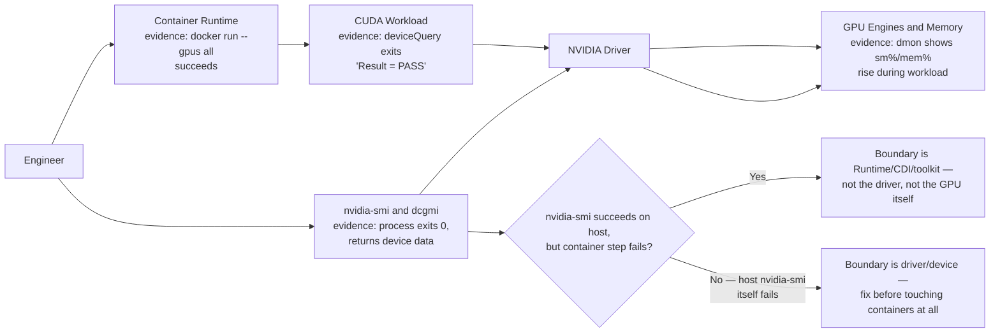

# Lab 02: Inspect GPU Engine and Memory Behavior

## Lab Metadata

| Field | Value |
|---|---|
| Volume | 02 - GPU Architecture |
| Difficulty | Intermediate |
| Estimated time | 75–100 minutes |
| Target platform | Ubuntu GPU host or Kubernetes GPU node |
| Lab type | Exploration, measurement, and troubleshooting |
| Required GPU count | One or more |

## 1. Objective

Inspect a live NVIDIA GPU and connect observable metrics to the architecture introduced in Chapters 04–06. You will identify the device and driver, inspect memory and utilization, run a controlled workload, observe changes over time, inspect process accounting, and intentionally create one failure condition.

This lab does not attempt to prove peak performance. Its purpose is to teach a repeatable observation workflow.

## 2. Background

A single utilization percentage cannot explain GPU behavior. An operator needs context: which process owns memory, whether compute engines are active, whether clocks are limited, whether power or temperature constraints exist, whether transfers dominate, and whether the workload is long enough to observe.

The tools used here expose architecture through operational signals. `nvidia-smi` communicates with the NVIDIA driver and management library. `dcgmi`, when available, provides health and diagnostic views through NVIDIA Data Center GPU Manager. A containerized CUDA workload creates controlled activity without requiring a local compiler installation.

## 3. Learning Outcomes

After completing this lab, you will be able to:

- Inventory GPU model, driver, memory, clocks, power, and topology.
- Observe GPU metrics continuously while a workload runs.
- Distinguish memory allocation from compute activity.
- Identify the process using a GPU.
- Explain why a short workload may be invisible to low-frequency monitoring.
- Detect and diagnose a container that cannot access the GPU.
- Produce a baseline record for later performance labs.

## 4. Architecture



**Figure L2.2.1 - Lab architecture.** Management commands and the test workload interact with the GPU through the installed driver. The branch is this lab's own Step 5/Failure-Injection logic made explicit: a host that shows a healthy GPU but a container that can't see it is a different, narrower failure than a host where `nvidia-smi` itself fails — and telling them apart in one question saves an unnecessary driver reinstall.

## 5. Prerequisites

### Hardware

- One supported NVIDIA GPU
- Sufficient power and cooling for a short test workload

### Software

- Ubuntu or another supported Linux distribution
- Working NVIDIA driver
- `nvidia-smi`
- Docker or another compatible container engine
- NVIDIA Container Toolkit for GPU-enabled containers
- Optional: DCGM and `dcgmi`

### Permissions

You need permission to:

- run containers with GPU access
- inspect host GPU state
- read system logs

:::warning
Do not perform this lab on a production node without confirming change and workload policies. Even a test workload consumes GPU capacity and power.
:::

## 6. Environment

Record your environment before beginning.

```text
Host name:
Operating system:
Kernel:
GPU model:
GPU count:
Driver version:
Container runtime:
NVIDIA Container Toolkit version:
DCGM available: yes/no
```

This information becomes part of the baseline. Performance and command output vary by GPU generation, driver branch, system design, and software version.

## 7. Components

| Component | Purpose |
|---|---|
| NVIDIA driver | Controls the device and exposes management interfaces |
| `nvidia-smi` | Reports device, process, power, thermal, clock, and memory state |
| NVIDIA Container Toolkit | Passes GPU devices and libraries into containers |
| CUDA sample or benchmark | Generates controlled GPU work |
| DCGM | Provides health, diagnostics, and telemetry for data-center GPUs |

## 8. Deployment Steps

### Step 1 — Confirm host-level GPU visibility

**Purpose:** Verify that the operating system and NVIDIA driver can communicate with the GPU.

**Command:**

```bash
nvidia-smi
```

**Expected output:**

```text
+-----------------------------------------------------------------------------------------+
| NVIDIA-SMI 550.90.07              Driver Version: 550.90.07      CUDA Version: 12.4      |
|-----------------------------------------+------------------------+----------------------+
| GPU  Name                 Persistence-M | Bus-Id          Disp.A | Volatile Uncorr. ECC |
| Fan  Temp   Perf          Pwr:Usage/Cap |           Memory-Usage | GPU-Util  Compute M. |
|===========================================+========================+======================|
|   0  NVIDIA H100 80GB HBM3          On  | 00000000:1B:00.0 Off  |                    0 |
| N/A   34C    P0             68W / 700W |    412MiB / 81559MiB |      0%      Default |
+-----------------------------------------------------------------------------------------+
| Processes:                                                                               |
|  No running processes found                                                              |
+-----------------------------------------------------------------------------------------+
```

A table containing one or more GPUs, driver information, temperature, power, memory use, utilization, and active processes. Exact columns vary by driver and device. Reading this baseline: `Driver Version: 550.90.07` / `CUDA Version: 12.4` (the driver's maximum supported CUDA version, not necessarily the toolkit installed anywhere) — record both, since Step 5's container comparison depends on this exact driver version being consistent between host and container path. `Pwr:Usage/Cap 68W / 700W` and `GPU-Util 0%` are the idle baseline this lab will compare against once a workload runs in Step 7.

**Interpretation:**

A successful response confirms basic driver-to-device communication. It does not confirm container integration, CUDA execution, or application correctness.

**Common errors:**

- `nvidia-smi: command not found`
- `NVIDIA-SMI has failed because it couldn't communicate with the NVIDIA driver`
- no devices listed

If the command fails, stop and repair the host-level driver path before continuing.

### Step 2 — Capture a machine-readable baseline

**Purpose:** Produce a compact record suitable for comparison and automation.

**Command:**

```bash
nvidia-smi \
  --query-gpu=index,name,uuid,pci.bus_id,driver_version,memory.total,memory.used,utilization.gpu,utilization.memory,temperature.gpu,power.draw,power.limit \
  --format=csv
```

**Expected output:**

```text
index, name, uuid, pci.bus_id, driver_version, memory.total [MiB], memory.used [MiB], utilization.gpu [%], utilization.memory [%], temperature.gpu, power.draw [W], power.limit [W]
0, NVIDIA H100 80GB HBM3, GPU-3a1f9e02-4c11-4b8a-9e2d-7f6b1c0a55e1, 00000000:1B:00.0, 550.90.07, 81559 MiB, 412 MiB, 0 %, 0 %, 34, 68.21 W, 700.00 W
```

**Explanation:**

The query interface is preferable to scraping the default table. It allows operators to select stable fields and export CSV or no-header formats for automation.

Save the result:

```bash
mkdir -p ~/nvidia-zero-to-hero-labs/volume-02-lab-02
nvidia-smi \
  --query-gpu=index,name,uuid,pci.bus_id,driver_version,memory.total,memory.used,utilization.gpu,utilization.memory,temperature.gpu,power.draw,power.limit \
  --format=csv \
  > ~/nvidia-zero-to-hero-labs/volume-02-lab-02/gpu-baseline.csv
```

### Step 3 — Inspect topology

**Purpose:** Understand how GPUs, CPUs, and network devices are connected.

**Command:**

```bash
nvidia-smi topo -m
```

**Expected output:**

```text
        GPU0    NIC0    CPU Affinity    NUMA Affinity
GPU0     X      PIX     0-15            0

Legend:
  X    = self
  PIX  = connection traversing at most a single PCIe bridge
```

A matrix showing GPU-to-GPU and GPU-to-NIC relationships. Systems with one GPU will display a simpler result — the single-GPU matrix above still confirms useful information: `PIX` to `NIC0` means this GPU and the NIC share a PCIe bridge, a locality worth recording even with nothing to compare it against yet.

**Explanation:**

Topology influences peer traffic, CPU affinity, PCIe traversal, and multi-GPU communication. Later volumes will interpret labels such as PIX, PXB, PHB, SYS, and NVLink relationships in greater depth.

### Step 4 — Inspect detailed device properties

**Purpose:** View clocks, memory state, power limits, ECC information, and supported features.

**Command:**

```bash
nvidia-smi -q
```

The output can be long. Save it for later comparison:

```bash
nvidia-smi -q > ~/nvidia-zero-to-hero-labs/volume-02-lab-02/nvidia-smi-query.txt
```

**Interpretation:**

```text
==============NVSMI LOG==============
GPU 00000000:1B:00.0
    Product Name                     : NVIDIA H100 80GB HBM3
    GPU UUID                         : GPU-3a1f9e02-4c11-4b8a-9e2d-7f6b1c0a55e1
    VBIOS Version                    : 96.00.89.00.01
    FB Memory Usage
        Total                        : 81559 MiB
        Used                         : 412 MiB
        Free                         : 81147 MiB
    Performance State                : P0
    Clocks
        Graphics                     : 345 MHz
        Memory                       : 400 MHz
    Max Clocks
        Graphics                     : 1980 MHz
        Memory                       : 2619 MHz
    Temperature
        GPU Current Temp             : 34 C
    Power Readings
        Power Draw                   : 68.21 W
        Power Limit                  : 700.00 W
    Ecc Errors
        Volatile
            SRAM Correctable         : 0
            SRAM Uncorrectable       : 0
    Retired Pages
        Multiple Single Bit Retirement : N/A
```

Look for:

- product name and UUID
- VBIOS and driver information
- memory totals and usage
- performance state
- clocks and clock limits
- temperature and power
- ECC status where supported
- retired pages or row-remapping information where supported

The pairing worth recording as a baseline: `Clocks: Graphics 345 MHz` against `Max Clocks: Graphics 1980 MHz` shows this idle GPU running at roughly 17% of its rated boost clock — expected at idle, and the number to compare against Step 6/7's active-workload trace. `Ecc Errors: SRAM Correctable/Uncorrectable: 0` at both zero is the healthy baseline; a rising `Uncorrectable` count over time, checked again after a workload, is one of the strongest signals of a genuine hardware problem rather than a software one. Do not assume every GPU exposes every field.

### Step 5 — Verify container GPU access

**Purpose:** Confirm that the container runtime can expose the GPU.

**Command:**

```bash
docker run --rm --gpus all nvidia/cuda:12.4.1-base-ubuntu22.04 nvidia-smi
```

**Expected output:**

```text
+-----------------------------------------------------------------------------------------+
| NVIDIA-SMI 550.90.07              Driver Version: 550.90.07      CUDA Version: 12.4      |
|-----------------------------------------+------------------------+----------------------+
|   0  NVIDIA H100 80GB HBM3          On  | 00000000:1B:00.0 Off  |                    0 |
| N/A   34C    P0             68W / 700W |    412MiB / 81559MiB |      0%      Default |
+-----------------------------------------------------------------------------------------+
```

The container should display the same physical GPU inventory as the host, subject to the devices granted to it. Note that `Driver Version: 550.90.07` inside the container matches the host exactly — the container never has its own driver, it always uses the host's; only the CUDA user-space libraries and `nvidia-smi` binary itself come from the container image.

**Explanation:**

The container uses the host driver. The image provides user-space CUDA components and utilities compatible with the selected container environment. Image tags evolve; use an available tag appropriate for your environment if this exact tag is unavailable.

### Step 6 — Start continuous monitoring

Open a second terminal.

**Purpose:** Observe metric changes while a workload runs.

**Command:**

```bash
nvidia-smi dmon -s pucm -d 1
```

**Expected output:**

```text
# gpu    pwr  gtemp    sm   mem  fb
# Idx      W      C     %     %  MB
    0     68     34     0     0  412
    0     71     34     0     0  412
    0    298     52    97    64  71824
    0    301     53    96    61  71824
    0     69     35     0     0  412
```

A new row approximately every second showing selected power, utilization, clock, and memory-related fields. Available columns vary. The transition worth watching: rows 1-2 are the idle baseline (`pwr≈68W`, `sm=0%`), rows 3-4 jump to `pwr≈300W`, `sm=97%`, `fb` (framebuffer/memory used) rising to `71824MB` once the workload from Step 7 begins allocating and computing, and row 5 drops straight back to idle once the process exits — that full idle-to-active-to-idle sequence in one continuous trace is exactly what Section 10's verification questions ask you to explain.

Alternative query loop:

```bash
watch -n 1 'nvidia-smi --query-gpu=index,pstate,clocks.sm,clocks.memory,utilization.gpu,utilization.memory,memory.used,power.draw,temperature.gpu --format=csv,noheader'
```

**Explanation:**

Sampling frequency matters. A workload lasting 100 milliseconds may complete between one-second samples and appear idle. Later profiling tools provide finer-grained visibility.

### Step 7 — Run a controlled CUDA workload

**Purpose:** Generate visible compute and memory activity.

Use a CUDA sample image available in your environment. One practical option is to run a sample container or build a sample from an NVIDIA CUDA development image.

```bash
docker run --rm --gpus all \
  nvidia/cuda:12.4.1-devel-ubuntu22.04 \
  bash -lc '
    set -e
    apt-get update >/dev/null
    apt-get install -y --no-install-recommends git make g++ >/dev/null
    git clone --depth 1 https://github.com/NVIDIA/cuda-samples.git /tmp/cuda-samples >/dev/null
    make -C /tmp/cuda-samples/Samples/1_Utilities/deviceQuery -j"$(nproc)" >/dev/null
    /tmp/cuda-samples/bin/x86_64/linux/release/deviceQuery
  '
```

**Expected output:**

```text
/tmp/cuda-samples/bin/x86_64/linux/release/deviceQuery Starting...

CUDA Device Query (Runtime API) version (CUDART static linking)

Detected 1 CUDA Capable device(s)

Device 0: "NVIDIA H100 80GB HBM3"
  CUDA Driver Version / Runtime Version          12.4 / 12.4
  CUDA Capability Major/Minor version number:    9.0
  Total amount of global memory:                 81559 MBytes
  (132) Multiprocessors, (128) CUDA Cores/MP:    16896 CUDA Cores
  GPU Max Clock rate:                            1980 MHz (1.98 GHz)
  Memory Clock rate:                             2619 Mhz
  Memory Bus Width:                              5120-bit
  L2 Cache Size:                                 52428800 bytes
deviceQuery, CUDA Driver = CUDART, CUDA Driver Version = 12.4, CUDA Runtime Version = 12.4, NumDevs = 1
Result = PASS
```

The sample should list device properties and end with a successful result. `CUDA Capability Major/Minor version number: 9.0` is the compute capability referenced in earlier chapters — the version number a build system checks to decide which instruction-set features are available. `(132) Multiprocessors` is the exact SM count used throughout this volume's worked residency and grid-sizing examples for this GPU class. `Result = PASS` at the end is the one line worth grepping for in an automated version of this check — its absence, even with no explicit error printed above it, means the query did not complete successfully.

:::note
This command requires Internet access and package installation inside an ephemeral container. In restricted environments, use a prebuilt internal image containing approved CUDA samples.
:::

To generate a longer workload, use an approved benchmark or sample already present in your environment. Avoid inventing a performance expectation; the goal is to observe state changes, not compare scores across unrelated systems.

### Step 8 — Inspect active GPU processes

While a workload is running, use:

```bash
nvidia-smi pmon -s um -d 1
```

and:

```bash
nvidia-smi --query-compute-apps=pid,process_name,gpu_uuid,used_memory --format=csv
```

**Expected output:**

```text
$ nvidia-smi pmon -s um -c 3
# gpu    pid  type    sm   mem   fb  command
# Idx      #   C/G     %     %   MB  name
    0    58213   C     97    64  71412  deviceQuery

$ nvidia-smi --query-compute-apps=pid,process_name,gpu_uuid,used_memory --format=csv
pid, process_name, gpu_uuid, used_memory [MiB]
58213, deviceQuery, GPU-3a1f9e02-4c11-4b8a-9e2d-7f6b1c0a55e1, 71412 MiB
```

One or more process records while the workload is active. Short workloads may finish before they are sampled. `pid=58213` appearing in both commands is the link between the OS process and the GPU allocation — `type C` (compute, as opposed to `G` for graphics) confirms this is a CUDA compute context, and `used_memory=71412 MiB` from `--query-compute-apps` is the per-process breakdown that a Kubernetes environment would additionally map back to a specific pod and container.

**Explanation:**

Process accounting connects GPU use to an operating-system process. Container and Kubernetes environments add another mapping layer from PID to container or pod.

## 9. Validation

Validate the following:

| Check | Healthy result |
|---|---|
| Host visibility | `nvidia-smi` lists the GPU |
| Container visibility | GPU-enabled container lists an allowed GPU |
| CUDA execution | Device query or approved workload completes |
| Monitoring | Utilization, clocks, power, or memory change during work |
| Process mapping | Active workload PID appears during execution |
| Topology | `nvidia-smi topo -m` returns a matrix |

Record observations in a Markdown file:

```bash
cat > ~/nvidia-zero-to-hero-labs/volume-02-lab-02/observations.md <<'EOF'
# Volume 02 Lab 02 Observations

## Idle State
- GPU utilization:
- Memory used:
- Power draw:
- Temperature:
- Performance state:

## Active State
- GPU utilization:
- Memory used:
- Power draw:
- Temperature:
- Performance state:

## Topology Notes

## Unexpected Behavior
EOF
```

## 10. Verification

Answer these questions from your observations:

1. Did memory usage increase before compute utilization?
2. Did clocks or performance state change during the workload?
3. Was the workload long enough to appear in every sample?
4. Which process owned the GPU allocation?
5. Did utilization fall immediately after the process exited?
6. What does the topology matrix reveal about CPU or NIC proximity?

A correct lab outcome is not a specific utilization number. It is the ability to explain the observed sequence.

## 11. Observability

### Host level

Use:

```bash
nvidia-smi
nvidia-smi dmon
nvidia-smi pmon
nvidia-smi -q
journalctl -k | grep -iE 'nvidia|nvrm|xid'
```

### DCGM level

When DCGM is installed:

```bash
dcgmi discovery -l
dcgmi health -s a
dcgmi health -c
dcgmi diag -r 1
```

Run diagnostics only according to environment policy. Diagnostic levels can consume the GPU and may affect workloads.

### Kubernetes level

On a Kubernetes node, also inspect:

```bash
kubectl describe node <gpu-node-name>
kubectl get pods -A -o wide | grep <gpu-node-name>
kubectl get events -A --sort-by=.lastTimestamp
```

Later volumes will add DCGM Exporter, Prometheus, and Grafana.

## 12. Performance Measurements

Capture idle and active values for:

- GPU utilization
- memory utilization
- memory allocated
- SM clock
- memory clock
- power draw
- temperature
- performance state

Do not label a value “healthy” without context. Healthy depends on workload, GPU model, cooling design, power policy, and service objectives.

Compare behavior, not unrelated absolute numbers:

```text
idle baseline → workload starts → memory allocated → kernels execute → workload exits → resources return
```

## 13. Failure Injection

### Failure: Run the container without GPU access

**Purpose:** Demonstrate the difference between an ordinary container and a GPU-enabled container.

**Command:**

```bash
docker run --rm nvidia/cuda:12.4.1-base-ubuntu22.04 nvidia-smi
```

**Expected broken behavior:**

```text
$ docker run --rm nvidia/cuda:12.4.1-base-ubuntu22.04 nvidia-smi
Failed to initialize NVML: Unknown Error
```

The container should fail to find the NVIDIA management path or report that no GPU is available, depending on runtime and image behavior. `Failed to initialize NVML: Unknown Error` specifically (rather than a driver version error) is the signature of a container that has the `nvidia-smi` binary and CUDA user-space libraries from the image, but no device nodes or driver capabilities injected — the container genuinely cannot see any GPU-related kernel interface, because none was passed to it, not because anything is broken on the host.

Now run the healthy form:

```bash
docker run --rm --gpus all nvidia/cuda:12.4.1-base-ubuntu22.04 nvidia-smi
```

**Root cause:**

The first container was not granted GPU devices and runtime integration.

**Production relevance:**

The same class of failure occurs when Kubernetes workloads omit GPU resource requests, the device plugin is unhealthy, the runtime is misconfigured, or admission policy removes required settings.

## 14. Troubleshooting

### Symptom: Host sees the GPU, container does not

**Diagnosis:**

```bash
docker info
nvidia-ctk --version
cat /etc/docker/daemon.json 2>/dev/null || true
journalctl -u docker --since '30 minutes ago'
```

**Likely causes:**

- NVIDIA Container Toolkit missing
- runtime configuration absent
- daemon not restarted after configuration
- container launched without `--gpus`
- device permissions restricted

**Turning this into evidence.** `nvidia-ctk` (the Container Toolkit CLI) reporting a version, paired with the actual Docker daemon runtime configuration, distinguishes "toolkit missing" from "toolkit present but not wired into the daemon":

```text
$ nvidia-ctk --version
NVIDIA Container Toolkit CLI version 1.15.0

$ cat /etc/docker/daemon.json
{
    "default-runtime": "runc"
}
```

`nvidia-ctk --version` succeeding proves the toolkit is installed — that rules out "toolkit missing" as the cause. But `daemon.json` showing `"default-runtime": "runc"` with no `nvidia` runtime registered at all is the actual root cause here: the toolkit is present on disk but was never wired into the Docker daemon's runtime configuration, so `docker run --gpus all` has no NVIDIA-aware runtime to hand the device request to. The fix is `nvidia-ctk runtime configure --runtime=docker` followed by a daemon restart — a toolkit reinstall would not have helped, since the toolkit was never the missing piece.

### Symptom: Utilization remains zero during the test

**Diagnosis:**

- Confirm the workload actually reached a CUDA kernel.
- Increase sampling frequency where supported.
- Use a longer approved workload.
- Check whether the process exited before observation.
- Confirm the workload did not fall back to CPU.

### Symptom: Memory remains allocated after the workload

**Diagnosis:**

```bash
nvidia-smi
nvidia-smi --query-compute-apps=pid,process_name,used_memory --format=csv
ps -fp <pid>
```

A persistent process, service, notebook kernel, model server, or monitoring agent may still own the allocation.

### Symptom: Power or temperature reaches an unexpected limit

Stop the test and review:

- cooling and airflow
- system power policy
- GPU power limit
- chassis health
- concurrent workloads
- clock-throttling reasons exposed by `nvidia-smi -q`

Do not change power or clock settings without platform approval.

## 15. Cleanup

The containers in this lab use `--rm`, so they should remove themselves after exit. Remove local lab artifacts only when no longer needed:

```bash
rm -rf ~/nvidia-zero-to-hero-labs/volume-02-lab-02
```

If you built or pulled large images and need disk space, review them before deletion:

```bash
docker images | grep -E 'nvidia/cuda|cuda-samples'
```

Do not remove shared images from production nodes without change approval.

## 16. Summary

You inspected GPU identity, topology, memory, clocks, power, thermals, utilization, and active processes. You then compared idle and active behavior and demonstrated that container GPU access must be explicitly configured.

The important skill is interpretation. Metrics are meaningful only when connected to workload stages and architecture layers.

## 17. Challenge Exercises

1. Export the query output every second for five minutes and graph memory, power, and utilization.
2. Compare a memory-allocation-only process with a compute-heavy process.
3. On a multi-GPU host, restrict a container to one GPU and verify device visibility.
4. Map a GPU process PID back to its container.
5. On Kubernetes, deploy a short GPU pod and map pod, container, process, and GPU UUID.
6. Compare topology and CPU affinity across multiple GPU nodes.
7. Add DCGM health output to the baseline report.

## 18. Further Reading

- [CUDA Cores, Tensor Cores, and RT Cores](../chapter-04-cuda-cores-tensor-cores-and-rt-cores)
- [GPU Memory Hierarchy](../chapter-05-gpu-memory-hierarchy)
- [Scheduling, Occupancy, and Instruction Dispatch](../chapter-06-scheduling-occupancy-and-instruction-dispatch)
- [Inspect GPU Architecture and Topology](./lab-01-inspect-gpu-architecture-and-topology)
